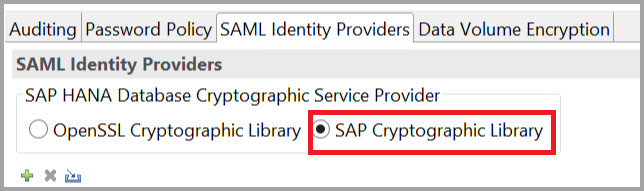

# <a name="use-security-assertion-markup-language-saml-for-sso-from-power-bi-to-on-premises-data-sources"></a>SAML (Security Assertion Markup Language) gebruiken voor SSO bij on-premises gegevensbronnen vanuit Power BI

Met inschakeling van SSO is het eenvoudiger om gegevens van on-premises gegevensbronnen te vernieuwen in Power BI-rapporten en -dashboards, terwijl machtigingen van het gebruikersniveau die op deze gegevensbronnen zijn geconfigureerd, worden gehandhaafd. Gebruik [Security Assertion Markup Language (SAML)](https://www.onelogin.com/pages/saml) om naadloze connectiviteit dankzij eenmalige aanmelding mogelijk te maken. 

## <a name="supported-data-sources"></a>Ondersteunde gegevensbronnen

Momenteel wordt SAP HANA met SAML ondersteund. Zie [SAML SSO voor BI-Platform voor HANA](https://blogs.sap.com/2020/03/22/sap-bi-platform-saml-sso-to-hana-database/) voor meer informatie over het instellen en configureren van eenmalige aanmelding voor SAP HANA met behulp van SAML.

We ondersteunen extra gegevensbronnen (inclusief SAP HANA) met [Kerberos](service-gateway-sso-kerberos.md).

Het is raadzaam om voor SAP HANA versleuteling in te schakelen voordat u een SAML SSO-verbinding tot stand brengt. Configureer de HANA-server zo dat deze versleutelde verbindingen accepteert om versleuteling in te schakelen en configureer de gateway om versleuteling te gebruiken tijdens de communicatie met uw HANA-server. Omdat het HANA ODBC-stuurprogramma standaard geen SAML-asserties versleutelt, wordt de ondertekende SAML-assertie *onversleuteld* van de gateway naar de HANA-server verzonden en is deze kwetsbaar voor onderschepping en hergebruik door derde partijen.

> [!IMPORTANT]
> Aangezien [SAP geen ondersteuning meer biedt voor de OpenSSL](https://help.sap.com/viewer/b3ee5778bc2e4a089d3299b82ec762a7/2.0.05/en-US/de15ffb1bb5710148386ffdfd857482a.html), biedt Microsoft hier ook geen ondersteuning meer voor. Bestaande verbindingen blijven werken, maar vanaf februari 2021 kunt u geen nieuwe verbindingen meer maken. Gebruik vanaf deze datum in plaats hiervan CommonCryptoLib.

## <a name="configuring-the-gateway-and-data-source"></a>De gateway en de gegevensbron configureren

Als u SAML wilt gebruiken, moet u een vertrouwensrelatie tot stand brengen tussen de HANA-servers waarvoor u SSO wilt inschakelen en de gateway. In dit scenario doet de gateway dienst als SAML-identiteitsprovider (IdP). Er zijn verschillende manieren om deze relatie tot stand te brengen. SAP adviseert om de cryptografische SAP-bibliotheek (ook wel bekend als CommonCryptoLib of sapcrypto) te gebruiken om de installatiestappen uit te voeren waarmee de vertrouwensrelatie wordt bevestigd. Zie de officiële SAP-documentatie voor meer informatie.

In de volgende stappen wordt beschreven hoe u een vertrouwensrelatie tussen een HANA-server en de gateway-IdP tot stand brengt door het X509-certificaat van de gateway te ondertekenen met een basis-CA die wordt vertrouwd door de HANA-server. 

### <a name="create-the-certificates"></a>De certificaten maken

Voer de volgende stappen uit om de certificaten te maken:

1. Maak op het apparaat met SAP HANA een lege map om uw certificaten in op te slaan en navigeer vervolgens naar die map.
2. Maak de basiscertificaten door de volgende opdracht uit te voeren:

   ```
   openssl req -new -x509 -newkey rsa:2048 -days 3650 -sha256 -keyout CA_Key.pem -out CA_Cert.pem -extensions v3_ca'''
   ```

    U moet de wachtwoordzin onthouden om dit certificaat te gebruiken om andere certificaten te ondertekenen.
    U ziet dat *CA_Cert.pem* en *CA_Key.pem* worden gemaakt.

   
3. Maak de IdP-certificaten door de volgende opdracht uit te voeren:
 
    ```
    openssl req -newkey rsa:2048 -days 365 -sha256 -keyout IdP_Key.pem -out IdP_Req.pem -nodes
    ```
    U ziet dat *IdP_Key.pem* en *IdP_Req.pem* worden gemaakt.

4. Onderteken de IdP-certificaten met de basiscertificaten:

    ```
    openssl x509 -req -days 365 -in IdP_Req.pem -sha256 -extensions usr_cert -CA CA_Cert.pem -CAkey CA_Key.pem -CAcreateserial -out IdP_Cert.pem
    ```
    U ziet dat *CA_Cert.srl* en *IdP_Cert.pem* worden gemaakt.
    We zijn alleen geïnteresseerd in de *IdP_Cert.pem*.    

### <a name="create-saml-identity-provider-certificate-mapping"></a>Certificaattoewijzing van de SAML-identiteitsprovider maken

Maak de certificaattoewijzing van de SAML-identiteitsprovider door de volgende stappen te volgen.

1. Klik in **SAP HANA Studio** met de rechtermuisknop op de SAP HANA-servernaam en ga vervolgens naar **Beveiliging > Beveiligingsconsole openen > SAML-identiteitsprovider**.
2. Als de cryptografische bibliotheek van SAP niet is geselecteerd, selecteert u deze. Gebruik de cryptografische bibliotheek van OpenSSL (de selectie aan de linkerkant, in de volgende afbeelding) *niet*; deze is afgeschaft door SAP.

    

3. Importeer het ondertekende certificaat *IdP_Cert.pem* door te klikken op de blauwe knop Importeren, die wordt weergegeven in de volgende afbeelding.

    

Vergeet niet een naam toe te wijzen aan de naam van uw *Naam van identiteitsprovider*.

### <a name="import-and-create-the-signed-certificates-in-hana"></a>De ondertekende certificaten importeren en maken in HANA

Vervolgens importeert en maakt u de ondertekende certificaten in HANA. Volg deze stappen:

1. Voer de volgende query uit in **HANA Studio**:

    ```
    CREATE CERTIFICATE FROM '<idp_cert_pem_certificate_content>'
    ```
    
    Hier volgt een voorbeeld:

    ```
    CREATE CERTIFICATE FROM
    '-----BEGIN CERTIFICATE-----
    MIIDyDCCArCgA...veryLongString...0WkC5deeawTyMje6
    -----END CERTIFICATE-----
    '
    ```

2. Als er geen PSE met SAML-doel is, maakt u er een door de volgende query uit te voeren in **HANA Studio**:
    
    ```
    CREATE PSE SAMLCOLLECTION;<br>set pse SAMLCOLLECTION purpose SAML;<br>
    ```

3. Voeg het zojuist gemaakte ondertekende certificaat toe aan de PSE met de volgende opdracht:

    ```
    alter pse SAMLCOLLECTION add CERTIFICATE <certificate_id>;
    ```

    Bijvoorbeeld:
    ```
    alter pse SAMLCOLLECTION add CERTIFICATE 1978320;
    ```

    U kunt de lijst met certificaten die zijn gemaakt met de volgende query controleren:
    ```
    select * from PUBLIC"."CERTIFICATES"
    ```

    Het certificaat is nu goed geïnstalleerd. U kunt de volgende query uitvoeren om te bevestigen:
    ```
    select * from "PUBLIC"."PSE_CERTIFICATES"
    ```

### <a name="map-the-user"></a>De gebruiker toewijzen

Volg deze stappen om de gebruiker toe te wijzen:

1. Selecteer in **SAP HANA Studio** de map **Beveiliging**:

    

2. Vouw **Gebruikers** uit en selecteer vervolgens de gebruiker aan wie u uw Power BI-gebruiker wilt toewijzen.

3. Schakel het selectievakje **SAML** in en selecteer vervolgens **Configureren**, zoals wordt weergegeven in de volgende afbeelding.

    

4. Selecteer de identiteitsprovider die u hebt gemaakt in de sectie [Certificaattoewijzing van de SAML-identiteitsprovider maken](#create-saml-identity-provider-certificate-mapping) eerder in dit artikel. Voer voor Externe identiteit de UPN van de Power BI-gebruiker in (gewoonlijk het e-mailadres waarmee de gebruiker zich aanmeldt bij Power BI) en selecteer vervolgens **Toevoegen**.  In de volgende afbeelding worden deze opties en selecties weergegeven.

    

    Als u uw gateway op het gebruik van de optie *ADUserNameReplacementProperty* hebt ingesteld, moet u de vervangende waarde voor de oorspronkelijke UPN van de Power BI-gebruiker invoeren. Als u *ADUserNameReplacementProperty* bijvoorbeeld instelt op *SAMAccountName*, voert u de *SAMAccountName* van de gebruiker in.

### <a name="configure-the-gateway"></a>De gateway configureren

Nu u het certificaat en de identiteit van de gateway hebt geconfigureerd, kunt u aan de hand van de volgende stappen het certificaat converteren naar PFX-indeling en de gateway instellen op gebruik van het certificaat.

1. Converteer het certificaat naar PFX-indeling door de volgende opdracht uit te voeren. Deze opdracht geeft een naam op voor het resulterende .pfx-bestand samlcert.pfx en stelt *root* in als het bijbehorende wachtwoord:

    ```
    openssl pkcs12 -export -out samltest.pfx -in IdP_Cert.pem -inkey IdP_Key.pem -passin pass:root -passout pass:root
    ```

2. Kopieer het pfx-bestand naar het gatewayapparaat:

    1. Dubbelklik op *samltest.pfx* en selecteer **Lokale computer** > **Volgende**.

    2. Voer het wachtwoord in en selecteer vervolgens **Volgende**.

    3. Selecteer **Alle certificaten in het onderstaande archief opslaan** en selecteer vervolgens **Bladeren** > **Persoonlijk** > **OK**.

    4. Selecteer **Volgende**, gevolgd door **Voltooien**.

       

3. Geef het gatewayserviceaccount toegang tot de persoonlijke sleutel van het certificaat door de volgende stappen te volgen:

    1. Voer op de gatewaycomputer de Microsoft Management Console (MMC) uit.

        

    2. Selecteer onder **Bestand** de optie **Module toevoegen/verwijderen**.

        

    3. Selecteer **Certificaten** > **Toevoegen** en vervolgens **Computeraccount** > **Volgende**.

    4. Selecteer **Lokale computer** > **Voltooien** > **OK**.

    5. Vouw **Certificaten** > **Persoonlijk** > **Certificaten** uit en zoek het certificaat.

    6. Klik met de rechtermuisknop op het certificaat en navigeer naar **Alle taken** &gt; **Persoonlijke sleutels beheren**.

        

    1. Voeg het gatewayserviceaccount toe aan de lijst. Het account is standaard **NT SERVICE\PBIEgwService**. U ontdekt in welk account de gatewayservice wordt uitgevoerd door **services.msc** uit te voeren en te zoeken naar **On-premises gegevensgatewayservice**.

        

Ga ten slotte als volgt te werk om de vingerafdruk van het certificaat toe te voegen aan de gatewayconfiguratie:

1. Voer de volgende PowerShell-opdracht uit om de certificaten op uw computer weer te geven:

    ```powershell
    Get-ChildItem -path cert:\LocalMachine\My
    ```

2. Kopieer de vingerafdruk voor het certificaat dat u hebt gemaakt.

3. Ga naar de gatewaymap. Standaard is dat *C:\Program Files\On-premises-data-gateway*.

4. Open *PowerBI.DataMovement.Pipeline.GatewayCore.dll.config* en zoek de sectie *SapHanaSAMLCertThumbprint*. Plak de vingerafdruk die u hebt gekopieerd.

5. Start de gateway opnieuw.

## <a name="running-a-power-bi-report"></a>Een Power BI-rapport uitvoeren

Nu kunt u de pagina **Gateway beheren** in Power BI gebruiken om de gegevensbron van SAP HANA te configureren. Schakel onder **Geavanceerde instellingen** SSO via SAML in. Hierdoor kunt u rapporten en gegevenssets publiceren die een binding met die gegevensbron hebben.

   

## <a name="troubleshooting"></a>Problemen oplossen

Na het configureren van SSO op basis van SAML ziet u mogelijk de volgende fout in de Power BI-portal: *De opgegeven referenties kunnen niet worden gebruikt voor de bron SapHana.* Deze fout geeft aan dat de referentie SAML is geweigerd door SAP HANA.

Verificatietraceringen op de server bieden gedetailleerde informatie voor het oplossen van problemen met referenties op SAP HANA. Volg deze stappen om tracering voor uw SAP HANA-server te configureren:

1. Schakel de verificatietracering in op de SAP HANA-server door de volgende query uit te voeren:

    ```
    ALTER SYSTEM ALTER CONFIGURATION ('indexserver.ini', 'SYSTEM') set ('trace', 'authentication') = 'debug' with reconfigure 
    ```

1. Reproduceer het probleem.

1. Open de beheerconsole in HANA Studio en selecteer het tabblad **Diagnosis Files**.

1. Open de meest recente indexservertracering en zoek naar *SAMLAuthenticator.cpp*.

    U zou een gedetailleerd foutbericht moeten vinden dat de hoofdoorzaak aangeeft, zoals:

    ```
    [3957]{-1}[-1/-1] 2018-09-11 21:40:23.815797 d Authentication   SAMLAuthenticator.cpp(00091) : Element '{urn:oasis:names:tc:SAML:2.0:assertion}Assertion', attribute 'ID': '123123123123123' is not a valid value of the atomic type 'xs:ID'.
    [3957]{-1}[-1/-1] 2018-09-11 21:40:23.815914 i Authentication   SAMLAuthenticator.cpp(00403) : No valid SAML Assertion or SAML Protocol detected
    ```

1. Schakel de verificatietracering uit nadat de problemen zijn opgelost door de volgende query uit te voeren:

    ```
    ALTER SYSTEM ALTER CONFIGURATION ('indexserver.ini', 'SYSTEM') UNSET ('trace', 'authentication');
    ```

## <a name="next-steps"></a>Volgende stappen

Raadpleeg de volgende bronnen voor meer informatie over de on-premises gegevensgateway en DirectQuery:

* [Wat is een on-premises gegevensgateway?](/data-integration/gateway/service-gateway-onprem)
* [DirectQuery in Power BI](desktop-directquery-about.md)
* [Data sources supported by DirectQuery](power-bi-data-sources.md) (Gegevensbronnen die worden ondersteund door DirectQuery)
* [DirectQuery en SAP BW](desktop-directquery-sap-bw.md)
* [DirectQuery en SAP HANA](desktop-directquery-sap-hana.md)
