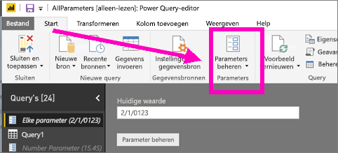
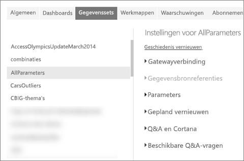
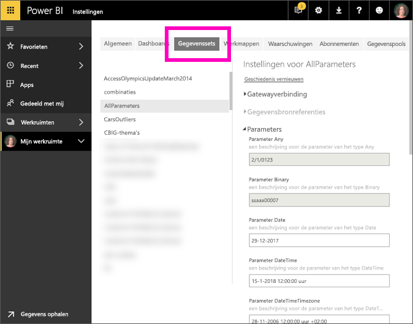

# Parameterinstellingen bewerken in de Power BI-service
Rapportmakers voegen queryparameters toe aan rapporten in Power BI Desktop. Ze kunnen aan de hand van parameters gedeelten van rapporten maken die afhankelijk zijn van een of meerdere parameter *waarden*. Een maker van een rapport kan bijvoorbeeld een parameter maken waarmee de gegevens worden beperkt tot een land/regio of een parameter maken waarmee acceptabele indelingen worden opgegeven voor bijvoorbeeld datum-, tijd- en tekstvelden.

## Parameters controleren en bewerken in Power BI-service

Als rapportmaker definieert u parameters in Power BI Desktop. Wanneer u [dat rapport naar Power BI-service publiceert](../create-reports/desktop-upload-desktop-files.md), worden ook de parameterinstellingen en selecties meegenomen. U kunt wel parameterinstellingen controleren en bewerken in de Power BI-service, maar ze niet maken.

1. Selecteer in de Power BI-service het tandwielpictogram  om **Instellingen** te openen.

2. Selecteer het tabblad **Gegevenssets** en markeer een gegevensset in de lijst. 
    
    

3. Vouw **Parameters** uit.  Als de geselecteerde gegevensset geen parameters bevat, verschijnt een bericht met een koppeling naar Meer informatie over queryparameters. Maar als de gegevensset wel parameters bevat, worden deze weergegeven wanneer u **Parameters** uitvouwt. 

    

    Controleer de parameterinstellingen en breng eventueel wijzigingen aan. Grijze velden kunnen niet worden bewerkt. 

## Volgende stappen
Een ad-hocmanier om eenvoudige parameters toe te voegen, is [de URL wijzigen](../collaborate-share/service-url-filters.md).
