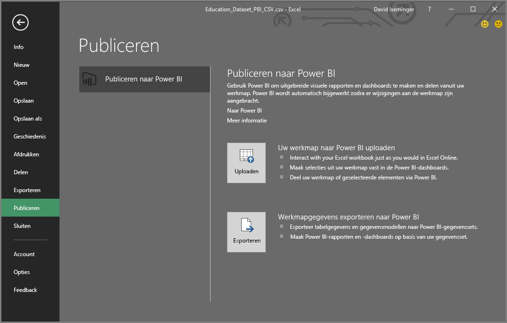
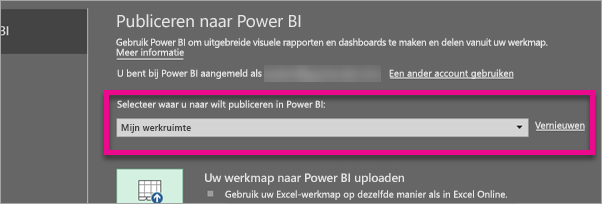
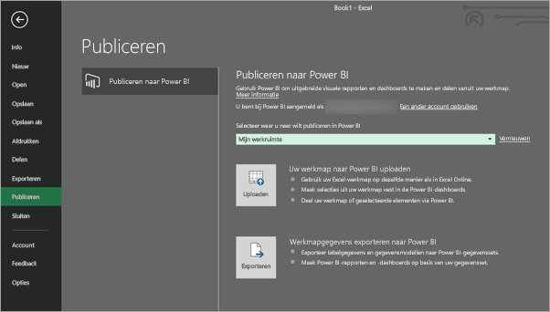
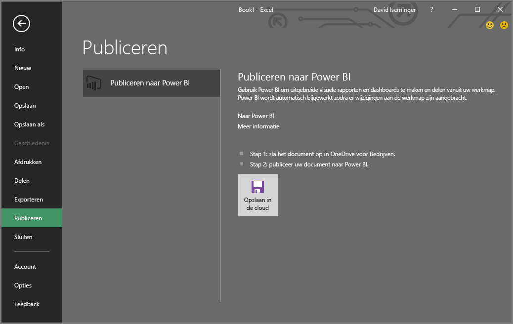
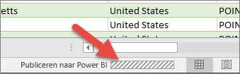

# Vanuit Microsoft Excel publiceren naar Power BI
U kunt uw Excel-werkmappen met Microsoft Excel 2016 of hoger direct naar uw [Power BI](https://powerbi.microsoft.com)-werkruimte publiceren, waar u interactieve rapporten en dashboards op basis van uw werkmapgegevens kunt maken. Vervolgens kunt u uw inzichten delen met anderen in uw organisatie.

Wanneer u een werkmap naar Power BI publiceert, moet u rekening houden met het volgende:

* Het account waarmee u zich aanmeldt bij Office, OneDrive voor Bedrijven (als u daar opgeslagen werkmappen gebruikt) en Power BI moet hetzelfde account zijn.
* U kunt een lege werkmap of een werkmap zonder door Power BI ondersteunde inhoud niet publiceren.
* U kunt geen versleutelde of met wachtwoord beveiligde werkmappen of werkmappen met Information Protection-beheer publiceren.
* Publiceren naar Power BI vereist dat moderne verificatie ingeschakeld is (standaard). Indien uitgeschakeld, is de optie Publiceren niet beschikbaar in het menu Bestand.

## Uw Excel-werkmap publiceren
Als u uw Excel-werkmap wilt publiceren, selecteert u in Excel **Bestand** > **Publiceren** en selecteert u **Uploaden** of **Exporteren**.

Als u uw werkmap wilt **uploaden** naar Power BI, kunt u met de werkmap werken zoals u dat met Excel Online zou doen. U kunt ook selecties uit uw werkmap vastmaken aan Power BI-dashboards en uw werkmap of geselecteerde elementen delen via Power BI.

Als u **Exporteren** selecteert, kunt u tabelgegevens en het bijbehorende gegevensmodel exporteren naar een Power BI-gegevensset en daarmee Power BI-rapporten en -dashboards maken.

### Lokaal bestand publiceren
Excel biedt ondersteuning voor het publiceren van lokale Excel-bestanden. Ze hoeft niet te worden opgeslagen in OneDrive voor bedrijven of SharePoint Online.

> [!IMPORTANT]
> U kunt alleen lokale bestanden publiceren als u Excel 2016 (of hoger) gebruikt met een Microsoft 365-abonnement. Zelfstandige installaties van Excel 2016 kunnen worden gebruikt om naar Power BI te publiceren, maar alleen wanneer de werkmap wordt opgeslagen in OneDrive voor Bedrijven of SharePoint Online.
> 

Wanneer u **Publiceren** selecteert, kunt u de werkruimte selecteren waarnaar u wilt publiceren. Als uw Excel-bestand zich in OneDrive voor bedrijven bevindt, kunt u alleen publiceren naar *Mijn werkruimte*. Als uw Excel-bestand zich op een lokaal station bevindt, kunt u publiceren naar *Mijn werkruimte* of een gedeelde werkruimte waartoe u toegang hebt.

Twee opties voor het overbrengen van uw werkmap naar Power BI.

Na publicatie wordt de inhoud van de werkmap geïmporteerd in Power BI, los van het lokale bestand. Als u het bestand in Power BI wilt bijwerken, moet u de bijgewerkte versie opnieuw publiceren. U kunt de gegevens ook vernieuwen door een geplande vernieuwing te configureren voor de werkmap of de gegevensset in Power BI.

### Publiceren vanuit een zelfstandige Excel-installatie
Wanneer u de werkmap publiceert vanuit een zelfstandige Excel-installatie, moet de werkmap worden opgeslagen in OneDrive voor Bedrijven. Selecteer **Opslaan naar Cloud** en kies een locatie in OneDrive voor Bedrijven.

Zodra uw werkmap is opgeslagen in OneDrive voor Bedrijven en u **Publiceren** selecteert, kunt u kiezen tussen **Uploaden** of **Exporteren** om uw werkmap in Power BI te krijgen:

#### Uw werkmap naar Power BI uploaden
Als u de optie **Uploaden** kiest, verschijnt uw werkmap in Power BI net als in Excel Online. Maar, anders dan in Excel Online, hebt u hier een aantal opties waarmee u elementen uit uw werkbladen direct aan uw dashboards kunt vastmaken.

U kunt uw werkmap niet in Power BI bewerken. Als u wijzigingen wilt aanbrengen, kunt u op **Bewerken** selecteren en uw werkmap vervolgens bewerken in Excel Online of openen in Excel op uw computer. Eventuele wijzigingen worden opgeslagen in de werkmap op OneDrive voor Bedrijven.

Als u **Uploaden** kiest, wordt er geen gegevensset gemaakt in Power BI. Uw werkmap wordt weergegeven in Rapporten, in het navigatievenster van uw werkruimte. Werkmappen die naar Power BI zijn geüpload, hebben een speciaal Excel-pictogram om ze te identificeren als Excel-werkmappen die zijn geüpload.

Kies de optie **Uploaden** als er alleen gegevens in de werkbladen staan of als u draaitabellen en grafieken hebt die u wilt weergeven in Power BI.

Uploaden van Publiceren naar Power BI in Excel werkt bijna hetzelfde als **Gegevens ophalen > Bestand > OneDrive voor Bedrijven > Verbinding maken, Beheren en Excel weergeven in Power BI** vanuit Power BI in uw browser.

#### Werkmapgegevens exporteren naar Power BI
Als u de optie **Exporteren** kiest, worden alle ondersteunde gegevens in tabellen en/of een gegevensmodel geëxporteerd naar een nieuwe gegevensset in Power BI. Alle Power View-werkbladen worden opnieuw gemaakt in Power BI als rapporten.

U kunt uw werkmap blijven bewerken. Wanneer uw wijzigingen worden opgeslagen, worden ze meestal binnen een uur gesynchroniseerd met de gegevensset in Power BI. Als u de wijzigingen sneller wilt doorvoeren, kunt u opnieuw **Publiceren** selecteren in Excel, en worden uw wijzigingen direct geëxporteerd. Alle visualisaties in rapporten en dashboards worden ook bijgewerkt.

Kies de optie **Publiceren** als u Gegevens ophalen en transformeren of Power Pivot hebt gebruikt om gegevens in een gegevensmodel te laden, of als uw werkmap Power View-bladen bevat met visualisaties die u in Power BI wilt weergeven.

De functie **Exporteren** werkt bijna hetzelfde als **Gegevens ophalen > Bestand > OneDrive voor Bedrijven > Excel-gegevens exporteren naar Power BI** vanuit Power BI in uw browser.

## Publiceren
Wanneer u een van beide opties kiest, wordt Excel bij Power BI met uw huidige account aangemeld en wordt uw werkmap naar uw Power BI-werkruimte gepubliceerd. U kunt de statusbalk in Excel controleren om de voortgang van het publicatieproces bij te houden.

Als het proces is voltooid, kunt u rechtstreeks vanuit Excel naar Power BI gaan.

## Volgende stappen
[Excel-gegevens in Power BI](service-excel-workbook-files.md)  
Hebt u nog vragen? [Misschien dat de Power BI-community het antwoord weet](https://community.powerbi.com/)

