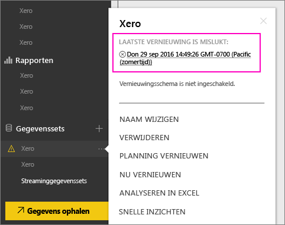
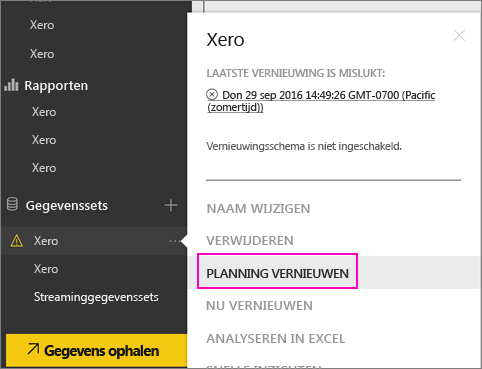
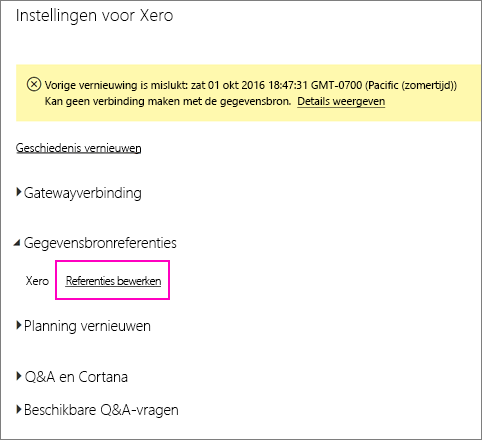
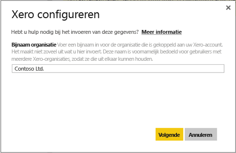
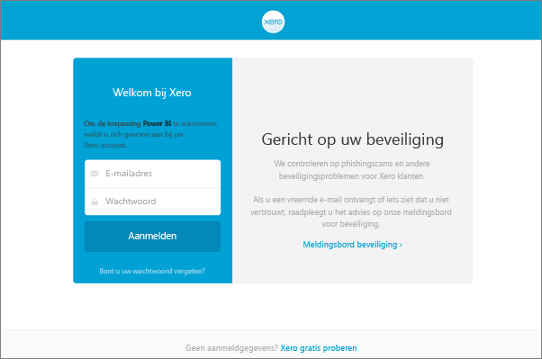
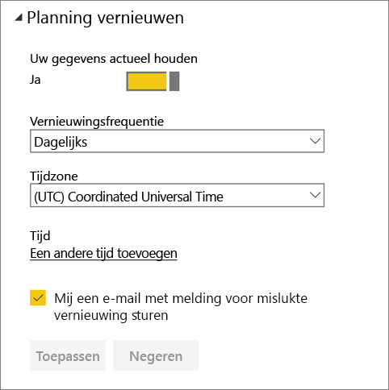
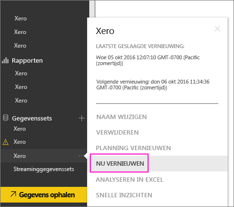

# Uw referenties voor het Xero-inhoudspakket vernieuwen als vernieuwen is mislukt
Als u het Xero Power BI-inhoudspakket gebruikt, hebt u mogelijk problemen ondervonden met het dagelijkse vernieuwen van het inhoudspakket vanwege een recent service-incident met Power BI.

U kunt bekijken of het inhoudspakket is vernieuwd door de meest recente vernieuwingsstatus voor uw Xero-gegevensset te controleren zoals in de onderstaande schermafbeelding wordt weergegeven.

Als het vernieuwen is mislukt zoals hierboven wordt weergegeven, voert u de volgende stappen uit om uw referenties voor het inhoudspakket te vernieuwen.

1. Klik op **Meer opties** (...) naast uw Xero-gegevensset en klik vervolgens op **Vernieuwing plannen**. Hiermee opent u de instellingenpagina voor het Xero-inhoudspakket.
   
    
2. Selecteer op de pagina **Instellingen voor Xero** de optie **Gegevensbronreferenties** > **Referenties bewerken**.
   
    
3. Voer de naam van uw organisatie in > **Volgende**.
   
    
4. Meld u aan met uw Xero-account.
   
    
5. Nu uw referenties zijn bijgewerkt, kunt u controleren of het vernieuwingsschema zo is ingesteld dat het dagelijks wordt uitgevoerd. Dit doet u door op **Meer opties** (...) naast uw Xero-gegevensset te klikken en vervolgens op **Vernieuwing plannen** te klikken.
   
    
6. U kunt de gegevensset ook direct vernieuwen. Klik op **Meer opties** (...) naast uw Xero-gegevensset en klik vervolgens op **Nu vernieuwen**.
   
    

Als u nog steeds problemen ondervindt bij het vernieuwen, kunt u contact met ons opnemen via [https://support.powerbi.com](https://support.powerbi.com) 

Ga naar de [Help-pagina voor Xero- inhoudspakketten](service-connect-to-xero.md) voor meer informatie over het Xero-inhoudspakket voor Power BI.

### Volgende stappen
* Hebt u nog vragen? [Misschien dat de Power BI-community het antwoord weet](https://community.powerbi.com/)

