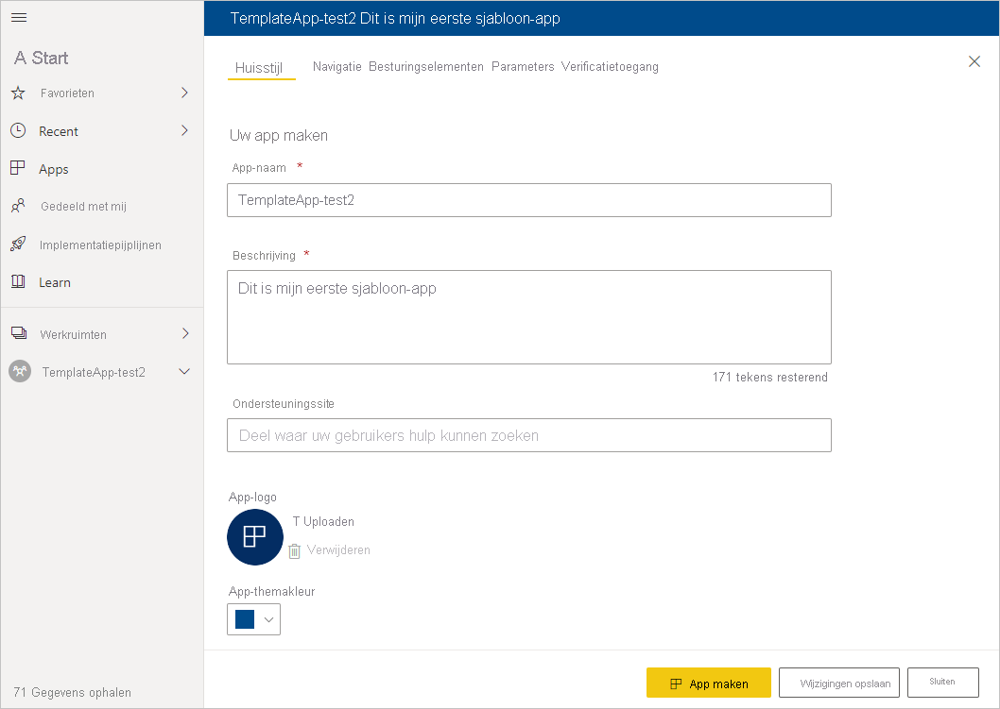
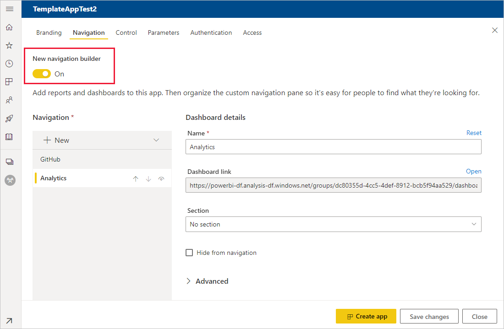
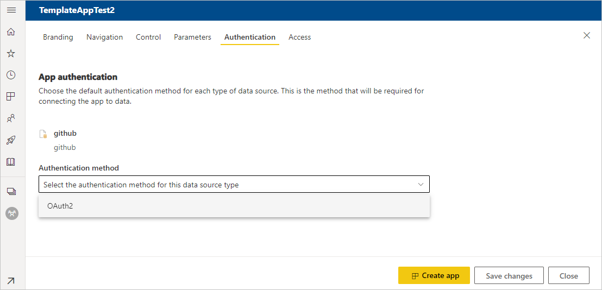
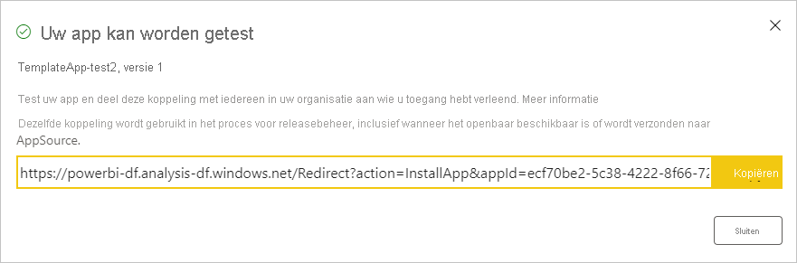

# Een sjabloon-app maken in Power BI

Met Power BI-*sjabloon-apps* kunnen Power BI-partners Power BI-apps maken met weinig of geen code en deze implementeren voor elke Power BI-klant.  Dit artikel bevat stapsgewijze instructies voor het maken van een Power BI-sjabloon-app.

Als u Power BI-rapporten en -dashboards kunt maken, kunt u een *sjabloon-app-bouwer* worden die analytische inhoud maakt en verpakt in een *app*. Vervolgens kunt u uw app implementeren naar andere Power BI-tenants via elk beschikbaar platform, zoals AppSource of uw eigen webservice. Als u uw sjabloon-app via uw eigen webservice distribueert, kunt u zelfs [een deel van het installatieproces automatiseren](../developer/template-apps/template-apps-auto-install.md) om het uw klanten makkelijker te maken.

Power BI-beheerders beheren en bepalen wie er binnen de betreffende organisatie sjabloon-apps kan maken en wie deze kan installeren. Gemachtigde gebruikers kunnen uw sjabloon-app installeren en deze vervolgens wijzigen en distribueren naar de Power BI-gebruikers in hun organisatie.

## Vereisten

Dit zijn de vereisten voor het bouwen van een sjabloon-app:  

- Een [Power BI Pro-licentie](../fundamentals/service-self-service-signup-for-power-bi.md)
- De [installatie van Power BI Desktop](../fundamentals/desktop-get-the-desktop.md) (optioneel)
- Vertrouwd zijn met de [basisconcepten van Power BI](../fundamentals/service-basic-concepts.md)
- Machtigingen voor het openbaar delen van een sjabloon-app (Raadpleeg Power BI-[beheerportal, sjabloon-app-instellingen](../admin/service-admin-portal.md#template-apps-settings) voor meer informatie

## De werkruimte voor sjabloon maken

Voor het maken van een sjabloon-app die u naar andere Power BI-tenants kunt distribueren, moet u de app in een van de nieuwe werkruimten maken.

1. In de Power BI-service selecteert u **Werkruimten** > **Een werkruimte maken**.

    

2. Voer in **Een werkruimte maken** een naam, beschrijving (optioneel) en logoafbeelding (optioneel) voor uw werkruimte in.

    

4. Vouw de sectie **Geavanceerd** uit en selecteer **Een sjabloon-app ontwikkelen**.

    

5. Selecteer **Opslaan**.
>[!NOTE]
>U hebt machtigingen van uw Power BI-beheerder nodig om het niveau van sjabloon-apps te verhogen.

## Inhoud toevoegen aan de werkruimte van de sjabloon-app

Net als bij een normale Power BI-werkruimte bestaat de volgende stap uit het toevoegen van inhoud aan de werkruimte.  

- [Maak uw Power BI-inhoud](index.yml) in uw werkruimte.

Als u parameters in Power Query gebruikt, moet u ervoor zorgen dat de typen ervan goed gedefinieerd zijn (bijvoorbeeld Tekst). De typen Any en Binary worden niet ondersteund.

[Tips voor het ontwerpen van sjabloon-apps in Power BI](service-template-apps-tips.md) bevat suggesties die u kunt overwegen bij het maken van rapporten en dashboards voor uw app-sjabloon.

## De eigenschappen van de sjabloon-app definiëren

Nu u inhoud in uw werkruimte hebt, kunt u deze verpakken in een sjabloonapp. De eerste stap is het maken van een testsjabloon-app, die alleen toegankelijk is binnen uw organisatie op uw tenant.

1. Selecteer **App maken** in de werkruimte van de sjabloon-app.

    

    Hier vult u op zes tabbladen aanvullende bouwopties voor uw sjabloon-app in:

    **Huisstijl**

    
    - Naam van app
    - Beschrijving
    - Ondersteuningssite (koppeling staat onder de app-gegevens nadat de sjabloon-app als organisatie-app is gedistribueerd)
    - App-logo (bestandsgrootte van maximaal 45K, hoogte-breedteverhouding van 1:1, in de indeling .png, .jpg of .jpeg)
    - Themakleur App

    **Navigatie**

    Activeer **Nieuwe bouwfunctie voor navigatie**, waar u het navigatievenster van de app kunt definiëren (zie [De navigatie-ervaring ontwerpen](../collaborate-share/service-create-distribute-apps.md#design-the-navigation-experience) in dit artikel voor meer informatie).

   
    
    **Landingspagina van app:** Als u ervoor kiest om de opbouwfunctie voor navigatie niet te gebruiken, kunt u de landingspagina van de app selecteren. Definieer een rapport of dashboard als startpagina van uw app. Gebruik een landingspagina die de juiste indruk geeft.

    **Beheer**

    Stel limieten en beperkingen voor de inhoud van uw app in voor de gebruikers van uw app. Met dit besturingselement kunt u intellectueel eigendom in uw app beveiligen.

    

    >[!NOTE]
    >Elementen exporteren naar de .pbix-indeling wordt altijd geblokkeerd voor gebruikers die de app installeren.

    **Parameters**

    De parameters worden gemaakt in het oorspronkelijke pbix-bestand (meer informatie over het [maken van queryparameters](https://powerbi.microsoft.com/blog/deep-dive-into-query-parameters-and-power-bi-templates/)). U kunt de mogelijkheden op dit tabblad gebruiken om degene die de app installeert na het installeren te helpen de app te configureren als diegene verbinding maakt met zijn/haar gegevens.

    Op dit tabblad kunt u ook een koppeling naar de app-documentatie opgeven.

    

    Elke parameter heeft een naam en een beschrijving, die uit de query komen, en een waardeveld. Er zijn drie opties om tijdens de installatie een waarde op te halen voor de parameter.

    * U kunt vereisen dat degene die de app installeert een waarde invoert. In dat geval geeft u een voorbeeld op dat diegene moet vervangen. Als u een parameter op deze manier wilt configureren, schakelt u het selectievakje **Vereist** in en typt u vervolgens in het tekstvak een voorbeeld van de verwachte waarde voor de gebruiker. Bijvoorbeeld:

       

    * U kunt een vooraf ingevulde waarde opgeven die de gebruiker die de app installeert, niet kan wijzigen. Een parameter die op deze manier is geconfigureerd, wordt verborgen voor degene die de app installeert. Gebruik deze methode alleen als u zeker weet dat de vooraf ingevulde waarde geldig is voor alle gebruikers. Gebruik anders de hierboven vermelde eerste methode, waarvoor gebruikersinvoer is vereist.

       Als u een parameter op deze manier wilt configureren, voert u de waarde in het tekstvak **Waarde** in en klikt u vervolgens op het vergrendelingspictogram. Hierdoor kan de waarde niet worden gewijzigd. Bijvoorbeeld:

       

    * U kunt een standaardwaarde opgeven die de gebruiker tijdens de installatie kan wijzigen. Als u een parameter op deze manier wilt configureren, voert u de gewenste standaardwaarde in het tekstvak **Waarde** in en laat u het vergrendelingspictogram ontgrendeld. Bijvoorbeeld:

      

    **Verificatie**
    
    Op dit tabblad selecteert u de te gebruiken verificatiemethode. Welke opties beschikbaar zijn, is afhankelijk van de gebruikte gegevensbrontypen.

    

    Het privacyniveau wordt automatisch geconfigureerd:
   * Enkele gegevensbron: Wordt automatisch geconfigureerd als privé.
   * Meervoudige anonieme gegevensbron: Wordt automatisch geconfigureerd als openbaar.

    **Toegang**
    
    In de testfase bepaalt u welke andere personen in uw organisatie uw app kunnen installeren en testen. U kunt deze instellingen altijd later wijzigen. De instelling heeft geen invloed op de toegang tot de gedistribueerde sjabloon-app.

    

2. Selecteer **App maken**.

    U ziet een bericht dat de test-app gereed is, met daarin een koppeling om de app te kopiëren en te delen met de testers van uw app.

    

    U hebt ook de eerste stap van het publicatiebeheerproces uitgevoerd, dat hieronder wordt uiteengezet.

## De publicatie van de sjabloon-app beheren

Voordat u deze sjabloon-app openbaar maakt, moet u controleren of de app helemaal klaar is voor gebruik. Power BI heeft een deelvenster voor publicatiebeheer gemaakt, waarin u het volledige publicatiepad van de app kunt volgen en controleren. U kunt de overgang ook per fase activeren. Dit zijn de algemene fasen:

- Test-app genereren: uitsluitend om te testen binnen uw organisatie.
- Het testpakket promoveren naar de preproductiefase: de app buiten uw organisatie testen.
- Het preproductiepakket promoveren naar productie: productieversie.
- Een pakket verwijderen of opnieuw beginnen vanaf de vorige fase.

Als u tussen de releasefasen wisselt, wordt de URL niet gewijzigd. Niveauverhoging heeft geen invloed op de URL zelf.

De verschillende fasen worden hieronder besproken:

1. Selecteer **Publicatiebeheer** in de werkruimte van de sjabloon.

    

2. Selecteer **Koppeling ophalen** als u de test-app hebt gemaakt in de sectie **De eigenschappen van de sjabloon-app definiëren** hierboven (waardoor de gele stip naast **Testen** al is gevuld).

    Als u de app nog niet hebt gemaakt, selecteert u **App maken**. Hierdoor gaat u terug naar het proces voor het maken van de sjabloon-app.

    

4. Als u de installatie-ervaring van de app wilt testen, kopieert u de koppeling in het meldingenvenster en plakt u deze in een nieuw browservenster.

    Vanaf hier volgt u dezelfde procedure als uw klanten. Zie [Sjabloon-apps in uw organisatie installeren en distribueren](service-template-apps-install-distribute.md).

5. Selecteer **Installeren** in het dialoogvenster.

    Wanneer de installatie is geslaagd, ziet u een melding dat de nieuwe app gereed is.

6. Selecteer **Ga naar app**.

    Controleer of de test-app de voorbeeldgegevens bevat. Als u wijzigingen wilt aanbrengen, gaat u terug naar de app in de oorspronkelijke werkruimte. Werk de test-app bij totdat u helemaal tevreden bent.

1. Als u klaar bent om het niveau van de app te verhogen naar de preproductiefase waarin de app buiten uw tenant wordt getest, gaat u terug naar het deelvenster **Publicatiebeheer** en selecteert u **App promoveren**.

    
    >[!NOTE]
    > Zodra het niveau van de app is verhoogd, wordt deze openbaar beschikbaar buiten uw eigen organisatie.

    Als u deze optie niet ziet, neemt u contact op met uw Power BI-beheerder om u [machtigingen voor de ontwikkeling van sjabloon-apps](../admin/service-admin-portal.md#template-apps-settings) te verlenen in de beheerportal.
11. Selecteer **Niveau verhogen** om uw keuze te bevestigen.
12. Kopieer deze nieuwe URL om de app buiten uw tenant te testen. Dit is ook de koppeling die u verzendt voor de distributie van uw app op AppSource door een [nieuwe Partnercentrum-aanbieding](/azure/marketplace/partner-center-portal/create-power-bi-app-offer) te maken. Verzend alleen preproductiekoppelingen naar het Partnercentrum. Pas als de app is goedgekeurd en u een melding hebt gekregen dat uw app in AppSource is gepubliceerd, kunt u dit pakket promoveren naar productie in Power BI.
13. Wanneer uw app gereed is voor productie of kan worden gedeeld via AppSource, gaat u terug naar het deelvenster **Publicatiebeheer** en selecteert u **App promoten** naast **Vóór productie**.
14. Selecteer **Niveau verhogen** om uw keuze te bevestigen.

    Uw app is nu in productie en gereed voor distributie.

    

Als u uw app algemeen beschikbaar wilt stellen voor duizenden Power BI-gebruikers wereldwijd, raden we u aan de app te verzenden naar AppSource. Zie de [aanbieding voor Power BI-toepassing](/azure/marketplace/partner-center-portal/create-power-bi-app-offer) voor meer informatie.

## Parameterconfiguratie automatiseren tijdens de installatie

Als u een ISV bent en u een sjabloon-app via uw webservice distribueert, kunt u de configuratie van de parameters van de sjabloon-app automatiseren wanneer uw klanten de app installeren in hun Power BI-account. Dit maakt het eenvoudiger voor uw klanten en verhoogt de kans op een succes volle installatie omdat ze geen details hoeven op te geven die ze mogelijk niet kennen. Zie [Automatische configuratie van de installatie van een sjabloon-app](../developer/template-apps/template-apps-auto-install.md) voor meer informatie.

## Volgende stappen

Zie hoe uw klanten werken met uw sjabloon-app in [Install, customize, and distribute template apps in your organization](service-template-apps-install-distribute.md) (Sjabloon-apps in uw organisatie installeren, aanpassen en distribueren).

Zie de [aanbieding voor Power BI-toepassing](/azure/marketplace/partner-center-portal/create-power-bi-app-offer) voor meer informatie over het distribueren van uw app.