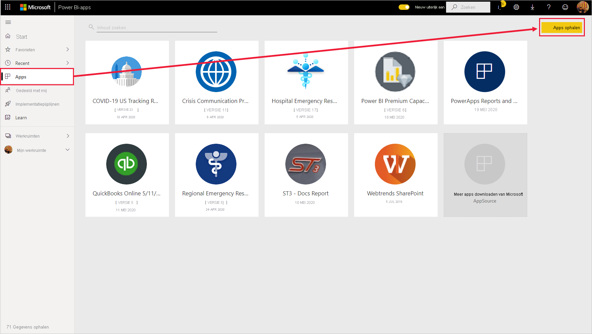
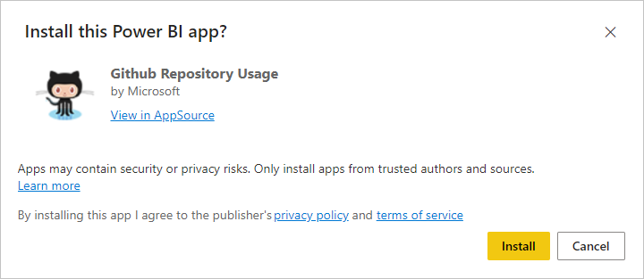
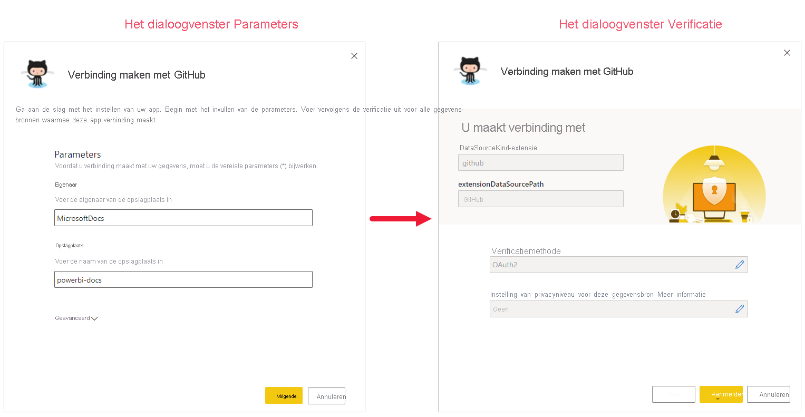

# Sjabloon-apps in uw organisatie installeren en distribueren

Bent u een Power BI-analist? In dat geval leest u in dit artikel hoe u [sjabloon-apps](service-template-apps-overview.md) kunt installeren om in verbinding te komen met de vele services waarmee u uw bedrijfsactiviteiten uitvoert, zoals Salesforce, Microsoft Dynamics en Google Analytics. U kunt de vooraf gemaakte dashboards en rapporten van de sjabloon-app wijzigen om aan de behoeften van uw organisatie te voldoen en deze als [app](../consumer/end-user-apps.md) naar uw collega's distribueren. 

Zie [Een sjabloon-app maken in Power BI](service-template-apps-create.md) als u meer wilt weten over het maken van sjabloon-apps die u buiten uw organisatie kunt distribueren. Power BI-partners kunnen Power BI-apps bouwen met weinig of geen code en deze beschikbaar stellen voor Power BI-klanten. 

## Vereisten  

Als u een sjabloon-app wilt installeren, aanpassen en distribueren, hebt u het volgende nodig: 

* Een [Power BI Pro-licentie](../fundamentals/service-self-service-signup-for-power-bi.md).
* Machtigingen om sjabloon-apps te installeren op uw tenant.
* Een geldige installatiekoppeling voor de app, die u ophaalt uit AppSource of van de maker van de app.
* Bekendheid met de [basisconcepten van Power BI](../fundamentals/service-basic-concepts.md).

## Een sjabloon-app installeren

1. Selecteer in de Power BI-service in het navigatievenster **Apps** > **Apps ophalen**.

    

1. Selecteer **Sjabloon-apps**in de marketplace voor Power BI apps die wordt weergegeven. Alle sjabloon-apps die beschikbaar zijn in AppSource worden weergegeven. Blader naar de sjabloon-app die u zoekt of krijg een gefilterde selectie met behulp van het zoekvak. Als u een deel van de naam van de sjabloon-app of een categorie zoals Financiën, Analytics, Marketing, enzovoort, typt, kunt u het gezochte item gemakkelijker vinden.

    

1. Wanneer u de sjabloon-app die u zoekt heeft gevonden, klikt u erop. De aanbieding voor de sjabloon-app wordt weergegeven. Klik op **GET IT NOW**.

   

1. Selecteer in het dialoogvenster dat verschijnt de optie **Installeren**.

    
    
    De app is geïnstalleerd, samen met een werkruimte met dezelfde naam als alle artefacten die nodig zijn voor verdere [aanpassingen](#customize-and-share-the-app).

    > [!NOTE]
    > Als u een installatiekoppeling gebruikt voor een app die niet in AppSource wordt vermeld, wordt u in het dialoogvenster voor validatie gevraagd uw keuze te bevestigen.
    >
    >Als u een sjabloon-app wilt installeren die niet wordt vermeld op AppSource, moet u de relevante machtigingen aanvragen bij uw beheerder. Zie de [Instellingen voor sjabloon-apps](../admin/service-admin-portal.md#template-apps-settings) in de Power BI-beheerportal voor meer informatie.

    Wanneer de installatie is voltooid, krijgt u een melding dat de nieuwe app gereed is.

    

## Verbinding maken met gegevens

1. Selecteer **Naar de app**.

1. Selecteer in het venster **Aan de slag met uw nieuwe app** **Verkennen**.

   

   De app wordt geopend met voorbeeldgegevens.

1. Selecteer de koppeling **Uw gegevens koppelen** op de banner bovenaan de pagina.

   

    
    Hiermee opent u een dialoogvenster of een reeks dialoogvensters waarin u de gegevensbron van de voorbeeldgegevens kunt wijzigen in uw eigen gegevensbron. Over het algemeen betekent dit dat u parameters van de gegevensset en referenties van de gegevensbron opnieuw definieert. Raadpleeg [Bekende beperkingen](service-template-apps-overview.md#known-limitations).
    
    In het onderstaande voorbeeld zijn twee dialoogvensters betrokken bij het maken van verbinding met gegevens.

   

    Wanneer u klaar bent met het invullen van de verbindingsdialoogvensters, wordt het verbindingsproces gestart. Met een banner wordt aangegeven dat de gegevens worden vernieuwd en dat u in de tussentijd naar voorbeeldgegevens kijkt.

    

   Uw rapportgegevens worden eenmaal per dag automatisch vernieuwd, tenzij u dit hebt uitgeschakeld tijdens het aanmeldingsproces. U kunt desgewenst ook [uw eigen vernieuwingsplanning instellen](./refresh-scheduled-refresh.md) om de rapportgegevens up-to-date te houden.

## De app aanpassen en delen

Nadat u verbinding hebt gemaakt met uw gegevens en de vernieuwing van gegevens is voltooid, kunt u de rapporten en dashboards aanpassen die in de apps zijn opgenomen, en de app delen met uw collega's. Houd er echter rekening mee dat eventuele wijzigingen die u aanbrengt, worden overschreven wanneer u de app bijwerkt met een nieuwe versie, tenzij u de gewijzigde items opslaat onder andere namen. [Zie informatie over overschrijven](#overwrite-behavior).

Als u uw app wilt aanpassen en delen, selecteert u het potloodpictogram in de rechterbovenhoek van de pagina.

Raadpleeg voor meer informatie over het bewerken van artefacten in de werkruimte het artikel
* [Rondleiding door de rapporteditor in Power BI](../create-reports/service-the-report-editor-take-a-tour.md)
* [Basisconcepten voor ontwerpers in de Power BI-service](../fundamentals/service-basic-concepts.md)

Zodra u klaar bent met het maken van wijzigingen in de artefacten in de werkruimte, kunt u de app publiceren en delen. Zie [Uw app publiceren](../collaborate-share/service-create-distribute-apps.md#publish-your-app) om te leren hoe u dit doet.

## Een sjabloon-app bijwerken

Van tijd tot tijd brengen makers van sjabloon-apps nieuwe versies van hun sjabloon-apps uit, via AppSource, directe koppeling of beide.

Als u de app oorspronkelijk hebt gedownload vanaf AppSource, krijgt u op twee manieren bericht wanneer een nieuwe versie van de sjabloon-app beschikbaar wordt:
* Er wordt een banner voor updates weergegeven in de Power BI-service om u te laten weten dat er een nieuwe app-versie beschikbaar is.
  
* U ontvangt een melding in het deelvenster Meldingen van Power BI.

  

>[!NOTE]
>Als u de app oorspronkelijk hebt ontvangen via een directe koppeling in plaats van via AppSource, is de enige manier om te weten te komen of een nieuwe versie beschikbaar is, door contact op te nemen met de maker van de sjabloon-app.

  Als u de update wilt installeren, klikt u op **Downloaden** op de meldingsbanner of in het meldingscentrum, of zoekt u de app weer op in AppSource en kiest u **Nu downloaden**. Als u een directe koppeling voor de update hebt gekregen van de maker van de sjabloon-app, klikt u gewoon op de koppeling.
  
  U wordt gevraagd of u de huidige versie wilt overschrijven, of dat u de nieuwe versie wilt installeren in een nieuwe werkruimte. Standaard is Overschrijven geselecteerd.

  

- **Een bestaande versie overschrijven:** hiermee wordt de bestaande werkruimte overschreven met de bijgewerkte versie van de sjabloon-app. [Zie informatie over overschrijven](#overwrite-behavior).

- **Installeren in een nieuwe werkruimte:** hiermee wordt een nieuwe versie van de werkruimte en app geïnstalleerd die u moet opnieuw configureren (dat wil zeggen, verbinding maken met gegevens, navigatie en machtigingen definiëren).

### Gedrag voor overschrijven

* Bij het overschrijven worden de rapporten, de dashboards en de gegevensset in de werkruimte bijgewerkt en niet de app zelf. Wanneer u overschrijft, worden de navigatie van de app, de instellingen en de machtigingen niet gewijzigd.
* Nadat u de werkruimte hebt bijgewerkt, moet u **de app bijwerken om wijzigingen voor de werkruimte toe te passen in de app**.
* Bij het overschrijven blijven geconfigureerde parameters en verificatie behouden. Na de update wordt automatisch gestart met het vernieuwen van de gegevensset. **Tijdens deze vernieuwing worden in de app, rapporten en dashboards voorbeeldgegevens weergegeven**.

  

* Tijdens het overschrijven worden er altijd voorbeeldgegevens weergegeven tot het vernieuwen is voltooid. Als de auteur van de sjabloon-app wijzigingen heeft aangebracht aan de gegevensset of parameters, zien gebruikers van de werkruimte en app de nieuwe gegevens pas wanneer de vernieuwing is voltooid. In plaats daarvan blijven ze de voorbeeldgegevens zien gedurende deze periode.
* Als u overschrijft, worden nooit nieuwe rapporten en dashboards overschreven die u hebt toegevoegd aan de werkruimte. Alleen de oorspronkelijke rapporten en dashboards worden overschreven met wijzigingen van de oorspronkelijke auteur.

>[!IMPORTANT]
>Vergeet niet om [de app bij te werken](#customize-and-share-the-app) na het overschrijven, om wijzigingen aan te brengen in de rapporten en dashboards voor de gebruikers van de organisatie-app.

## Volgende stappen

[Werkruimten maken met uw collega's in Power BI](../collaborate-share/service-create-the-new-workspaces.md)
