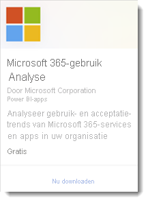

# Wat zijn Power BI-sjabloon-apps?

Met de nieuwe Power BI-*sjabloon-apps* kunnen Power BI-partners Power BI-apps maken met weinig of geen code en deze implementeren naar elke Power BI-klant.  In dit artikel wordt een overzicht gegeven van het programma Power BI-sjabloon-app.

Als Power BI-partner kunt u een set met out-of-the-box-inhoud voor uw klanten maken en deze zelf publiceren.  

U bouwt sjabloon-apps waarmee uw klanten binnen hun eigen accounts verbinding kunnen maken en kunnen instantiëren. Als domeinexperts kunnen ze de gegevens zodanig ontgrendelen dat deze eenvoudig kunnen worden gebruikt door hun zakelijke gebruikers.  

U dient een sjabloon-app in bij het Partnercentrum. De apps worden vervolgens openbaar beschikbaar in de [Marketplace voor Power BI-apps](https://app.powerbi.com/getdata/services) en in [Microsoft AppSource](https://appsource.microsoft.com/?product=power-bi). We besteden nu uitgebreid aandacht aan de ervaring van het maken van een openbare sjabloon-app.

## Marketplace voor Power BI apps

Met Power BI-sjabloon-apps kunnen gebruikers van Power BI Pro of Power BI Premium direct inzichten krijgen, via vooraf verpakte dashboards en rapporten die kunnen worden verbonden met livegegevensbronnen. Veel Power BI-apps zijn al beschikbaar in de [Marketplace voor Power BI-apps](https://app.powerbi.com/getdata/services).

|  |
|     :---:      |
|     |
|  |

## Proces
Het algemene proces om een sjabloon-app te ontwikkelen en in te dienen omvat meerdere fasen. In sommige fasen is het mogelijk dat er meerdere activiteiten tegelijkertijd moeten worden uitgevoerd.

| Fase | Power BI Desktop |  |Power BI-service  |  |Partnercentrum  |
|---|--------|--|---------|---------|---------|
| **Eén** | Bouw een gegevensmodel en een rapport in een pbix-bestand |  | Maak een werkruimte. Importeer een pbix-bestand. Een aanvullend dashboard maken  |  | Aanmelden als partner |
| **Twee** |  |  | Een testpakket maken en interne validatie uitvoeren        |  | |
| **Drie** | |  | Het testpakket promoveren naar de pre-productiefase voor validatie buiten uw Power BI-tenant en dit naar AppSource verzenden  |  | Met uw pre-productiepakket een Power BI-sjabloon-app-aanbieding maken en het validatieproces starten |
| **Vier** | |  | Het preproductie-pakket naar productie promoveren |  | Live gaan |

## Voordat u begint

Voor het maken van de sjabloon-app hebt u machtigingen nodig om er eentje te maken. Zie de Power BI-beheerderportal en Instellingen voor sjabloon-apps voor meer informatie. 

Voor het publiceren van een sjabloon-app naar de Power BI-service en AppSource moet u voldoen aan de vereisten voor [het worden van een Partnercentrum-uitgever](/azure/marketplace/become-publisher).
 
## Stappen op hoog niveau

Hier volgen de stappen op hoog niveau. 

1. [De vereisten bekijken](#requirements) om te controleren of u eraan voldoet. 

2. Een rapport maken in Power BI Desktop. Parameters gebruiken, zodat u deze kunt opslaan als een bestand dat anderen kunnen gebruiken. 

3. Maak een werkruimte voor uw sjabloon-app in uw tenant op de Power BI-service (app.powerbi.com). 

4. Importeer uw pbix-bestand en voeg inhoud aan uw app toe, zoals een dashboard. 

5. Maak een testpakket om zelf de sjabloon-app te testen binnen uw organisatie. 

6. Promoveer de test-app naar de pre-productiefase om de app voor validatie in te dienen bij AppSource en om deze buiten uw eigen tenant te testen. 

7. Dien de inhoud in bij het [Partnercentrum](/azure/marketplace/partner-center-portal/create-power-bi-app-offer) voor publicatie. 

8. Zorg ervoor dat uw aanbieding 'Live' gaat in AppSource en in de productiefase wordt geplaatst in Power BI.

9. U kunt nu beginnen het ontwikkelen van de volgende versie in dezelfde werkruimte, in de pre-productiefase. 

## Vereisten

Voor het maken van de sjabloon-app hebt u machtigingen nodig om er eentje te maken. Zie de Power BI-[beheerderportal en Instellingen voor sjabloon-apps](../admin/service-admin-portal.md#template-apps-settings) voor meer informatie.

Voor het publiceren van een sjabloon-app naar de Power BI-service en AppSource moet u voldoen aan de vereisten voor [het worden van een Partnercentrum-uitgever](/azure/marketplace/become-publisher).
 > [!NOTE] 
 > Indieningen van sjabloon-apps worden beheerd in [Partnercentrum](/azure/marketplace/partner-center-portal/create-power-bi-app-offer). Gebruik hetzelfde Microsoft Developer Center-registratieaccount om u aan te melden. U mag maar één Microsoft-account hebben voor uw AppSource-aanbiedingen. Accounts mogen niet specifiek zijn voor afzonderlijke services of aanbiedingen.

## Tips 

- Zorg ervoor dat uw app voorbeeldgegevens bevat waarmee iedereen in één klik aan de slag kan. 
- Bekijk uw toepassing zorgvuldig door deze in uw tenant en een secundaire tenant te installeren. Zorg ervoor dat klanten alleen zien wat u wilt dat ze zien. 
- Gebruik AppSource als uw onlinewinkel voor het hosten van uw toepassing. Op deze manier kan iedereen met behulp van Power BI uw app vinden. 
- Overweeg meer dan één sjabloon-app aan te bieden voor verschillende unieke scenario's. 
- Schakel aanpassing van de gegevens in, zoals ondersteuning voor aangepaste verbinding en configuratie van parameters door het installatieprogramma.

Zie [Tips voor het ontwerpen van sjabloon-apps in Power BI](service-template-apps-tips.md) voor meer suggesties.

## Bekende beperkingen

| Functie | Bekende beperking |
|---------|---------|
|Inhoud:  Gegevenssets   | Er moet exact één gegevensset aanwezig zijn. Alleen de gegevenssets die zijn ingebouwd in Power BI Desktop (.pbix-bestanden) zijn toegestaan.  Niet ondersteund: Gegevenssets uit andere sjabloon-apps, gegevenssets voor meerdere werkruimten, gepagineerde rapporten (.rdl-bestanden), Excel-werkmappen |
|Inhoud: Dashboards | Realtime-tegels zijn niet toegestaan (met andere woorden, geen ondersteuning voor push- of streaminggegevenssets) |
|Inhoud: Gegevensstromen | Niet ondersteund: Gegevensstromen |
|Inhoud van bestanden | Alleen .pbix-bestanden worden ondersteund.  Niet ondersteund: .rdl-bestanden (gepagineerde rapporten), Excel-werkmappen   |
| Gegevensbronnen | Gegevensbronnen die worden ondersteund voor via de cloud geplande gegevensvernieuwing zijn toegestaan.  Niet ondersteund: <li> DirectQuery</li><li>Liveverbindingen (geen Azure AS)</li> <li>On-premises gegevensbronnen (persoonlijke gateways en bedrijfsgateways worden niet ondersteund)</li> <li>Realtime (geen ondersteuning voor pushgegevensset)</li> <li>Samengestelde modellen</li></ul> |
| Gegevensset: voor meerdere werkruimten | Gegevenssets voor meerdere werkruimten zijn niet toegestaan  |
| Queryparameters | Niet ondersteund: Parameters van het type Any of Binary blokkeren het vernieuwen van de gegevensset |
| Power BI-visuals | Alleen de openbaar beschikbare Power BI-visuals worden ondersteund. [Power BI-organisatievisuals](../developer/visuals/power-bi-custom-visuals-organization.md) niet ondersteund |
| Onafhankelijke clouds | Sjabloon-apps zijn niet beschikbaar in onafhankelijke clouds |

## Ondersteuning
Gebruik [https://powerbi.microsoft.com/support](https://powerbi.microsoft.com/support) voor ondersteuning tijdens de ontwikkeling. We bewaken en beheren deze site actief. Klantincidenten worden zo snel mogelijk naar het desbetreffende team doorgestuurd.

## Volgende stappen

[Een sjabloon-app maken](service-template-apps-create.md)