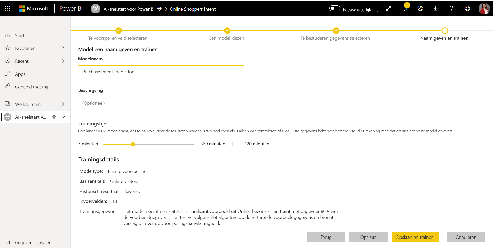

# Zelfstudie: Een machine learning-model bouwen in Power BI

In dit artikel gebruikt u **geautomatiseerde machine learning** om een binair voorspellingsmodel te maken en toe te passen in Power BI. De zelfstudie bevat richtlijnen voor het maken van een Power BI-gegevensstroom, en voor het gebruiken van de entiteiten die in de gegevensstroom zijn gedefinieerd om een machine learning-model te trainen en te valideren, rechtstreeks in Power BI. We gebruiken dat model vervolgens om met behulp van scores van nieuwe gegevens voorspellingen te genereren.

Eerst maakt u een machine learning-model van het type Binaire voorspelling, om de aankoopintentie van onlineklanten te voorspellen op basis van een set met kenmerken van hun onlinesessie. Voor deze oefening gebruiken we een gegevensset voor machine learning die als benchmark is gedefinieerd. Zodra een model is getraind, genereert Power BI automatisch een validatierapport waarin de resultaten van het model worden uitgelegd. U kunt dit validatierapport bekijken en het model toepassen op uw gegevens om een score te berekenen.

Deze zelfstudie bestaat uit de volgende stappen:
> [!div class="checklist"]

> * Een gegevensstroom maken met de invoergegevens
> * Een machine learning-model maken en trainen
> * Het modelvalidatierapport bekijken
> * Het model toepassen op een gegevensstroomentiteit
> * De beoordeelde uitvoer van het model gebruiken in een Power BI-rapport

## Een gegevensstroom maken met de invoergegevens

In het eerste deel van deze zelfstudie gaat u een gegevensstroom met invoergegevens maken. Dit proces vereist enkele stappen, zoals u kunt zien in de volgende secties, te beginnen met het ophalen van gegevens.

### Gegevens ophalen

De eerste stap bij het maken van een gegevensstroom is ervoor te zorgen dat uw gegevensbronnen klaar zijn. In ons geval gebruiken we een gegevensset voor machine learning uit een reeks onlinesessies, waarvan sommige een aankoop hebben opgeleverd. De gegevensset bevat een reeks kenmerken van deze sessies, die we gebruiken voor het trainen van het model.

U kunt de gegevensset downloaden van de website van UC Irvine. We hebben de gegevensset speciaal voor deze zelfstudie ook beschikbaar gemaakt via deze koppeling: [online_shoppers_intention.csv](https://raw.githubusercontent.com/santoshc1/PowerBI-AI-samples/master/Tutorial_AutomatedML/online_shoppers_intention.csv).

### De entiteiten maken

Als u entiteiten in uw gegevensstroom wilt maken, meldt u zich aan bij de Power BI-service en gaat u naar een werkruimte in uw toegewezen capaciteit waarvoor AI is ingeschakeld.

Als u nog geen werkruimte hebt, kunt u er een maken door in het navigatievenster in de Power BI-service **Werkruimten** te selecteren en vervolgens **Een werkruimte maken** te kiezen in het deelvenster aan de onderkant. Hiermee opent u een deelvenster aan de rechterkant waarin u gegevens van de werkruimte kunt invoeren. Voer een naam in voor de werkruimte en selecteer **Geavanceerd**. Controleer of de werkruimte toegewezen capaciteit gebruikt (die optie staat op Aan) en of de werkruimte is toegewezen aan een capaciteitsinstantie waarvoor de AI-preview is ingeschakeld. Selecteer vervolgens **Opslaan**.

Nadat de werkruimte is gemaakt, kunt u in de rechterbenedenhoek van het welkomstscherm **Overslaan** selecteren, zoals wordt aangegeven in de volgende afbeelding.

 Selecteer in de rechterbovenhoek van de werkruimte de knop **Maken** en selecteer vervolgens **Gegevensstroom**.

Selecteer **Nieuwe entiteiten toevoegen**. Hiermee wordt de editor **Power Query** gestart in de browser.

Selecteer **Tekst-/CSV-bestand** als gegevensbron, zoals wordt weer gegeven in de volgende afbeelding.

U ziet nu de pagina **Verbinding maken met een gegevensbron**. Plak de volgende koppeling naar _online_shoppers_intention.csv_ in het vak **Bestandspad of URL** en selecteer daarna **Volgende**.

`https://raw.githubusercontent.com/santoshc1/PowerBI-AI-samples/master/Tutorial_AutomatedML/online_shoppers_intention.csv`

In de Power Query-editor ziet u een voorbeeld van de gegevens uit het CSV-bestand. U kunt de naam van de query wijzigen in een beschrijvende naam door de waarde in het vak Naam in het rechterdeelvenster aan te passen. U kunt de naam van de query bijvoorbeeld wijzigen in _Online bezoekers_.

Power Query leidt automatisch het type kolommen af. U kunt het kolomtype wijzigen door te klikken op het pictogram van het kenmerktype bovenaan de kolomkop. In dit voorbeeld wijzigen we het type van de kolom Omzet in Waar/Onwaar.

Selecteer de knop **Opslaan en sluiten** om de Power Query-editor te sluiten. Geef een naam op voor de gegevensstroom en selecteer **Opslaan** (zie de volgende afbeelding).

## Een machine learning-model maken en trainen

Als u een machine learning-model wilt toevoegen, selecteert u de knop **ML-model toepassen** in de lijst **Acties** voor de basisentiteit die uw trainings- en labelgegevens bevat, en selecteert u vervolgens **Een Machine Learning-model toevoegen**.

De eerste stap voor het maken van ons machine learning-model is het identificeren van de historische gegevens, inclusief het resultaatveld dat u wilt voorspellen. Het model wordt gemaakt door te leren van deze gegevens.

In het geval van de gegevensset die we gebruiken, is dit het veld **Revenue**. Selecteer **Omzet** als waarde voor Resultaatveld en selecteer vervolgens **Volgende**.

Vervolgens moeten we het type machine learning-model selecteren dat we willen maken. Power BI analyseert de waarden in het veld met resultaten dat u hebt geïdentificeerd en stelt de typen machine learning-modellen voor die kunnen worden gemaakt om dat veld te voorspellen.

Aangezien we in dit geval een binair resultaat willen voor de vraag of een gebruiker al dan niet tot aankoop zal overgaan, wordt Binaire voorspelling aangeraden. Omdat we geïnteresseerd zijn in het voorspellen van gebruikers die een aankoop gaan doen, selecteert u Waar als het resultaat van de Omzet waarin u het meest geïnteresseerd bent. Verder kunt u beschrijvende labels opgeven voor de resultaten die moeten worden gebruikt in het automatisch gegenereerde rapport waarin de resultaten van de modelvalidatie worden samengevat. Selecteer vervolgens Volgende.

Power BI voert vervolgens een voorlopige scan uit van een sample van uw gegevens en stelt de invoerwaarden voor die meer nauwkeurige voorspellingen kunnen opleveren. Als Power BI geen veld aanbeveelt, wordt ernaast een uitleg gegeven. U hebt de mogelijkheid om de selecties te wijzigen zodat deze alleen de velden bevatten die door het model moeten worden onderzocht, of u kunt alle velden selecteren door het selectievakje naast de naam van de entiteit in te schakelen. Selecteer **Volgende** om de invoer te accepteren.

In de laatste stap moeten we een naam opgeven voor het model. Geef het model de naam _Voorspelling van aankoopintentie_. U kunt ervoor kiezen om de trainingstijd te verkorten om snel resultaten te bekijken of de hoeveelheid tijd die wordt besteed aan training te vergroten om het beste model te krijgen. Selecteer vervolgens **Opslaan en trainen** om te beginnen met het trainen van het model.

Het trainingsproces begint met het bemonsteren en normaliseren van uw historische gegevens en het opsplitsen van de gegevensset in twee nieuwe entiteiten: _Purchase Intent Prediction Training Data_ en _Purchase Intent Prediction Testing Data_.

Afhankelijk van de grootte van de gegevensset kan het trainingsproces enkele minuten duren of zolang als de trainingstijd die is geselecteerd in het vorige scherm. Op dit moment kunt u het model zien op het tabblad **Machine Learning-modellen** van de gegevensstroom. De status Gereed geeft aan dat het model in de wachtrij is geplaatst voor training of wordt getraind.

U kunt aan de status van de gegevensstroom zien of het model wordt getraind en gevalideerd. Dit wordt aangegeven als het vernieuwen van gegevens op het tabblad **Gegevensstromen** van de werkruimte.

Zodra de training van het model is voltooid, wordt voor de gegevensstroom een bijgewerkte tijd voor vernieuwing weergegeven. U kunt controleren of het model is getraind door naar het tabblad **Machine Learning-modellen** van de gegevensstroom te gaan. Het model dat u hebt gemaakt, moet de status **Getraind** hebben en de tijd bij **Laatst getraind** moet zijn bijgewerkt.

## Het modelvalidatierapport bekijken
Als u het validatierapport van het model wilt bekijken, selecteert u op het tabblad Machine learning-modellen de knop Prestatierapport weergeven in de kolom Acties voor het model. In dit rapport wordt beschreven hoe uw machine learning-model waarschijnlijk zal presteren.

Selecteer op de pagina **Modelprestaties** van het rapport **Belangrijkste voorspellingsfactoren zien** om de belangrijkste voorspellingsfactoren voor uw model weer te geven. U kunt een van de voorspellingsfactoren selecteren om te zien hoe het resultaat van die factor is verdeeld.

U kunt de slicer **Drempelwaarde waarschijnlijkheid** op de pagina Modelprestaties gebruiken om de invloed van de voorspellingsfactor op de waarden voor precisie en terughalen van het model te onderzoeken.

Op de andere pagina's van het rapport worden de statistische prestatiegegevens voor het model beschreven.

Het rapport bevat ook een pagina Trainingsdetails waarop de verschillende iteraties worden beschreven die zijn uitgevoerd, hoe functies zijn geëxtraheerd uit de invoer en de hyperparameters die voor het uiteindelijke model zijn gebruikt.

## Het model toepassen op een gegevensstroomentiteit

Selecteer de knop **Model toepassen** bovenaan het rapport om dit model aan te roepen. In het dialoogvenster **Toepassen** kunt u de doelentiteit opgeven die de brongegevens bevat waarop het model moet worden toegepast.

Als dit wordt gevraagd, moet u de gegevensstroom **vernieuwen** om een voorbeeld van de resultaten van het model te kunnen bekijken.

Wanneer het model wordt toegepast, worden er twee nieuwe entiteiten gemaakt, met het achtervoegsel **verrijkte <model_name>** en **verrijkte <model_name> uitleg**. In ons geval wordt door het model toe te passen op de entiteit **Online bezoekers** **Online bezoekers verrijkte Aankoopintentievoorspelling** gemaakt die de voorspelde uitvoer van het model bevat en **Online bezoekers verrijkte Aankoopintentievoorspelling uitleg** waarin de top recordspecifieke beïnvloeders voor de voorspelling staan. 

Bij het toepassen van een binair voorspellingsmodel worden er vier kolommen toegevoegd met het voorspelde resultaat, een waarschijnlijkheidsscore, de belangrijkste, recordspecifieke beïnvloeders voor de voorspelling en uitlegindex, elke voorafgegaan door de opgegeven kolomnaam.  

Zodra het vernieuwen van de gegevensstroom is voltooid, kunt u de entiteit **Online bezoekers verrijkte Aankoopintentievoorspelling** selecteren om de resultaten te bekijken.

## De beoordeelde uitvoer van het model gebruiken in een Power BI-rapport

Als u de beoordeelde uitvoer van uw machine learning-model wilt gebruiken, kunt u vanuit Power BI Desktop verbinding maken met de gegevensstroom (met behulp van de connector Gegevensstromen). De entiteit **Online bezoekers verrijkte Aankoopintentievoorspelling** kan nu worden gebruikt om de voorspellingen van uw model op te nemen in Power BI-rapporten.

## Volgende stappen

In deze zelfstudie hebt u een binair voorspellingsmodel gemaakt en toegepast in Power BI met behulp van de volgende stappen:

* Een gegevensstroom maken met de invoergegevens
* Een machine learning-model maken en trainen
* Het modelvalidatierapport bekijken
* Het model toepassen op een gegevensstroomentiteit
* De beoordeelde uitvoer van het model gebruiken in een Power BI-rapport

Zie [Geautomatiseerde machine learning in Power BI](../transform-model/service-machine-learning-automated.md) voor meer informatie over geautomatiseerde machine learning in Power BI.
