# Zelfstudie: Verbinding maken met een GitHub-opslagplaats met Power BI
In deze zelfstudie gaat u echte gegevens gebruiken: de openbare opslagplaats met Power BI-inhoud (ook wel een *repo* genoemd) in de GitHub-service. In Power BI worden automatisch een dashboard en rapport met de gegevens gemaakt. U ziet antwoorden op vragen zoals: Hoeveel mensen dragen bij aan de openbare Power BI-opslagplaats? Wie levert de meeste bijdragen? Op welke dag van de wek worden de meeste bijdragen geleverd? En andere vragen. 

U kunt ook verbinding maken met uw eigen persoonlijke of openbare GitHub-opslagplaatsen. In het artikel [Verbinding maken met GitHub via Power BI](service-connect-to-github.md) wordt uitgelegd hoe u een *sjabloon-app* van Power BI gebruikt om verbinding te maken met uw opslagplaatsen.

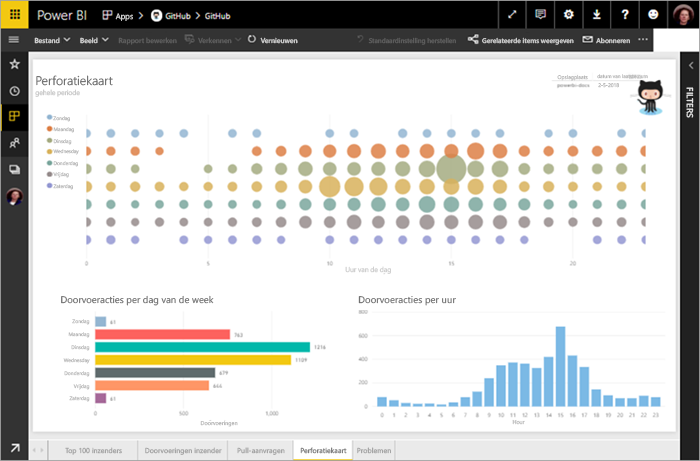

In deze zelfstudie voert u de volgende stappen uit:

> [!div class="checklist"]
> * Meld u aan voor een GitHub-account als u dat nog niet hebt 
> * Meld u aan bij uw Power BI-account, of meld u aan voor een account als u dat nog niet hebt
> * De Power BI-service openen
> * De GitHub-app zoeken
> * De informatie voor de openbare GitHub-opslagplaats van Power BI invoeren
> * Het dashboard en rapport met GitHub-gegevens bekijken
> * De app verwijderen om resources te wissen

Als u zich niet hebt geregistreerd voor Power BI, kunt u zich hier [aanmelden voor een gratis proefversie](https://app.powerbi.com/signupredirect?pbi_source=web) voordat u begint.

## Vereisten

Voor het voltooien van deze zelfstudie hebt u een GitHub-account nodig, als u dit nog niet hebt. 

- Meld u aan voor een [GitHub-account](/contribute/get-started-setup-github).

## Verbinding maken
1. Aanmelden bij de Power BI-service (`https://app.powerbi.com`). 
2. Selecteer in het navigatievenster de optie **Apps** en selecteer vervolgens **Apps downloaden**.
   
   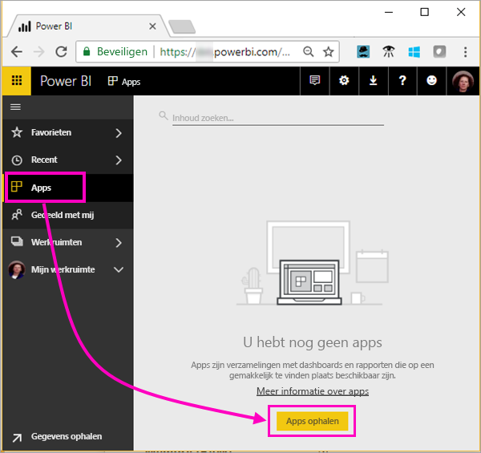 

3. Selecteer **Apps** , typ **GitHub** in het zoekvak > **Nu downloaden**.
   
   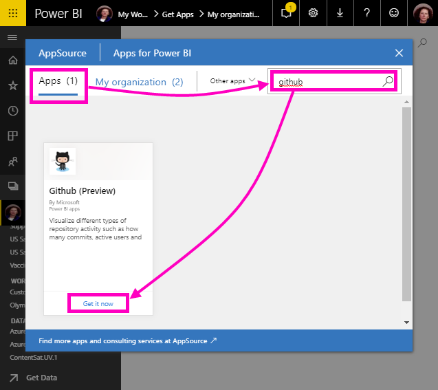 

4. Selecteer in **Deze Power BI-app installeren?** de optie **Installeren**.
5. Selecteer in **Uw nieuwe app is gereed** de optie **Naar app**.
6. Selecteer in **Aan de slag met uw nieuwe app** de optie **Verbinding maken**.

    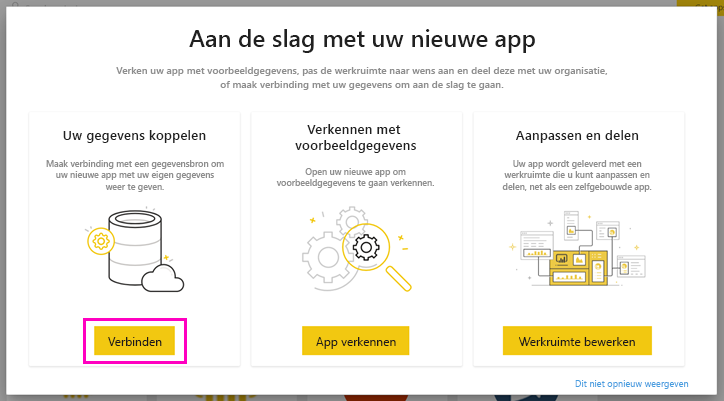

7. Voer de naam in van de opslagplaats en de naam van de eigenaar van de opslagplaats. De URL voor deze opslagplaats is https://github.com/MicrosoftDocs/powerbi-docs, dus de **Eigenaar van opslagplaats** is **MicrosoftDocs** en de **Opslagplaats** is **powerbi-docs**. 
   
    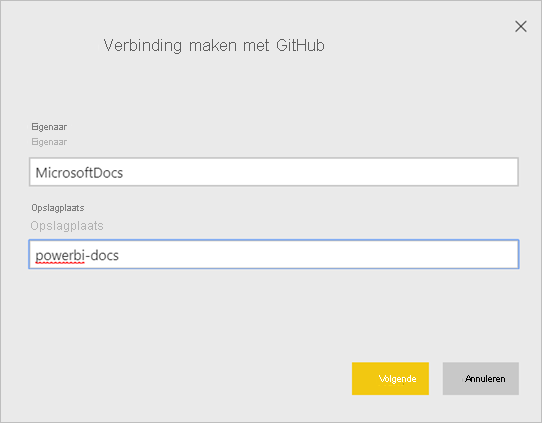

5. Voer de GitHub-referenties die u hebt gemaakt in. Power BI kan deze stap overslaan als u zich al hebt aangemeld bij GitHub in uw browser. 

6. Houd bij **Verificatiemethode** de optie **oAuth2** geselecteerd \> **Aanmelden**.

7. Volg de verificatie-instructies van GitHub. Geef Power BI toestemming voor de GitHub-gegevens.
   
   Power BI kan nu verbinding maken met GitHub en de gegevens.  De gegevens worden eenmaal per dag vernieuwd.

8. Nadat de gegevens zijn geïmporteerd in Power BI, wordt de inhoud van uw nieuwe GitHub-werkruimte weergegeven. 
9. Selecteer de pijl naast de naam van de werkruimte in het navigatievenster. U ziet dat de werkruimte een dashboard en een rapport bevat. 

    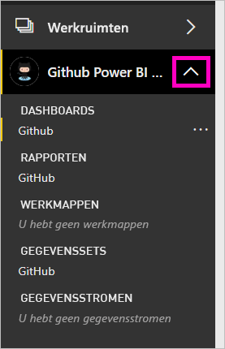

10. Selecteer **Meer opties** (...) naast de dashboardnaam > **Naam wijzigen** > typ **GitHub-dashboard**.
 
    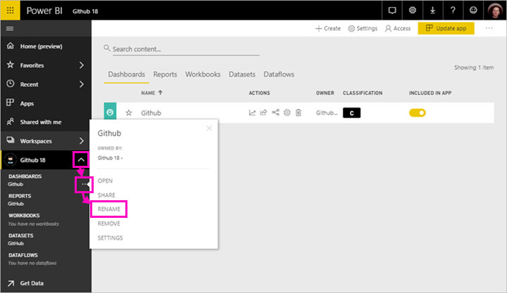 

8. Selecteer het algemene navigatiepictogram om het navigatievenster te minimaliseren, zodat u meer ruimte hebt.

    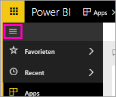

10. Selecteer uw GitHub-dashboard.
    
    Het GitHub-dashboard bevat livegegevens, dus de waarden die u ziet, kunnen afwijken.

    

    

## Stel een vraag

1. Plaats de cursor in het vak **Een vraag stellen over uw gegevens**. Power BI biedt **Vragen om mee te beginnen**. 

1. Selecteer **Hoeveel gebruikers zijn er?**.
 
    

13. Tussen **Hoeveel** en **gebruikers zijn er?** typt u **pull-aanvragen per**. 

     Power BI maakt een staafdiagram met daarin het aantal pull-aanvragen per persoon.

    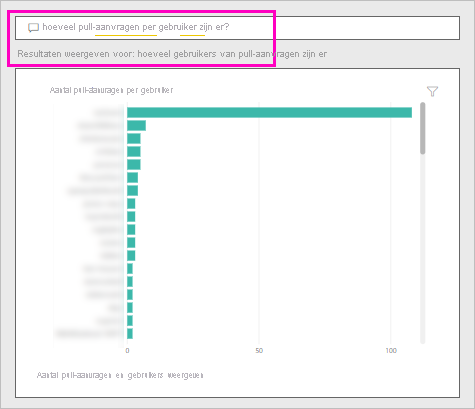

13. Selecteer de speld om het staafdiagram aan uw dashboard vast te maken en selecteer **Q&A afsluiten**.

## Het GitHub-rapport weergeven 

1. In het GitHub-dashboard selecteert u de kolomgrafiek **Pull-aanvragen per maand** om het bijbehorende rapport te openen.

    

2. Selecteer een gebruikersnaam in het diagram **Totaal aantal pull-aanvragen per gebruiker**. In dit voorbeeld zien we dat de meeste uren in februari waren.

    

3. Selecteer het tabblad **Perforatiekaart** om de volgende pagina in het rapport weer te geven. 
 
    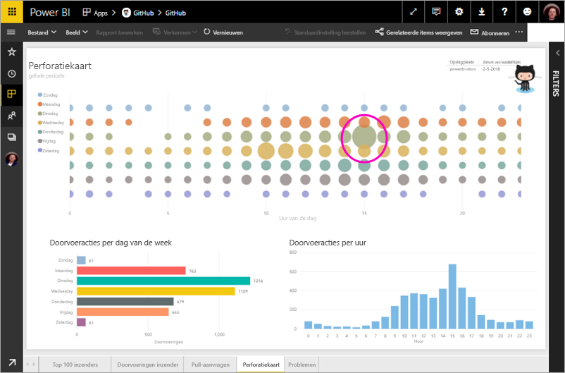

    Zo te zien is dinsdag om 15.00 uur het meest gangbare tijdstip en de meest gangbare dag van de week voor *doorvoerbewerkingen* , wanneer mensen hun werk inchecken.

## Resources opschonen

Nu u de zelfstudie hebt voltooid, kunt u de GitHub-app verwijderen. 

1. Selecteer **Apps** in het navigatievenster.
2. Beweeg de cursor boven de GitHub-tegel en selecteer de prullenbak **Verwijderen**.

    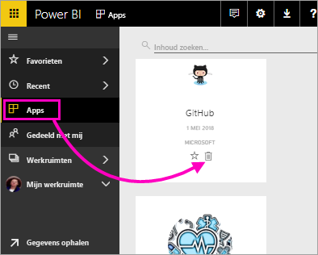

## Volgende stappen

In deze zelfstudie hebt u verbinding gemaakt met een openbare GitHub-opslagplaats en gegevens gedownload, die door Power BI naar een dashboard en rapport zijn geformatteerd. U hebt een aantal vragen over de gegevens beantwoord door het dashboard en rapport te verkennen. U kunt nu meer leren over verbinding maken met andere services zoals Salesforce, Microsoft Dynamics en Google Analytics. 
 
> [!div class="nextstepaction"]
> [Verbinding maken met GitHub met een Power BI-sjabloon-app](service-connect-to-github.md)
