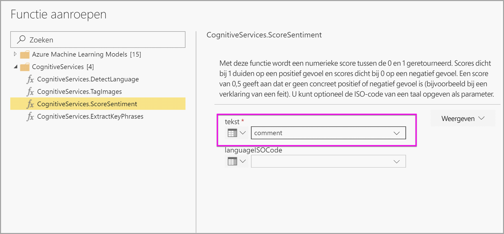
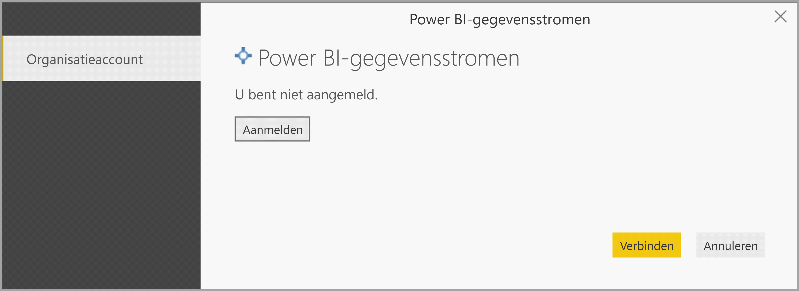

# <a name="tutorial-use-cognitive-services-in-power-bi"></a>Zelfstudie: Cognitive Services gebruiken in Power BI

Power BI biedt toegang tot een set functies van Azure Cognitive Services om uw gegevens op te maken tijdens de selfservice voor gegevensvoorbereiding voor gegevensstromen. De services die momenteel worden ondersteund zijn [Sentimentanalyse](/azure/cognitive-services/text-analytics/how-tos/text-analytics-how-to-sentiment-analysis), [Sleuteltermextractie](/azure/cognitive-services/text-analytics/how-tos/text-analytics-how-to-keyword-extraction), [Taaldetectie](/azure/cognitive-services/text-analytics/how-tos/text-analytics-how-to-language-detection) en [Afbeeldingen taggen](/azure/cognitive-services/computer-vision/concept-tagging-images). De transformaties worden uitgevoerd in de Power BI-service en daarvoor is geen Azure Cognitive Services-abonnement nodig. Deze functie vereist Power BI Premium.

Cognitive Services-transformaties worden ondersteund in de [Selfservice voor gegevensvoorbereiding voor gegevensstromen](https://powerbi.microsoft.com/blog/introducing-power-bi-data-prep-wtih-dataflows/). Gebruik de onderstaande stapsgewijze voorbeelden voor tekstanalyses en afbeeldingen taggen om aan de slag te gaan.

In deze zelfstudie leert u het volgende:

> [!div class="checklist"]
> * Gegevens importeren in een gegevensstroom
> * Sentiment beoordelen en sleuteltermen extraheren uit een tekstkolom in een gegevensstroom
> * Verbinding maken met de resultaten vanuit Power BI Desktop


## <a name="prerequisites"></a>Vereisten

U hebt het volgende nodig om deze zelfstudie af te ronden: 

- Een Power BI-account. Als u zich niet hebt geregistreerd voor Power BI, kunt u zich hier [aanmelden voor een gratis proefversie](https://app.powerbi.com/signupredirect?pbi_source=web) voordat u begint.
- Toegang tot een power BI Premium-capaciteit met AI-workload ingeschakeld. Deze workload wordt tijdens de preview standaard uitgeschakeld. Als u een Premium-capaciteit hebt geopend en AI-inzichten niet worden weergegeven, neem dan contact op met de beheerder van uw Premium-capaciteit om de AI-workload in de beheerdersportal in te schakelen.

## <a name="text-analytics"></a>Tekstanalyse

Volg de stappen in deze sectie om de tekstanalyse voor de zelfstudie te voltooien.

### <a name="step-1-apply-sentiment-scoring-in-power-bi-service"></a>Stap 1: Sentimentscore toepassen in de Power BI-service

Navigeer allereerst naar een Power BI-werkruimte met Premium-capaciteit en maak een nieuwe gegevensstroom met de knop **Maken** in de rechterbovenhoek van het scherm.


Het dialoogvenster gegevensstroom geeft de opties om een nieuwe gegevensstroom te maken weer, selecteer **Nieuwe entiteiten toevoegen**. Kies vervolgens **Tekst/CSV** in het menu van gegevensbronnen.


Plak deze URL in het URL-veld [https://pbiaitutorials.blob.core.windows.net/textanalytics/FabrikamComments.csv](https://pbiaitutorials.blob.core.windows.net/textanalytics/FabrikamComments.csv) en klik op **Volgende**.


De gegevens zijn nu klaar voor tekstanalyse en we kunnen Sentimentscore en Sleuteltermextractie gebruiken op de kolom met opmerkingen van klanten.

Selecteer **AI-inzichten** in de Power Query-editor


Vouw de map **Cognitive Services** uit en selecteer de functie die u wilt gebruiken. In dit voorbeeld wordt het sentiment van de kolom met opmerkingen beoordeeld, maar u kunt dezelfde stappen uitvoeren om Taaldetectie en Sleuteltermextractie te proberen.


Nadat een functie is geselecteerd, worden de vereiste en optionele velden weergegeven. Selecteer de kolom beoordelingen als tekstinvoer om het sentiment van de voorbeeldbeoordelingen te beoordelen. Cultuurgegevens zijn optionele invoer en vereisen een ISO-indeling. Voer bijvoorbeeld 'en' in als u wilt dat de tekst als Engelse tekst wordt behandeld. Als het veld leeg is, detecteert Power BI eerst de taal van de invoerwaarde voordat het sentiment wordt beoordeeld.



Selecteer nu **Aanroepen** om de functie uit te voeren. Er wordt een nieuwe kolom met de sentimentscore voor elke rij toegevoegd aan de tabel. U kunt teruggaan naar **AI-inzichten** om op dezelfde manier sleuteltermen van de beoordelingstekst te extraheren.

Nadat u klaar bent met de transformaties, wijzigt u de naam van de query in 'Opmerkingen van klanten' en selecteert u **Gereed**.


**Bewaar** vervolgens de gegevensstroom en noem deze Fabrikam. Selecteer de knop **Nu vernieuwen** die verschijnt nadat u de gegevensstroom hebt opgeslagen.


Nadat de gegevensstroom is opgeslagen en vernieuwd, kunt u deze gebruiken in een Power BI-rapport.

### <a name="step-2-connect-from-power-bi-desktop"></a>Stap 2: Verbinding maken vanuit Power BI Desktop

Open Power BI Desktop. Selecteer in het lint Start **Gegevens ophalen**.

Navigeer naar **Power BI-gegevensstromen (bèta)** in de sectie Power BI en selecteer **verbinding maken**.


Aangezien dit een preview-functie is, vraagt de connector u om de voorwaarden van de preview te accepteren. Nadat u deze hebt geaccepteerd, meldt u zich aan met uw organisatieaccount.



Selecteer de gegevensstroom die u zojuist hebt gemaakt. Navigeer naar de tabel Opmerkingen van klanten en klik op **Laden**.


Nu de gegevens zijn geladen, kunt u beginnen aan een rapport.

## <a name="image-tagging"></a>Afbeeldingen taggen

Navigeer naar de Power BI-werkruimte met de Premium-capaciteit. Maak een nieuwe gegevensstroom met de knop **Maken** in de rechterbovenhoek van het scherm.


Selecteer **Nieuwe entiteiten toevoegen**.


Als u wordt gevraagd om een gegevensbron te kiezen, selecteert u **Lege query**.


Kopieer de onderstaande query in de query-editor en klik op volgende. U kunt de onderstaande URL-paden vervangen door andere afbeeldingen, of u kunt meer rijen toevoegen. De functie *Web.Contents* importeert de afbeeldings-URL als binair bestand. Als u een gegevensbron met afbeeldingen hebt die zijn opgeslagen als binair bestand, kunt u die ook rechtstreeks gebruiken.


```python
let
  Source = Table.FromRows({
  { Web.Contents("https://images.pexels.com/photos/87452/flowers-background-butterflies-beautiful-87452.jpeg") },
  { Web.Contents("https://upload.wikimedia.org/wikipedia/commons/5/53/Colosseum_in_Rome%2C_Italy_-_April_2007.jpg") }}, { "Image" })
in
  Source
```


Wanneer u om referenties wordt gevraagd, selecteert u *anoniem*.


U ziet de volgende afbeelding.


U wordt voor elke afzonderlijke webpagina om referenties gevraagd.

Selecteer **AI-inzichten** in de query-editor.


Meldt u vervolgens aan met uw **organisatieaccount**.


Selecteer de functie Afbeeldingen taggen, voer _[Binary]_ in het kolomveld in en '_en_' in het veld cultuurgegevens. 

> [!NOTE]
> U kunt momenteel geen kolom kiezen met een vervolgkeuzelijst. Dat willen we tijdens de beperkte preview zo snel mogelijk oplossen.


Verwijder in de functie-editor de aanhalingstekens rond de naam van de kolom. 

> [!NOTE]
> De aanhalingstekens verwijderen is een tijdelijke oplossing. We willen dit probleem zo snel mogelijk tijdens de preview oplossen.


De functie retourneert een record met zowel de tags in een door komma's gescheiden indeling en een json-record. Selecteer de uitvouwknop om één of beide kolommen toe te voegen aan de tabel.


Selecteer **Gereed** en sla de gegevensstroom op. Nadat u de gegevensstroom hebt vernieuwd, kunt u er verbinding mee maken vanuit Power BI Desktop met behulp van gegevensstroomconnectors. (Raadpleeg de stappen op pagina 5 van dit document).

## <a name="clean-up-resources"></a>Resources opschonen

Als de query niet meer nodig is, verwijdert u deze door met de rechtermuisknop te klikken op de naam van de query in de Power Query-editor en op **Verwijderen** te klikken.

## <a name="next-steps"></a>Volgende stappen

In deze zelfstudie hebt u sentimentbeoordeling en functies om afbeeldingen te taggen toegepast in een Power BI-gegevensstroom. Voor meer informatie over Cognitive Services in Power BI leest u de volgende artikelen.

* [Cognitive Services in Azure](/azure/cognitive-services/)
* Aan de slag [met selfservice gegevensvoorbereiding op gegevensstromen](../transform-model/dataflows/dataflows-introduction-self-service.md)
* Meer informatie over [Power BI Premium](https://powerbi.microsoft.com/power-bi-premium/)

Wellicht bent u ook geïnteresseerd in de volgende artikelen.

* [Zelfstudie: Een Machine Learning Studio-model (klassiek) aanroepen in Power BI (preview)](service-tutorial-invoke-machine-learning-model.md)
* [Azure Machine Learning-integratie in Power BI (preview)](../transform-model/dataflows/dataflows-machine-learning-integration.md)
* [Cognitive Services in Power BI (preview)](../transform-model/dataflows/dataflows-machine-learning-integration.md)