# Zelfstudie: Meldingen instellen in Power BI-dashboards

[!INCLUDE[consumer-appliesto-yynn](../includes/consumer-appliesto-yynn.md)]

[!INCLUDE [power-bi-service-new-look-include](../includes/power-bi-service-new-look-include.md)]

Stel meldingen in de Power BI-service in om u te waarschuwen wanneer wijzigingen in de gegevens op een dashboards niet voldoen aan de limieten die u hebt ingesteld. Waarschuwingen kunnen alleen worden ingesteld voor tegels die zijn vastgemaakt vanuit rapportvisuals, en alleen voor meters, KPI's en kaarten. 

Waarschuwingen kunnen worden gemaakt op dashboards:
- die u hebt gemaakt en opgeslagen in **Mijn werkruimte**
- die met u zijn gedeeld in een [Premium-capaciteit](end-user-license.md) 
- in elke werkruimte waartoe u toegang hebt, als u beschikt over een Power BI Pro-licentie.    

Meldingen werken alleen voor gegevens die zijn vernieuwd. Als gegevens worden vernieuwd, controleert Power BI of er een melding voor die gegevens is ingesteld. Als de gegevens een drempelwaarde voor de melding hebben bereikt, wordt er een melding geactiveerd. 

Deze functie is nog volop in ontwikkeling, dus we raden u aan [het gedeelte Tips en probleemoplossing hieronder te raadplegen](#tips-and-troubleshooting).

U bent zelf de enige die de door u ingestelde meldingen kunt zien, ook als u uw dashboard deelt. Gegevensmeldingen worden volledig met alle platforms gesynchroniseerd. Stel gegevensmeldingen in en bekijk ze [in de mobiele Power BI-apps](mobile/mobile-set-data-alerts-in-the-mobile-apps.md) (Engelstalig) en in de Power BI-service. 

> [!WARNING]
> Deze meldingen geven u informatie over uw gegevens. Als u uw Power BI-gegevens op een mobiel apparaat weergeeft en dat apparaat wordt gestolen, wordt u aangeraden de Power BI-service te gebruiken om alle meldingen uit te schakelen.
> 

In deze zelfstudie leert u het volgende.
> [!div class="checklist"]
> * Wie waarschuwingen kan instellen
> * Welke visuals waarschuwingen ondersteunen
> * Wie u waarschuwingen kunnen zien
> * Of waarschuwingen werken in Power BI Desktop en mobiel
> * Een waarschuwing maken
> * Waar u uw waarschuwingen ontvangt

## Vereisten

Als u zich niet hebt geregistreerd voor Power BI, kunt u zich hier [aanmelden voor een gratis proefversie](https://app.powerbi.com/signupredirect?pbi_source=web) voordat u begint.

1. In dit voorbeeld gebruiken we een kaarttegel van een dashboard uit het voorbeeld Verkoop en marketing. Open de Power BI-service (app.powerbi.com), meld u aan, en open **Mijn werkruimte**.    
    

2. Selecteer in de linkerbendehoek **Gegevens ophalen**.

    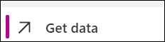

3. Selecteer **Voorbeelden** op de pagina Gegevens ophalen die wordt weergegeven.

4. Selecteer het voorbeeld Verkoop en marketing, en kies vervolgens **Verbinding maken**.

    

5. Nadat Power BI verbinding heeft gemaakt met het voorbeeld, selecteert u in het dialoogvenster dat verschijnt, de optie **Naar dashboard**.     
    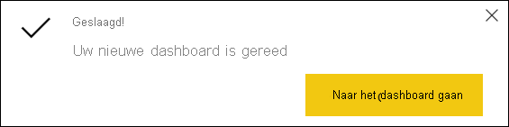

## Een waarschuwing toevoegen aan een dashboardtegel

1. Selecteer de beletseltekens (drie puntjes) op een dashboardmeter, KPI of kaarttegel.
   
   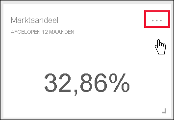

2. Selecteer het waarschuwingspictogram 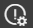 of **Waarschuwingen beheren** om een of meer waarschuwingen toe te voegen voor de kaart **Marktaandeel**.

   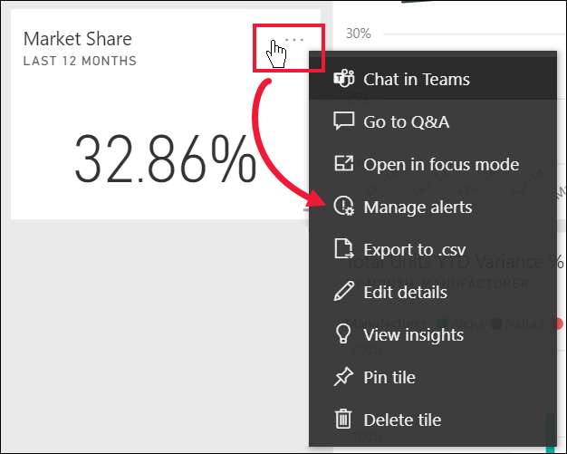

   
1. Selecteer in het venster **Waarschuwingen beheren** de optie **+ Waarschuwingsregel toevoegen**.  Zorg ervoor dat de schuifregelaar staat ingesteld op **Aan** en geef uw waarschuwing een titel. Titels helpen u de meldingen makkelijk te herkennen.
   
   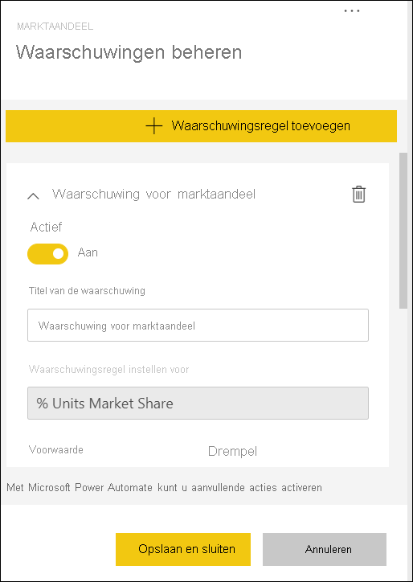
4. Schuif omlaag en voer de details van de melding in.  In dit voorbeeld maken we een melding die ons eenmaal per dag waarschuwt zodra ons marktaandeel 40 of hoger is. Waarschuwingen worden weergegeven in het [Meldingencentrum](end-user-notification-center.md). We zorgen er ook voor dat Power BI een e-mail stuurt.
   
   

5. Selecteer **Opslaan en sluiten**.
 

   > 

## Meldingen ontvangen
Als de bijgehouden gegevens een van de ingestelde drempelwaarden bereiken, vindt er een aantal dingen plaats. Eerst controleert Power BI of het langer dan een uur, of langer dan 24 uur (afhankelijk van de optie die u hebt geselecteerd), is sinds de vorige waarschuwing is verzonden. U ontvangt een melding zolang de gegevens de drempelwaarde overschrijden.

Vervolgens wordt een melding verzonden naar het meldingencentrum en ontvangt u er eventueel een per e-mail. Elke melding bevat een rechtstreekse koppeling naar uw gegevens. Selecteer de koppeling om de relevante tegel te bekijken.  

1. Als de melding zo is ingesteld dat u een e-mail ontvangt, vindt u iets soortgelijks als hieronder in uw Postvak IN. Dit is een waarschuwing die we hebben ingesteld voor de kaart **Sentiment**.
   
   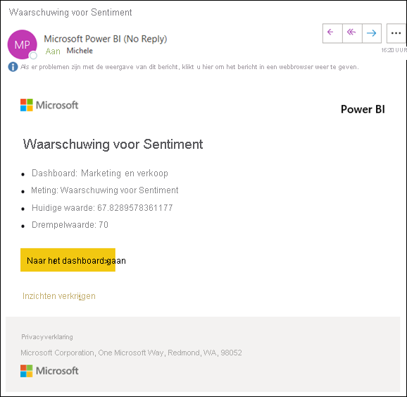
2. Power BI voegt ook een bericht toe aan het **Meldingencentrum**.
   
   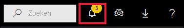
3. Open het meldingencentrum om de details van de melding te bekijken.
   
    
   
  

## Meldingen beheren

U kunt meldingen op diverse manieren beheren: vanaf de dashboardtegel zelf, vanuit het menu Instellingen in Power BI,vanaf een afzonderlijke tegel in de [mobiele Power BI-app op de iPhone](mobile/mobile-set-data-alerts-in-the-mobile-apps.md), of in de [mobiele Power BI-app voor Windows 10](mobile/mobile-set-data-alerts-in-the-mobile-apps.md).

### Vanaf de tegel zelf

1. Als u een waarschuwing voor een tegel wilt wijzigen of verwijderen, opent u het venster **Waarschuwingen beheren** opnieuw door het waarschuwingspictogram  te selecteren. Alle meldingen die u voor die tegel hebt ingesteld, worden weergegeven.
   
    .
2. Als u een tegel wilt wijzigen, selecteert u de pijl links van de naam van de melding.
   
    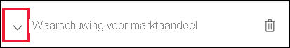.
3. Als u een tegel wilt verwijderen, selecteert u de prullenbak rechts van de naam van de melding.
   
      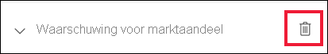

### Vanuit het menu Instellingen in Power BI

1. Selecteer het tandwielpictogram in de Power BI-menubalk.
   
    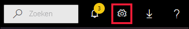.
2. Selecteer onder **Instellingen** de optie **Meldingen**.
   
    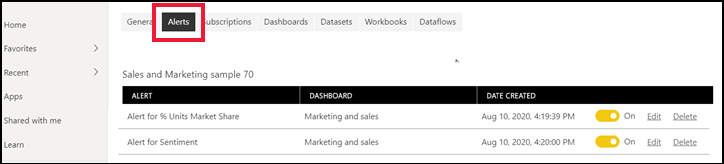
3. Hier kunt u meldingen in- en uitschakelen, het venster **Meldingen beheren** openen om wijzigingen aan te brengen of de melding verwijderen.

## Tips en problemen oplossen 

* Als u geen melding voor een meter, KPI of kaart kunt instellen, neemt u contact op met de tenantbeheerder of IT-helpdesk voor hulp. Soms worden meldingen uitgeschakeld of zijn deze niet beschikbaar voor uw dashboard of voor specifieke typen dashboardtegels.
* Meldingen werken alleen voor gegevens die zijn vernieuwd. Ze werken niet met statische gegevens. De meeste voorbeelden van Microsoft zijn statisch. 
* Voor de mogelijkheid om gedeelde inhoud te ontvangen en weer te geven is een Power BI Pro- of Power BI Premium-licentie vereist. Lees [Welke licentie heb ik?](end-user-license.md) voor meer informatie.
* Waarschuwingen kunnen worden ingesteld voor visuals die zijn gemaakt op basis van streaminggegevenssets die van een rapport zijn vastgemaakt aan een dashboard. Er kunnen geen waarschuwingen worden ingesteld voor streamingtegels die rechtstreeks op het dashboard zijn gemaakt met **Tegel toevoegen** > **Aangepaste streaminggegevens**.

## Resources opschonen
De instructies om waarschuwingen te verwijderen, zijn hierboven beschreven. In het kort selecteert u het tandwielpictogram in de Power BI-menubalk. Onder **Instellingen** selecteert u **Waarschuwingen** en verwijdert u de waarschuwing.

> [!div class="nextstepaction"]
> [Gegevenswaarschuwingen instellen op uw mobiele apparaat](mobile/mobile-set-data-alerts-in-the-mobile-apps.md)

