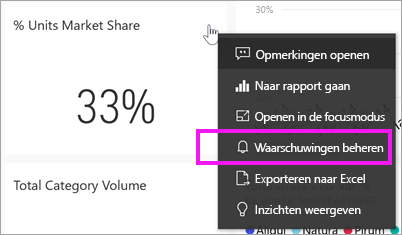
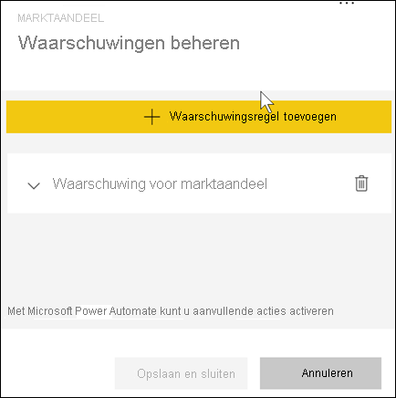
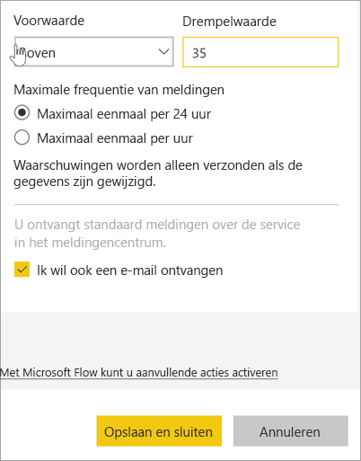
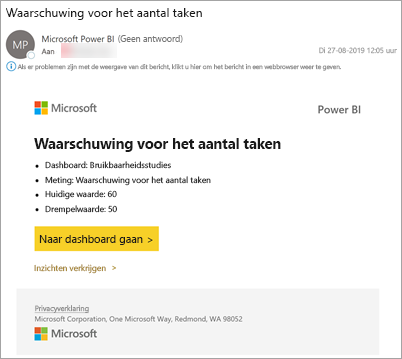
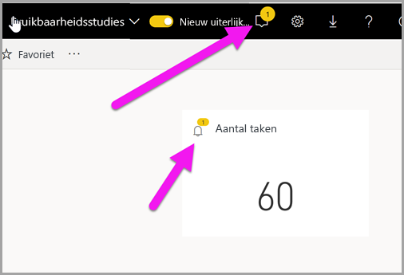
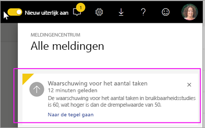
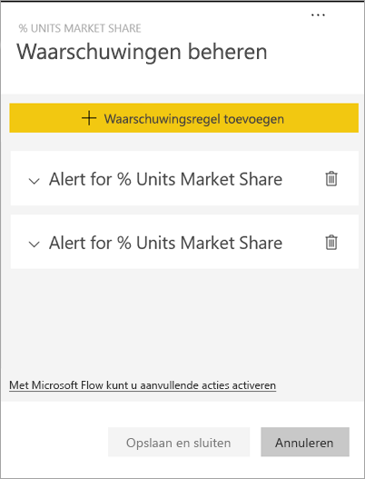
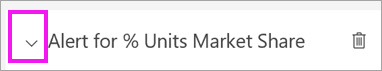
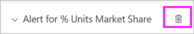
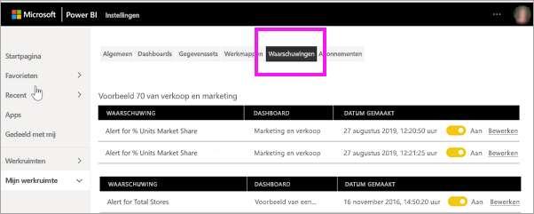

# Zelfstudie: dashboardmeldingen instellen in Power BI-dashboards
Stel meldingen in om u te waarschuwen als wijzigingen aan de gegevens in uw dashboards de limieten overschrijden die u hebt ingesteld. Meldingen werken voor meters, KPI's en kaarten. Deze functie is nog volop in ontwikkeling, dus we raden u aan [het gedeelte Tips en probleemoplossing hieronder te raadplegen](#tips-and-troubleshooting).

U bent zelf de enige die de door u ingestelde meldingen kunt zien, ook als u uw dashboard deelt. Gegevensmeldingen worden volledig met alle platforms gesynchroniseerd. Stel gegevensmeldingen in en bekijk ze [in de mobiele Power BI-apps](mobile/mobile-set-data-alerts-in-the-mobile-apps.md) (Engelstalig) en in de Power BI-service. 

> [!WARNING]
> Deze meldingen geven u informatie over uw gegevens. Als u uw Power BI-gegevens op een mobiel apparaat weergeeft en dat apparaat wordt gestolen, wordt u aangeraden de Power BI-service te gebruiken om alle meldingen uit te schakelen.
> 

In deze zelfstudie leert u het volgende.
> [!div class="checklist"]
> * Wie waarschuwingen kan instellen
> * Welke visuals waarschuwingen ondersteunen
> * Wie u waarschuwingen kunnen zien
> * Of waarschuwingen werken in Power BI Desktop en mobiel
> * Een waarschuwing maken
> * Waar u uw waarschuwingen ontvangt

Als u zich niet hebt geregistreerd voor Power BI, kunt u zich hier [aanmelden voor een gratis proefversie](https://app.powerbi.com/signupredirect?pbi_source=web) voordat u begint.

In dit voorbeeld gebruiken we en kaarttegel van een dashboard uit de voorbeeldapp Sales & Marketing. Deze app is beschikbaar via [Microsoft AppSource](https://appsource.microsoft.com). Zie [Apps installeren en gebruiken met Power BI](end-user-app-view.md) voor hulp bij het downloaden van de app.

1. Selecteer de beletseltekens (drie puntjes) op een dashboardmeter, KPI of kaarttegel.
   
   
2. Selecteer het belpictogram  of **Waarschuwingen beheren** om één of meer waarschuwingen toe te voegen voor **Totale opslaglocaties**.

   

   
1. Selecteer in het venster **Waarschuwingen beheren** de optie **+ Waarschuwingsregel toevoegen**.  Zorg ervoor dat de schuifregelaar staat ingesteld op **Aan** en geef uw waarschuwing een titel. Titels helpen u de meldingen makkelijk te herkennen.
   
   
4. Schuif omlaag en voer de details van de melding in.  In dit voorbeeld maken we een melding die ons eenmaal per dag waarschuwt als ons marktaandeel 35 of hoger wordt. Meldingen worden weergegeven in het meldingencentrum. We zorgen er ook voor dat Power BI een e-mail stuurt.
   
   
5. Selecteer **Opslaan en sluiten**.
 
   > [!NOTE]
   > Meldingen werken alleen voor gegevens die zijn vernieuwd. Als gegevens worden vernieuwd, controleert Power BI of er een melding voor die gegevens is ingesteld. Als de gegevens een drempelwaarde voor de melding hebben bereikt, wordt er een melding geactiveerd. 
   > 

## Meldingen ontvangen
Als de bijgehouden gegevens een van de ingestelde drempelwaarden bereiken, vindt er een aantal dingen plaats. Eerst controleert Power BI of het langer dan een uur, of langer dan 24 uur (afhankelijk van de optie die u hebt geselecteerd), is sinds de vorige waarschuwing is verzonden. U ontvangt een melding zolang de gegevens de drempelwaarde overschrijden.

Vervolgens wordt een melding verzonden naar het meldingencentrum en ontvangt u er eventueel een per e-mail. Elke melding bevat een rechtstreekse koppeling naar uw gegevens. Selecteer de koppeling om de relevante tegel te bekijken.  

1. Als de melding zo is ingesteld dat u een e-mail ontvangt, vindt u iets soortgelijks als hieronder in uw Postvak IN. Dit is een melding die we op een ander dashboard hebben ingesteld. Via dit dashboard worden taken bijgehouden die door het bruikbaarheidsteam zijn voltooid.
   
   
2. Er wordt een bericht aan het **meldingencentrum** toegevoegd en een nieuw meldingenpictogram aan de desbetreffende tegel.
   
   
3. Open het meldingencentrum om de details van de melding te bekijken.
   
    
   
  

## Meldingen beheren

U kunt meldingen op diverse manieren beheren: Vanaf het dashboardtegel zelf, vanuit het menu Instellingen in Power BI en vanaf een individuele tegel in de [mobiele Power BI-app op de iPhone](mobile/mobile-set-data-alerts-in-the-mobile-apps.md) of in de [mobiele Power BI-app voor Windows 10](mobile/mobile-set-data-alerts-in-the-mobile-apps.md).

### Vanaf de tegel zelf

1. Als u een waarschuwing voor een tegel wilt wijzigen of verwijderen, opent u opnieuw het venster **Waarschuwingen beheren** door het belpictogram  te selecteren. Alle meldingen die u voor die tegel hebt ingesteld, worden weergegeven.
   
    .
2. Als u een tegel wilt wijzigen, selecteert u de pijl links van de naam van de melding.
   
    .
3. Als u een tegel wilt verwijderen, selecteert u de prullenbak rechts van de naam van de melding.
   
      

### Vanuit het menu Instellingen in Power BI

1. Selecteer het tandwielpictogram in de Power BI-menubalk.
   
    .
2. Selecteer onder **Instellingen** de optie **Meldingen**.
   
    
3. Hier kunt u meldingen in- en uitschakelen, het venster **Meldingen beheren** openen om wijzigingen aan te brengen of de melding verwijderen.

## Tips en problemen oplossen 

* Meldingen kunnen alleen worden ingesteld op meters, KPI's en kaarten.
* Als u geen melding voor een meter, KPI of kaart kunt instellen, moet u contact opnemen met uw systeembeheerder. Soms worden meldingen uitgeschakeld of zijn deze niet beschikbaar voor uw dashboard of voor specifieke typen dashboardtegels.
* Meldingen werken alleen voor gegevens die zijn vernieuwd. Ze werken niet met statische gegevens. De meeste voorbeelden van Microsoft zijn statisch. 

## Resources opschonen
De instructies om waarschuwingen te verwijderen, zijn hierboven beschreven. In het kort selecteert u het tandwielpictogram in de Power BI-menubalk. Onder **Instellingen** selecteert u **Waarschuwingen** en verwijdert u de waarschuwing.

> [!div class="nextstepaction"]
> [Gegevenswaarschuwingen instellen op uw mobiele apparaat](mobile/mobile-set-data-alerts-in-the-mobile-apps.md)

