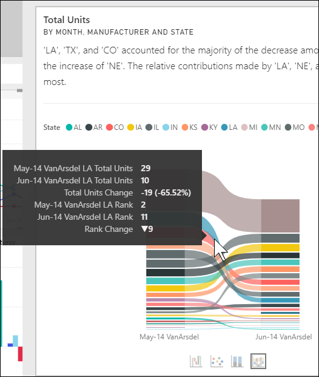

# Gebruik de functie Analyseren om schommelingen in rapportvisuals te verklaren

[!INCLUDE[consumer-appliesto-yynn](../includes/consumer-appliesto-yynn.md)]

In rapportvisuals ziet u vaak een grote toename, gevolgd door flink afgenomen waarden. Vraagt u zich ook wel eens af waardoor deze schommelingen worden veroorzaakt? Met **Analyseren** in **de Power BI-service** kunt u met slechts enkele klikken de oorzaak van het probleem achterhalen.

Kijk eens naar de volgende visual. Hierin wordt *Totaal eenheden* per *Maand* en *Fabrikant* weergegeven. VanArsdel doet het beter dan de concurrenten, maar geeft in juni 2014 een forse dip te zien. In dergelijke gevallen kunt u de gegevens verkennen om te achterhalen wat er is veranderd. 

U kunt in Power BI-service vragen om toenames, afnames of ongewone distributies in visuals te verklaren en een snelle, geautomatiseerde, inzichtelijke analyse over uw gegevens te krijgen. Klik met de rechtermuisknop op een gegevenspunt en selecteer **Analyseren > Leg de afname uit** (toename, als de vorige staaf lager is) of **Analyseren > Zoeken waar de distributie verschilt**. U krijgt het inzicht te zien in een gebruiksvriendelijk venster.

De functie Analyseren is contextueel en gebaseerd op het gegevenspunt dat er onmiddellijk aan vooraf gaat, zoals de vorige staaf of kolom.

> [!NOTE]
> De functie is een preview-versie en kan nog worden gewijzigd. De inzichtfunctie is standaard ingeschakeld (u hoeft geen preview-vak aan te vinken om de functie in te schakelen).

### Welke factoren en categorieën worden gekozen?

Na onderzoek van verschillende kolommen selecteert en toont Power BI de factoren die de grootste verandering in de relatieve bijdrage laten zien. Bij elke kolom worden de waarden met de grootste verandering in de bijdrage benoemd in de beschrijving. Daarnaast worden de waarden benoemd met de grootste daadwerkelijke toename en afname.

Gebruik de schuifbalk om alle inzichten weer te geven die door Power BI zijn gegenereerd. De volgorde wordt zodanig gerangschikt dat de belangrijkste bijdrager als eerste wordt weergegeven. 

## Inzichten gebruiken
Klik met de rechtermuisknop op een gegevenspunt in een staaf- of lijndiagram en selecteer **Analyseren** om inzicht te krijgen in trends die in visuals zichtbaar zijn. Kies vervolgens de optie die wordt weergegeven: **Leg de toename uit**, **Leg de afname uit** of **Leg het verschil uit**.

Vervolgens worden de gegevens met machine-learningalgoritmen geanalyseerd en wordt in een venster een visual en een beschrijving weergegeven. Hieraan ziet u welke categorieën de meeste invloed hebben gehad op de toename, afname of het verschil.  In dit voorbeeld is het eerste inzicht een watervalgrafiek.

Als u de kleine pictogrammen onder aan de waterval selecteert, kunt u ervoor kiezen of in de inzichten een spreidingsdiagram, een gestapeld kolomdiagram of lintdiagram wordt weergegeven.

Gebruik de pictogrammen met *duim omhoog* of *duim omlaag* boven aan de pagina om feedback te geven over de visual en de functie.  

U kunt inzichten gebruiken als uw rapport in lees- of bewerkweergave is. U kunt er dan gegevens mee analyseren en visuals mee maken die u makkelijk aan uw rapporten kunt toevoegen. Als u het rapport in de bewerkweergave hebt geopend, ziet u een pictogram met plusteken naast de duimpictogrammen. Selecteer het pluspictogram om het inzicht aan uw rapport toe te voegen als een nieuwe visual. 

## Details van de geretourneerde resultaten

De informatie die wordt geretourneerd door de inzichten is bedoeld om aan te geven wat het verschil was tussen twee perioden.  

Het algoritme bekijkt als het ware alle kolommen in het model en berekent het verschil in de kolommen *vóór* en *na* een bepaald punt. Op die manier wordt bepaald hoeveel verandering er is geweest; de kolommen met de grootste verandering worden geretourneerd. Zo is bijvoorbeeld *Staat* geselecteerd in de watervalgrafiek, omdat de bijdrage van Louisiana, Texas en Colorado in juni en juli met 13% is afgenomen tot 19%. Dit was de grootste bijdrage tot de afname in *Totaal eenheden*.  

Voor elk geretourneerd inzicht kunnen er vier visuals worden weergegeven. Drie van die visuals zijn bedoeld om de verandering in de bijdrage tussen de twee perioden aan te tonen. Hiermee kunt u bijvoorbeeld zien wat de oorzaak was van de stijging tussen *kwartaal 2* en *kwartaal 3*. In het lintdiagram wordt de verandering zowel voor als na het geselecteerde gegevenspunt weergegeven.

### Het spreidingsplot

In de visual met het spreidingsplot ziet u de waarde van de meting in de eerste periode (op de x-as) in combinatie met de waarde van de meting in de tweede periode (op de y-as) voor alle waarden in de kolom (*Staat* in dit geval). Gegevenspunten bevinden zich in de groene regio als ze zijn toegenomen en in de rode regio als ze zijn afgenomen. 

De stippellijn is de best passende lijn door de punten. De gegevenspunten boven deze lijn zijn toenames boven de trend en de punten eronder afnames.  

De gegevensitems zonder waarde voor beide perioden worden niet weergegeven in het spreidingsplot.

### De 100% gestapelde kolomdiagram

Het 100% gestapelde kolomdiagram toont de waarde van de bijdrage aan het totaal (100%) voor het geselecteerde gegevenspunt en het vorige punt. Hierdoor kunnen de bijdragen van alle gegevenspunten met elkaar worden vergeleken. In dit voorbeeld wordt de feitelijke bijdrage voor de geselecteerde waarde voor Texas weergegeven in de knopinfo. Aangezien de lijst met staten lang is, kan door middel van knopinfo de details worden bekeken. In de knopinfo ziet u dat Texas met ongeveer hetzelfde percentage heeft bijgedragen tot Totaal eenheden (31% en 32%), maar dat het werkelijk aantal Totaal eenheden is gedaald van 89 tot 71. Langs de y-as wordt een percentage afgezet, geen totaal, en elke kolom geeft een percentage weer, geen waarde. 

### De lintgrafiek

In de visual met de lintgrafiek ziet u de waarde van de meting vóór en na een specifiek punt. Het is vooral handig bij het weergeven van de veranderingen in bijdragen wanneer de *volgorde* van de inzenders verandert (bijvoorbeeld *LA* is gezakt van plaats twee naar elf).  En hoewel *TX* wordt voorgesteld door een breed lint aan de bovenkant, waarmee wordt aangegeven dat het vóór en na de belangrijkste bijdrager is, laat de afname zien dat de waarde van de bijdrage tijdens de geselecteerde periode en daarna is afgenomen.

### De watervalgrafiek

De vierde visual is een watervalgrafiek, met daarin de daadwerkelijke toename of afname in een bepaalde periode. Deze visual laat één belangrijke bijdrager zien tot de afname voor juni 2014 - in dit geval **Staat**. En het bijzondere van de invloed van **Staat** op het totale aantal eenheden is dat afnames in Louisiana, Texas en Colorado de belangrijkste rol hebben gespeeld.      

 

## Overwegingen en beperkingen
Deze inzichten zijn gebaseerd op de wijziging vanaf het voorgaande gegevenspunt. Ze zijn dus niet beschikbaar als u het eerste gegevenspunt in een visual selecteert. 

**Analyseren** is niet beschikbaar voor alle typen visuals. 

In de volgende lijst vindt u een aantal scenario's die momenteel niet worden ondersteund voor **Analyseren: toename/afname/verschil verklaren**:

* TopN-filters
* Opname-/uitsluitingsfilters
* Maateenheidfilters
* Niet-numerieke metingen
* Het gebruik van Waarde weergeven als
* Gefilterde metingen: met gefilterde metingen voert u berekeningen op visueel niveau uit, waarbij een specifiek filter wordt toegepast (bijvoorbeeld *Total Sales for France*). Deze metingen worden gebruikt voor enkele van de visuals die met de inzichtenfunctie zijn gemaakt
* Categorische kolommen op de X-as, tenzij er een scalaire kolomsortering wordt gedefinieerd. Als er een hiërarchie wordt gebruikt, moet elke kolom in de actieve hiërarchie aan deze voorwaarde voldoen

## Volgende stappen
[Watervalgrafieken](../visuals/power-bi-visualization-waterfall-charts.md)    
[Spreidingsdiagrammen](../visuals/power-bi-visualization-scatter.md)    
[Kolomdiagrammen](../visuals/power-bi-report-visualizations.md)    
[Lintgrafieken](../visuals/desktop-ribbon-charts.md)
