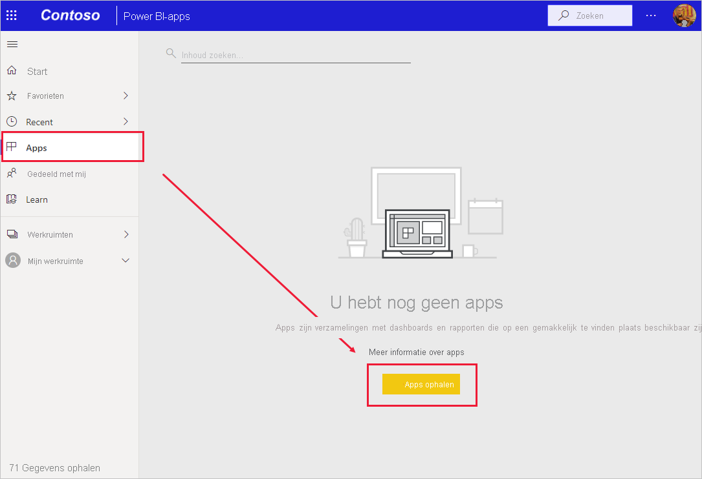
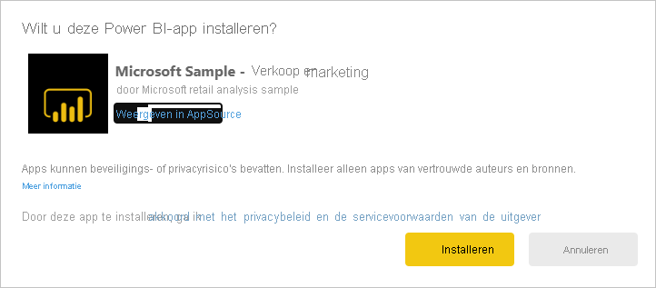
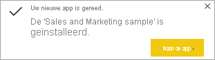
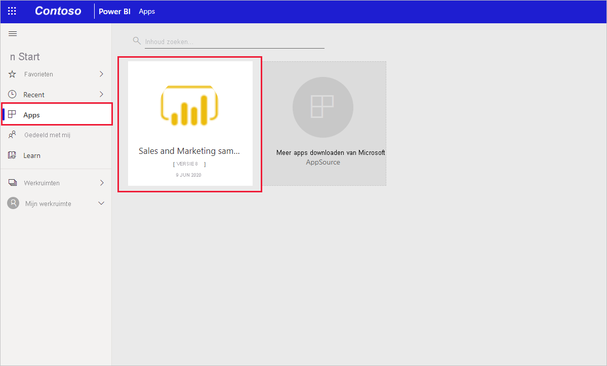
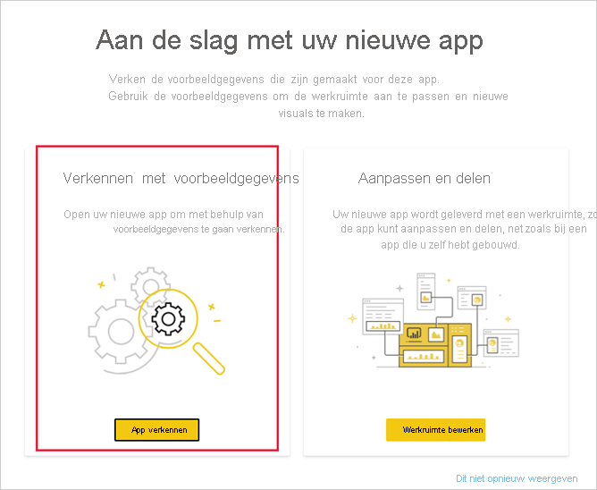

# De voorbeeld-app Verkoop en Marketing installeren en gebruiken in de Power BI-service

[!INCLUDE[consumer-appliesto-yyny](../includes/consumer-appliesto-yyny.md)]

Nu u een [basaal begrip hebt over het verkrijgen van Power BI-inhoud](end-user-app-view.md), gaan we de Marketing- en Verkoop-app downloaden van Microsoft AppSource (appsource.com). 

## De app downloaden via de marketplace voor Power BI-apps

1. [Meld u aan bij de Power BI-service](./end-user-sign-in.md) als u zich nog niet hebt aangemeld. 

1. Als u zich in Power BI bevindt, selecteert u **Apps > Apps verkrijgen**. 

    

1. De Marketplace voor Power BI-apps wordt geopend. Vind de verkoop- en marketing-app. Als u deze niet ziet, typt u 'verkoop' in het zoekvak.

    

1. Klik op de app-tegel. De app-aanbieding op AppSource wordt geopend. Klik op **GET IT NOW**.

   

1. Bevestig dat u deze app wilt installeren.

   

5. Zodra de app is geïnstalleerd, wordt in de Power BI-service een succesbericht weergegeven. Selecteer **Naar de app** om de app te openen. Afhankelijk van de manier waarop de ontwerper de app heeft gemaakt, wordt of het dashboard of het rapport van de app weergegeven.

    

    U kunt de app ook rechtstreeks openen vanuit de lijst met app-inhoud door **Apps** te selecteren en **Sales & Marketing** te kiezen.

    

6. Kies of u uw nieuwe app wilt verkennen of wilt aanpassen en delen. Omdat we een voorbeeldapp van Microsoft hebben geselecteerd, gaan we de app eerst verkennen. 

    

7.  Uw nieuwe app wordt geopend met een dashboard. De app-*ontwerper* heeft mogelijk ingesteld dat de app in plaats daarvan met een rapport wordt geopend.  

    

## Interactie met de dashboards en rapporten in de app
Neem de tijd om de gegevens in de dashboards en rapporten waaruit de app bestaat, te verkennen. U hebt toegang tot de standaard Power BI-interacties zoals filteren, markeren, sorteren en inzoomen.  Is het verschil tussen dashboards en rapporten u nog niet helemaal duidelijk?  Lees het [artikel over dashboards](end-user-dashboards.md) en het [artikel over rapporten](end-user-reports.md).  

## Volgende stappen
* [Terug naar het overzicht van apps](end-user-apps.md)
* [Een Power BI-rapport weergeven](end-user-report-open.md)
* [Andere manieren waarop inhoud met u wordt gedeeld](end-user-shared-with-me.md)
