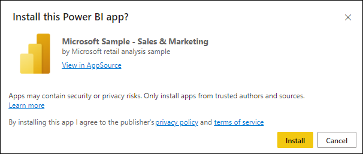

# De voorbeeld-app Verkoop en Marketing installeren en gebruiken in de Power BI-service

[!INCLUDE[consumer-appliesto-yyny](../includes/consumer-appliesto-yyny.md)]

Nu u een [basaal begrip hebt over het verkrijgen van Power BI-inhoud](end-user-app-view.md), gaat u Microsoft AppSource gebruiken om de sjabloon-app Marketing en verkoop te downloaden. De sjabloon-app Marketing en verkoop bevat voorbeeldgegevens die u kunt gebruiken om de Power BI-service te verkennen. Deze specifieke app heeft één dashboard en een aantal rapportpagina's. 

> [!IMPORTANT]
> Als u deze app van Microsoft AppSource wilt installeren, moet u beschikken over een **Power BI Pro**-licentie.  Zie [Licenties](end-user-license.md) voor meer informatie.

## De app uit Microsoft AppSource downloaden

1. Open [https://appsource.microsoft.com](https://appsource.microsoft.com).

   

1. Voer in het zoekvak **Microsoft-voorbeeld** in en selecteer **Microsoft-voorbeeld - Verkoop en marketing**. 

    

1. Lees desgewenst het overzicht en de recensies door en bekijk de installatiekopieën.  Selecteer vervolgens **Nu downloaden**.

   

1. Bevestig dat u deze app wilt installeren.

   

5. Zodra de app is geïnstalleerd, wordt in de Power BI-service een succesbericht weergegeven. Selecteer **Ga naar app**. Of selecteer de app zelf vanaf uw **Apps**-canvas. Afhankelijk van de manier waarop de ontwerper de app heeft gemaakt, wordt of het dashboard of het rapport van de app weergegeven.

    

7.  Deze sjabloon-app is ingesteld om op het dashboard te worden geopend. Met de *ontwerpfunctie* voor de app kan met behulp van de app ook een van de rapportpagina's worden geopend.  

    

## Interactie met de dashboards en rapporten in de app
Neem de tijd om de gegevens in de dashboards en rapporten waaruit de app bestaat, te verkennen. U hebt toegang tot de standaard Power BI-interacties zoals filteren, markeren, sorteren en inzoomen.  Is het verschil tussen dashboards en rapporten u nog niet helemaal duidelijk?  Lees het [artikel over dashboards](end-user-dashboards.md) en het [artikel over rapporten](end-user-reports.md).  

## Volgende stappen
* [Terug naar het overzicht van apps](end-user-apps.md)    
* [Een Power BI-rapport weergeven](end-user-report-open.md)    
* [Andere manieren waarop inhoud met u wordt gedeeld](end-user-shared-with-me.md)
