# Apps installeren en gebruiken met dashboards en rapporten in Power BI

[!INCLUDE[consumer-appliesto-ynny](../includes/consumer-appliesto-ynny.md)]

[!INCLUDE [power-bi-service-new-look-include](../includes/power-bi-service-new-look-include.md)]

Nu u een [basiskennis van apps](end-user-apps.md) hebt, laten we u zien hoe u apps kunt openen en ermee kunt communiceren. 

## Manieren om een ​​nieuwe app te verkrijgen
Er zijn verschillende manieren om een ​​nieuwe app te krijgen. Een collega-rapportontwerper kan de app automatisch in uw Power BI-account installeren of u een directe koppeling naar een app sturen. U kunt ook naar AppSource gaan en naar apps zoeken die voor u beschikbaar zijn gesteld door app-ontwerpers, zowel binnen als buiten uw bedrijf. 

In Power BI op uw mobiele apparaat kunt u een app alleen installeren via een rechtstreekse koppeling, niet vanuit AppSource. Als de app-ontwerper de app automatisch installeert, ziet u deze in uw lijst met apps.

## Apps en licenties
Niet alle Power BI-gebruikers kunnen apps bekijken en ermee werken. 
- Als u een gratis licentie hebt, kunt u apps openen die met u zijn gedeeld en zijn opgeslagen in een werkruimte met Premium-capaciteit.
- Als u een Pro-licentie hebt, kunt u apps openen die met u zijn gedeeld.

## Een app vanuit een directe koppeling installeren
De eenvoudigste manier om zelf een nieuwe app te installeren is door een directe koppeling in een e-mail te krijgen van de ontwerper van de app.  

**Op uw computer** 

Wanneer u de koppeling in de e-mail selecteert, wordt de app door de Power BI-service ([https://powerbi.com](https://powerbi.com)) in de browser geopend. 

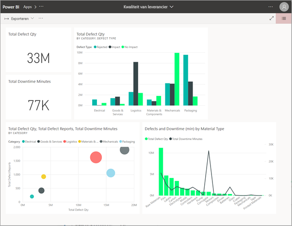

**Op uw iOS- of mobiele Android-apparaat** 

Wanneer u de koppeling in de e-mail selecteert op uw mobiele apparaat, wordt de app automatisch geïnstalleerd en geopend in de mobiele app. Mogelijk moet u zich eerst aanmelden. 

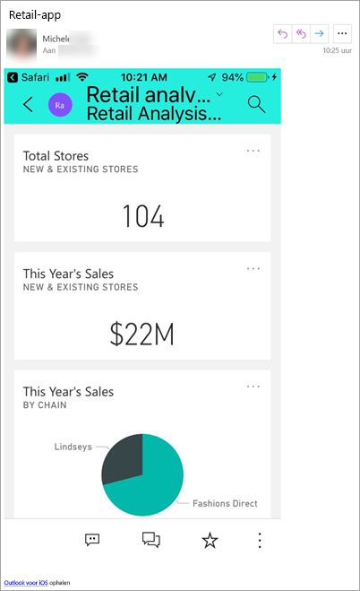

## De app uit Microsoft AppSource downloaden
U kunt ook apps zoeken en installeren vanuit Microsoft AppSource. Alleen apps waartoe u toegang hebt (de app-auteur heeft u of iedereen toestemming gegeven) worden weergegeven. 

> [!NOTE]
> Als u een gratis gebruikerslicentie gebruikt, kunt u apps downloaden, maar u kunt ze niet bekijken, tenzij u een upgrade uitvoert naar een Power BI Pro-account of als de app is opgeslagen in Premium-capaciteit. Zie [licenties voor consumenten](end-user-license.md) voor meer informatie.

1. Selecteer**Apps**  > **Apps verkrijgen**. 
   
    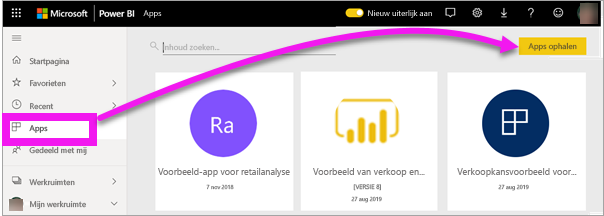    
2. Zoek in AppSource onder **Mijn organisatie** om de resultaten te filteren en de gewenste app te vinden.
   
    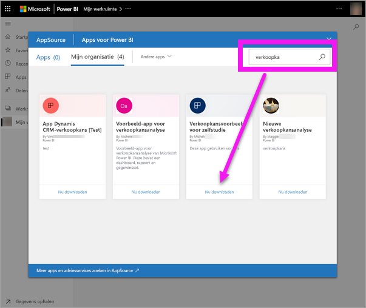
3. Selecteer **Nu downloaden** om deze aan uw Apps-inhoudslijst toe te voegen. 

## Een app verkrijgen via de Microsoft AppSource-website 

In dit voorbeeld openen we een van de voorbeeldapps van Microsoft. In AppSource vindt u apps voor veel van de services die u gebruikt om uw bedrijf te runnen.  Services zoals Salesforce, Microsoft Dynamics, Google Analytics, GitHub, Zendesk, Marketo en nog veel meer. Zie [Apps voor services die u gebruikt met Power BI](../service-connect-to-services.md) voor meer informatie. 

1. Open [https://appsource.microsoft.com](https://appsource.microsoft.com) in een browser en selecteer **Power BI-apps**.

    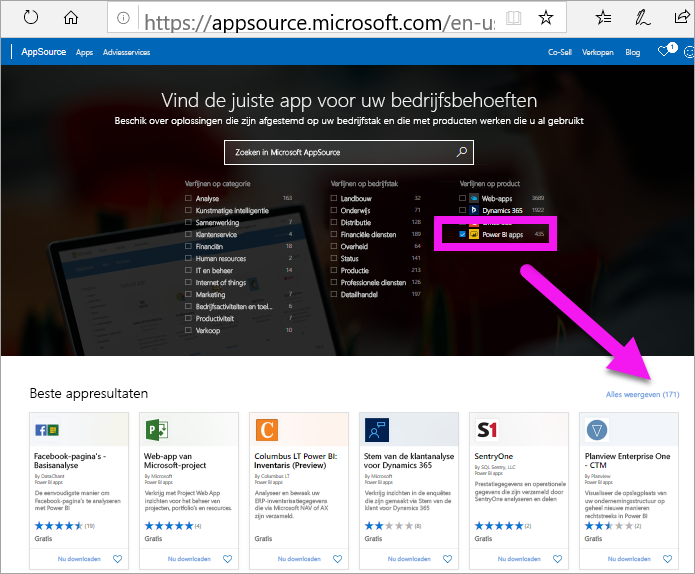

2. Selecteer **Alles weergeven** om de lijst weer te geven met alle Power BI-apps die momenteel beschikbaar zijn in AppSource. Blader of zoek naar de app **Microsoft Sample - Sales & Marketing**.

    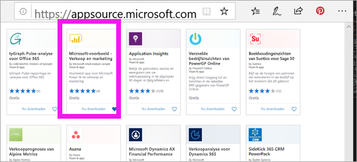

3. Selecteer **Nu downloaden** en ga akkoord met de gebruiksvoorwaarden.

    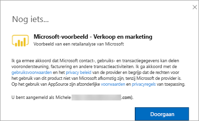

4. Bevestig dat u deze app wilt installeren.

    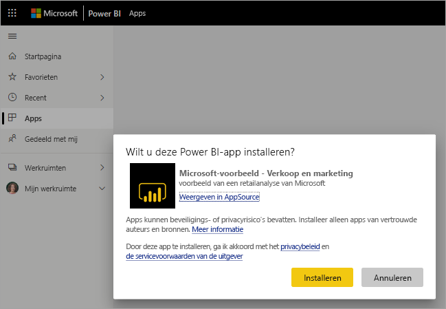

5. Zodra de app is geïnstalleerd, wordt in de Power BI-service een succesbericht weergegeven. Selecteer **Naar de app** om de app te openen. Afhankelijk van de manier waarop de ontwerper de app heeft gemaakt, wordt of het dashboard of het rapport van de app weergegeven.

    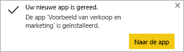

    > [!NOTE]
    > Als u een gratis gebruikerslicentie gebruikt, kunt u apps downloaden, maar u kunt ze niet bekijken, tenzij u een upgrade uitvoert naar een Power BI Pro-account. 

    U kunt de app ook rechtstreeks openen vanuit de lijst met app-inhoud door **Apps** te selecteren en **Sales & Marketing** te kiezen.

    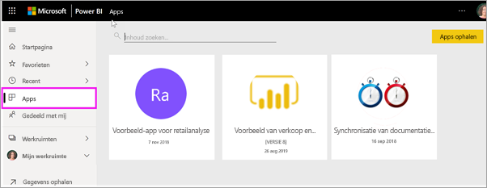

6. Kies of u uw nieuwe app wilt verkennen of wilt aanpassen en delen. Omdat we een voorbeeldapp van Microsoft hebben geselecteerd, gaan we de app eerst verkennen. 

    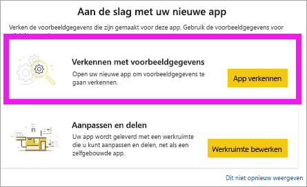

7.  Uw nieuwe app wordt geopend met een dashboard. De app-*ontwerper* heeft mogelijk ingesteld dat de app in plaats daarvan met een rapport wordt geopend.  

    

## Interactie met de dashboards en rapporten in de app
Neem de tijd om de gegevens in de dashboards en rapporten waaruit de app bestaat, te verkennen. U hebt toegang tot de standaard Power BI-interacties zoals filteren, markeren, sorteren en inzoomen.  Is het verschil tussen dashboards en rapporten u nog niet helemaal duidelijk?  Lees het [artikel over dashboards](end-user-dashboards.md) en het [artikel over rapporten](end-user-reports.md).  

## Een app bijwerken 

Van tijd tot tijd kunnen ontwikkelaars van apps nieuwe versies van hun apps uitbrengen. Hoe u de nieuwe versie krijgt, hangt af van de manier waarop u de oorspronkelijke versie hebt ontvangen. 

* Als u de app van uw organisatie hebt ontvangen, is de update naar de nieuwe versie volledig transparant. U hoeft dan niets te doen. 

* Als u de app vanuit AppSource hebt gekregen, ziet u een meldingsbanner als u de app de volgende keer opent. De melding laat u weten dat er een nieuwe versie beschikbaar is. 

    1. Selecteer **Nu downloaden** om de app bij te werken.  

        <!-- -->

    2. Selecteer **Installeren** als u wordt gevraagd om de bijgewerkte app te installeren. 

        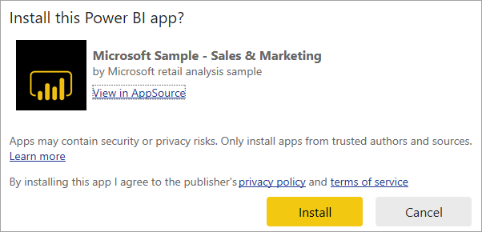 

    3. Omdat u al een versie van deze app hebt, moet u beslissen of u de bestaande versie wilt vervangen of de bijgewerkte app wilt installeren in een nieuwe werkruimte.   

        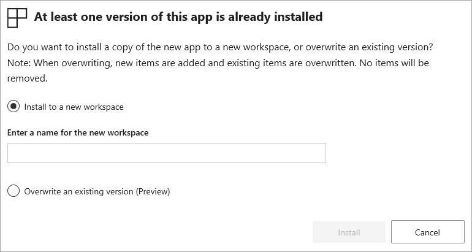 

    > [!NOTE] 
    > Als u een nieuwe versie installeert, worden alle wijzigingen die u in de rapporten en dashboards hebt aangebracht, mogelijk overschreven. Als u uw bijgewerkte rapporten en dashboards wilt bewaren, kunt u ze met een andere naam of op een andere locatie opslaan voordat u de installatie uitvoert. 

    4. Nadat u de bijgewerkte versie hebt geïnstalleerd, selecteert u **App bijwerken** om het updateproces te voltooien. 

## Volgende stappen
* [Terug naar het overzicht van apps](end-user-apps.md)
* [Een Power BI-rapport weergeven](end-user-report-open.md)
* [Andere manieren waarop inhoud met u wordt gedeeld](end-user-shared-with-me.md)
