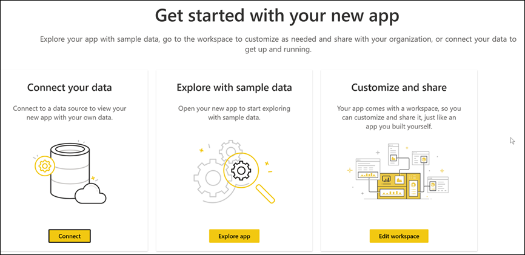

# Apps installeren en gebruiken met dashboards en rapporten in Power BI

[!INCLUDE[consumer-appliesto-ynny](../includes/consumer-appliesto-ynny.md)]

[!INCLUDE [power-bi-service-new-look-include](../includes/power-bi-service-new-look-include.md)]

Nu u een [basiskennis van apps](end-user-apps.md) hebt, laten we u zien hoe u apps kunt openen en ermee kunt communiceren. 

## Manieren om een ​​nieuwe app te verkrijgen
Er zijn verschillende manieren om een ​​nieuwe app te verkrijgen:
* U kunt het downloaden via de app Marketplace van Power BI in de Power BI-service.
* U kunt een rechtstreekse koppeling naar een app gebruiken die u hebt ontvangen van de maker van de app. 
* Een app-ontwerper in uw organisatie kan de app automatisch installeren in uw Power BI-account.

Met de mobiele Power BI-app kunt u alleen een app via een directe koppeling installeren. Als de app-ontwerper de app automatisch installeert, ziet u deze in uw lijst met apps.

## Apps en licenties
Niet alle Power BI-gebruikers kunnen apps bekijken en ermee werken. 
- Als u een gratis licentie hebt, kunt u apps openen die met u zijn gedeeld en zijn opgeslagen in een werkruimte met Premium-capaciteit.  
- Als u een Pro-licentie hebt, kunt u apps openen die met u zijn gedeeld.

Als u een app niet kunt openen, neemt u contact op met de beheerder of de helpdesk. Raadpleeg [Power BI-licentieverlening](end-user-license.md) voor meer informatie over licenties.

## De app downloaden via de marketplace voor Power BI-apps

U kunt apps zoeken en installeren via de marketplace voor Power BI-apps. In de marketplace voor apps kunt u apps en sjabloon-apps verkrijgen.

- Er is een *organisatie-app* beschikbaar voor Power BI-gebruikers in uw organisatie. Deze apps bevatten ook vooraf gebouwde dashboards en rapporten die u als zodanig kunt gebruiken of aanpassen en delen. Uw organisatie beschikt mogelijk over apps voor het bijhouden van de verkoop, het meten van de prestaties of het analyseren van het rekruteringssucces.
- Een *sjabloon-app* wordt geleverd met vooraf gebouwde dashboards en rapporten die u kunt gebruiken om verbinding te maken met veel van de services die u gebruikt voor uw bedrijfsactiviteiten, zoals SalesForce, Microsoft Dynamics en Google Analytics.

1. [Meld u aan bij de Power BI-service](./end-user-sign-in.md) als u zich nog niet hebt aangemeld. 

1. Nadat de Power BI-service is geopend, selecteert u **Apps > Apps ophalen**. 

    

1. De Marketplace voor Power BI-apps wordt geopend.

   

   Er zijn drie tabbladen beschikbaar die u kunt gebruiken:
   * **Alle apps**: blader door zowel sjabloon-apps als alle organisatorische apps die voor u beschikbaar zijn. Sjabloon-apps worden onderscheiden door het pictogram van een winkeltas in de rechterbovenhoek van hun tegels.
   * **Organisatorische apps**: blader door de organisatie-apps die met u zijn gedeeld. 
   * **Sjabloon-apps**: blader door sjabloon-apps die worden gehost op AppSource.

   U kunt ook het zoekvak gebruiken om een gefilterde selectie van apps te zien. Als u een deel van de naam van een app of een categorie zoals Financiën, Analytics, Marketing, enzovoort, typt, kunt u het gezochte item gemakkelijker vinden. 

   Het zoekvak is gevoelig voor het tabblad wat openstaat. Alleen apps van het geselecteerde type worden geretourneerd. Als het tabblad **Alle apps** is geopend, worden zowel organisatie-apps als de sjabloon-apps geretourneerd. Dit kan verwarrend zijn wanneer een organisatie-app en een sjabloon-app dezelfde naam hebben. Houd er rekening mee dat de tegels voor sjabloon-apps in de rechterbovenhoek een pictogram van een winkeltas hebben.

4. Wanneer u de gewenste app hebt gevonden, selecteert u **Nu downloaden** om deze te installeren.

   

* Als u een organisatie-app installeert, wordt deze direct toegevoegd aan uw lijst met apps.
* Als u een sjabloon-app installeert, wordt u naar de aanbieding voor de sjabloon-app in AppSource geleid. Zie [een voorbeeld](end-user-app-marketing.md) van het downloaden en installeren van een voorbeeldsjabloon-app vanuit de marketplace voor Power BI-apps. De app is geïnstalleerd, samen met een werkruimte met dezelfde naam.

   > [!NOTE]
   > Als u een gratis gebruikerslicentie gebruikt, kunt u apps downloaden, maar u kunt ze niet bekijken, tenzij u een upgrade uitvoert naar een Power BI Pro-account of als de app is opgeslagen in een gedeelde Premium-capaciteit. Zie [licenties voor zakelijke gebruikers](end-user-license.md) voor meer informatie.

## Een app vanuit een directe koppeling installeren
U kunt een organisatie-app ook via een rechtstreekse koppeling installeren.    

**Op uw computer** 

Wanneer u de koppeling in de e-mail selecteert, wordt de app door de Power BI-service ([https://app.powerbi.com](https://app.powerbi.com)) in de browser geopend. 

**Op uw iOS- of mobiele Android-apparaat** 

Wanneer u de koppeling in de e-mail selecteert op uw mobiele apparaat, wordt de app automatisch geïnstalleerd en geopend in de mobiele app. Mogelijk moet u zich eerst aanmelden. 

## Interactie met de dashboards en rapporten in de app
Neem de tijd om de gegevens in de dashboards en rapporten waaruit de app bestaat, te verkennen. U hebt toegang tot de standaard Power BI-interacties zoals filteren, markeren, sorteren en inzoomen.  Wat u kunt doen met een app, wordt bepaald door de machtigingen die de *ontwerper* aan u heeft toegewezen.  Hoe u kunt communiceren met de dashboards en rapporten van de app, wordt bepaald door de toegang en rollen die de *ontwerper* aan u heeft toegewezen. 

Is het verschil tussen dashboards en rapporten u nog niet helemaal duidelijk?  Lees het [artikel over dashboards](end-user-dashboards.md) en het [artikel over rapporten](end-user-reports.md).  

### Een app openen

U hebt een app geïnstalleerd of een app van een collega ontvangen. Als u die app wilt bekijken, opent u uw inhoudslijst voor Apps door **Apps** te selecteren in het navigatiepaneel.

Beweeg de muisaanwijzer over de app die u wilt openen. Afhankelijk van de app ontvangt u mogelijk een melding die lijkt op het volgende:

Zie [Sjabloon-apps installeren](../connect-data/service-template-apps-install-distribute.md)voor meer informatie over welke optie u moet selecteren.

Beweeg de muisaanwijzer over de app om de details te zien en selecteer de app-kaart om de app te openen.

De app wordt geopend. Elke app ziet er anders uit: verschillende indelingen, visuals, kleuren en opties. Maar alle apps hebben een aantal veelvoorkomende functies.

1. De naam van de app en de tijd van de laatste update. Klik op de pijl van de vervolgkeuze om de eigenaar en de contactpersoon voor hulp op te zoeken.
1. Selecteer **Power BI** om terug te gaan naar [Start](end-user-home.md).
1. Uw actiebalk. 
1. Het canvas van de rapportpagina.
1. Het navigatiedeelvenster van de app.  Onder de naam van de app ziet u de lijst met inhoud. Deze app heeft één rapport met zes pagina's. Selecteer de naam van een rapport om het te openen. We hebben momenteel de pagina *Retourfrequentie* geopend. 
1. Selecteer de pijl om het deelvenster **Filters** uit te vouwen.

U kunt ook de bijbehorende werkruimte verkennen als u daartoe toegang hebt.  Wanneer u een sjabloon-app installeert of downloadt, maakt de Power BI-service een werkruimte voor u. Wanneer u een organisatie-app installeert, bevat deze mogelijk geen toegang tot de werkruimte. [Meer informatie over werkruimten](end-user-workspaces.md). Selecteer **Power BI** (nummer 2) om terug te gaan naar **Start** en kies **Werkruimten**. 

## Een app bijwerken 

Van tijd tot tijd kunnen ontwerpers van apps nieuwe versies van hun apps uitbrengen. Hoe u de nieuwe versie krijgt, hangt af van de manier waarop u de oorspronkelijke versie hebt ontvangen. 

* Als u de app van uw organisatie hebt ontvangen, is de update naar de nieuwe versie volledig transparant. U hoeft dan niets te doen. 

* Als u een sjabloon-app hebt gedownload vanuit AppSource, ziet u een banner met een melding als u de app de volgende keer opent. De melding laat u weten dat er een nieuwe versie beschikbaar is. 

    1. Selecteer **Nu downloaden** om de app bij te werken.  

        <!-- -->

    2. Selecteer **Installeren** als u wordt gevraagd om de bijgewerkte app te installeren. 

         

    3. Omdat u al een versie van deze app hebt, moet u beslissen of u de bestaande versie wilt vervangen of de bijgewerkte app wilt installeren in een nieuwe werkruimte.   

         

     > [!NOTE] 
     > Als u een nieuwe versie installeert, worden alle wijzigingen die u in de rapporten en dashboards van de app hebt aangebracht, overschreven. Als u uw bijgewerkte rapporten en dashboards wilt bewaren, kunt u ze met een andere naam of op een andere locatie opslaan voordat u de installatie uitvoert. 

    4. Nadat u de bijgewerkte versie hebt geïnstalleerd, selecteert u **App bijwerken** om het updateproces te voltooien. 

## Aandachtspunten en probleemoplossing

- De mogelijkheid om apps te installeren, kan worden in- of uitgeschakeld door uw Power BI-beheerder. Neem contact op met uw IT-afdeling of helpdesk als u deze functie hebt ingeschakeld.    
- Voor het gebruik van apps is een Pro-licentie vereist of moet de app zijn opgeslagen in een werkruimte in een gedeelde Premium-capaciteit. [Meer informatie over licenties](end-user-license.md).

## Volgende stappen
* [Terug naar het overzicht van apps](end-user-apps.md)
* [Een Power BI-rapport weergeven](end-user-report-open.md)
* [Andere manieren waarop inhoud met u wordt gedeeld](end-user-shared-with-me.md)

