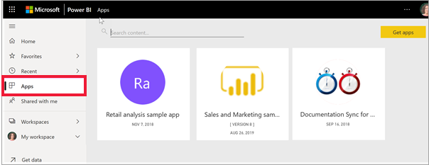

# Apps in Power BI

[!INCLUDE[consumer-appliesto-ynny](../includes/consumer-appliesto-ynny.md)]

[!INCLUDE [power-bi-service-new-look-include](../includes/power-bi-service-new-look-include.md)]

## Wat is een Power BI-app?
Een *app* is een Power BI-inhoudstype waarmee gerelateerde dashboards en rapporten op één locatie worden gecombineerd. Een app kan één of meer dashboards en één of meer rapporten hebben, die allemaal zijn gebundeld. Apps worden gemaakt door Power BI *-ontwerpers* die de apps distribueren en delen met *gebruikers* zoals u. 

Uw apps zijn georganiseerd in de **Apps**-inhoudslijst. U hoeft alleen **Apps** te selecteren om uw apps weer te geven. Beweeg de muisaanwijzer over een app om de meest recente update en de eigenaar weer te geven. 

Er is een Power BI Pro-licentie vereist om de app-functie te gebruiken of om de app op te slaan in Premium-capaciteit en met u te delen. Zie [Licenties voor consumenten](end-user-license.md) voor meer informatie over licenties en Premium-capaciteit.

## App-*ontwerpers* en app-*gebruikers*
Afhankelijk van uw rol bent u mogelijk iemand die apps maakt (*ontwerper*) voor uw eigen gebruik of om te delen met collega's. Of misschien bent u iemand die apps ontvangt en downloadt (*gebruiker*) die door anderen zijn gemaakt. Dit artikel is voor app-*gebruikers*.

## Voordelen van apps
Apps bieden een eenvoudige manier om verschillende typen inhoud in één keer met anderen te delen. App-*ontwerpers* maken de dashboards en rapporten en bundelen deze in een app. De *ontwerpers* kunnen de app vervolgens delen of publiceren naar een locatie waarop u, de *gebruiker*, toegang tot die app heeft. Omdat gerelateerde dashboards en rapporten worden gebundeld, is het eenvoudiger om deze zowel in de Power BI-service ([https://powerbi.com](https://powerbi.com)) als op uw mobiele apparaat te zoeken en te installeren. Nadat u een app hebt geïnstalleerd, hoeft u de namen van veel verschillende dashboards of rapporten niet meer te onthouden omdat ze allemaal bij elkaar staan in de app, in uw browser of op uw mobiele apparaat.

Bij apps ziet u automatisch de wijzigingen wanneer de auteur van de app updates publiceert. De auteur bepaalt ook hoe vaak de gegevens worden gepland om te worden vernieuwd, zodat u zich geen zorgen hoeft te maken over het up-to-date houden van de gegevens. 

<!-- add conceptual art -->
## Een nieuwe app verkrijgen
Er zijn verschillende manieren om een ​​nieuwe app te verkrijgen. U kunt apps zoeken, vinden en installeren en app-makers kunnen apps met u delen. 

### U kunt apps zoeken en installeren via de Marketplace voor Power BI-apps
Een manier om apps te vinden, is door **App ophalen** te selecteren in het venster Power BI-apps. 

Blader door de lijst met apps in de Marketplace voor Power BI-apps totdat u er een hebt gevonden om te installeren. Kies uit **organisatie-apps**, die alleen beschikbaar zijn voor mensen in uw bedrijf, of **sjabloon-apps**, die door Microsoft en de community beschikbaar worden gesteld voor installatie door elke Power BI-gebruiker. 

Er zijn een aantal andere manieren om apps te downloaden. Een aantal van deze manieren wordt hieronder beschreven. Als u echter gedetailleerde stapsgewijze instructies wilt voor het ophalen en verkennen van een app, gaat u naar [Apps openen en gebruiken](end-user-app-view.md).

* De ontwerper van de app kan de app automatisch in uw Power BI-account installeren. De volgende keer dat u de Power BI-service opent, ziet u de nieuwe app in de **Apps**-inhoudslijst. 
* De app-ontwerper kan u een directe koppeling naar een app mailen. Als u de koppeling selecteert, wordt de app geopend in de Power BI-service.
* In Power BI op uw mobiele apparaat kunt u een app alleen installeren via een rechtstreekse koppeling, niet vanuit de Marketplace voor apps. Als de auteur van de app de app automatisch installeert, ziet u deze in uw lijst met apps. 

## Volgende stappen
* [Een app openen en ermee communiceren](end-user-app-view.md)
* [Andere manieren om inhoud te delen](end-user-shared-with-me.md)

