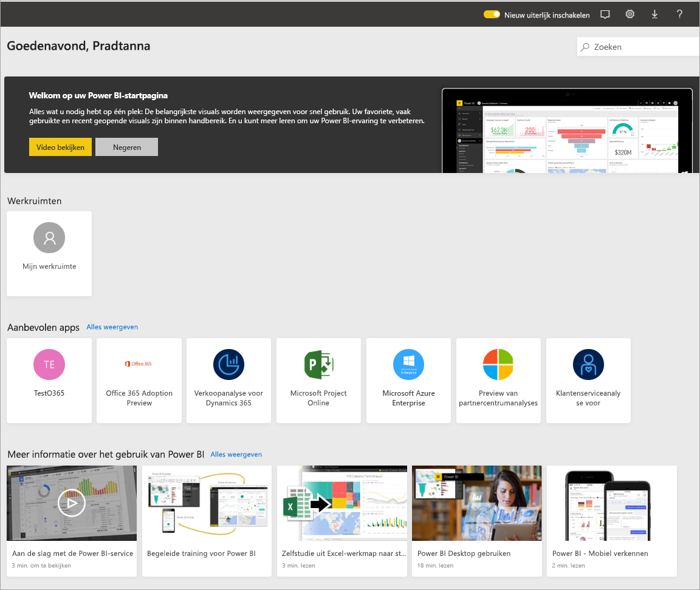
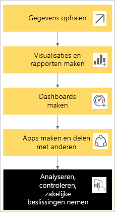
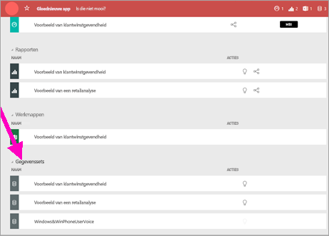
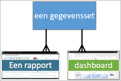
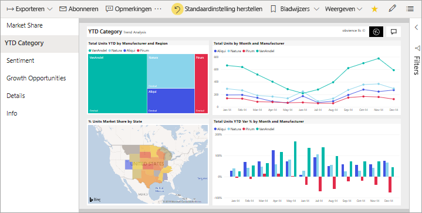
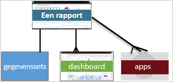
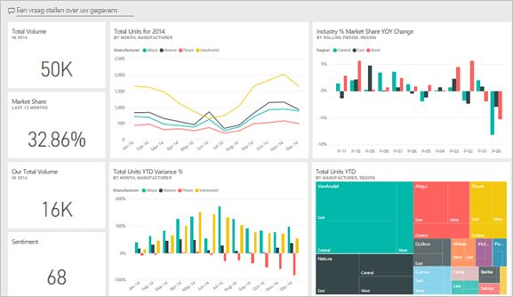
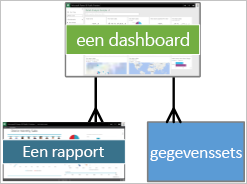
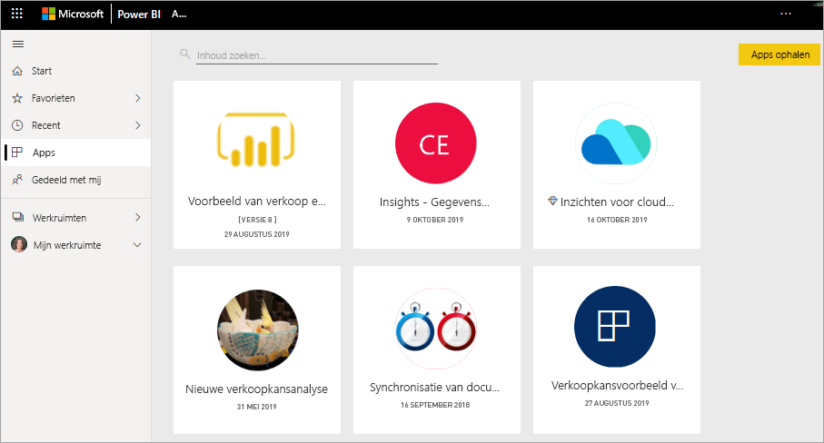
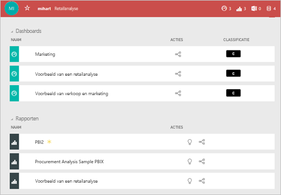

# Basisconcepten voor consumenten van de Power BI-service

[!INCLUDE [power-bi-service-new-look-include](../includes/power-bi-service-new-look-include.md)]

In dit artikel wordt ervan uitgegaan dat u het [Power BI-overzicht](../fundamentals/power-bi-overview.md) al hebt gelezen en u zich hebt geïdentificeerd als een [Power BI **_-consument_** ](end-user-consumer.md). Consumenten ontvangen Power BI-inhoud, zoals dashboards en rapporten, van collega's. Consumenten maken gebruik van de Power BI-service, de websiteversie van Power BI.

U hebt ongetwijfeld al gehoord van de term ‘Power BI Desktop’ of gewoon ‘Desktop’. Dit is het zelfstandige hulpprogramma dat wordt gebruikt door *ontwerpers* die dashboards bouwen en rapporten samenstellen, en deze met u delen. Het is belangrijk om te weten dat er ook andere Power BI-hulpprogramma’s beschikbaar zijn. Als consument werkt u alleen met de Power BI-service. Dit artikel is alleen van toepassing op de Power BI-service.

## Termen en concepten

Dit artikel is geen visuele rondleiding door Power BI en ook geen praktische zelfstudie. Het is in plaats hiervan een overzichtsartikel om u vertrouwd te maken met de termen en concepten van Power BI. U leert hiermee het jargon en de grondbeginselen kennen. Ga naar [Quickstart: navigeren in de Power BI-service](end-user-experience.md) voor een rondleiding van de Power BI-service en de bijbehorende navigatie.

## De Power BI-service voor het eerst openen

De meeste Power BI-consumenten krijgen de beschikking over de Power BI-service omdat 1) hun bedrijf licenties koopt en 2) een beheerder de licenties aan werknemers als u toewijst.

Als u wilt beginnen, opent u een browser en typt u **app.powerbi.com**. De eerste keer dat u de Power BI-service opent, ziet u iets dat vergelijkbaar is met het volgende:

Als u Power BI gebruikt, kunt u aanpassen wat u ziet wanneer u de website in het vervolg opent. Sommige mensen willen graag dat Power BI wordt geopend met de **Startpagina**, terwijl anderen een favoriet dashboard hebben dat ze het eerst willen zien. Maak u zich geen zorgen. In dit artikel leert u hoe u uw versie kunt aanpassen.

- [Inleiding tot de Power BI-startpagina en de algemene zoekopdracht](https://powerbi.microsoft.com/blog/introducing-power-bi-home-and-global-search)

- [Aanbevolen dashboards in de Power BI-service](end-user-featured.md)

Maar voordat we verdergaan, doen we eerst een stapje terug en nemen we de bouwstenen van de Power BI-service door.

_______________________________________________________

## Power BI-inhoud

### Inleiding tot bouwstenen

De vijf bouwstenen voor een Power BI-consument zijn: **_visualisaties_** , **_dashboards_** , **_rapporten_** , **_apps_** en **_gegevenssets_** . Deze worden soms aangeduid als **_inhoud_** van *Power BI*. *Inhoud* bevindt zich in **_werkruimten_** . Een gebruikelijke werkstroom omvat alle bouwstenen: Een Power BI-*ontwerper* (geel in het onderstaande diagram) verzamelt gegevens uit *gegevenssets*, voert deze in Power BI in voor analyse, maakt *rapporten* vol *visualisaties* die interessante feiten en inzichten belichten, maakt visualisaties uit rapporten vast aan een dashboard en deelt de rapporten en dashboards met *consumenten* , zoals u, (zwart in het onderstaande diagram). De *ontwerper* deelt ze in de vorm van *apps* of andere typen gedeelde inhoud.

In de eenvoudigste vorm:

-  een **_visualisatie_** (of *visual*), is een type diagram dat is gebouwd door Power BI-*ontwerpers*. In de visuals worden gegevens uit *rapporten* en *gegevenssets* weergegeven. Gewoonlijk maken *ontwerpers* de visuals in Power BI Desktop.

    Zie [Werken met visuals in rapporten, op dashboards en in apps](end-user-visualizations.md) voor meer informatie.

- . Een *gegevensset* is een container net gegevens. Dit kan bijvoorbeeld een Excel-bestand zijn van de Wereldgezondheidsorganisatie. Het kan ook een database met gebruikers zijn die eigendom zijn van een bedrijf, of een Salesforce-bestand.  

- . Een *dashboard* is één scherm met interactieve visuals, tekst en grafische weergaven. Op een dashboard worden uw belangrijkste metrische gegevens op één scherm bij elkaar gebracht om een boodschap over te brengen of een vraag te beantwoorden. De inhoud van het dashboard komt uit een of meer rapporten en een of meer gegevenssets.

    Zie [Dashboards voor consumenten van de Power BI-service](end-user-dashboards.md) voor meer informatie.

-  Een *rapport* bevat een of meer pagina's met interactieve visuals, tekst en grafische weergaven die samen één geheel vormen. Een rapport in Power BI is gebaseerd op één gegevensset. Vaak komt op rapportpagina’s in de service een centraal interessegebied of één vraagstuk aan de orde.

    Zie [Rapporten in Power BI](end-user-reports.md) voor meer informatie.

-  Een *app* is een manier waarop *ontwerpers* gerelateerde dashboards en rapporten bundelen en delen. *Consumenten* ontvangen sommige apps automatisch maar kunnen ook zoeken naar andere apps die zijn gemaakt door collega's of de community. Power BI-apps worden bijvoorbeeld aangeboden door externe services waarvan u mogelijk al gebruikmaakt, zoals Google Analytics en Microsoft Dynamics CRM.

Voor de duidelijkheid: als u een nieuwe gebruiker bent en u zich voor het eerst bij Power BI aanmeldt, hebt u nog geen dashboards, apps of rapporten.

_______________________________________________________

## Gegevenssets

Een *gegevensset* is een verzameling gegevens die *ontwerpers* importeren of waar ze verbinding mee maken en die ze vervolgens gebruiken om rapporten en dashboards mee te maken. Als consument hebt u geen directe interactie met gegevenssets, maar het is wel handig om te leren hoe ze in het grotere geheel passen.  

Elke gegevensset vertegenwoordigt één gegevensbron. Voorbeelden van bronnen: een Excel-werkmap in OneDrive, een on-premises tabulaire gegevensset van SQL Server Analysis Services, of een Salesforce-gegevensset. Power BI biedt ondersteuning voor veel verschillende gegevensbronnen.

Wanneer een ontwerper een app met u deelt, kunt u zien welke gegevenssets zijn opgenomen in de app.

Eén gegevensset...

- Kan steeds opnieuw worden gebruikt door een rapportontwerper om dashboards en rapporten te maken

- Kan worden gebruikt in tal van verschillende rapporten

- Visuals uit deze ene gegevensset kunnen worden weergegeven op een groot aantal verschillende dashboards

  

Nu over naar de volgende bouwsteen: visualisaties.

_______________________________________________________

## Visualisaties

Visualisaties (ook wel visuals genoemd) geven inzichten weer die in Power BI zijn gedetecteerd in de gegevens. Met visualisaties kunnen inzichten gemakkelijker worden geïnterpreteerd, omdat uw hersenen een afbeelding sneller kunnen doorgronden dan een spreadsheet met getallen.

Enkele visualisaties die u in Power BI kunt tegenkomen, zijn: watervalgrafieken, linten, treemaps, cirkeldiagrammen, trechterdiagrammen, kaarten, spreidingsdiagrammen en meters.

   

Zie de [volledige lijst met visualisaties in Power BI](../power-bi-visualization-types-for-reports-and-q-and-a.md).

Visualisaties, genoemd *aangepaste visuals*, zijn ook beschikbaar via de community. Als u een rapport ontvangt met een visual die u niet herkent, is het waarschijnlijk een aangepaste visual. Als u hulp nodig hebt bij het interpreteren van de aangepaste visual, zoekt u de naam van de *ontwerper* van het rapport of dashboard, en neemt u contact met hem of haar op.

Eén visualisatie in een rapport...

- Kan meerdere keren worden weergegeven in hetzelfde rapport

- Kan worden weergegeven op veel verschillende dashboards

_______________________________________________________

## Rapporten

Een Power BI-rapport bestaat uit een of meer pagina's met visualisaties, grafische weergaven en tekst. Alle visualisaties in een rapport zijn afkomstig uit één gegevensset. *Ontwerpers* delen rapporten met *consumenten*, die [met de rapporten kunnen communiceren in de *Leesweergave*](end-user-reading-view.md).

Eén rapport...

- Kan worden gekoppeld aan meerdere dashboards (tegels die zijn vastgemaakt vanuit dat rapport, kunnen worden weergegeven in meerdere dashboards).

- Kan worden gemaakt met gegevens uit slechts één gegevensset.  

- Kan deel uitmaken van meerdere apps.

  

_______________________________________________________

## Dashboards

Een dashboard vertegenwoordigt een aangepaste weergave van een subset van de onderliggende gegevensset(s). *Ontwerpers* bouwen dashboards en delen deze met *consumenten*, afzonderlijk of als onderdeel van een app. Een dashboard is een enkel canvas dat *tegels*, grafische weergaven en tekst bevat.

  

Een tegel is een weergave van een visual die een *ontwerper* *vastmaakt*, bijvoorbeeld vanuit een rapport aan een dashboard. Op elke vastgemaakte tegel wordt een [visualisatie](end-user-visualizations.md) weergegeven die door een ontwerper is gemaakt vanuit een gegevensset en vastgemaakt aan dit dashboard. Een tegel kan ook een volledige rapportpagina, live gestreamde gegevens of een video bevatten. Er zijn verschillende manieren waarop *ontwerpers* tegels kunnen toevoegen aan dashboards. Dit zijn er te veel om op te nemen in dit overzichtsartikel. Zie [Dashboardtegels in Power BI](end-user-tiles.md) voor meer informatie.

Consumenten kunnen dashboards niet bewerken. U kunt echter wel opmerkingen toevoegen, gerelateerde gegevens weergeven, een dashboard instellen als favoriet, u erop abonneren en meer.

Wat voor doelen hebben dashboards?  Hier volgen er slechts enkele:

- in één oogopslag alle benodigde informatie zien voor het nemen van beslissingen

- de belangrijkste informatie over uw bedrijf bewaken

- ervoor zorgen dat alle collega's hetzelfde voor ogen hebben, en allemaal dezelfde informatie zien en gebruiken

- de status in de gaten houden van een bedrijf, product, afdeling, marketingcampagne, enzovoort

- U kunt een gepersonaliseerde weergave van een groter dashboard maken met alle metrische gegevens die voor u belangrijk zijn

**Eén** dashboard

- kan visualisaties weergeven uit diverse gegevenssets,

- uit verschillende rapporten en

- kan visualisaties weergeven die zijn vastgemaakt vanuit andere hulpprogramma's (bijvoorbeeld Excel)

  

_______________________________________________________

## Apps

Met deze verzamelingen van dashboards en rapporten hebt u gerelateerde inhoud bij elkaar in één pakket. Power BI-*ontwerpers* bouwen ze en delen ze met personen, groepen, een hele organisatie of in het openbaar. Als consument kunt u er zeker van zijn dat uw collega's en u met dezelfde gegevens werken: één vertrouwde, onomstreden versie.

Apps zijn gemakkelijk te vinden en te installeren in de [Power BI-service](https://powerbi.com) en op uw mobiele apparaat. Nadat u een app hebt geïnstalleerd, hoeft u niet de namen van veel verschillende dashboards te onthouden. U vindt deze allemaal samen in één app, in uw browser, of op uw mobiele apparaat.

Deze app biedt drie gerelateerde dashboards en drie gerelateerde rapporten die gezamenlijk één app vormen.

Bij apps ziet u automatisch de wijzigingen wanneer de auteur van de app updates publiceert. De auteur bepaalt ook de planning voor hoe vaak de gegevens worden vernieuwd in Power BI. U hoeft u geen zorgen te maken over het up-to-date houden van deze gegevens.

U kunt apps op een aantal verschillende manieren verkrijgen:

- De app-ontwerper kan de app automatisch installeren in uw Power BI-account.

- De app-ontwerper kan u een directe koppeling naar een app sturen.

- U kunt zoeken naar apps in [Microsoft AppSource](https://appsource.microsoft.com/marketplace/apps?product=power-bi), waar u alle apps ziet die u kunt gebruiken.

In Power BI op uw mobiele apparaat kunt u apps alleen installeren via een rechtstreekse koppeling, niet vanuit AppSource. Als de app-ontwerper de app automatisch installeert, ziet u deze in uw lijst met apps.

Nadat de app is geïnstalleerd, hoeft u deze alleen maar te selecteren in de lijst met apps. Vervolgens kunt u selecteren welk dashboard of rapport u het eerst wilt openen en verkennen.

Hopelijk hebt u enig inzicht gekregen in de bouwstenen van de Power BI-service voor consumenten.

## Volgende stappen

- Bekijk de [Woordenlijst](end-user-glossary.md) en voeg deze toe aan favorieten

- Volg een [rondleiding door de Power BI-service](end-user-experience.md)

- Lees het [overzicht van Power BI, speciaal geschreven voor consumenten](end-user-consumer.md)

- Bekijk een video waarin Will de basisconcepten bespreekt en een rondleiding door de Power BI-service geeft.

    <iframe width="560" height="315" src="https://www.youtube.com/embed/B2vd4MQrz4M" frameborder="0" allowfullscreen></iframe>
