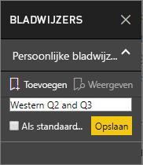
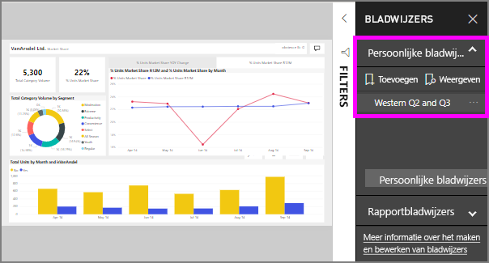

# Wat zijn bladwijzers?
Bladwijzers vastleggen van de momenteel geconfigureerde weergave van een rapportpagina, met inbegrip van filters, slicers en de status van visuele elementen. Wanneer u een bladwijzer selecteert, gaat Power BI u terug naar deze weergave. Er zijn twee soorten bladwijzers - die u zelf en die zijn gemaakt door rapport *ontwerpers*.

## Bladwijzers gebruiken om inzichten te delen en verhalen te vertellen in Power BI 
Er zijn vele toepassingen voor bladwijzers. Stel dat u een interessant inzicht detecteren en wilt handhaven--een bladwijzer maken, zodat u later kunt terugkeren. Moet verlaten en wilt behouden van uw huidige werk, een bladwijzer maakt. Ook kunt u een bladwijzer de standaardweergave van het rapport, zodat telkens wanneer u terugkeert, dat weergave van de rapportpagina eerst wordt geopend. 

U kunt ook een verzameling maken van bladwijzers gebruikt, deze rangschikken in de volgorde die u wilt en doorloop vervolgens elke bladwijzer in een presentatie om te markeren van een reeks inzichten die een verhaal vertellen.  

## Bladwijzers gebruiken
Selecteer om te openen in het deelvenster Bladwijzers, **bladwijzers** in de menubalk. Als u wilt terugkeren naar de oorspronkelijke gepubliceerde weergave van het rapport, selecteert u **standaardinstellingen herstellen**.

### Rapport bladwijzers
Als het rapport *designer* opgenomen rapport bladwijzers, vindt u onder de **rapporteren bladwijzers** kop. 

Selecteer een bladwijzer wijzigen in die rapportweergave. 

### Persoonlijke favorieten

Wanneer u een bladwijzer maakt, worden de volgende elementen opgeslagen met de bladwijzer:

* De huidige pagina
* Filters
* Slicers, met inbegrip van het type slicer (bijvoorbeeld vervolgkeuzelijst of lijst) en de status van de slicer
* Selectiestatus van visual (zoals filters voor kruislings markeren)
* Sorteervolgorde
* Zoomlocatie
* Zichtbaarheid (van een object via het deelvenster **Selectie**)
* De focus- of **Spotlight**-modus van een zichtbaar object

Configureer een rapportpagina zoals u deze wilt weergeven in de bladwijzer. Zodra de rapportpagina en visuele elementen naar wens zijn gerangschikt, selecteert u **Toevoegen** in het deelvenster **Bladwijzers** om een bladwijzer toe te voegen. In dit voorbeeld hebben we bepaalde filters voor de regio en datum toegevoegd. 

**Power BI** maakt een bladwijzer en geeft deze een algemene naam of een naam die u invoert. U kunt *naam*, *verwijderen*, of *bijwerken* een bladwijzer door het beletselteken naast de naam van de bladwijzer selecteren en vervolgens een bewerking te selecteren in het menu dat verschijnt.

Zodra u een bladwijzer hebt, kunt u deze weergeven door eenvoudig te selecteren van de bladwijzer in de **bladwijzers** deelvenster. 

<!--
## Arranging bookmarks
As you create bookmarks, you might find that the order in which you create them isn't necessarily the same order you'd like to present them to your audience. No problem, you can easily rearrange the order of bookmarks.

In the **Bookmarks** pane, simply drag-and-drop bookmarks to change their order, as shown in the following image. The yellow bar between bookmarks designates where the dragged bookmark will be placed.

The order of your bookmarks can become important when you use the **View** feature of bookmarks, as described in the next section. 

-->

## Bladwijzers als een diavoorstelling
Als u wilt presenteren of bladwijzers op volgorde wilt weergeven, selecteert u **weergave** uit de **bladwijzers** deelvenster om te beginnen met een diavoorstelling.

In de **weergavemodus** moet u op enkele dingen letten:

1. De naam van de bladwijzer wordt weergegeven in de bladwijzerbalk, onderaan op het canvas.
2. De bladwijzerbalk bevat pijlen waarmee u naar de volgende of vorige bladwijzer kunt gaan.
3. U kunt de **Weergavemodus** afsluiten door **Afsluiten** te selecteren in het deelvenster **Bladwijzers** of door de **X** op de bladwijzerbalk te selecteren. 

In de **weergavemodus** kunt u het deelvenster **Bladwijzers** sluiten (door te klikken op de X in dit deelvenster) om meer ruimte vrij te maken voor de presentatie. In de **Weergavemodus** zijn alle visuele elementen interactief en beschikbaar voor kruislingse markering, net zoals wanneer u er normaal mee werkt. 

<!--
## Visibility - using the Selection pane
With the release of bookmarks, the new **Selection** pane is also introduced. The **Selection** pane provides a list of all objects on the current page and allows you to select the object and specify whether a given object is visible. 

You can select an object using the **Selection** pane. Also, you can toggle whether the object is currently visible by clicking the eye icon to the right of the visual. 

When a bookmark is added, the visible status of each object is also saved based on its setting in the **Selection** pane. 

It's important to note that **slicers** continue to filter a report page, regardless of whether they are visible. As such, you can create many different bookmarks, with different slicer settings, and make a single report page appear very different (and highlight different insights) in various bookmarks.

## Bookmarks for shapes and images
You can also link shapes and images to bookmarks. With this feature, when you click on an object, it will show the bookmark associated with that object. This can be especially useful when working with buttons; you can learn more by reading the article about [using buttons in Power BI](desktop-buttons.md). 

To assign a bookmark to an object, select the object, then expand the **Action** section from the **Format Shape** pane, as shown in the following image.

Once you turn the **Action** slider to **On** you can select whether the object is a back button, a bookmark, or a Q&A command. If you select bookmark, you can then select which of your bookmarks the object is linked to.

There are all sorts of interesting things you can do with object-linked bookmarking. You can create a visual table of contents on your report page, or you can provide different views (such as visual types) of the same information, just by clicking on an object.

When you are in editing mode you can use ctrl+click to follow the link, and when not in edit mode, simply click the object to follow the link. 

## Bookmark groups

Beginning with the August 2018 release of **Power BI Desktop**, you can create and use bookmark groups. A bookmark group is a collection of bookmarks that you specify, which can be shown and organized as a group. 

To create a bookmark group, hold down the CTRL key and select the bookmarks you want to include in the group, then click the ellipses beside any of the selected bookmarks, and select **Group** from the menu that appears.

**Power BI Desktop** automatically names the group *Group 1*. Fortunately, you can just double-click on the name and rename it to whatever you want.

With any bookmark group, clicking on the bookmark group's name only expands or collapses the group of bookmarks, and does not represent a bookmark by itself. 

When using the **View** feature of bookmarks, the following applies:

* If the selected bookmark is in a group when you select **View** from bookmarks, only the bookmarks *in that group* are shown in the viewing session. 

* If the selected bookmark is not in a group, or is on the top level (such as the name of a bookmark group), then all bookmarks for the entire report are played, including bookmarks in any group. 

To ungroup bookmarks, just select any bookmark in a group, click the ellipses, and then select **Ungroup** from the menu that appears. 

Note that selecting **Ungroup** for any bookmark from a group takes all bookmarks out of the group (it deletes the group, but not the bookmarks themselves). So to remove a single bookmark from a group, you need to **Ungroup** any member from that group, which deletes the grouping, then select the members you want in the new group (using CTRL and clicking each bookmark), and select **Group** again. 
-->

## Beperkingen en overwegingen
Houd rekening met de volgende beperkingen en overwegingen in deze release van **bladwijzers**.

* De meeste aangepaste visualisaties zouden goed met bladwijzers moeten werken. Als u problemen ondervindt met bladwijzers en een aangepaste visual, neem dan contact op met de maker van die aangepaste visual en vraag deze om ondersteuning voor bladwijzers toe te voegen. 
* Als u een visueel element toevoegt aan een rapportpagina nadat u een bladwijzer hebt gemaakt, wordt het visuele element weergegeven in de standaardstaat. Dit betekent ook dat als u een slicer toevoegt aan een pagina waarop u eerder bladwijzers hebt gemaakt, de slicer in de standaardstaat wordt uitgevoerd.
* Als visuele elementen worden verplaatst nadat een bladwijzer is gemaakt, wordt dit weerspiegeld in de bladwijzer. 
* Over het algemeen uw bladwijzers is niet van toepassing als het rapport *designer* bijwerken of het rapport het rapport opnieuw publiceert. Echter, als de ontwerpfunctie voor belangrijke wijzigingen in het rapport aanbrengt, zoals het verwijderen van de velden die worden gebruikt door een bladwijzer, vervolgens u ontvangt een foutbericht weergegeven de volgende keer dat u probeert te openen die bladwijzer. 

<!--
## Next steps
spotlight?
-->
