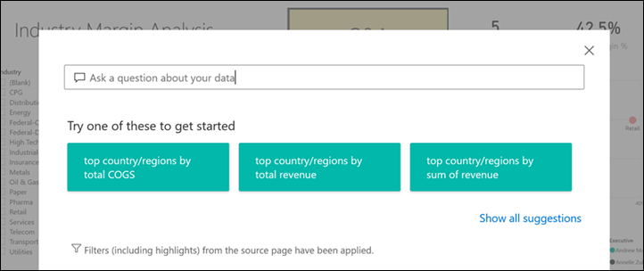

# Knoppen in de Power BI-service
In de rapporten die u van collega's ontvangt, hebt u mogelijk knoppen gedetecteerd en hebt u zich afgevraagd hoe u deze kunt gebruiken. Sommige bevatten woorden, andere bevatten pijlen en weer andere afbeeldingen. Sommige bevatten zelfs vervolgmenu's. In dit artikel leert u hoe u een knop herkent en hoe u kunt ontdekken wat u ermee moet doen.

## Een knop herkennen
Knoppen kunnen veel lijken op vormen, afbeeldingen of pictogrammen op een rapportpagina. Maar als er een actie wordt uitgevoerd wanneer u deze selecteert (erop klikt), is het waarschijnlijk een knop.

## Typen knoppen
Auteurs van rapporten voegen knoppen toe aan rapporten om u te helpen bij het navigeren en verkennen. Enkele voorbeelden van knoptypen: vorige, bladwijzer, pijlen, Q&A, help en leeg. 

### Vorige-knoppen 
Een Vorige-knop kan een pijlpictogram bevatten. Wanneer u deze selecteert, keert u terug naar de vorige pagina in Power BI.  De Vorige-knoppen worden vaak gebruikt bij drillthrough. Hier volgt een voorbeeld van een Vorige-knop die wordt gebruikt bij drillthrough.

1. De gebruiker heeft **Word** geselecteerd in het staafdiagram en zoomt in op **Market Basket Analysis**.

    

2. Wanneer u **Market Basket Analysis**, kiest, wordt in Power BI de rapportpagina *Market Basket Analysis* geopend en worden de selecties gebruikt die u hebt gemaakt op de bronpagina om te filteren wat op de doelpagina wordt weergegeven.

    

    U bent nu op de rapportpagina **Market Basket Analysis**, die op **Word** is gefilterd. Selecteer de Vorige-knop met het label **Go back** om terug te keren naar de vorige pagina. 

## Bladwijzer-knoppen
*Ontwerpers* van rapporten nemen vaak bladwijzers op in hun rapporten. U kunt de lijst met rapportbladwijzers weergeven door **Bladwijzers** te selecteren in de rechterbovenhoek. Wanneer een rapportontwerper een bladwijzer-*knop* toevoegt, is het simpelweg een alternatieve manier om naar de rapportpagina te navigeren die aan die bladwijzer is gekoppeld. Op de pagina bevinden zich de toegepaste filters en instellingen die door de bladwijzer zijn vastgelegd. [Meer informatie over bladwijzers vindt u in Power BI](end-user-bookmarks.md). 

In dit voorbeeld heeft de knop een bladwijzer-pictogram en de naam van de bladwijzer, *Urban*. 

Als u de knop Bladwijzer kiest, gaat u in Power BI naar de locatie en instellingen zoals die zijn gedefinieerd voor die bladwijzer.  In dit geval bevindt de bladwijzer zich op de rapportpagina *Groeikansen* en wordt die pagina kruislings gefilterd op **Urban**.

## Drillthrough-knoppen
Er zijn twee manieren om een drillthrough uit te voeren in de Power BI-service. Met Drillthrough gaat u naar een andere rapportpagina en worden de gegevens op die doelpagina weergegeven op basis van de filters en selecties die u hebt gemaakt op de bronpagina.

Een van de manieren om een rapport te analyseren, is door met de rechtermuisknop op een gegevenspunt in een visual te klikken, **Analyseren** te selecteren en het doel te kiezen. Deze methode wordt hierboven beschreven in de sectie met de titel **Vorige-knop**. Maar soms gebruiken de rapportontwerpers een drillthrough-*knop* om de actie duidelijker te maken en om de aandacht te vestigen op belangrijke inzichten.  

Drillthrough-knoppen kunnen meer dan één vereiste hebben. De knop werkt pas als u aan alle vereisten voldoet. We kijken naar een voorbeeld.

Hier volgt een drillthrough-knop die ons naar de pagina *Details opslaan* brengt. Als u de muisaanwijzer boven de knop houdt, wordt er knopinfo weergegeven welke ons aangeeft dat we zowel een winkel als een product moeten selecteren. De knop wordt pas actief als we een van beide selecteren.

Nu we één product (**Word**) en één winkel (**Leo**) hebben geselecteerd, verandert de knop van kleur om aan te geven dat deze nu actief is.

Als u de drillthrough-knop selecteert, gaan we naar de rapportpagina *Winkel*. De pagina *Winkel* wordt gefilterd op basis van de selecties van **Word** en **Leo**.

Drillthrough-knoppen kunnen ook vervolgkeuzemenu's hebben die u een keuze in bestemmingen bieden. Wanneer u uw selecties hebt gemaakt op de bronrapportpagina, selecteert u de doelrapportpagina voor de drillthrough. In het onderstaande voorbeeld wijzigen we onze selectie om de rapportpagina *Marktgegevens* te analyseren. 

## Paginanavigatie

Met paginanavigatie-knoppen gaat u naar een andere pagina in hetzelfde rapport. Rapportontwerpers maken vaak navigatie-knoppen om een verhaal te vertellen of u door de rapportinzichten te leiden. In het onderstaande voorbeeld heeft de rapportontwerper een knop toegevoegd op elke rapportpagina waarmee u terug naar de eerste pagina gaat, de overzichtspagina op het hoogste niveau in het rapport. Deze paginanavigatie-knop is handig omdat dit rapport uit veel pagina's bestaat.

## Q&A-knoppen 
Als u een Q&A-knop selecteert, wordt het Explorer-venster Power BI Q&A geopend. Het Q&A-venster wordt boven aan de rapportpagina weergegeven en kan worden gesloten door de X te selecteren. [Meer informatie over Q&A](end-user-q-and-a.md)

## Web-URL
Met de knoppen Web-URL opent u een nieuw browservenster. Rapportontwerpers kunnen dit type knop toevoegen als referentiebron toevoegen als koppeling naar de bedrijfswebsite of een Help-pagina, of zelfs als koppeling naar een ander rapport of dashboard. In het onderstaande voorbeeld kunt u met de Web-URL-knop het bronbestand voor het rapport downloaden. 

Aangezien de pagina in een afzonderlijk venster wordt geopend, sluit u het venster of selecteert u het tabblad Power BI om terug te gaan naar het Power BI-rapport.

## Volgende stappen
[Bladwijzers](end-user-bookmarks.md)    
[Uitzoomen, inzoomen](end-user-drill.md)
