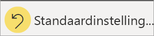

# Wijzigen hoe een diagram in een Power BI-rapport wordt gesorteerd
In een Power BI-rapport kunt u de meeste visualisaties alfabetisch sorteren op namen of categorieën in het diagram, of op de numerieke waarde van elke categorie. Dit diagram is op de categorie **winkelnaam** gesorteerd.

U kunt de sortering eenvoudig wijzigen van een categorie (winkelnaam) in een waarde (verkoop per vierkante meter).

1. Selecteer het beletselteken (...) en kies **Sorteren op > Sales Per Sq Ft**.
2. Selecteer zo nodig opnieuw het beletselteken en kies **Aflopend sorteren**.

   

> [!NOTE]
> Niet alle visuele elementen kunnen worden gesorteerd. De volgende visuals kunnen bijvoorbeeld niet worden gesorteerd: treemap, kaart, choropletenkaart, spreiding, meter, kaart, waterval.

## Wijzigingen opslaan die u aan de sorteervolgorde hebt aangebracht
Power BI-rapporten behouden de gemaakte wijzigingen in de filters, slicers, sorteervolgorde en gegevensweergave. Als u dus weg navigeert van een rapport en later terugkeert, worden uw wijzigingen opgeslagen.  Als u uw wijzigingen wilt terugzetten naar de instellingen van de maker van het rapport, selecteert u **Standaardinstelling herstellen** in de bovenste menubalk. 

Als de knop **Standaardinstelling herstellen** echter in het grijs wordt weergegeven, heeft de maker van het rapport de mogelijkheid om uw wijzigingen op te slaan (te behouden) uitgeschakeld.

## Sorteren op andere criteria
Af en toe wilt u het visuele element sorteren met behulp van een ander veld of andere criteria.  Stel dat u wilt sorteren op maand (en niet in alfabetische volgorde) of op gehele getallen in plaats van op cijfers (bijvoorbeeld op 0, 1, 9, 20 en niet op 0, 1, 20, 9).  

In sommige gevallen kunt u het visuele element sorteren zoals u dat zelf wilt, bijvoorbeeld op maand.  Als dat niet kan, dan moet u de achterliggende gegevensset enigszins aanpassen. Vraag de maker van het rapport de gegevensset bij te werken.

## Volgende stappen
Meer informatie over [visualisaties in Power BI-rapporten](end-user-visualizations.md) (Engelstalig).

[Power BI - basisconcepten](end-user-basic-concepts.md)
