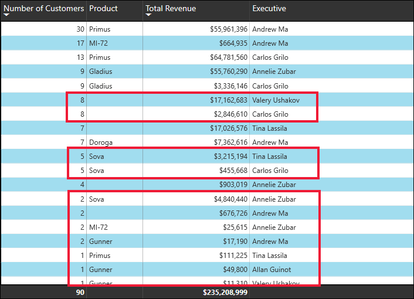

# Wijzigen hoe een diagram in een Power BI-rapport wordt gesorteerd

[!INCLUDE[consumer-appliesto-ynnn](../includes/consumer-appliesto-ynnn.md)]

> [!IMPORTANT]
> **Dit artikel is bedoeld voor Power BI-gebruikers die niet beschikken over bewerkingsmachtigingen voor het rapport of de gegevensset en die alleen werken in de online versie van Power BI (de Power BI-service). Als u een *ontwerper* van rapporten bent, of een *beheerder* of *eigenaar*, bevat dit artikel mogelijk niet alle informatie die u nodig hebt. Lees in dat geval [Op kolom sorteren in Power BI Desktop](../create-reports/desktop-sort-by-column.md)** .

U kunt in de Power BI-service de weergave van een visueel element wijzigen door deze op andere gegevensvelden te sorteren. Als u de sortering van een visual wijzigt, kunt u de informatie markeren die u wilt overbrengen. Of u nu numerieke gegevens (zoals verkoopcijfers) of tekstgegevens (zoals provincienamen) gebruikt, u kunt uw visualisaties sorteren zoals u wilt. Power BI biedt veel flexibiliteit voor sorteren en snelle menu's die u kunt gebruiken. 

Visuals op een dashboard kunnen niet worden gesorteerd. Maar in een Power BI-rapport kunt u de meeste visualisaties met één en soms twee velden tegelijk sorteren. Voor bepaalde typen visuals is sorteren niet beschikbaar: structuurkaarten, meters, kaarten, enzovoort. 

## Aan de slag

Open een rapport dat met u is gedeeld om aan de slag te gaan. Selecteer een visual (dat kan worden gesorteerd) en kies **Meer acties** (...).  Er zijn drie opties voor het sorteren: **Aflopend sorteren**, **Oplopend sorteren** en **Sorteren op**. 
    

### Alfabetisch of numeriek sorteren

U kunt u visuals alfabetisch sorteren op de tekstnamen van de categorieën in de visual, of op de numerieke waarden van elke categorie. Zo is dit diagram alfabetisch gesorteerd op de X-ascategorie **Winkelnaam**.

U kunt de sortering eenvoudig wijzigen van een categorie (winkelnaam) in een waarde (verkoop per vierkante meter). Selecteer **Meer acties** (...) en kies **Sorteren op**. Selecteer een numerieke waarde die wordt gebruikt in de visual.  In dit voorbeeld hebben we **Verkoop per vierkante meter** geselecteerd.

Wijzig, indien nodig, de sorteervolgorde van oplopend in aflopend.  Selecteer opnieuw **Meer acties** (...) en kies **Aflopend sorteren** of **Oplopend sorteren**. Het veld dat wordt gebruikt om te sorteren is vetgedrukt en bevat een gele balk.

   

> [!NOTE]
> Niet alle visuele elementen kunnen worden gesorteerd. De volgende visuals kunnen bijvoorbeeld niet worden gesorteerd: treemap, kaart, choropletenkaart, spreiding, meter, kaart, waterval.

## Op meerdere kolommen sorteren
De gegevens in deze tabel worden gesorteerd op **Aantal klanten**.  We weten dit dankzij de kleine pijl onder het woord *Nummer*. De pijl wijst omlaag, wat betekent dat de kolom wordt gesorteerd in *aflopende* volgorde.

Als u meer kolommen wilt toevoegen aan de sorteer volgorde, houdt u Shift ingedrukt en klikt u op de kolomkop die u wilt toevoegen als volgende in de sorteervolgorde. Als u bijvoorbeeld op **Aantal klanten** en vervolgens Shift indrukt en klikt op **Totale omzet**, wordt de tabel eerst gesorteerd op klanten en vervolgens op omzet. In het rode overzicht worden gebieden weergegeven waar de sorteervolgorde is gewijzigd.

Als u Shift indrukt en een tweede keer op dezelfde kolom klikt, wordt de sorteerrichting voor die kolom gewijzigd. Als u Shift indrukt en klikt u op een kolom die u eerder hebt toegevoegd aan de sorteervolgorde, wordt deze kolom ook verplaatst naar de achtergrond van de sorteervolgorde.

## Wijzigingen opslaan die u aan de sorteervolgorde hebt aangebracht
Power BI-rapporten behouden de gemaakte wijzigingen in de filters, slicers, sorteervolgorde en gegevensweergave, ook al werkt u in de [leesweergave](end-user-reading-view.md). Als u dus weg navigeert van een rapport en later terugkeert, zijn uw wijzigingen voor sorteren opgeslagen.  Als u uw wijzigingen wilt terugzetten naar de instellingen van de *ontwerper* van het rapport, selecteert u **Standaardinstelling herstellen** in de bovenste menubalk. 

Als de knop **Standaardinstelling herstellen** echter in het grijs wordt weergegeven, heeft de *ontwerper* van het rapport de mogelijkheid om uw wijzigingen op te slaan (te behouden) uitgeschakeld.

## Aandachtspunten en probleemoplossing

### Sorteren op andere criteria
Af en toe wilt u de visual sorteren met behulp van een ander veld (Dat niet in de visual is opgenomen) of andere criteria.  Stel dat u sequentieel wilt sorteren op maand (en niet in alfabetische volgorde) of op gehele getallen in plaats van op cijfers (bijvoorbeeld op 0, 1, 9, 20 en niet op 0, 1, 20, 9).  

Alleen de persoon die het rapport heeft ontworpen, kan deze wijzigingen voor u aanbrengen. Contactinformatie voor de *ontwerper* vindt u door de naam van het rapport te selecteren in de balk met de koptekst.

Als u een *ontwerper* bent en beschikt over bewerkingsmachtigingen voor de inhoud, leest u [Sorteren op kolom in Power BI Desktop](../create-reports/desktop-sort-by-column.md) voor meer informatie over het bijwerken van de gegevensset en het inschakelen van dit type sortering.

## Volgende stappen
Meer informatie over [visualisaties in Power BI-rapporten](end-user-visualizations.md) (Engelstalig).

[Power BI - basisconcepten](end-user-basic-concepts.md)
