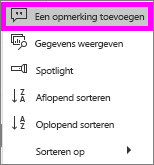
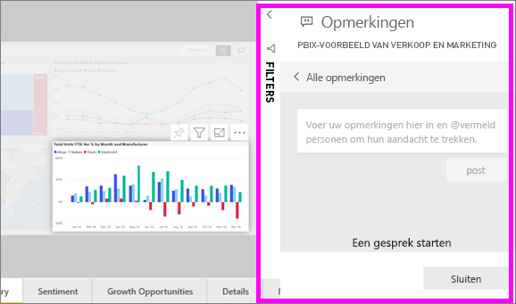
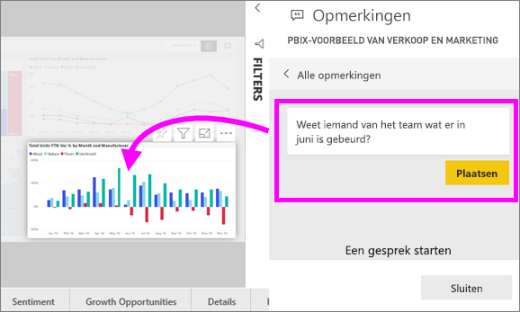
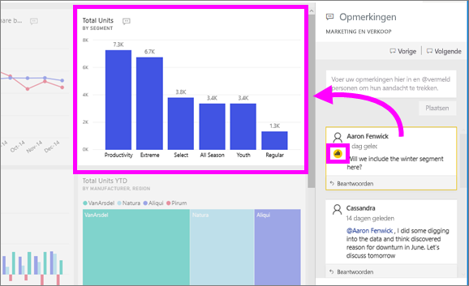

# Opmerkingen toevoegen aan een dashboard of rapport
Een persoonlijke opmerking toevoegen of start een discussie over een dashboard of rapport met uw collega's. De functie **Opmerkingen** is slechts een van de manieren waarop een *gebruiker* met anderen kan samenwerken. 

## De functie voor opmerkingen gebruiken
Opmerkingen kunnen worden toegevoegd aan een volledig dashboard, afzonderlijke visuele elementen in een dashboard, een rapportpagina en afzonderlijke visuele elementen op een rapportpagina. Voeg een algemene opmerking of een opmerking die is gericht op specifieke collega's.  

Wanneer u een opmerking aan een rapport toevoegt, wordt de huidige waarden van filter- en slicerstatus vastgelegd in Power BI. Dit betekent dat wanneer u selecteren of te reageren op een opmerking, de rapportpagina of rapportvisual kan worden gewijzigd om weer te geven u het filter en slicerselecties die actief zijn als de opmerking voor het eerst werd toegevoegd.  

Waarom is dit belangrijk? Stel dat een collega een filter op dat aan het licht komt een interessant inzicht die hij wil delen met het team toegepast. Zonder dat filter geselecteerd, de opmerking mogelijk niet zinvol zijn. 

### Een algemene opmerking aan een dashboard of rapport toevoegen
De processen voor het toevoegen van opmerkingen aan een dashboard of rapport zijn vergelijkbaar. In dit voorbeeld gebruiken we een dashboard. 

1. Open een Power BI-dashboard of rapport en selecteer de **opmerkingen** pictogram. Hiermee opent u het dialoogvenster Opmerkingen.

    

    Hier zien we dat de maker van het dashboard al een algemene opmerking heeft toegevoegd.  Iedereen met toegang tot dit dashboard ziet deze opmerking.

    

2. Als u wilt reageren, selecteert u **Antwoord**, typt u uw reactie en selecteert u **Post**.  

    

    Standaard stuurt Power BI uw reactie naar de collega die de opmerkingen-thread heeft gestart, in dit geval Aaron F. 

    

 3. Als u een opmerking toevoegen die geen deel uitmaakt van een bestaande thread wilt, kunt u uw opmerking invoeren in het bovenste tekstvak.

    

    De opmerkingen voor dit dashboard zien er nu als volgt uit.

    

### Een opmerking aan een specifiek dashboard of rapport visual toevoegen
Naast het toevoegen van opmerkingen aan een gehele dashboard of aan een volledige rapportpagina, kunt u opmerkingen toevoegen aan afzonderlijke dashboard-tegels en visuele elementen voor afzonderlijke rapporten. De processen zijn vergelijkbaar, en in dit voorbeeld gebruiken we een rapport.

1. Beweeg de muisaanwijzer over de visual en selecteer het beletselteken (...).    
2. Selecteer **Een opmerking toevoegen** in de vervolgkeuzelijst.

      

3.  De **opmerkingen** dialoogvenster wordt geopend en de andere visuele elementen op de pagina worden grijs weergegeven. Deze visual bevat nog geen opmerkingen. 

      

4. Typ de opmerking en selecteer **Post**.

      

    - In een rapport licht pagina, selecteert een opmerking die is gemaakt op een visueel element, dat visual (Zie hierboven).

    - Op een dashboard, het pictogram  Laat ons weten dat een opmerking is gebonden aan een specifieke visualisatie. Opmerkingen die betrekking hebben op het gehele dashboard beschikt niet over een speciaal pictogram. Selecteer het pictogram van de grafiek ziet u de gerelateerde visual op het dashboard.

        

5. Selecteer **Sluiten** om terug te gaan naar het dashboard of rapport.

### Vraag de aandacht van uw collega's met behulp van het @-teken
U maakt een dashboard, rapport, tegel of visual Opmerking selectiegrepen aandacht van uw collega's met behulp van de '\@"symbool.  Wanneer u typt de '\@'-symbool, Power BI opent een vervolgkeuzelijst kunt u zoeken naar en selecteer personen in uw organisatie. Elke geverifieerde naam met een \@ ervoor verschijnt in een blauw lettertype. 

Hier volgt een gesprek dat ik heb met de *ontwerper* van de visualisatie. Hij gebruikt het teken @ om er zeker van te zijn dat ik de opmerking zie. Ik weet zo dat deze opmerking voor mij is. Ik open dit app-dashboard in Power BI en selecteer **Opmerkingen** in de kop. Ons gesprek verschijnt in het deelvenster **Opmerkingen**.

  

## Volgende stappen
Terug naar [visualisaties voor gebruikers](end-user-visualizations.md)    
<!--[Select a visualization to open a report](end-user-open-report.md)-->
