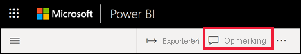
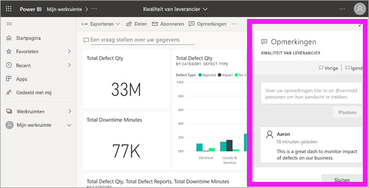
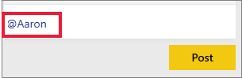
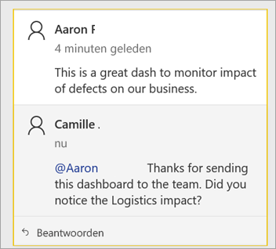
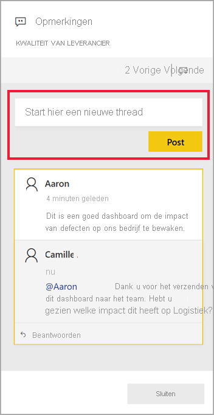
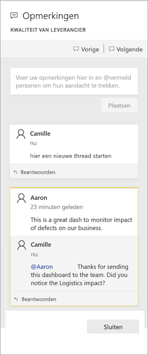
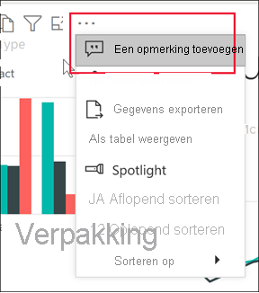
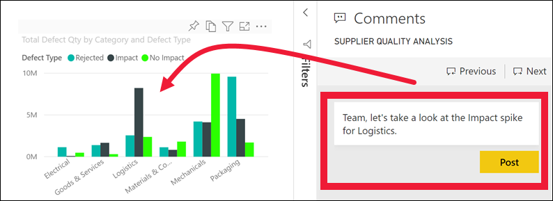
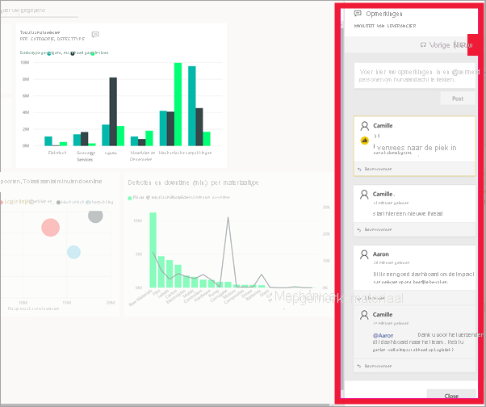
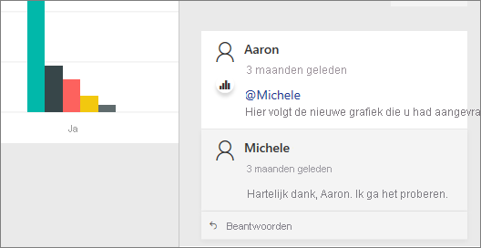

# Opmerkingen toevoegen aan een dashboard of rapport

[!INCLUDE[consumer-appliesto-ynny](../includes/consumer-appliesto-ynny.md)]

Voeg een persoonlijke opmerking toe of start een gesprek over een dashboard of rapport met uw collega's. De functie **Opmerkingen** is slechts een van de manieren waarop een *zakelijke gebruiker* met anderen kan samenwerken. 

> [!NOTE]
> Voor samenwerking met anderen, met inbegrip van opmerkingen toevoegen aan gedeelde rapporten, is een Power BI Pro-licentie vereist of moet de inhoud zijn gehost in een Power BI Premium-capaciteit. [Welk licentietype heb ik?](end-user-license.md)

## De functie voor opmerkingen gebruiken
Opmerkingen kunnen worden toegevoegd aan het hele dashboard, aan afzonderlijke visuals op een dashboard, aan een rapportpagina, aan een gepagineerd rapport en aan afzonderlijke visuals op een rapportpagina. Voeg een algemene opmerking toe of een opmerking gericht aan specifieke collega's.  

Wanneer u een opmerking aan een rapport toevoegt, worden de huidige filter- en slicerwaarden door Power BI vastgelegd en wordt een [bladwijzer](end-user-bookmarks.md) gemaakt. Dit betekent dat wanneer u een opmerking selecteert of beantwoordt, de rapportpagina of -visual kan worden gewijzigd, zodat u de filter- en slicerselecties ziet die actief waren toen de opmerking werd toegevoegd.  

Waarom is dit belangrijk? Stel dat een collega een filter heeft toegepast waarmee interessante inzichten zijn onthuld die hij of zij wil delen met het team. Zonder dat het filter is geselecteerd, is de opmerking mogelijk niet zinvol.

Als u een gepagineerd rapport gebruikt, mag u alleen een algemene opmerking over uw rapport maken.  Er is geen ondersteuning beschikbaar voor het maken van opmerkingen over afzonderlijke visuals van gepagineerde rapporten.

### Een algemene opmerking toevoegen aan een dashboard of rapport
Het proces van het toevoegen van opmerkingen aan een dashboard of rapport is vergelijkbaar.  In dit voorbeeld gebruiken we een dashboard. 

1. Open een Power BI-dashboard of -rapport en selecteer het pictogram **Opmerking**. Hiermee opent u het dialoogvenster Opmerkingen.

    

    Hier zien we dat de maker van het dashboard al een algemene opmerking heeft toegevoegd.  Iedereen met toegang tot dit dashboard ziet deze opmerking.

    

2. Als u wilt reageren, selecteert u **Antwoord**, typt u uw reactie en selecteert u **Post**.  

    

    Standaard stuurt Power BI uw reactie naar de collega die de opmerkingen-thread heeft gestart, in dit geval Aaron. 

    

 3. Als u een opmerking wilt toevoegen die geen deel uitmaakt van een bestaande thread, voert u uw opmerking in het bovenste tekstveld in.

    

    De opmerkingen voor dit dashboard zien er nu als volgt uit.

    

### Een opmerking toevoegen aan een specifieke dashboard- of rapportvisual
Naast het toevoegen van opmerkingen aan het gehele dashboard of aan een gehele rapportpagina, kunt u opmerkingen toevoegen aan afzonderlijke dashboardtegels en afzonderlijke rapportvisuals. De processen zijn vergelijkbaar en in dit voorbeeld gebruiken we een rapport.

1. Beweeg de muisaanwijzer over de visual en selecteer **Meer acties** (...).    
2. Selecteer **Een opmerking toevoegen** in de vervolgkeuzelijst.

      

3.  Het dialoogvenster **Opmerkingen** wordt geopend en de andere visuals op de pagina worden grijs weergegeven. Deze visual bevat nog geen opmerkingen. 

      

4. Typ de opmerking en selecteer **Post**.

      

    - Als op een rapportpagina een opmerking wordt geselecteerd die voor een visual is gemaakt, wordt die visual gemarkeerd (zie hieronder).

    - Het diagrampictogram op een dashboard  laat ons weten dat een opmerking is gekoppeld aan een specifieke visual. Opmerkingen die van toepassing zijn op het gehele dashboard, hebben geen speciaal pictogram. Als u het diagrampictogram selecteert, wordt de gerelateerde visual op het dashboard gemarkeerd.
    

    

5. Selecteer **Sluiten** om terug te gaan naar het dashboard of rapport.

### Vraag de aandacht van uw collega's met behulp van het @-teken
Of u nu een dashboard-, rapport-, tegel- of visualopmerking maakt, u trekt de aandacht van uw collega's met het \@-teken.  Wanneer u het \@-symbool typt, opent Power BI een vervolgkeuzelijst waarin u personen van uw organisatie kunt zoeken en selecteren. Elke geverifieerde naam met een \@ ervoor verschijnt in een blauw lettertype. De @mentioned personen ontvangen onmiddellijk een e-mail in hun Postvak IN en als ze een Power BI Mobiel-app gebruiken, ontvangen ze een pushmelding op hun apparaat. Zij kunnen het rapport of het dashboard rechtstreeks vanuit de melding openen, de opmerking bekijken, de gegevens bekijken en dienovereenkomstig antwoorden.

Hier volgt een gesprek dat ik heb met de *ontwerper* van de visualisatie. Ze gebruiken het teken @ om er zeker van te zijn dat ik de opmerking zie. Ik ontvang een melding en selecteer de koppeling om dit dashboard en het betreffende gesprek te openen.  

  

## Aandachtspunten en probleemoplossing

- Bladwijzers worden niet vastgelegd als u op een gesprek reageert. Alleen met de eerste opmerking in een gesprek wordt een bladwijzer gemaakt.
- Als u een gepagineerd rapport gebruikt, mag u alleen een algemene opmerking over uw rapport maken.  Er is geen ondersteuning beschikbaar voor het maken van opmerkingen over afzonderlijke visuals van gepagineerde rapporten.

## Volgende stappen
Terug naar [visualisaties voor zakelijke gebruikers](end-user-visualizations.md)    
[Een visualisatie selecteren om een rapport te openen](end-user-report-open.md)
