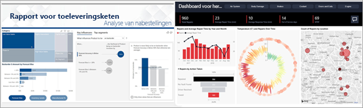
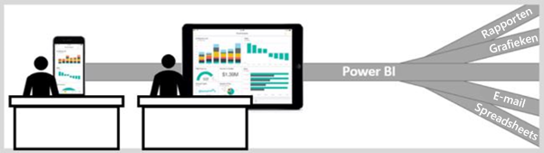

# De Power BI-service voor zakelijke gebruikers

[!INCLUDE[consumer-appliesto-ynny](../includes/consumer-appliesto-ynny.md)]

Alles draait tegenwoordig om gegevens en zakelijke beslissingen worden niet meer op meningen, maar op feiten gebaseerd. Om deze beslissingen te kunnen nemen, hebt u gegevens nodig. Gelukkig wordt u niet door uw collega's in de steek gelaten.     
 
Ze sturen u allerlei soorten rapporten, spreadsheets, e-mailberichten met grafieken en zelfs afgedrukte hand-outs. Naarmate de hoeveelheid gegevens toeneemt, zal het steeds moeilijker worden om snel de informatie te vinden die u nodig hebt, en u bent bang dat u wellicht niet over de meest recente informatie beschikt.  
 

## De Power BI-service voor *zakelijke gebruikers*

Met Power BI wordt uw werk niet alleen eenvoudiger, maar kunt u ook meteen meer indruk achterlaten. Al die gegevens worden omgezet in diagrammen en grafieken, waarmee uw gegevens worden gevisualiseerd. In plaats van lange lijsten of tabellen met nummers en woorden, zien uw gegevensinzichten er ***prachtig** _ uit: kleurrijke en aantrekkelijke visuals waarmee verhalen over de inzichten in uw gegevens worden verteld. 

 
Open gewoon de Power BI-service in een browser of op een mobiel apparaat. U en uw collega's werken vanaf dezelfde vertrouwde dashboards en rapporten die bovendien automatisch worden bijgewerkt en vernieuwd. U werkt dus altijd met de meest actuele inhoud.   

Omdat de inhoud niet statisch is, kunt u hier induiken om trends, inzichten en andere business intelligence te zoeken. Deel de inhoud op in fragmenten en segmenten en stel zelfs vragen in uw eigen bewoording. Of doe het rustig aan en laat uw gegevens zelf interessante inzichten voor u vinden; ontvang meldingen wanneer gegevens worden gewijzigd en krijg e-mailrapporten volgens een door u ingestelde planning. Al uw gegevens via de cloud of on-premises binnen handbereik vanaf elk apparaat, wanneer u maar wilt. En dat is nog maar het begin van wat er allemaal met Power BI mogelijk is. 

## Ben ik een _zakelijke gebruiker* van Power BI?

De manier waarop u met Power BI werkt, is afhankelijk van uw functie. Als eindgebruiker of *zakelijke gebruikers* bent u iemand die inhoud (dashboards, rapporten en apps) van collega's ontvangt. U werkt in de onlineversie of de mobiele versie van Power BI (de Power BI-service genoemd) om deze inhoud te controleren en te gebruiken en uiteindelijk uw zakelijke beslissingen te nemen. 
   
Als zakelijke gebruiker hebt u geen toegang tot de volledige functionaliteit van Power BI. En dat is prima, omdat het niet uw taak is om dashboards en rapporten te bouwen. U gebruikt de Power BI-service voor analyses, bewaking, verkennen en besluitvorming. 

U hebt ongetwijfeld de term 'Power BI Desktop' of gewoon 'Desktop' gehoord. Dat is een zelfstandig hulpprogramma dat wordt gebruikt door de *ontwerpers* die dashboards en rapporten maken en met u delen.  Het is belangrijk te weten dat er nog meer Power BI-hulpprogramma's zijn. Als u een *zakelijke gebruiker* bent, werkt u echter alleen met de Power BI-service. 

En omdat u werkt met *gedeelde* inhoud, moet aan een van de volgende voorwaarden worden voldaan:
- U hebt een Power BI Pro-licentie
- Uw organisatie heeft een Power BI Premium-abonnement en de inhoud die u wilt delen, bevindt zich in een Premium-capaciteit 

Zie [Welke licentie heb ik?](end-user-license.md) voor meer informatie over licenties en abonnementen.

## Veilig omgaan met inhoud 
Wees gerust als u filtert, segmenteert, u abonneert en exporteert: uw werk is niet van invloed op de onderliggende gegevensset of de oorspronkelijke gedeelde inhoud (dashboards, rapporten en apps).  

U kunt uw gegevens niet schaden.  Power BI is een fantastische plek om te verkennen en experimenteren zonder dat u zich zorgen hoeft te maken dat u iets vernielt.  
 
Dat betekent niet dat u uw wijzigingen niet kunt opslaan: dat kunt u wel. Maar deze wijzigingen zijn alleen van invloed op uw weergave van de inhoud. En om terug te keren naar de oorspronkelijke standaardweergave is eenvoudig: u hoeft slecht te klikken op een knop.  

## Volgende stappen

[Volg een rondleiding door de Power BI-service voor zakelijke gebruikers](end-user-reading-view.md)    
[Training voor Power BI-service voor zakelijke gebruikers](/learn/paths/consume-data-with-power-bi/)    
[Terminologie en concepten voor *zakelijke gebruikers* van Power BI](end-user-basic-concepts.md)