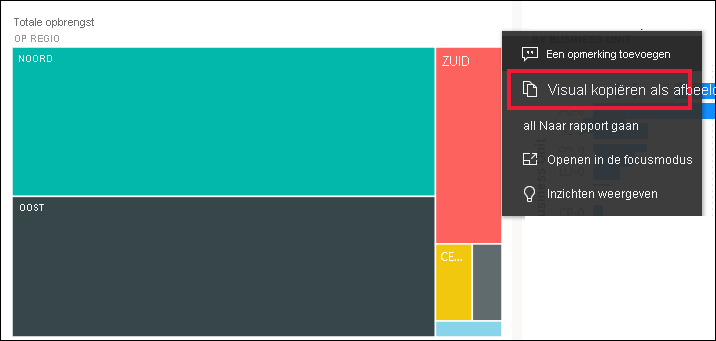
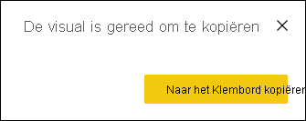
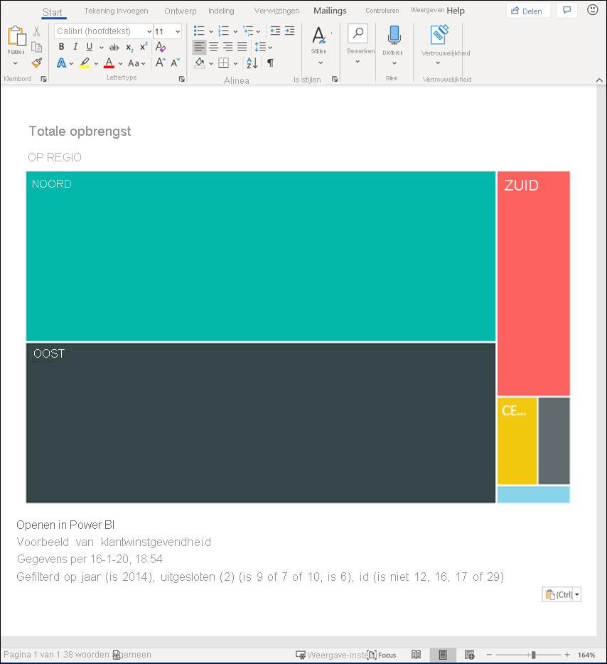
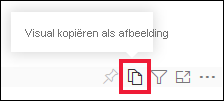
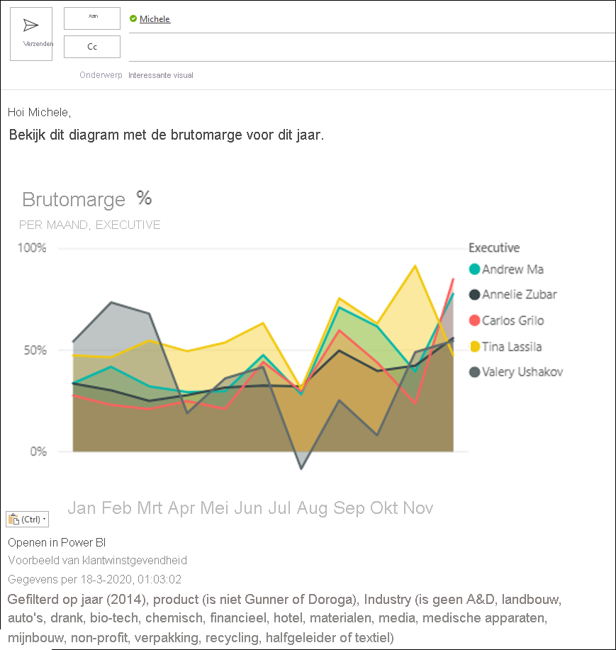
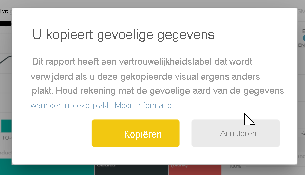
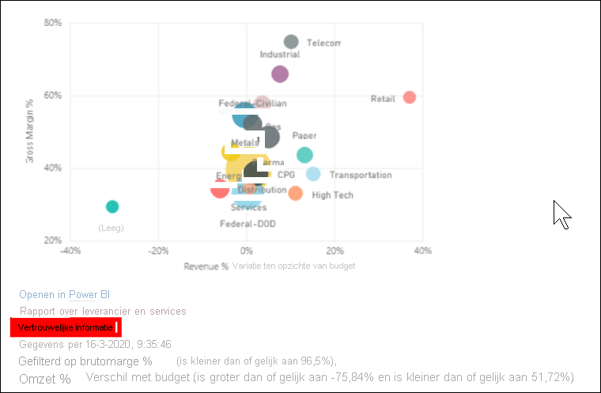
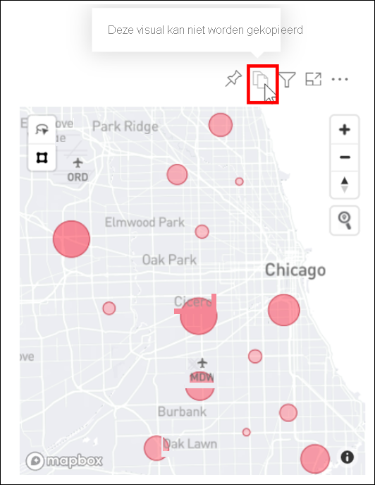

# Een visual als afbeelding naar uw klembord kopiëren

[!INCLUDE[consumer-appliesto-yyyn](../includes/consumer-appliesto-yyyn.md)]

Hebt u ooit een afbeelding uit een Power BI-rapport of dashboard willen delen? Nu kunt u de visual kopiëren en plakken in een willekeurige andere toepassing die plakken ondersteunt. 

Wanneer u een statische afbeelding van een visual kopieert, krijgt u een kopie van de visual, voorzien van de metagegevens. Dit omvat:
* terugkoppeling naar het Power BI-rapport of dashboard
* titel van het rapport of dashboard
* kennisgeving of de afbeelding vertrouwelijke informatie bevat
* tijdstempel van moment waarop het laatst is bijgewerkt
* filters die op de visual zijn toegepast

### Kopiëren vanaf een dashboardtegel

1. Navigeer naar het dashboard vanaf waar u inhoud wilt kopiëren.

2. In de rechterbovenhoek van de visual selecteert u **Meer acties(...)** en kiest u **Visual als afbeelding kopiëren**. 

    

3. Wanneer het dialoogvenster **De visual is gereed om te kopiëren** wordt weergegeven, selecteert u **Naar het klembord kopiëren**.

    

4. Nadat uw visual gekopieerd is, plakt u deze in een andere toepassing met **Ctrl + V** of door met de rechtermuisknop op Plakken te klikken. In de onderstaande schermopname is de visual in Microsoft Word geplakt. 

    

### Kopiëren vanuit een rapportvisual 

1. Navigeer naar het rapport van waaruit u inhoud wilt kopiëren.

2. In de rechterbovenhoek van de visual selecteert u het pictogram voor **Visual als afbeelding kopiëren**. 

    

3. Wanneer het dialoogvenster **De visual is gereed om te kopiëren** wordt weergegeven, selecteert u **Naar het klembord kopiëren**.

    

4. Nadat uw visual gekopieerd is, plakt u deze in een andere toepassing met **Ctrl + V** of door met de rechtermuisknop op Plakken te klikken. In de onderstaande schermopname is de visual in een e-mailbericht geplakt.

    

5. Als er een label over gevoeligheid van gegevens is toegepast op het rapport, wordt een waarschuwing weergegeven wanneer u het kopieerpictogram selecteert.  

    

    Bovendien wordt een gevoeligheidslabel toegevoegd aan de metagegevens onder de geplakte visual. 

    

## Aandachtspunten en probleemoplossing

   

V: Waarom is het kopieerpictogram uitgeschakeld bij een visual?    
A: Momenteel worden systeemeigen Power BI-visuals en gecertificeerde aangepaste visuals ondersteund. Er is beperkte ondersteuning voor bepaalde visuals, inclusief: 
- ESRI en andere kaartvisuals 
- Python-visuals 
- R-visuals 
- PowerApps    

A: De mogelijkheid om een visual te kopiëren kan worden uitgeschakeld door uw IT-afdeling of Power BI-beheerder.

V: Waarom wordt mijn visual niet goed geplakt?    
A: Er gelden beperkingen voor aangepaste visuals en visuals met animatie. 

## Volgende stappen
Meer informatie over [visualisaties in Power BI-rapporten](end-user-visual-type.md)

Hebt u nog vragen? [Misschien dat de Power BI-community het antwoord weet](https://community.powerbi.com/)

