# Zoommodus voor een visualisatie in Power BI

In dit artikel wordt beschreven hoe u kunt inzoomen op een visualisatie in Microsoft Power BI-service en Power BI Desktop. Power BI-rapporten kunnen meerdere hiërarchieën aan gegevens bevatten die u maximaal inzicht bieden in uw gegevens. Door uw gegevenspunten in en uit te zoomen kunt u diepgaande details over uw gegevens verkennen. U kunt hier zelfs uw voordeel mee doen op de kleine formulieren op uw mobiele apparaten.

## Voor zoomen is een hiërarchie vereist

Wanneer een visualisatie een hiërarchie heeft, kunt u inzoomen om extra details te onthullen. U kunt bijvoorbeeld een visualisatie hebben die kijkt naar het aantal Olympische medailles door een hiërarchie bestaande uit sport, discipline en gebeurtenis. Standaard zou de visualisatie het aantal medailles weergeven per sport (gymnastiek, skiën, watersport, enzovoort). Maar omdat deze een hiërarchie bevat, zou het selecteren van één van de visualisatie-elementen (zoals een balk, lijn of bel) een steeds gedetailleerder beeld weergeven. Selecteer het element **Watersport** om de gegevens voor zwemmen, duiken en waterpolo te bekijken.  Selecteer het element **Duiken** om de details voor duikplank, platform en gesynchroniseerde duikgebeurtenissen te bekijken.

U kunt hiërarchieën toevoegen aan rapporten waarvan u de eigenaar bent, maar niet aan rapporten die met u worden gedeeld.
Weet u niet zeker welke Power BI-visualisaties een hiërarchie bevatten? Beweeg de muisaanwijzer over een visualisatie. Als u deze besturingselementen voor zoomen ziet in de bovenhoeken, heeft de visualisatie een hiërarchie.

    
   

Datums zijn een uniek type hiërarchie. Wanneer u een datumveld aan een visualisatie toevoegt, voegt Power BI automatisch een tijdshiërarchie met jaar, kwartaal, maand en dag. Zie [Gedrag van visuele hiërarchieën en inzoomen](../guided-learning/visualizations.yml?tutorial-step=18) of bekijk de onderstaande video voor meer informatie.

<iframe width="560" height="315" src="https://www.youtube.com/embed/MNAaHw4PxzE?list=PL1N57mwBHtN0JFoKSR0n-tBkUJHeMP2cP" frameborder="0" allowfullscreen></iframe>

> [!NOTE]
> Bekijk de video [Hiërarchieën maken en toevoegen](https://youtu.be/q8WDUAiTGeU) voor meer informatie over het maken van hiërarchieën met Power BI Desktop.

## Vereisten

1. Voor zoomen in de Power BI-service of in Power BI Desktop is een visualisatie met een hiërarchie vereist.

1. Als u deze wilt volgen, opent u [Voorbeeld van een retailanalyse](../sample-datasets.md). Een **treemap**-visualisatie maken die er als volgt uitziet:

    | Bron | Veld |
    | ---- | ----- |
    | Waarde |Verkoop \|\_ Totaal aantal eenheden dit jaar |
    | Groep | Winkel \|\_ Gebied \|\_ Plaats \|\_ Postcode \|\_ Naam

    De treemap heeft een hiërarchie die bestaat uit gebied, plaats, postcode en plaatsnaam. Elk gebied heeft één of meer plaatsen, elke plaats heeft één of meer postcodes, enzovoort. Standaard geeft de visualisatie alleen de gebiedsgegevens weer, omdat *Gebied* als eerste voorkomt in de lijst.

    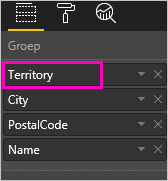

1. Meer informatie over hoe verwarrend het kan zijn als de verschillende zoompictogrammen samenwerken. We gaan de treemap filteren zodat slechts twee kleinere gebieden worden weergegeven: **KY** en **TN**. Selecteer de treemap en vouw onder  **Filters op niveau van visuele elementen** de optie **Territorium** uit. Selecteer vervolgens **KY** en **TN**.

    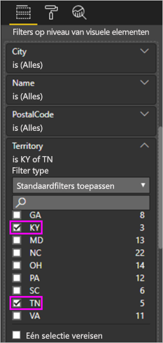

    Nu worden alleen deze twee territoria in de treemap weergegeven.

    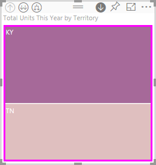

## Drie manieren om de zoomfuncties te gebruiken

U hebt verschillende opties voor toegang tot functies voor inzoomen, uitzoomen en uitvouwen voor visualisaties met hiërarchieën. In dit artikel leest u hoe de eerste optie hieronder kunt gebruiken. Zodra u de basisprincipes van inzoomen en uitvouwen onder de knie hebt, weet u hoe u alle drie de opties moet gebruiken. U kunt met alle drie dezelfde dingen doen. Probeer ze uit en kies de optie die het beste bij u past.

- Beweeg de muisaanwijzer over een visualisatie om de pictogrammen te zien en te gebruiken.  

    

- Klik met de rechtermuisknop op een visualisatie om het menu weer te geven en te gebruiken.

    

- Vanaf de Power BI-menubalk selecteert u de knop **Verkennen**.

   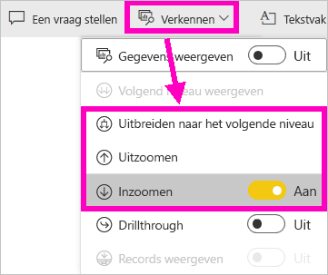

## Paden voor inzoomen

### Inzoomen

U hebt verschillende manieren om op uw visualisatie in te zoomen. Met **Inzoomen** gaat u naar het volgende niveau in de hiërarchie. Als u naar het niveau **Gebied** kijkt, kunt u inzoomen op plaatsniveau, vervolgens op postcodeniveau en tenslotte op naamniveau. Elke stap in het pad toont u nieuwe informatie.

### Uitvouwen

Met **Uitvouwen** voegt u een extra hiërarchieniveau toe aan de huidige weergave. Dus als u naar het niveau **Gebied** kijkt, kunt u dit uitvouwen en informatie over plaats, postcode en naam toevoegen de treemap. Elke stap in het pad toont u dezelfde informatie en voegt één niveau aan nieuwe informatie toe.

U kunt ook kiezen of u wilt inzoomen of uitvouwen op één veld per keer of op alle velden tegelijk.

## Inzoomen op alle velden tegelijk

1. Begin op het hoogste niveau van de treemap, waarin gegevens voor KY en TN worden weergegeven. Verbreed uw treemap door een van de grepen te selecteren en sleep deze greep naar rechts.

    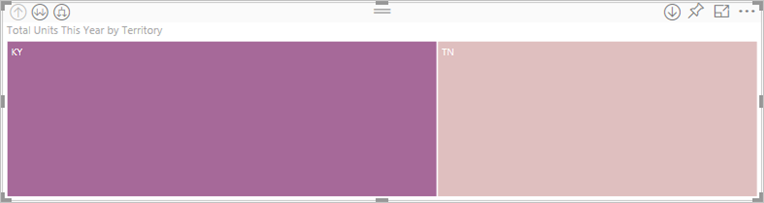

1. Als u op *alle velden tegelijk* wilt inzoomen, selecteert u de dubbele pijl in de linkerbovenhoek van de visualisatie . Uw treemap toont nu stadsgegevens voor Kentucky en Tennessee.

    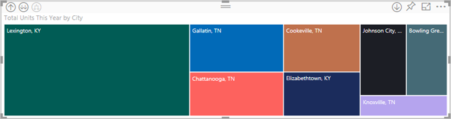

1. Zoom nog één keer in op het postcodeniveau van de hiërarchie.

    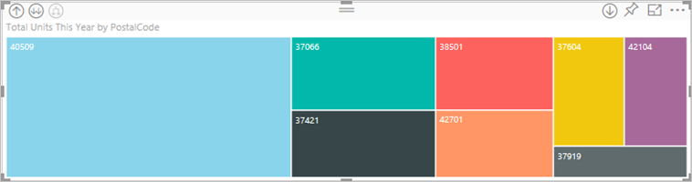

1. Als u weer wilt uitzoomen, selecteert u de pijl omhoog in de linkerbovenhoek van de visualisatie .

## Inzoomen op één veld tegelijk

Deze methode maakt gebruik van het inzoompictogram dat in de rechterbovenhoek van de visualisatie zelf verschijnt.

1. Selecteer het inzoompictogram om dit in te schakelen .

    Nu hebt u de optie om op **één veld tegelijk** in te zoomen.

    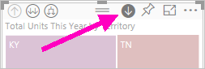

    Als u inzoomen niet inschakelt, kunt u een visualisatie-element (zoals een balk, bel of bladknooppunt) niet inzoomen als u het selecteert. In plaats hiervan worden de andere grafieken op de rapportpagina kruislings gefilterd.

1. Selecteer het bladknooppunt voor **TN**. In de treemap worden nu alle steden in Tennessee weergegeven waarin een winkel is gevestigd.

    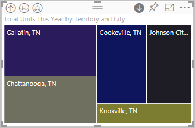

1. Vanaf dit punt kunt u:

    1. Verder inzoomen in Tennessee.

    1. Inzoomen in een bepaalde stad in Tennessee.

    1. In plaats hiervan uitvouwen (zie **Alle velden tegelijk uitvouwen** hieronder).

    We blijven voor dit moment inzoomen op één veld tegelijk.  Selecteer **Knoxville, TN**. In de treemap wordt nu de postcode voor uw winkel in Knoxville weergegeven.

    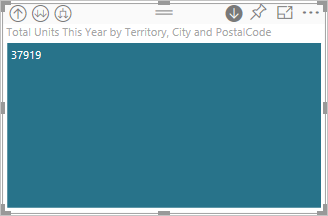

    U ziet dat de titel wordt gewijzigd tijdens het in- en uitzoomen.

## Alle velden tegelijk en één veld tegelijk uitvouwen

Het gebruik van een treemap die alleen een postcode laat zien, is niet informatief.  Laten we dus één niveau in de hiërarchie omlaag uitvouwen.  

1. Selecteer met de treemap actief het pictogram *omlaag uitvouwen* . In de treemap worden nu twee niveaus van de hiërarchie weergegeven: postcode en winkelnaam.

    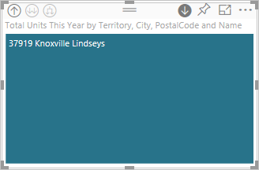

1. Als u alle vier hiërarchieniveaus met gegevens voor Tennessee wilt zien, selecteert u de pijl voor uitzoomen totdat u het tweede niveau van de treemap bereikt, **Totaal aantal eenheden dit jaar per gebied en plaats**.

    

1. Zorg ervoor dat inzoomen nog steeds is ingeschakeld  en selecteer het pictogram *omlaag uitvouwen* . In de treemap worden nu extra details weergegeven. In plaats van alleen plaats en staat wordt nu ook de postcode weergegeven.

    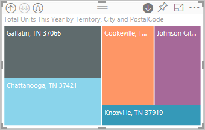

1. Selecteer het pictogram voor *omlaag uitvouwen* nog één keer om alle vier hiërarchieniveaus met details voor Tennessee in de treemap weer te geven. Beweeg de muisaanwijzer over een bladknooppunt voor nog meer informatie.

    

## Analysefilters voor andere visuals

As u in de zoommodus werkt, kunt u bepalen hoe inzoomen en uitvouwen invloed heeft op de andere visualisaties op de pagina.

Standaard wordt met zoomen niet op andere visuals in een rapport gefilterd. U kunt deze functie inschakelen in Power BI Desktop en in de Power BI-service.

1. In Desktop selecteert u het tabblad **Indeling** en schakelt u het selectievakje voor **Analysefilters voor andere visuals** in.

    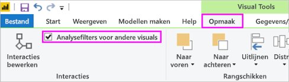

1. Wanneer u nu wilt inzoomen, uitzoomen of uitvouwen in een visualisatie met een hiërarchie, activeert u hiermee filters voor de andere visuals op de pagina.

    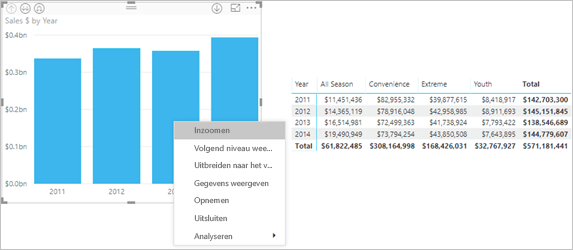

    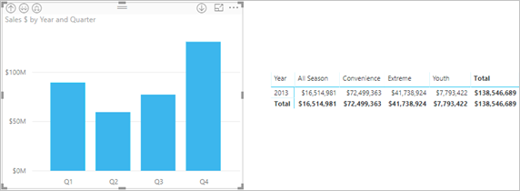

> [!NOTE]
> Als u dit wilt inschakelen in de Power BI-service, selecteert u **Interacties met visuals > Analysefilters voor andere visuals** >  **in de bovenste menubalk**.
>
> 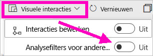

## Meer informatie over de hiërarchie-as en hiërarchiegroep

De hiërarchie-as en de hiërarchiegroep kunt u zien als mechanismen voor het verhogen en verlagen van de granulatie van de gegevens die u wilt weergeven. Alle gegevens die kunnen worden georganiseerd in categorieën en subcategorieën, worden gezien als gegevens met een hiërarchie, waaronder datums en tijden.

U kunt in Power BI aangeven dat een visualisatie over een hiërarchie moet beschikken door een of meer gegevensvelden te selecteren om toe te voegen aan de bron **As** of aan de bron **Groep**. Voeg vervolgens de gegevens die u wilt onderzoeken, toe als gegevensvelden in de bron **Waarden**. Gegevens zijn hiërarchisch als in de hoeken links- en rechtsboven van uw visualisatie de pictogrammen voor de *inzoommodus* worden weergegeven.

Er zijn in feite twee typen hiërarchische gegevens:

- Datum- en tijdgegevens: Als u een gegevensveld met gegevenstype Datum/tijd hebt, hebt u al hiërarchische gegevens. In Power BI wordt automatisch een hiërarchie gemaakt voor een gegevensveld. U kunt de waarden parseren in een structuur [Datum/tijd](https://msdn.microsoft.com/library/system.datetime.aspx). U hoeft hiervoor alleen een datum-/tijdveld aan de bron **As** of **Groep** toe te voegen.

- Categorische gegevens: als uw gegevens in Power BI zijn afgeleid van verzamelingen die subverzamelingen bevatten, of op een andere manier rijen met gegevens bevatten die gemeenschappelijke waarden delen, hebt u hiërarchische gegevens.

In Power BI kunt u de gegevens uitvouwen op basis van een of alle subsets. U kunt inzoomen op uw gegevens om op elk niveau één subset weer te geven, of u kunt inzoomen om op elk niveau alle subsets tegelijkertijd weer te geven. U kunt bijvoorbeeld inzoomen op een bepaald jaar of alle resultaten voor elk jaar weergeven wanneer u inzoomt op de hiërarchie.

Op dezelfde manier kunt u ook uitzoomen.

In de volgende secties wordt beschreven hoe u kunt inzoomen vanuit de weergave op het hoogste niveau, de weergave op het middelste niveau en de weergave op het laagste niveau.

### Hiërarchische gegevens en tijdsgegevens

Voor dit voorbeeld:

1. Ga verder met het [voorbeeld van een retailanayse](../sample-datasets.md) en maak een visualisatie van een gestapeld kolomdiagram waarmee wordt gekeken naar:

    | Bron | Veld |
    | ---- | ----- |
    | As | Tijd \|\_ Maand |
    | Waarden | Verkoop \|\_ TotalSales |

    Hoewel **Maand** het gegevensveld voor de as is, wordt ook de categorie **Jaar** in de bron **As** gemaakt. Dit komt doordat Power BI de volledige structuur Datum-/tijd biedt voor alle waarden die worden gelezen. Boven in de hiërarchie worden gegevens voor het jaar weergegeven.

    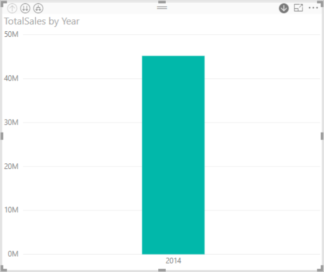

1. Selecteer in de inzoommodus de balk in het diagram om één niveau omlaag te gaan in de hiërarchie. U ziet drie balken voor de gegevens van de beschikbare kwartalen.

1. Kies in de pictogrammen in de linkerbovenhoek **Alles één niveau in de hiërarchie omlaag uitvouwen**.

1. Voer deze actie nog één keer uit om naar het laagste niveau van de hiërarchie te gaan, waarin de resultaten voor elke maand worden weergegeven.

    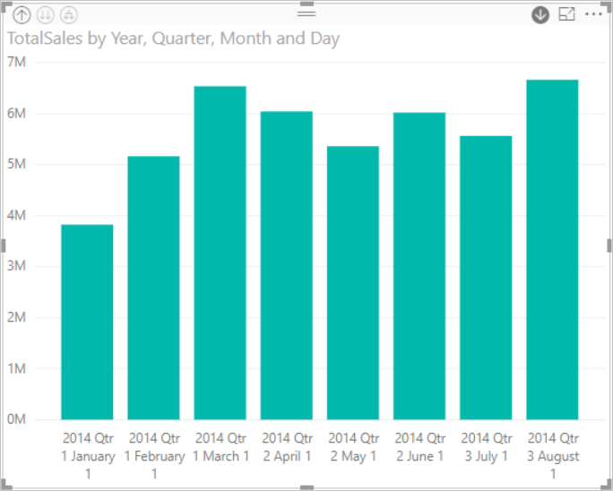

Naast de visualisatie ziet u de hiërarchie in de gegevens die voor elk rapport worden weergegeven. Selecteer in de rechterbovenhoek het beletselteken en selecteer vervolgens **Gegevens weergeven**. In de volgende tabel worden de resultaten weergegeven van inzoomen op één maand of op alle maanden:

|Modus voor uitgevouwen gegevens|Jaar|Kwartaal|Maand|Dag|
| --- |:---:|:---:|:---:|---|
|Enkel|||||
|Alles|||||

U ziet dat de gegevens in de rapporten **Kwartaal** en **Jaar** identiek zijn. Wanneer u inzoomt op het detailniveau dat voor **Waarden** is opgegeven, ziet u dat het rapport voor één maand specifieker is, en dat het rapport voor alle maanden meer gegevens bevat.

### Hiërarchische categoriegegevens

Gegevens die zijn gemodelleerd op basis van verzamelingen en subverzamelingen, noemen we hiërarchische gegevens.

Een goed voorbeeld zijn locatiegegevens. Stel dat u een tabel hebt in een gegevensbron met de kolommen Land, Provincie, Plaats en Postcode. Gegevens die hetzelfde land, dezelfde provincie en dezelfde plaats delen, zijn hiërarchische gegevens.

Voor dit voorbeeld:

1. Ga verder met het [voorbeeld van een retailanalyse](../sample-datasets.md). Maak een visualisatie van een gestapeld kolomdiagram waarmee wordt gekeken naar:

    | Bron | Veld |
    | ---- | ----- |
    | Waarde |Verkoop \|\_ Totaal aantal eenheden dit jaar |
    | As | Winkel \|\_ Gebied \|\_ Plaats - mogelijk moet u Plaats uit de bron **Legenda** naar de bron **As** slepen. \|\_ Postcode \|\_ Naam |

    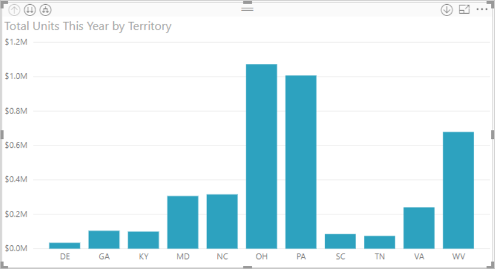

1. Kies in de linkerbovenhoek van de inzoommodus drie keer het pictogram **Alles één niveau in de hiërarchie omlaag uitvouwen**.

    U bevindt u op het laagste niveau van de hiërarchie, waarin de resultaten voor Gebied, Plaats en Postcode worden weergegeven.

    

Naast de visualisatie ziet u de hiërarchie in de gegevens die voor elk rapport worden weergegeven. Selecteer in de rechterbovenhoek het beletselteken en selecteer vervolgens **Gegevens weergeven**. In de volgende tabel worden de resultaten weergegeven van inzoomen op één gebied of op alle gebieden.

| Modus voor uitgevouwen gegevens|Gebied|Plaats|Postcode|Naam|
| ---|:---:|:---:|:---:|---|
|Enkel|||||
|Alles|||||

 Tijdens het inzoomen ziet u hoe het rapport voor **één** gebied minder en specifiekere gegevens bevat en het rapport voor **alle** gebieden meer gegevens bevat.

## Overwegingen en beperkingen

Als door het toevoegen van een datumveld aan een visualisatie geen hiërarchie wordt gemaakt, kan het zijn dat het datumveld niet daadwerkelijk als datum is opgeslagen. Als u eigenaar bent van de gegevensset:

1. Open deze in de weergave *Gegevens* in Power BI Desktop.

1. Selecteer de kolom die de datum bevat.

1. Wijzig op het tabblad **Modellering** het **Gegevenstype** in **Datum** of **Datum/tijd**.

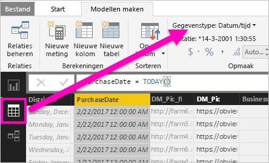

Als het rapport met u is gedeeld, neem dan contact op met de eigenaar om de wijziging aan te vragen.

## Volgende stappen

[Visualisaties in Power BI-rapporten](../visuals/power-bi-report-visualizations.md)

[Power BI-rapporten](end-user-reports.md)

[Power BI - basisconcepten](end-user-basic-concepts.md)

Hebt u nog vragen? [Misschien dat de Power BI-community het antwoord weet](http://community.powerbi.com/)
