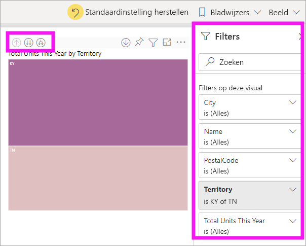
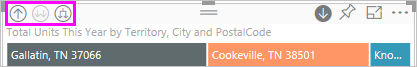
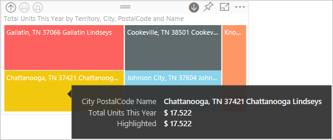
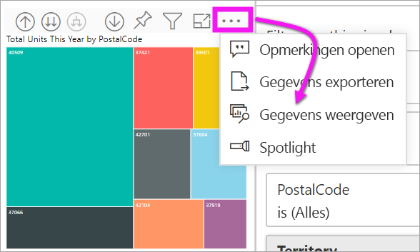

# Zoommodus voor een visual in Power BI

[!INCLUDE[consumer-appliesto-yyny](../includes/consumer-appliesto-yyny.md)]

[!INCLUDE [power-bi-service-new-look-include](../includes/power-bi-service-new-look-include.md)]

In dit artikel wordt beschreven hoe u kunt inzoomen op een visual in de Microsoft Power BI-service. Door uw gegevenspunten in en uit te zoomen kunt u diepgaande details over uw gegevens verkennen. 

## Voor zoomen is een hiërarchie vereist

Wanneer een visueel element een hiërarchie heeft, kunt u inzoomen om extra details te onthullen. U kunt bijvoorbeeld een visual hebben die kijkt naar het aantal Olympische medailles door een hiërarchie bestaande uit sport, discipline en gebeurtenis. Standaard zou de visual het aantal medailles weergeven per sport: gymnastiek, skiën, watersport, enzovoort. Maar omdat deze een hiërarchie bevat, zou het selecteren van één van de visuele elementen (zoals een balk, lijn of bel) een steeds gedetailleerder beeld weergeven. Het selecteren van het element **watersport** zou u de gegevens voor zwemmen, duiken en waterpolo laten zien.  Het selecteren van het element **duiken** zou u de details voor duikplank, platform en gesynchroniseerde duikgebeurtenissen laten zien.

Datums zijn een uniek type hiërarchie.  Rapportontwerpers voegen vaak datumhiërarchieën toe aan visuals. Een algemene datumhiërarchie bevat jaar, kwartaal, maand en dag. 

## Uitzoeken op welke visuals kan worden ingezoomd
Weet u niet zeker welke Power BI-visuals een hiërarchie bevatten? Beweeg de muisaanwijzer over een visual. Als u bovenaan een combinatie van deze besturingselementen voor een detailanalyse ziet, heeft uw visual een hiërarchie.

  

## Meer informatie over in- en uitzoomen

In dit voorbeeld gebruiken we een treemap met een hiërarchie die bestaat uit een gebied, plaats, postcode en archiefnaam. De treemap, voorafgaand aan het inzoomen, zoekt per gebied naar het totale aantal verkochte eenheden van dit jaar. 

  

### Twee manieren om toegang te krijgen tot de zoomfuncties

U hebt twee manieren om toegang te krijgen tot de functies voor inzoomen, uitzoomen en uitvouwen voor visuals met hiërarchieën. Probeer ze allebei en gebruik de optie die het beste bij u past.

- Eerste manier: beweeg de muisaanwijzer over een visual om de pictogrammen te zien en te gebruiken.  

    

- Tweede manier: klik met de rechtermuisknop op een visual om het menu weer te geven en te gebruiken.

    

## Paden voor inzoomen

### Inzoomen op alle velden tegelijk

U hebt verschillende manieren om op uw visual in te zoomen. Door het pictogram inzoomen te selecteren, gaat u naar het volgende niveau in de hiërarchie. Als u op zoek bent naar het niveau **Territory** voor Kentucky en Tennessee, kunt u inzoomen op plaatsniveau voor beide staten, vervolgens postcodeniveau voor beide staten en, ten slotte, het archiefnaamniveau voor beide staten. Elke stap in het pad toont u nieuwe informatie.

Het pictogram voor uitzoomen selecteren  totdat u terugkeert naar ‘Totaal aantal eenheden dit jaar per gebied’.

### Alle velden in één keer uitvouwen

Met **Uitvouwen** voegt u een extra hiërarchieniveau toe aan de huidige weergave. Dus als u naar het niveau **Gebied** kijkt, kunt u dit uitvouwen en informatie over plaats, postcode en naam toevoegen de treemap. Elke stap in het pad toont u dezelfde informatie en voegt één niveau aan nieuwe informatie toe.

U kunt er ook voor kiezen om op één veld per keer in te zoomen of uit te vouwen.

### Inzoomen op één veld tegelijk

1. Selecteer het inzoompictogram om dit in te schakelen .

    Nu hebt u de optie om op **één veld tegelijk** in te zoomen door een visueel element te selecteren. Voorbeelden van visuele elementen zijn: balk, bel en bladknooppunt.

    

    Als u inzoomen niet inschakelt, kunt u een visueel element (zoals een balk, bel of bladknooppunt) niet inzoomen als u het selecteert. In plaats hiervan worden de andere grafieken op de rapportpagina kruislings gefilterd.

1. Selecteer het bladknooppunt voor **TN**. In de treemap worden nu alle steden en gebieden in Tennessee weergegeven waarin een winkel is gevestigd.

    

1. Vanaf dit punt kunt u:

    1. Verder inzoomen in Tennessee.

    1. Inzoomen in een bepaalde stad in Tennessee.

    1. Vouw in plaats daarvan uit.

    We blijven voor dit moment inzoomen op één veld tegelijk.  Selecteer **Knoxville, TN**. In de treemap wordt nu de postcode voor uw winkel in Knoxville weergegeven.

    

    U ziet dat de titel wordt gewijzigd tijdens het in- en uitzoomen.

### Alle velden tegelijk en één veld tegelijk uitvouwen

Het gebruik van een treemap die alleen een postcode laat zien, is niet informatief.  Laten we dus één niveau in de hiërarchie omlaag *uitvouwen*.  

1. Selecteer met de treemap actief het pictogram *omlaag uitvouwen*. In de treemap worden nu twee niveaus van de hiërarchie weergegeven: postcode en winkelnaam.

    

1. Als u alle vier hiërarchieniveaus met gegevens voor Tennessee wilt zien, selecteert u de pijl voor uitzoomen totdat u het tweede niveau van de treemap bereikt, **Totaal aantal eenheden dit jaar per gebied en plaats**.

    

1. Zorg ervoor dat inzoomen nog steeds is ingeschakeld  en selecteer het pictogram *omlaag uitvouwen*. In uw treemap wordt nu hetzelfde aantal bladknooppunten (vakken) weergegeven, maar elk bladknooppunt bevat extra details. In plaats van alleen plaats en staat wordt nu ook de postcode weergegeven.

    

1. Selecteer het pictogram voor *omlaag uitvouwen* nog één keer om alle vier hiërarchieniveaus met details voor Tennessee in de treemap weer te geven. Beweeg de muisaanwijzer over een bladknooppunt voor nog meer informatie.

    

## De gegevens weergeven tijdens het inzoomen
Gebruik **Gegevens weergeven** om een kijkje achter de schermen te krijgen. Telkens wanneer u inzoomt of uitvouwt, laat **Gegevens weergeven** zien welke gegevens worden gebruikt om de visual op te bouwen. Dit kan u helpen inzicht te krijgen in de manier waarop hiërarchieën, zoomen en uitvouwen samen werken om visuals op te bouwen. 

Selecteer in de rechterbovenhoek **Meer opties** (...) en selecteer vervolgens **Gegevens weergeven**. 

In de volgende tabel ziet u de resultaten van het inzoomen op alle velden in één keer van gebied naar archiefnaam.  

Merk op dat de totalen hetzelfde zijn voor **Plaats**, **Postcode** en **Naam**. Dit zal niet altijd het geval zijn.  Maar voor deze gegevens is er slechts één archief in elke postcode en in elke plaats.  

## Overwegingen en beperkingen
- Standaard wordt met zoomen niet op andere visuals in een rapport gefilterd. De rapportontwerper kan dit standaard gedrag echter wijzigen. Controleer tijdens het inzoomen of de andere visuels op de pagina kruislings worden gefilterd of kruislings worden gemarkeerd.

- Als u een rapport wilt weergeven dat met u is gedeeld, hebt u een Power BI Pro- of Power BI Premium-licentie nodig. [Welke licentie heb ik?](end-user-license.md)

## Volgende stappen

[Visuals in Power BI-rapporten](../visuals/power-bi-report-visualizations.md)

[Power BI-rapporten](end-user-reports.md)

[Power BI - basisconcepten](end-user-basic-concepts.md)

Hebt u nog vragen? [Misschien dat de Power BI-community het antwoord weet](https://community.powerbi.com/)
