# Quickstart: navigeren in de Power BI-service

[!INCLUDE [power-bi-service-new-look-include](../includes/power-bi-service-new-look-include.md)]

Nu u de [basisprincipes van Power BI](end-user-basic-concepts.md) kent, zullen we een kijkje nemen bij de **Power BI-service**. Zoals aangegeven in het vorige artikel, zijn er collega's in uw team die al hun tijd doorbrengen in **Power BI Desktop** om daar gegevens te combineren en rapporten, dashboards en apps voor anderen te maken. Dit zijn de *ontwerpers* uit het team. Maar u, daarentegen, besteedt misschien wel al uw tijd in de Power BI-service. U bekijkt en werkt daar interactief met inhoud die door anderen is gemaakt (de **verbruikservaring**). U bent dan ook een *zakelijke gebruiker*. Deze quickstart is bedoeld voor *zakelijke gebruikers*. 

   
 
## Vereisten

- Als u zich niet hebt geregistreerd voor Power BI, kunt u zich hier [aanmelden voor een gratis proefversie](https://app.powerbi.com/signupredirect?pbi_source=web) voordat u begint.

- [Basisconcepten van de Power BI-service](end-user-basic-concepts.md) lezen

- Als u Power BI-inhoud (rapporten, dashboards, apps) wilt weergeven die zijn gemaakt door *ontwerpers*, moet u aan een van de twee volgende voorwaarden voldoen:
    - Een Power BI Pro-licentie hebben
    - Uw organisatie moet een Power BI Premium-abonnement hebben en de inhoud die u wilt delen moet zich bevinden in een Premium-capaciteit.    
    [Meer informatie over licenties en abonnementen](end-user-license.md).     

    Voor deze quickstart hoeft aan geen van deze voorwaarden te worden voldaan. Microsoft heeft rechtstreeks vanuit de interface van de Power BI-service voorbeeldinhoud beschikbaar gemaakt. We gebruiken deze voorbeeldinhoud om onze weg te vinden in de Power BI-service. 

## De Power BI-service openen

Open de Power BI-service (app.powerbi.com). 
1. Als het linkernavigatievenster is samengevouwen, selecteert u het pictogram voor het navigatievenster  om het menu uit te vouwen. 

1. Selecteer linksonder **Gegevens ophalen**. We nemen een aantal voorbeeldgegevens die we gebruiken voor onze rondleiding van de Power BI-service. We bieden u talloze soorten voorbeeldgegevens die u kunt verkennen. In dit voorbeeld gebruiken we de gegevens uit Voorbeeld van verkoop en marketing. 

   

1. Als het scherm **Gegevens ophalen** wordt weergegeven, selecteert u **Voorbeelden**.

   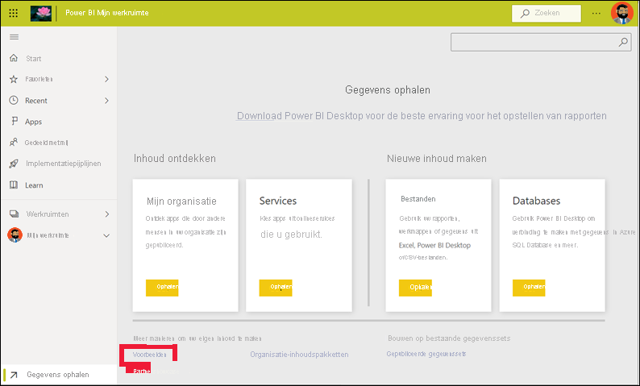

1. Selecteer **Voorbeeld van verkoop en marketing** > **Verbinding maken**. 

   

5. De Power BI-service installeert het voorbeeld in **Mijn werkruimte**.  **Mijn werkruimte** is uw persoonlijke sandbox voor leren en experimenteren.  Alleen u kunt de inhoud in **Mijn werkruimte** zien. Het voorbeeld bevat een dashboard, een rapport en een gegevensset. Normaal gesproken krijgen *zakelijke gebruikers* geen gegevenssets, maar dit voorbeeld is bedoeld voor alle gebruikers en bevat daarom wel een gegevensset.

    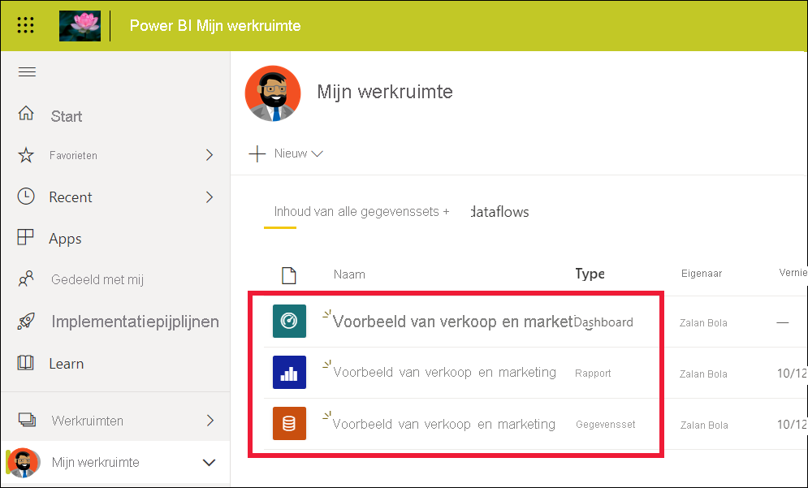

    Als *zakelijke gebruiker* zal de meeste inhoud die met u wordt gedeeld, geen rechtstreekse toegang bieden tot de onderliggende gegevenssets. Omdat de Power BI-voorbeelden worden gemaakt voor alle Power BI-klanten, zijn er gegevenssets opgenomen.   

    Zie [Voorbeelden voor Power BI downloaden](../create-reports/sample-datasets.md) voor meer informatie over voorbeelden.

## Inhoud weergeven (dashboards en rapporten)
Inhoud wordt geordend binnen de context van een werkruimte. Elke zakelijke gebruiker heeft ten minste één werkruimte, met de naam **Mijn werkruimte**. Als *ontwerpers* in de organisatie inhoud met u delen, beschikt u mogelijk over meerdere werkruimten.  Als een *ontwerper* u bijvoorbeeld toegangsmachtigingen geeft voor een van haar werkruimten, wordt die werkruimte weergegeven op uw Power BI-site.  

Alle inhoud waarvan u de eigenaar bent en die u maakt, wordt opgeslagen in **Mijn werkruimte**. Deze werkruimte kunt u beschouwen als een persoonlijke sandbox of persoonlijk werkgebied voor uw eigen inhoud. Bij veel *zakelijke gebruikers* van Power BI blijft **Mijn werkruimte** leeg omdat het maken van nieuwe inhoud niet een van hun taken is.  Zoals de naam al zegt, verbruiken *zakelijke gebruikers* gegevens die door anderen zijn gemaakt, en gebruiken ze deze gegevens om zakelijke beslissingen te nemen. Als u inhoud maakt, kunt u de [Power BI-artikelen voor *rapportmakers*](../index.yml) raadplegen.

Een werkruimte is veel meer dan alleen de weergave van inhoud. Op deze pagina vindt u een heleboel informatie over de dashboards en rapporten van de werkruimte. Neem even minuten de tijd om te ontdekken wie de eigenaar van de inhoud is, wanneer de gegevens voor het laatst zijn vernieuwd, wat de vertrouwelijkheid van de gegevens is en om eventuele goedkeuringen te lezen. Selecteer **Meer acties (...)** om een lijst met acties voor het dashboard en het rapport weer te geven.   

Zie [Werkruimten](end-user-workspaces.md) voor meer informatie.

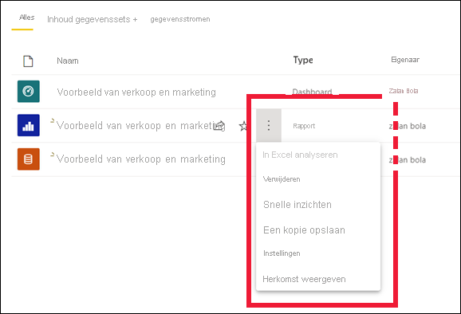

Een werkruimte is ook een van de paden naar uw gegevens. U opent een dashboard of rapport vanuit een werkruimte door het onderdeel te selecteren in de lijst.  Voeg een dashboard of rapport toe aan uw favorieten door de muisaanwijzer erover te bewegen en het sterpictogram te selecteren. Als de *ontwerper* u [machtigingen voor delen](end-user-shared-with-me.md) heeft gegeven, kunt u ook delen vanuit het onderdeel. 

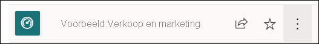

1. Selecteer de naam van het dashboard om dit te openen. Dashboards zijn de elementen waarmee de Power BI-service zich onderscheidt van Power BI Desktop. [Meer informatie over dashboards](end-user-dashboards.md)

    

2. De acties die u op een dashboard kunt uitvoeren, ziet u in de bovenste menubalk.    

    

3. Beweeg de muisaanwijzer over een dashboardtegel en selecteer **Meer opties (...)** om de opties te zien voor het werken met die tegel.

    

4. Selecteer een dashboardtegel om het rapport te openen dat is gebruikt om die tegel te maken. Het rapport wordt geopend op de pagina die de visual bevat die op de tegel wordt weergegeven. Hier heb ik de dashboardtegel geselecteerd met de treemap geselecteerd. De Power BI-service opent vervolgens de rapportpagina **Categorie jaar tot heden**.

    

    Rapporten bestaan uit verschillende secties. Aan de linkerkant staat een lijst met rapportpagina's waarop u kunt klikken. Bovenaan ziet u de menubalk met acties die u op het rapport kunt uitvoeren.  Welke opties beschikbaar zijn, is afhankelijk van de rol en de machtigingen die de *ontwerper* van het rapport aan u heeft toegewezen. Aan de rechterkant ziet u het deelvenster **Filters**. Het middelste canvas bevat het rapport zelf. Net als bij het dashboard zijn er acties die u kunt uitvoeren voor het hele rapport, voor afzonderlijke visuals en voor een bepaalde rapportpagina. 

    Lees hier meer over [Power BI-rapporten](end-user-reports.md).

## Het linkernavigatievenster gebruiken
Het navigatievenster wordt alleen maar nuttiger als collega's inhoud met u gaan delen. In dit gedeelte van de quickstart laten we het voorbeeld *Verkoop en marketing* even voor wat het is en bekijken we een dashboard en een rapport van een *zakelijke gebruiker* van Power BI die veel gedeelde inhoud heeft.

1. **Start** is de standaardlandingspagina wanneer u zich aanmeldt bij de Power BI-service. De startpagina is een uitstekende pagina om te beginnen en biedt een andere manier om door uw inhoud te navigeren. De inhoud van de startpagina is ingedeeld op basis van favorieten en vaak gebruikte items, recente items en aanbevolen apps. Op de startpagina worden ook uw meest recente werkruimten en apps weergegeven. Selecteer een item om dit te openen.

    De startpagina bevat alle zoek- en sorteermiddelen, het navigatievenster en een canvas met *kaarten* die u kunt selecteren om uw dashboards, rapporten en apps te openen. In het begin staan er misschien niet veel kaarten op uw startcanvas, maar dit verandert wanneer u Power BI begint te gebruiken met uw collega's. Ook wordt het startcanvas bijgewerkt met aanbevolen inhoud en trainingsmateriaal.

   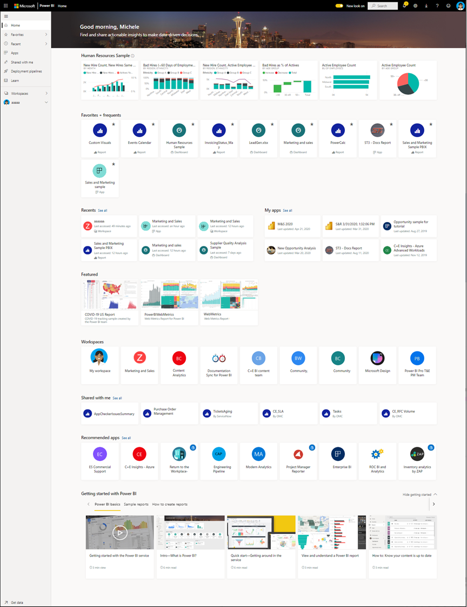

    Zie [Power BI-startpagina](end-user-home.md) voor meer informatie.

2. Naast **Favorieten** en **Recent** staan pijlen. Selecteer een pijl om snel de vijf meest recente favorieten of de vijf meest recent bezochte inhoudsitems weer te geven. Selecteer de inhoud in de flyout om deze te openen. 

   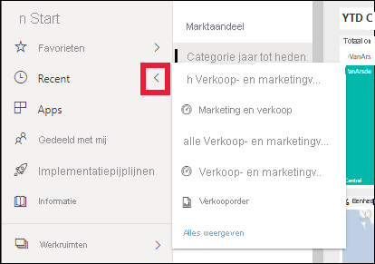

    Als u de volledige lijst met favorieten of recente inhoud wilt weergeven, selecteert u het woord of pictogram. Deze inhoudslijsten bieden aanvullende informatie over de rapporten, apps en dashboards.

    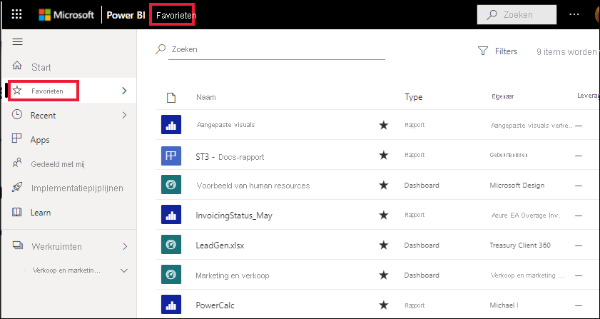

    Zie [Recent content in the Power BI service](end-user-recent.md) (Recent bezochte inhoud weergeven in de Power BI-service) en [Favorite dashboards, reports, and apps in the Power BI service](end-user-recent.md) (Favoriete dashboards, rapporten en apps in de Power BI-service) voor meer informatie.

4. Selecteer **Apps** om alle apps weer te geven die met u zijn gedeeld of die u hebt geïnstalleerd. Selecteer **Gedeeld met mij** om de dashboards en rapporten te zien die met u zijn gedeeld. Omdat u pas net begint met de Power BI-service, zullen deze inhoudsgebieden leeg zijn. 

    Lees hier meer informatie over [Apps](end-user-apps.md) en [Gedeeld met mij](end-user-shared-with-me.md).

### Inhoud zoeken en sorteren
Wanneer u de Power BI-service voor het eerst gebruikt, hebt u slechts enkele stukjes inhoud. Maar als collega's inhoud met u gaan delen en u zelf apps gaat downloaden, kunt u uiteindelijk lange lijsten met inhoud hebben. Dan is een functie voor zoeken en sorteren heel handig.

In bijna elk deel van de Power BI-service kunt u zoekacties uitvoeren. U gebruikt gewoon het zoekvak of het pictogram met een vergrootglas.    

Typ in het zoekveld de volledige of gedeeltelijke naam van een dashboard, rapport, werkmap, app of eigenaar. Power BI doorzoekt al uw inhoud.

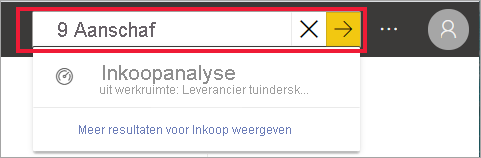

Er zijn ook verschillende manieren om inhoud te sorteren. Beweeg de muisaanwijzer over kolomkoppen en zoek naar pijlen die aangeven dat de kolom kan worden gesorteerd. Niet alle kolommen kunnen worden gesorteerd. 

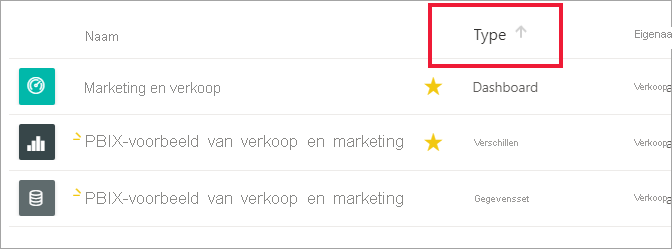

U kunt ook de sorteerfunctie **Filters** in de rechterbovenhoek van de inhoudslijsten gebruiken. U kunt snel inhoud vinden door het type inhoud, de eigenaar of een ander beschikbaar veld te selecteren.

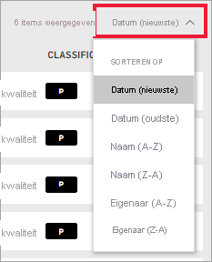

Zie [Power BI-navigatie: zoeken en sorteren](end-user-search-sort.md) voor meer informatie

## De eigenaar zoeken
We sluiten deze quickstart af met een handige tip. Als u vragen hebt over een dashboard, rapport of app, kunt u de eigenaar opzoeken. Als de inhoud is geopend, selecteert u de vervolgkeuzelijst Titel om de eigenaar weer te geven. De eigenaar kan een persoon of een groep zijn.

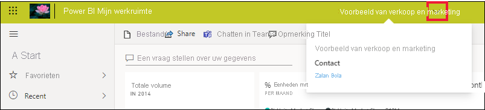

## Resources opschonen
Als u deze quickstart hebt voltooid, kunt u als u wilt het voorbeelddashboard, het rapport en de gegevensset verwijderen.

1. Open de Power BI-service (app.powerbi.com) en meld u aan.    
2. Open de startpagina van Power BI, scrol omlaag en selecteer **Mijn werkruimte**.      

3. Beweeg de muisaanwijzer over het dashboard, het rapport of de gegevensset en selecteer **Meer opties (...)**  > **Verwijderen**. Herhaal dit totdat alle drie zijn verwijderd.

    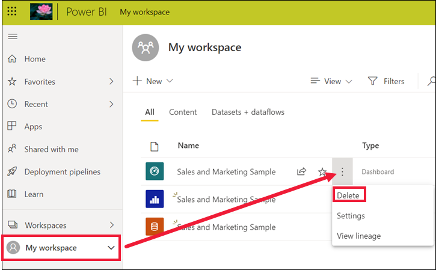

## Volgende stappen

> [!div class="nextstepaction"]
> [Leesweergave in de Power BI-service](end-user-reading-view.md)
