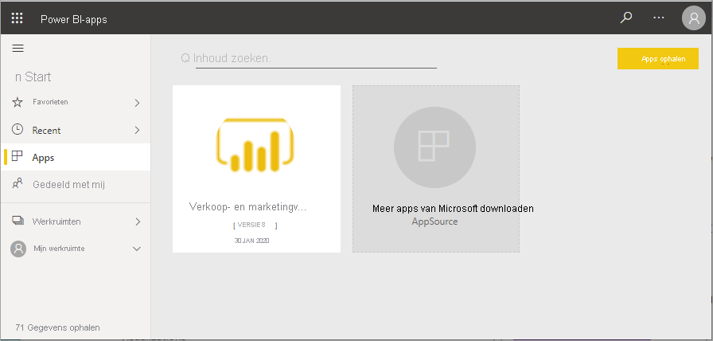
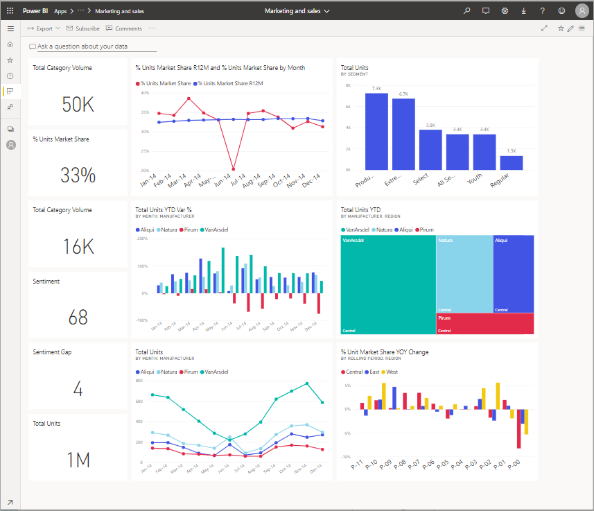
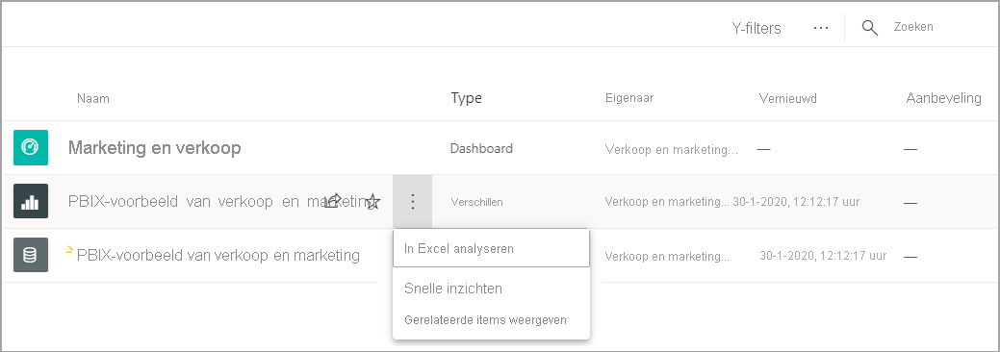

# Quickstart: navigeren in de Power BI-service

[!INCLUDE [power-bi-service-new-look-include](../includes/power-bi-service-new-look-include.md)]

Nu u de basisprincipes van Power BI kent, zullen we een kijkje nemen bij de **Power BI-service**. Zoals eerder werd genoemd, brengt iemand in uw team misschien al zijn of haar tijd door in **Power BI Desktop** om gegevens te combineren en rapporten voor anderen te maken. Maar u, daarentegen, besteedt misschien al uw tijd aan de Power BI-service. U bekijkt en werkt interactief met inhoud die door anderen is gemaakt (de **verbruikservaring**). In deze quickstart gaat u voorbeeldgegevens importeren en die gegevens gebruiken om de Power BI-service te leren gebruiken. 
 
## Vereisten

- Als u zich niet hebt geregistreerd voor Power BI, kunt u zich hier [aanmelden voor een gratis proefversie](https://app.powerbi.com/signupredirect?pbi_source=web) voordat u begint.

- [Basisconcepten van de Power BI-service](end-user-basic-concepts.md) lezen

## De Power BI-service openen

Open om te beginnen de Power BI-service (app.powerbi.com) en ga naar **Start**. 
1. Als het linkernavigatievenster is samengevouwen, selecteert u het pictogram voor het navigatievenster  om het menu uit te vouwen. 

1. Selecteer zo nodig **Start**. 

1. Haal voorbeeldgegevens op. We nemen een aantal voorbeeldgegevens die we gebruiken voor onze rondleiding in de Power BI-service. We bieden u talloze soorten voorbeeldgegevens die u kunt verkennen; we gebruiken in dit voorbeeld de gegevens over marketing en verkoop. 

    Volg deze instructies om de [app Voorbeeld van verkoop en marketing](end-user-app-marketing.md) te installeren.

1. Nadat de app is geïnstalleerd, selecteert u in het navigatievenster **Apps**. 

   

2. Selecteer op het scherm **Apps** de app **Voorbeeld van verkoop en marketing**.

    

2. Selecteer **App verkennen**.

    

3. In de Power BI-service wordt het dashboard van de app geopend. Dashboards zijn de elementen waarmee de Power BI-service zich onderscheidt van Power BI Desktop. Het voorbeeld bevat ook een rapport en een gegevensset. 

    

    De meeste apps die u als *consument* ontvangt, bevatten geen rechtstreekse toegang tot de onderliggende gegevenssets. Omdat de Power BI-voorbeelden worden gemaakt voor alle Power BI-klanten, zijn er gegevenssets opgenomen. *Ontwerpers* gebruiken de gegevenssets om nieuwe dashboards en rapporten te leren maken. 

## Inhoud weergeven (dashboards en rapporten)
Laten we beginnen door te kijken hoe de basisinhoud (dashboards, rapporten en apps) wordt geordend. Er wordt inhoud weergegeven binnen de context van een werkruimte. Elke consument heeft ten minste één werkruimte, **Mijn werkruimte**. Telkens wanneer u een app installeert, wordt er een werkruimte voor die app gemaakt.  Aangezien we de app Voorbeeld van verkoop en marketing hebben geïnstalleerd, hebben we nu twee werkruimten. 

U ziet dit als u **Werkruimten** in het linkernavigatievenster selecteert. 

Alle inhoud waarvan u de eigenaar bent en die u maakt, wordt opgeslagen in **Mijn werkruimte**. Deze werkruimte kunt u beschouwen als een persoonlijke sandbox of persoonlijk werkgebied voor uw eigen inhoud. Bij veel Power BI-*consumenten* blijft **Mijn werkruimte** leeg omdat het maken van nieuwe inhoud niet een van de taken is.  Zoals de naam al zegt, verbruiken *consumenten* gegevens die door anderen zijn gemaakt, en gebruiken ze deze gegevens om zakelijke beslissingen te nemen. Als u inhoud maakt, kunt u de [Power BI-artikelen voor *rapportmakers*](../index.yml) raadplegen.

**App-werkruimten** bevatten alle inhoud voor de specifieke app.  Wanneer *ontwerpers* een app maken, bundelen ze alle inhoud die voor het gebruik van de app nodig is.  Selecteer de werkruimte Verkoop en marketing om te zien wat de *ontwerper* in de app heeft gebundeld. 

De app-werkruimte Verkoop en marketing bevat één dashboard, één rapport en één gegevensset. Niet alle apps bevatten deze drie elementen. Het is mogelijk dat een app slechts één dashboard of drie van elk inhoudselement bevat, of zelfs twintig rapporten. Dit is geheel afhankelijk van wat de *ontwerper* in de app wil opnemen. Omdat de gegevens van Verkoop en marketing een voorbeeld zijn, bevatten deze een gegevensset. Maar meestal bevatten app-werkruimten voor *consumenten* geen gegevenssets. 

Een werkruimte is veel meer dan alleen de weergave van inhoud. Op deze pagina vindt u een heleboel informatie over de dashboards en rapporten van de werkruimte. Neem enkele minuten de tijd om te bekijken wie de eigenaar van de inhoud is en wanneer de gegevens voor het laatst zijn vernieuwd en om de goedkeuringen te lezen. Als de werkruimte een beschrijving heeft, kan deze beschrijving u helpen een beter inzicht te krijgen in de doelstellingen van de werkruimte en hoe u de werkruimte kunt gebruiken voor uw zakelijke doeleinden. En als de werkruimte veel inhoud bevat, gebruikt u de zoek- en sorteeropties om snel te vinden wat u nodig hebt.

Een werkruimte is ook een van de paden naar uw gegevens. Open een dashboard of rapport door het te selecteren in de lijst.  Voeg een dashboard of rapport aan uw favorieten toe door de muisaanwijzer erop te plaatsen en het sterpictogram te selecteren. Als de *ontwerper* u [machtigingen voor delen](end-user-shared-with-me.md) heeft gegeven, wordt deze actie ook weergegeven. 

Open het dashboard door de dashboardnaam te selecteren.

## Dashboard en een rapport aan favorieten toevoegen
Met **Favorieten** hebt u snel toegang tot uw belangrijkste inhoud. U hebt zojuist geleerd hoe u in een werkruimte een dashboard aan uw favorieten kunt toevoegen. U kunt ook rechtstreeks vanuit een dashboard of rapport favorieten maken.

1. Open het dashboard en selecteer op de menubalk **Aan favorieten toevoegen**.
   
   
   
   **Aan favorieten toevoegen** wordt gewijzigd in **Uit favorieten verwijderen** en het sterpictogram wordt geel weergegeven.
   
   

2. Als u een lijst wilt weergeven met alle inhoud die u aan Favorieten hebt toegevoegd, selecteert u in het navigatievenster de pijl rechts van **Favorieten**. Omdat het navigatievenster een permanente functie van de Power BI-service is, hebt u overal in de Power BI-service toegang tot deze lijst.
   
    
   
    Deze Power BI-gebruiker heeft tot nu toe vier favorieten. Favorieten kunnen dashboards, rapporten of apps zijn.  

Zie [Favorieten](end-user-favorite.md) voor meer informatie

## Uw meest recente inhoud zoeken

1. Net als bij Favorieten hebt u overal in de Power BI-service snel toegang tot uw recent geopende inhoud door in het navigatievenster de pijl naast **Recent** te selecteren.

   

    Selecteer de inhoud in de flyout om deze te openen.

2. Soms wilt u niet simpelweg recente inhoud openen, maar informatie bekijken of een andere actie uitvoeren zoals inzichten weergeven of items exporteren naar Excel. Open in gevallen als deze het deelvenster **Recente items** door **Recent** of het bijbehorende pictogram te selecteren in het navigatievenster. In dit voorbeeld heeft de Power BI-gebruiker meer dan een werkruimte, zodat deze lijst inhoud van alle werkruimten kan bevatten.

   

Zie [Recent geopende in Power BI](end-user-recent.md) voor meer informatie.

### Inhoud zoeken en sorteren
Wanneer u de Power BI-service voor het eerst gebruikt, hebt u slechts enkele stukjes inhoud. Maar als collega's inhoud met u gaan delen en u zelf apps gaat downloaden, kunt u uiteindelijk lange lijsten met inhoud hebben. Dan is een functie voor zoeken en sorteren heel handig.

In bijna elk deel van de Power BI-service kunt u zoekacties uitvoeren. U gebruikt gewoon het zoekvak of het pictogram met een vergrootglas.    

Typ in het zoekveld de volledige of gedeeltelijke naam van een dashboard, rapport, werkmap, app of eigenaar. Power BI doorzoekt al uw inhoud.

Er zijn ook verschillende manieren om inhoud te sorteren. Beweeg de muisaanwijzer over kolomkoppen en zoek naar pijlen die aangeven dat de kolom kan worden gesorteerd. Niet alle kolommen kunnen worden gesorteerd. 

U kunt ook zoeken naar het besturingselement voor sorteren in de rechterbovenhoek van het canvas. Selecteer of u oplopend of aflopend op datum, naam of eigenaar wilt sorteren.  

Zie [Power BI-navigatie: zoeken en sorteren](end-user-search-sort.md) voor meer informatie

## Power BI-startpagina
En we beëindigen deze quickstart op het punt waar we zijn begonnen: de Power BI-**startpagina**. 

De startpagina bevat alle zoek- en sorteermiddelen, het navigatievenster en een canvas met *kaarten* die u kunt selecteren om uw dashboards, rapporten en apps te openen. In het begin staan er misschien niet veel kaarten op uw startcanvas, maar dit verandert wanneer u Power BI begint te gebruiken met uw collega's. Ook wordt het startcanvas bijgewerkt met aanbevolen inhoud en trainingsmateriaal.

Zie [Power BI-startpagina](end-user-home.md) voor meer informatie

## Resources opschonen
Als u deze quickstart hebt voltooid, kunt u als u wilt het voorbeelddashboard, het rapport en de gegevensset verwijderen.

1. Open de Power BI-service (app.powerbi.com) en meld u aan.    
2. Open de Power BI-startpagina, schuif omlaag naar **Werkruimten** en selecteer *Verkoop en marketing*.      

3. Beweeg de muisaanwijzer over het dashboard, het rapport of de gegevensset en selecteer **Meer opties (...)**  > **Verwijderen**. Herhaal dit totdat alle drie zijn verwijderd.

    

## Volgende stappen

> [!div class="nextstepaction"]
> [Leesweergave in de Power BI-service](end-user-reading-view.md)
