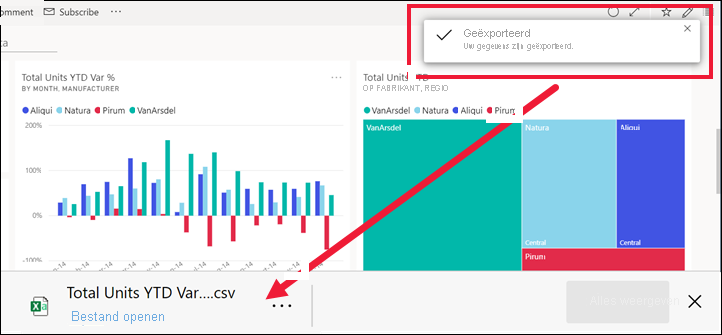
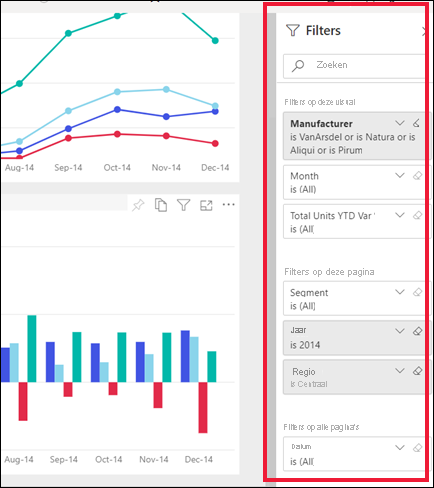
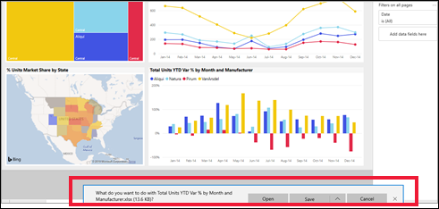

# Gegevens uit een visualisatie exporteren

[!INCLUDE[consumer-appliesto-yyny](../includes/consumer-appliesto-yyny.md)]

Als u de gegevens wilt zien die worden gebruikt om een visual te maken, [kunt u die gegevens weergeven in Power BI](end-user-show-data.md) of exporteren naar Excel. In dit artikel wordt beschreven hoe u naar Excel exporteert.

Voor het exporteren van gegevens naar Excel is een Power BI Pro licentie vereist, of voor het dash board of rapport dat u wilt delen met behulp van Premium-capaciteit. Zie [Welke licentie heb ik?](end-user-license.md) voor meer informatie. 

> [!IMPORTANT]
> Als u niet kunt exporteren naar Excel, is het mogelijk dat de auteur van het rapport of uw Power BI beheerder deze functie heeft uitgeschakeld. Dit wordt vaak gedaan om persoonlijke gegevens te beveiligen.

## Gegevens uit een Visual op een dash board exporteren

1. Begin in een Power BI-dashboard. Hier gebruiken we het dashboard uit de voorbeeldapp ***Verkoop en marketing** _app. U [downloadt deze app van AppSource.com](https://appsource.microsoft.com/en-us/product/power-bi/microsoft-retail-analysis-sample.salesandmarketingsample).

    

2. Beweeg met de muis over een visual om _ *Meer opties** (...) weer te geven en klik erop om het actiemenu weer te geven.

    

3. Selecteer **Exporteren naar .csv**.

4. Wat er nu gebeurt, hangt af van de browser die u gebruikt. U wordt mogelijk gevraagd om het bestand op te slaan, of u ziet mogelijk onderaan de browser een koppeling naar het geëxporteerde bestand. De export wordt standaard opgeslagen in de lokale map Downloads. 

    

5. Open het bestand in Excel. 

    > [!NOTE]
    > Als u geen machtigingen voor de gegevens hebt, kunt u deze niet exporteren of openen in Excel. Neem contact op met de eigenaar van het dash board of uw Power BI beheerder om machtigingen voor exporteren aan te vragen. 

    

## Gegevens uit een visueel element in een rapport exporteren
U kunt gegevens exporteren uit een visual in een rapport als .csv of .xlsx (Excel). 

1. Selecteer een tegel in een dashboard om het onderliggende rapport te openen.  In dit voorbeeld selecteren we dezelfde visual als hierboven, *Totaalaantal eenheden jaar tot nu, variabel percentage*. 

    

    Aangezien deze tegel is gemaakt vanuit het voorbeeldrapport *Verkoop en marketing*, wordt dat rapport geopend. De pagina die de visual van de geselecteerde tegel bevat, wordt ook geopend. 

2. Selecteer de visual in het rapport. Bekijk het venster **Filters** aan de rechterzijde. Er zijn filters toegepast op de visual. Voor meer informatie over filters raadpleegt u [Filters gebruiken in een rapport](end-user-report-filter.md).

    

3. Selecteer **Meer opties** (...) in de rechterbovenhoek van de visualisatie. Kies **Gegevens exporteren**.

    

4. U ziet opties om samenvattings gegevens of onderliggende gegevens te exporteren. Als u gebruikmaakt van de voorbeeldapp *Verkoop en marketing*, wordt **Onderliggende gegevens** uitgeschakeld. Aanvullende machtigingen zijn vereist voor het weer geven van meer gegevens dan wordt weer gegeven in de Visual (onderliggende gegevens). Deze machtigingen beschermen de gegevens tegen ongeschikte weer gave, hergebruik of gedeeld met iemand anders dan de beoogde doel groep.

    **Samengevatte gegevens**: selecteer deze optie als u gegevens wilt exporteren voor wat u momenteel ziet in de visual.  Dit type export geeft alleen de gegevens weer die werden gebruikt om de huidige staat van de visual te maken. Als er filters zijn toegepast op de visual, worden de gegevens die u exporteert ook gefilterd. Voor deze visual bevat uw export bijvoorbeeld alleen gegevens voor 2014 en de centrale regio en alleen gegevens voor vier van de fabrikanten: VanArsdel, Natura, Aliqui en Pirum. Als uw visual aggregaties (som, gemiddelde, enzovoort) bevat, wordt de export ook geaggregeerd. 
  

    **Onderliggende gegevens**: selecteer deze optie als u gegevens wilt exporteren voor wat u in de visual ziet **en** aanvullende gegevens uit de onderliggende gegevensset.  Dit zijn mogelijk gegevens die zijn opgenomen in de gegevensset, maar die niet worden gebruikt in de visual. Als er filters zijn toegepast op de visual, worden de gegevens die u exporteert ook gefilterd.  Als uw visuals aggregaties (som, gemiddelde, enzovoort) bevat, wordt de aggregatie door de export verwijderd, waardoor de gegevens in feite worden afgevlakt. 

    

5. Wat er nu gebeurt, hangt af van de browser die u gebruikt. U wordt mogelijk gevraagd om het bestand op te slaan, of u ziet mogelijk onderaan de browser een link naar het geëxporteerde bestand. Als u de Power BI-app gebruikt in Microsoft Teams, wordt het geëxporteerde bestand opgeslagen in de lokale map Downloads. 

    

    > [!NOTE]
    > Als u geen machtigingen voor de gegevens hebt, kunt u deze niet exporteren of openen in Excel. Neem contact op met de eigenaar van het rapport of uw Power BI beheerder om export machtigingen aan te vragen. 

6. Open het bestand in Excel. Vergelijk de hoeveelheid gegevens die is geëxporteerd naar wat we in het dash board van hetzelfde visuele element hebben geëxporteerd. Het verschil is dat deze export ook **Onderliggende gegevens** omvat. 

    

## Aandachtspunten en probleemoplossing
Er zijn veel overwegingen met betrekking tot het exporteren naar Excel. Dit is een van deze functies die rapport ontwerpers en Power BI beheerders kunnen uitschakelen voor individuen of zelfs voor een hele organisatie. Ze doen dit om ervoor te zorgen dat persoonlijke gegevens niet worden blootgesteld aan de verkeerde doel groep. 

Als u merkt dat u deze functie niet kunt gebruiken, kunt u contact met de eigenaar van het rapport en uw beheerder begrijpen waarom u geen gegevens van een bepaald visueel element of van alle visuals kunt exporteren. Het kan zijn dat deze functie is uitgeschakeld, waardoor deze mogelijk voor u kan worden ingeschakeld.  Andere tijden, er kunnen specifieke redenen zijn waarom een export niet werkt.  Dit kan gerelateerd zijn aan machtigingen, gegevens inhoud, gegevens type, het type visuele element, hoe de ontwerper de velden heet en meer. Als u contact opneemt met de eigenaar of beheerder van het rapport, raadpleegt u deze artikelen: [Tenant instellingen voor beheerders](../guidance/admin-tenant-settings.md), [beveiliging op rijniveau](../admin/service-admin-rls.md)en [gegevens bescherming](../admin/service-security-data-protection-overview.md).

- Er is een limiet voor het aantal rijen dat kan worden geëxporteerd naar Excel.  Voor. xlsx-bestanden is de limiet 150.000 rijen.  Voor CSV-bestanden is de limiet 30.000 rijen. 

- De gegevensset heeft mogelijk een beveiliging op RIJNIVEAU op het hoogste niveau van de gegevens. Dit betekent dat sommige gegevens mogelijk verborgen zijn omdat deze niet geschikt is voor u.  Als u bijvoorbeeld een persoons manager bent, kan de HR-gegevensset op RIJNIVEAU worden toegepast waarmee u alleen gegevens kunt zien voor werk nemers die rechtstreeks aan u rapporteren. 

- Bepaalde typen visuele elementen worden niet ondersteund. Dit zijn onder andere aangepaste visuele elementen, R-visuals en meer. 

## Volgende stappen

[De gegevens weergeven die worden gebruikt om een visual te maken](end-user-show-data.md)