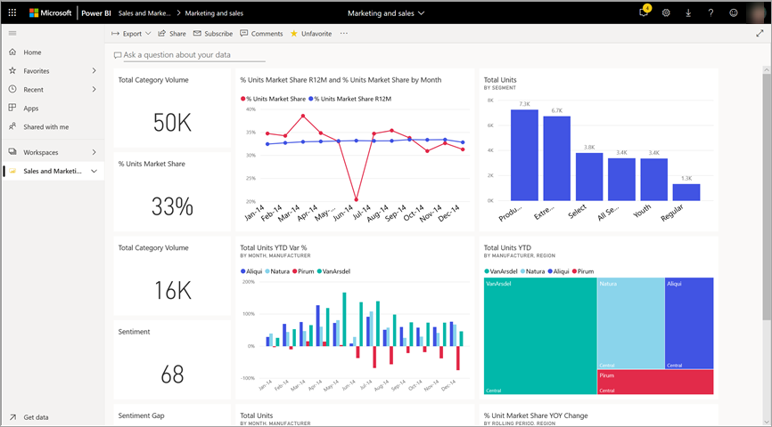

# Gegevens exporteren uit visual
Als u graag zou zien van de gegevens die wordt gebruikt willen voor het maken van een visueel element, [kunt u die gegevens weergeven in Power BI](end-user-show-data.md) of die gegevens exporteren naar Excel. De optie voor het exporteren van de gegevens vereist een bepaald type of een licentie en bewerkingsmachtigingen beschikken voor de inhoud. Als u niet exporteren, neem contact op met de Power BI-beheerder. 

## Van een visualisatie in een Power BI-dashboard

1. Start op een Power BI-dashboard. Hier gebruiken we het dashboard van de ***Marketing- en verkoopafdeling voorbeeld*** app. U kunt [deze app downloaden uit AppSource.com](https://appsource.microsoft.com/en-us/product/power-bi/microsoft-retail-analysis-sample.salesandmarketingsample-preview?flightCodes=e2b06c7a-a438-4d99-9eb6-4324ce87f282).

    

2. Beweeg de muisaanwijzer over een visueel element om weer te geven van de weglatingstekens (...) en klik op om het actiemenu weer te geven.

    

3. Selecteer **exporteren naar Excel**.

4. Wat er daarna gebeurt, is afhankelijk van welke browser dat u gebruikt. U kunt worden gevraagd om op te slaan van het bestand of uw kan een koppeling naar het geëxporteerde bestand aan de onderkant van de browser wordt weergegeven. 

    

5. Open het bestand in Excel.  

    

## Van een visualisatie in een rapport
U kunt gegevens van een visualisatie in een rapport exporteren als CSV- of .xlsx (Excel) indeling. 

1. Selecteer een tegel om het onderliggende rapport te openen op een dashboard.  In dit voorbeeld selecteren we hetzelfde visual als hierboven, *totale eenheden YTD Var %* . 

    

    Omdat deze tegel is gemaakt op basis van de *verkoop en Marketing voorbeeld* rapport, die het rapport dat wordt geopend. En deze wordt geopend op de pagina met het geselecteerde tegel visuele element. 

2. Selecteer de tegel in het rapport. U ziet dat de **Filters** deelvenster aan de rechterkant. Dit visuele element hebt waarvoor filters zijn toegepast. Zie voor meer informatie over filters, [filters gebruiken in een rapport](end-user-report-filter.md).

    

3. Selecteer het beletselteken in de rechterbovenhoek van de visualisatie. Kies **gegevens exporteren**.

    

4. Hier ziet u opties voor het exporteren van samengevat of onderliggende gegevens. Als u de *verkoop en marketing voorbeeld* app **onderliggende gegevens** wordt uitgeschakeld. Maar er rapporten wanneer beide opties zijn ingeschakeld. Hier volgt een uitleg van het verschil.

    **Samengevatte gegevens**: Selecteer deze optie als u exporteren van gegevens wilt voor wat u in het visuele element ziet.  Dit type uitvoer ziet u alleen de gegevens die is gebruikt voor het maken van het visuele element. Als het visuele element hebt waarvoor filters zijn toegepast, klikt u vervolgens de gegevens die u exporteert ook gefilterd. Bijvoorbeeld, voor dit visuele element, uw export bevat alleen gegevens voor 2014 en de centrale regio, en alleen de gegevens voor vier van de fabrikanten: VanArsdel, Natura, Aliqui en Prirum.
  

    **Onderliggende gegevens**: Selecteer deze optie als u exporteren van gegevens wilt voor wat u in het visuele element ziet **plus** aanvullende gegevens uit de onderliggende gegevensset.  Deze kan gegevens die is opgenomen in de gegevensset, maar niet gebruikt in het visuele element bevatten. 

    

5. Wat er daarna gebeurt, is afhankelijk van welke browser dat u gebruikt. U kunt worden gevraagd om op te slaan van het bestand of uw kan een koppeling naar het geëxporteerde bestand aan de onderkant van de browser wordt weergegeven. 

    

7. Open het bestand in Excel. Vergelijk de hoeveelheid gegevens die zijn geëxporteerd naar de gegevens die we van dezelfde visual op het dashboard hebt geëxporteerd. Het verschil is dat deze uitvoer bevat **onderliggende gegevens**. 

    

