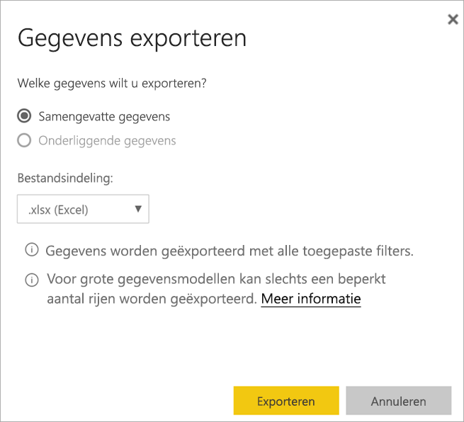

# Gegevens uit een visualisatie exporteren

[!INCLUDE [power-bi-service-new-look-include](../includes/power-bi-service-new-look-include.md)]

Als u de gegevens wilt zien die worden gebruikt om een visual te maken, [kunt u die gegevens weergeven in Power BI](end-user-show-data.md) of exporteren naar Excel. De optie om gegevens te exporteren vereist een bepaald type of licentie en bewerkingsmachtigingen voor de inhoud. Als u niets kunt exporteren, neemt u contact op met uw Power BI-beheerder. 

## Vanuit een visual in een Power BI-dashboard

1. Begin in een Power BI-dashboard. Hier gebruiken we het dashboard uit de voorbeeldapp ***Verkoop en marketing***. U [downloadt deze app van AppSource.com](https://appsource.microsoft.com/en-us/product/power-bi/microsoft-retail-analysis-sample.salesandmarketingsample-preview?flightCodes=e2b06c7a-a438-4d99-9eb6-4324ce87f282).

    

2. Beweeg met de muis over een visual om het beletselteken (...) weer te geven en klik erop om het actiemenu weer te geven.

    

3. Selecteer **Exporteren naar Excel**.

4. Wat er nu gebeurt, hangt af van de browser die u gebruikt. U wordt mogelijk gevraagd om het bestand op te slaan, of u ziet mogelijk onderaan de browser een link naar het geëxporteerde bestand. 

    

5. Open het bestand in Excel.  

    

## Vanuit een visual in een rapport
U kunt gegevens exporteren uit een visual in een rapport als .csv of .xlsx (Excel). 

1. Selecteer een tegel in een dashboard om het onderliggende rapport te openen.  In dit voorbeeld selecteren we dezelfde visual als hierboven, *Totaalaantal eenheden jaar tot nu, variabel percentage*. 

    

    Aangezien deze tegel is gemaakt vanuit het voorbeeldrapport *Verkoop en marketing*, wordt dat rapport geopend. De pagina die de visual van de geselecteerde tegel bevat, wordt ook geopend. 

2. Selecteer de tegel in het rapport. Bekijk het venster **Filters** aan de rechterzijde. Er zijn filters toegepast op de visual. Voor meer informatie over filters raadpleegt u [Filters gebruiken in een rapport](end-user-report-filter.md).

    

3. Selecteer het beletselteken in de rechterbovenhoek van de visualisatie. Kies **Gegevens exporteren**.

    

4. U ziet opties om Samengevatte gegevens of Onderliggende gegevens te exporteren. Als u gebruikmaakt van de voorbeeldapp *Verkoop en marketing*, wordt **Onderliggende gegevens** uitgeschakeld. U kunt echter wel rapporten tegenkomen waarbij beide opties zijn ingeschakeld. Dit is een voorbeeld van het verschil.

    **Samengevatte gegevens**: selecteer deze optie als u gegevens wilt exporteren voor wat u ziet in de visual.  Dit type export geeft alleen de gegevens weer die werden gebruikt om de visual te maken. Als er filters zijn toegepast op de visual, worden de gegevens die u exporteert ook gefilterd. Voor deze visual bevat uw export bijvoorbeeld alleen gegevens voor 2014 en de centrale regio en alleen gegevens voor vier van de fabrikanten: VanArsdel, Natura, Aliqui en Pirum.
  

    **Onderliggende gegevens**: selecteer deze optie als u gegevens wilt exporteren voor wat u in de visual ziet **en** aanvullende gegevens uit de onderliggende gegevensset.  Dit zijn mogelijk gegevens die zijn opgenomen in de gegevensset, maar die niet worden gebruikt in de visual. 

    

5. Wat er nu gebeurt, hangt af van de browser die u gebruikt. U wordt mogelijk gevraagd om het bestand op te slaan, of u ziet mogelijk onderaan de browser een link naar het geëxporteerde bestand. 

    

6. Open het bestand in Excel. Vergelijk de hoeveelheid geëxporteerde gegevens met de gegevens die u hebt geëxporteerd uit dezelfde visual op het dashboard. Het verschil is dat deze export ook **Onderliggende gegevens** omvat. 

    

## Volgende stappen

[De gegevens weergeven die worden gebruikt om een visual te maken](end-user-show-data.md)