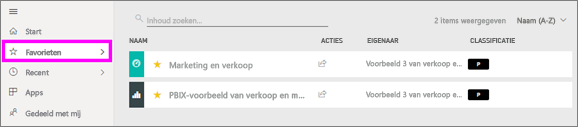
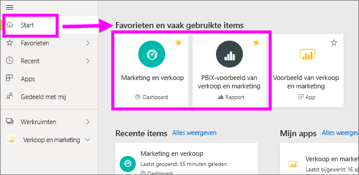
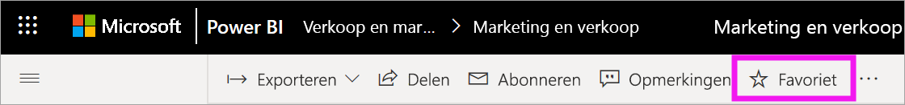
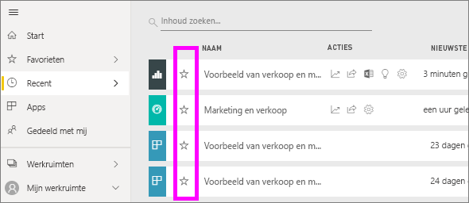
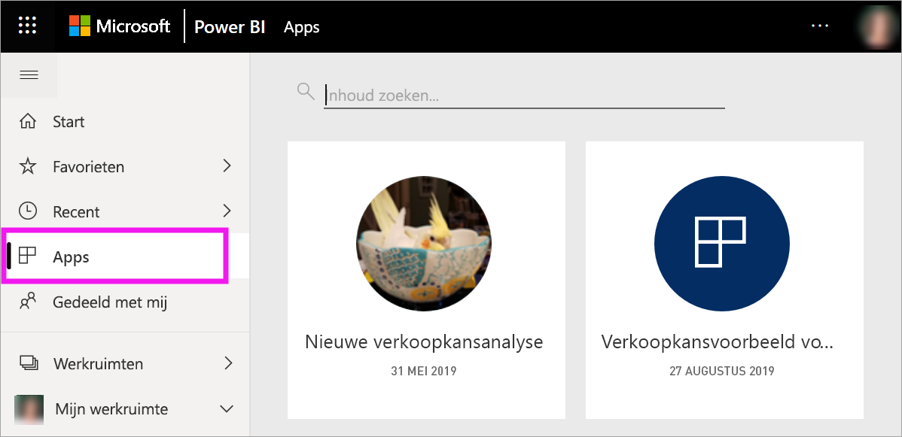
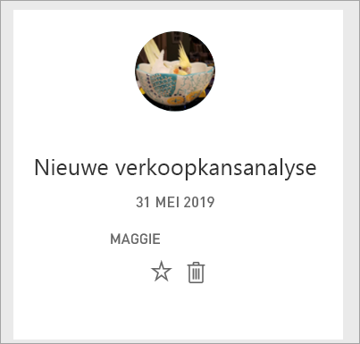
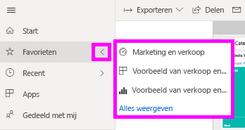
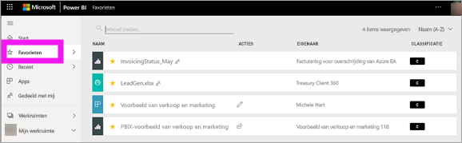
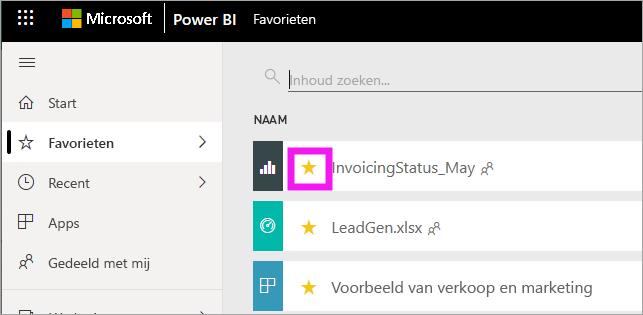

# Favoriete dashboards, rapporten en apps in de Power BI-service
Wanneer u inhoud een *favoriet* maakt, kunt u deze snel openen vanuit de inhoudslijst **Favorieten** en via de Power BI-**startpagina** > **Favorieten en vaak gebruikte items**. Favorieten zijn doorgaans inhoud die u het meest bezoekt. Deze worden aangeduid met een gele ster.

   

   

U kunt in de Power BI-service ook één dashboard selecteren als een [aanbevolen dashboard](end-user-featured.md).

## Een dashboard of rapport toevoegen als een favoriet

1. Open een dashboard of rapport dat u vaak gebruikt. Ook inhoud die met u is gedeeld, kan een favoriet zijn.

2. Selecteer in de bovenste menubalk van de Power BI-service **Favoriet** of het sterpictogram .
   
   
   
   U kunt ook vanaf elke locatie waar u het sterpictogram ziet een dashboard of rapport aan uw favorieten toevoegen, zoals Start, Recent, Apps en Gedeeld met mij. 
   
   

## Een app markeren als favoriet

1. Selecteer **Apps** in het navigatievenster.

   

2. Beweeg de muisaanwijzer over een app om meer details weer te geven. Selecteer het  sterpictogram om de app aan uw favorieten toe te voegen.
   
   

## Werken met favorieten
1. Om uw favorieten te zien, selecteert u de pijl rechts van **Favorieten**. Hier kunt u een favoriet selecteren om deze te openen. Er worden maximaal vijf favorieten weergegeven (alfabetisch). Als u meer dan vijf favorieten hebt, selecteert u **Alles weergeven** om de inhoudslijst met favorieten te openen. 
   
   
2. Om alle inhoud te zien die u aan uw favorieten hebt toegevoegd, selecteert u **Favorieten** of het pictogram Favorieten  in het navigatievenster. 
   
    
   
   Hier kunt u acties uitvoeren. U kunt favorieten openen, eigenaren identificeren en zelfs favorieten delen met collega's.

## Inhoud verwijderen uit favorieten
Gebruikt u een rapport niet meer zo vaak? U kunt dit rapport dan uit uw favorieten verwijderen. Wanneer u inhoud verwijdert uit de favorieten, wordt deze verwijderd uit uw favorieten maar niet uit Power BI.

1. Selecteer **Favorieten** in het navigatievenster om het scherm **Favorieten** te openen.
   
   
2. Selecteer de gele ster naast de inhoud om deze te verwijderen uit de favorieten.

> [!NOTE]
> U kunt ook een dashboard, rapport of app verwijderen uit de favorieten. Open het gewenste item en deselecteer het gele pictogram. 
> 
> 
## Beperkingen en overwegingen
Op dit moment kunt u een app aan uw favorieten toevoegen. Hiermee worden automatisch alle rapporten en dashboards voor die app aan uw favorieten toegevoegd. Het is niet mogelijk om persoonlijke app-rapporten of dashboards aan uw favorieten toe te voegen. 

## Volgende stappen
- [Power BI: basisconcepten](end-user-basic-concepts.md)
- Hebt u nog vragen? Misschien dat de [Power BI-community](https://community.powerbi.com/) het antwoord weet.

