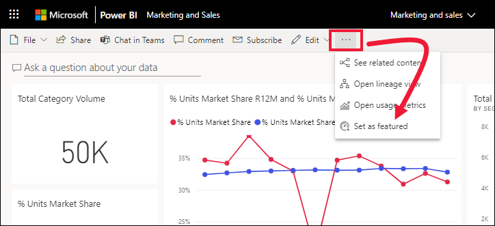
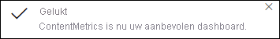

# Aanbevolen dashboards in de Power BI-service

[!INCLUDE [power-bi-service-new-look-include](../includes/power-bi-service-new-look-include.md)]

Veel mensen hebben één dashboard dat ze vaker bezoeken dan andere. Dit kan het dashboard zijn dat we gebruiken om ons bedrijf te runnen. Het kan ook een dashboard zijn dat een verzameling tegels uit veel verschillende dashboards en rapporten bevat.

## Een aanbevolen dashboard maken
Als u een dashboard selecteert als *aanbevolen*, wordt het dashboard meteen weergegeven wanneer u de Power BI-service opent. 

U kunt ook meerdere dashboards selecteren en ze als favoriet instellen. Zie [Favoriete dashboards](end-user-favorite.md).

Als u nog geen aanbevolen dashboard hebt ingesteld, wordt in Power BI het laatste dashboard dat u hebt gebruikt of de **startpagina** van Power BI geopend. 

### Een dashboard instellen als aanbevolen

1. Open het dashboard dat u wilt instellen als aanbevolen. 
2. Selecteer in de bovenste menubalk **Meer opties** (...) en kies **Instellen als aanbevolen dashboard**. 
   
    
3. Bevestig uw selectie.
   
    

## Het aanbevolen dashboard wijzigen
Als u later van gedachten verandert, kunt u een nieuw dashboard instellen als aanbevolen dashboard. Als u de aanbeveling van een dashboard ongedaan maakt, wordt het dashboard niet verwijderd uit Power BI. 

1. Volg stap 1 en 2 hierboven.
   
2. Selecteer **Instellen als aanbevolen dashboard**. 
   
    

## Het aanbevolen dashboard verwijderen
Als u een dashboard niet meer wilt markering als aanbevolen, ziet u hier hoe u de markering als aanbevolen van een dashboard verwijdert.

1. Open het momenteel aanbevolen dashboard.
2. Selecteer in de bovenste menubalk **Meer opties** (...) en kies **Aanbevolen dashboard uitschakelen**.

    
   
## Volgende stappen
- [Een dashboard aan favorieten toevoegen](end-user-favorite.md)    
- Nog vragen? Misschien dat de [Power BI-community](https://community.powerbi.com/) het antwoord weet.

