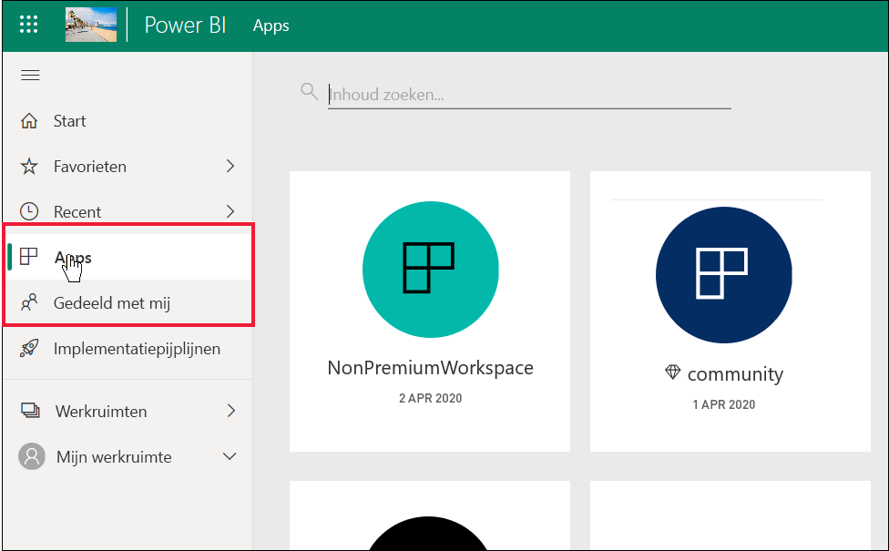

# Lijst met Power BI-functies voor *consumenten* en anderen met een gratis licentie

[!INCLUDE[consumer-appliesto-ynnn](../includes/consumer-appliesto-ynnn.md)]

Als *zakelijke gebruiker* gebruikt u de Power BI-service om rapporten en dashboards te verkennen om zakelijke beslissingen te nemen. Deze rapporten en dashboards worden gemaakt door *ontwerpers*  die een Power BI *Pro*-licentie hebben. Pro-gebruikers hebben de mogelijkheid om inhoud te delen met hun collega's en om te bepalen wat hun collega's wel en niet met die inhoud kunnen doen. Soms delen ontwerpers inhoud door u koppelingen te sturen. Andere keren wordt de inhoud automatisch geïnstalleerd en weergegeven in Power BI onder **Apps** of **Gedeeld met mij**.

Er zijn veel verschillende manieren waarop ontwerpers inhoud kunnen delen. Dit artikel is echter bedoeld voor *zakelijke gebruikers* van Power BI en daarom wordt alleen beschreven hoe *zakelijke gebruikers* inhoud kunnen ontvangen en ermee kunnen werken. Zie [Manieren om uw werk te delen in Power BI](../collaborate-share/service-how-to-collaborate-distribute-dashboards-reports.md) voor meer informatie over andere manieren om inhoud te delen.

In het [vorige artikel](end-user-license.md) hebt u geleerd dat het afhankelijk is van drie factoren wat u met dashboards, rapporten en apps (inhoud) in de Power BI-service kunt doen: uw licenties, uw rollen en machtigingen en de locatie waar inhoud is opgeslagen.

In dit artikel leest u welke functies in de Power BI-service beschikbaar zijn voor *zakelijke gebruikers* als u. Per definitie hebben *zakelijke gebruikers* een gratis licentie om in de Power BI-service (niet in Power BI Desktop) te werken en zijn ze lid van organisaties met inhoud in Premium-capaciteit.

<art>

## Kort overzicht van de terminologie
We gaan eerst enkele Power BI-concepten nader onder de loep nemen voordat we de lijst gaan bekijken. Dit is maar een beknopt overzicht. Als u meer informatie nodig hebt, gaat u naar [Licenties voor consumenten](end-user-license.md) of [Basisconcepten van Power BI](end-user-basic-concepts.md).

### Werkruimten en rollen
Er zijn twee typen werkruimten: **Mijn werkruimte** en app-werkruimten. Alleen u hebt toegang tot uw eigen **Mijn werkruimte**. Om te kunnen samenwerken en delen, moet *ontwerpers* van de inhoud, die over Pro-licenties beschikken, een app-werkruimte gebruiken. 

In app-werkruimten worden *rollen* toegewezen door de ontwerpers om te beheren wie wat kan doen in die werkruimte. *Zakelijke gebruikers* wordt vaak de rol **Viewer** toegewezen. 

### Premium-capaciteit
Wanneer een organisatie een abonnement voor Premium-capaciteit heeft, kunnen beheerders en Pro-gebruikers werkruimten toewijzen aan *toegewezen capaciteit*. Een werkruimte in een toegewezen capaciteit is een ruimte waarin Pro-gebruikers kunnen delen en samenwerken met gebruikers die een gratis licentie hebben; deze gebruikers hebben dus geen Pro-licenties nodig. Binnen deze werkruimten hebben gratis gebruikers verhoogde machtigingen nodig. (Zie de lijst hieronder.) 

### Licenties 
Elke Power BI-servicegebruiker heeft een gratis licentie of een Pro-licentie. *Zakelijke gebruikers* hebben gratis licenties.

- **Gratis licentie**: wordt doorgaans toegewezen aan *zakelijke gebruikers* in een organisatie (zie de eerste afbeelding hieronder). Wordt ook toegewezen aan iedereen die zich aanmeldt voor de Power BI-service als individuele gebruiker en de [Power BI-service in de zelfstandige modus wil proberen ](../fundamentals/service-self-service-signup-for-power-bi.md) (zie de tweede afbeelding hieronder). 

    

    Gebruikers die een gratis versie gebruiken en lid zijn van een organisatie die Premium-capaciteit heeft, krijgen de machtigingen van een supergebruiker. Zolang uw collega's met Pro gebruikmaken van werkruimten in Premium-capaciteit om inhoud te delen, kunnen gebruikers van een gratis versie inhoud van deze Pro-collega's bekijken en met hen samenwerken.  **Op deze manier krijgt de gratis gebruiker de mogelijkheid om inhoud te gebruiken die door anderen is gemaakt. Net als hun collega's, waaronder Pro-gebruikers, kan de zakelijke gebruiker dezelfde dashboards, rapporten en apps ontvangen, delen en eraan werken om zakelijke beslissingen te nemen.** 
 
    

   

## Lijst met Power BI-functies voor *consumenten* en gebruikers van een gratis versie
In de volgende grafiek ziet u welke taken kunnen worden uitgevoerd door een *zakelijke gebruiker* die met inhoud in Premium-capaciteit werkt.    

De eerste kolom vertegenwoordigt een gebruiker van een gratis versie die werkt met inhoud in **Mijn werkruimte**. Deze gebruiker kan niet samenwerken met collega's in de Power BI-service. Collega's kunnen inhoud niet rechtstreeks delen met deze gebruiker en deze gebruiker kan niets delen dat zich in **Mijn werkruimte** bevindt. 

De tweede kolom vertegenwoordigt een *zakelijke gebruiker*.  Een zakelijke gebruiker:

- heeft een gratis gebruikerslicentie
- maakt deel uit van een organisatie met een abonnement voor Premium-capaciteit
- krijgt inhoud (apps, dashboards, rapporten) van Pro-gebruikers die deze inhoud delen met behulp van app-werkruimten in toegewezen Premium-capaciteit.
- krijgt de rol van **kijker** voor deze app-werkruimten toegewezen. 

### Legenda
Functies met een  zijn beschikbaar in het huidige scenario    
Functies met een  zijn niet beschikbaar in het huidige scenario    
 De functies die zijn aangeduid met een **** zijn alleen beschikbaar in **Mijn werkruimte**. Inhoud in **Mijn werkruimte** is voor persoonlijk gebruik door de eigenaar en kan niet door iemand anders in Power BI worden gedeeld of bekeken.    
 \* toegang tot deze functie kan worden in-of uitgeschakeld door een Pro-gebruiker of -beheerder.    
   

### Lijst met functies

|Functies   | Scenario 1: Een gebruiker van een gratis versie van Power BI heeft geen toegang tot inhoud die op toegewezen capaciteit wordt gehost.    | Scenario 2: Power BI gratis gebruiker met **kijker**machtigingen voor inhoud die is opgeslagen in toegewezen capaciteit. Deze persoon is een *zakelijke gebruiker* van Power BI. |
|---|---|---|
|**Apps** 
|Wordt automatisch geïnstalleerd |  | *| 
|Openen |  |   | 
|Favoriet |  |   |
 |Bewerken, bijwerken, opnieuw delen, opnieuw publiceren |  |   |
 |Een nieuwe app maken |  |   |
 |AppSource: downloaden en openen |   | | 
|Zakelijke opslag: downloaden en openen|  |  |
 |**App-werkruimten**
| Werkruimte of inhoud maken, bewerken of verwijderen  |   | |
|Goedkeuringen toevoegen |   | | 
|Openen en bekijken  |   |    | 
| Gegevens lezen die zijn opgeslagen in gegevensstromen in de werkruimte | ||
|**Dashboards**
|Dashboards van collega's ontvangen, bekijken en ermee werken |  |    | 
| Waarschuwingen toevoegen aan tegels  |   |    | 
| Opmerkingen van anderen weergeven en erop reageren: uw eigen opmerkingen toevoegen  |   |  *  | 
| Een kopie opslaan |  | | 
|Visual als afbeelding kopiëren? | ||
|Maken, bewerken, bijwerken, verwijderen |  | | 
|Tegel exporteren naar Excel | | |
|Favoriet || |
|Functie | ||
|Modus volledig scherm en focusmodus | | |
|Algemene zoekopdracht |* |* |
|Inzichten over tegels |     | *|
|  Vragen en antwoorden: op dashboard gebruiken  |* |* |
|Vragen en antwoorden: aanbevolen en opgeslagen vragen toevoegen |   | |
|Vragen en antwoorden: gestelde vragen bekijken |   | |  
|Prestatiecontrole |  | |
|Tegels vastmaken uit vragen en antwoorden of-rapporten |  | | 
|Afdrukken |* |* |
|Vernieuwen |  | | 
|Opnieuw delen |   | | 
|Uzelf abonneren |* |*  |
|Anderen abonneren |   | | 
|**Gegevenssets**
|  Toevoegen, verwijderen, bewerken  |    |   |   
| Een rapport in een andere werkruimte maken op basis van een gegevensset in deze werkruimte |   | |  
|  Inzichten over gegevenssets  |   || 
|Planning vernieuwen |  || 
|**Rapporten**
|Rapporten van collega's ontvangen |  |    | 
| Samenwerken met collega's aan dezelfde versie van een rapport | |    | 
| Rapport analyseren in Excel  |*  |*  | 
| Bladwijzers weergeven die door anderen zijn gemaakt en uw eigen bladwijzers toevoegen  | |  |
| Opmerkingen van anderen weergeven en erop reageren: nieuwe opmerkingen toevoegen  | |  |
|Afmetingen van weergave aanpassen   |  |   | 
| Een kopie opslaan | |  
|Visual als afbeelding kopiëren* |
| Rapportvisuals kruislings markeren en filteren   | |  |
|  Inzoomen   |  |  |
| Drillthrough |* |* |
|  Insluiten (publiceren op internet, openbaar) | * | |  
|  Samengevatte gegevens exporteren uit rapportvisuals*  | | |
|Onderliggende gegevens exporteren uit rapportvisuals* |  |  | 
|  Het rapport aan favorieten toevoegen  | | |
|  Filters: typen wijzigen  |* |* |
|  Filters: interactief werken met   || |
|  Filters: permanent  |* |* |
| In het filterdeelvenster zoeken |* |* |
| Modus volledig scherm en focusmodus   | | |
|  Inzichten over rapporten1  |   || 
| Gegevensherkomstweergave  | | |
|PDF: maken op basis van rapportpagina's | |  |
|Prestatiecontrole || |
| Power Point: maken op basis van rapportpagina's*   | | |
|  Niveau inhoud verhogen naar startpagina  |   | | 
| Rapportpagina's afdrukken* | | |
|Interactief werken met een vraag en antwoord-visual | | |
|QR-code | | |
|  Vernieuwen  | | |
|  Inhoud delen met externe gebruikers  |   | | 
| Delen: anderen toestaan items opnieuw te delen |   | | 
|Weergeven als tabel (gegevens weergeven)| | |
|  Slicers: toevoegen of verwijderen  | | |
| Interactief werken met slicers | | |
|  Rapportvisuals sorteren  | | |
|  Uzelf abonneren op rapporten* | | |
|  Anderen abonneren op rapporten  |   | | 
|  Gerelateerde items weergeven | | |
|  Visuals: typen in rapporten wijzigen  |* |* |
|  Visuele interacties wijzigen  |  | |
|  Visuals: nieuwe toevoegen  |  | |
|  Visuals: nieuwe velden toevoegen  |   | |
|Visual: type wijzigen |  | |
| Visuals: aanwijzen om details en knopinfo weer te geven  |  | |

## Volgende stappen
[Power BI voor *zakelijke gebruikers*](end-user-consumer.md)    
