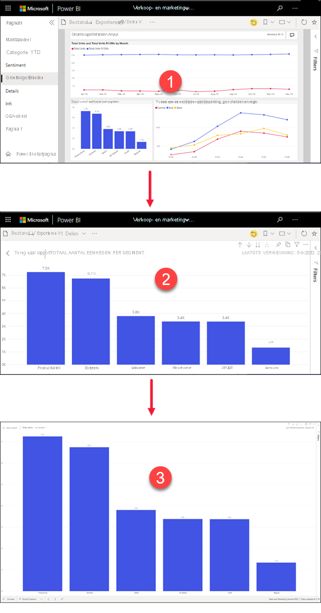
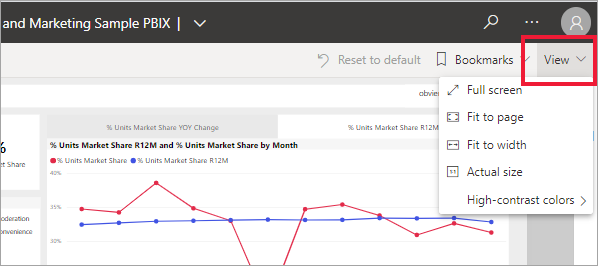
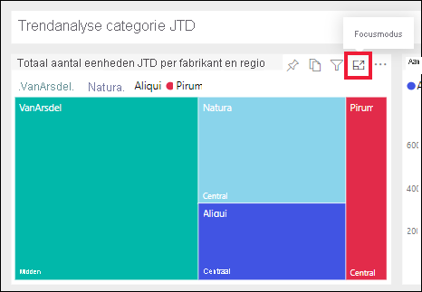
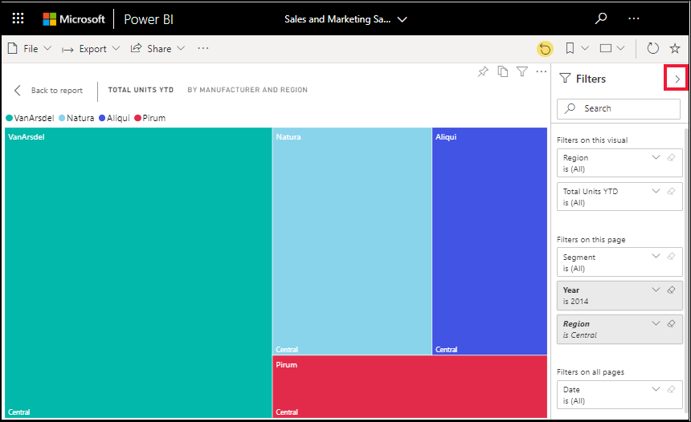
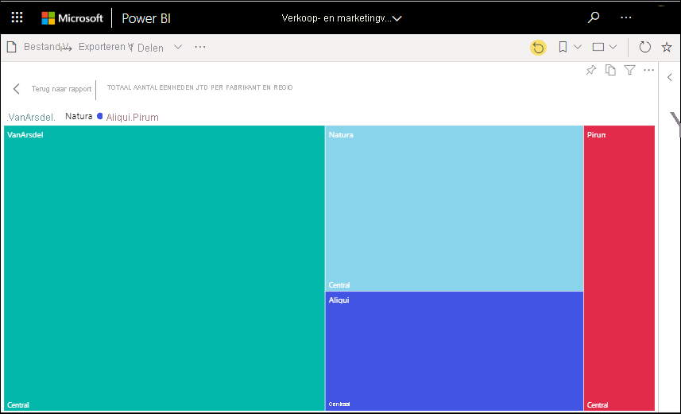

# Inhoud gedetailleerder weergeven: focusmodus en modus volledig scherm

[!INCLUDE [consumer-appliesto-yynn](../includes/consumer-appliesto-yynn.md)]

<iframe width="560" height="315" src="https://www.youtube.com/embed/dtdLul6otYE" frameborder="0" allowfullscreen></iframe>

De focusmodus en de modus volledig scherm zijn twee verschillende manieren waarop u meer details kunt zien in visuals, in rapporten en op dashboards.  Het belangrijkste verschil tussen de twee modi is dat in de modus volledig scherm alle deelvensters om de inhoud heen worden verwijderd, terwijl u in de focusmodus nog steeds kunt werken met uw visuals. Laten we de overeenkomsten en verschillen nader bekijken.  

|Inhoud    | Focusmodus  |Modus volledig scherm  |
|---------|---------|----------------------|
|Dashboard     |   Niet mogelijk     | ja |
|Rapportpagina   | Niet mogelijk  | ja|
|Rapportvisual | ja    | ja |
|Dashboardtegel | ja    | Niet mogelijk |
|Windows 10 Mobile | Niet mogelijk | Ja |

In het onderstaande voorbeeld zijn we begonnen met een rapport (1), hebben we een van de visuals geopend in de focusmodus (2) en hebben we diezelfde visual vervolgens geopend in de modus volledig scherm (3). 

## Wanneer gebruikt u de modus volledig scherm?

Geef de inhoud van de Power BI-service (dashboards, rapportpagina's en visuals) weer zonder de afleiding van menu's en navigatievensters.  U kunt uw tegel zonder andere storende factoren weergeven op het volledige scherm. Dit wordt soms TV-modus genoemd.   

Als u Power BI mobiel gebruikt, [is de modus Volledig scherm beschikbaar voor Windows 10 Mobile-apps](./mobile/mobile-windows-10-app-presentation-mode.md). 

Enkele gebruikstoepassingen voor de modus Volledig scherm zijn:

* Uw dashboard, visual of rapport op een vergadering of conferentie presenteren
* Het element op kantoor weergeven op een speciaal groot scherm of projector.
* Het element op een klein scherm weergeven.
* Controle in de vergrendelde modus: u kunt het scherm aanraken of de muis over tegels bewegen zonder het onderliggende rapport te openen.

## Wanneer gebruikt u de focusmodus?

Met de ***focusmodus** _ kunt u een visual of tegel uitvouwen (pop-out) om meer details te zien.  Misschien hebt u een dashboard of rapport dat te vol is en wilt u inzoomen op slechts één visual.  De focusmodus is de perfecte oplossing hiervoor.  

In de focusmodus kan een _zakelijke gebruiker* van Power BI werken met filters die zijn toegepast op het moment dat de visual is gemaakt.  In de Power BI-service kunt u de focusmodus gebruiken op een dashboardtegel of in een rapportvisual.

## Werken in de modus volledig scherm

De modus Volledig scherm is beschikbaar voor dashboards, rapportpagina's en visuals voor rapporten. 

- Selecteer het pictogram Volledig scherm om een dashboard te openen in de modus Volledig scherm  in de bovenste menubalk. 

- Selecteer **Weergave** > **Volledig scherm** om een rapportpagina te openen in de modus Volledig scherm.

    

- Om een visueel element in de modus Volledig scherm te zien, opent u het eerst in de focusmodus en selecteert u vervolgens **Weergave** > **Volledig scherm**.  

De geselecteerde inhoud vult nu het hele scherm. Eenmaal in de modus volledig scherm navigeert u met de menubalken boven- en onderaan (rapporten) of met het menu dat wordt weergegeven wanneer u de cursor verplaatst (dashboards en visuals). Omdat het volledige scherm beschikbaar is voor zeer uiteenlopende inhoud, variëren de navigatieopties.   

  * Selecteer de knop **Terug**, **Ga terug** of **Terug naar rapport** om naar de vorige pagina in uw browser te gaan. Als de vorige pagina een Power BI-pagina was, wordt deze weergegeven in de modus Volledig scherm.  De modus Volledig scherm blijft actief totdat u de modus afsluit.

  *     
    Met de knop **Aanpassen aan scherm** geeft u het dashboard zo groot mogelijk weer, zonder schuifbalken.  

    

  *        
    Soms hebt u geen behoefte aan schuifbalken, maar wilt u dat het dashboard wordt weergegeven over volledige breedte van de beschikbare ruimte. Selecteer de knop **Aanpassen aan breedte**.    

    

  *        
    Wanneer rapporten op het volledige scherm worden weergegeven, gebruikt u deze pijlen om door de pagina's in het rapport te bladeren.    
  *      
  Als u de modus Volledig scherm wilt afsluiten, selecteert u het pictogram **Volledig scherm afsluiten**.

      

## Werken in de focusmodus

De focusmodus is beschikbaar voor dashboardtegels en rapportvisuals. 

- U kunt een dashboardtegel in de focusmodus openen door met de muisaanwijzer over de tegel of rapportvisual te bewegen, **Meer opties** te selecteren (...) en **Openen in de focusmodus** te kiezen.

    .. 

- U kunt een visual in een rapport in de focusmodus openen, door met de muisaanwijzer over de visual te bewegen en het pictogram **focusmodus** te selecteren.  

   

De visual wordt geopend en op het volledige canvas weergegeven. U hebt nog steeds het deelvenster **Filters** dat u kunt gebruiken voor interactie met de visual. Het deelvenster **Filters** kan worden samengevouwen.

   

     

U kunt nog meer verkennen door [de filters aan te passen](end-user-report-filter.md) en te zoeken naar interessante ontdekkingen in uw gegevens. Als *zakelijke gebruiker* kunt u geen nieuwe filters toevoegen, niet de velden wijzigen die worden gebruikt in de visuals en geen nieuwe visuals maken.  U kunt echter wel met de bestaande filters werken. 

Wijzigingen op een dashboardtegel kunnen niet worden opgeslagen. Alle wijzigingen die u in de bestaande filters van een rapportvisual aanbrengt, worden echter opgeslagen wanneer u Power BI afsluit. Als u niet wilt dat uw wijzigingen worden onthouden in Power BI, selecteert u **Standaardinstelling herstellen**.   

U kunt de focusmodus sluiten en terugkeren naar het dashboard of het rapport door **Focusmodus sluiten** of **Terug naar rapport** te selecteren (in de linkerbovenhoek van de visual).

    

  

## Aandachtspunten en probleemoplossing

* Als u de focusmodus gebruikt voor een visual in een rapport, kunt u alle filters weergeven en gebruiken: op het niveau van visuals, op paginaniveau, bij drillthrough en op rapportniveau.    
* Als u de focusmodus gebruikt voor een visual in een dashboard, kunt u alleen de filters op het niveau van de visuele elementen weergeven en gebruiken.

## Volgende stappen

[Instellingen voor rapporten weergeven](end-user-report-view.md)