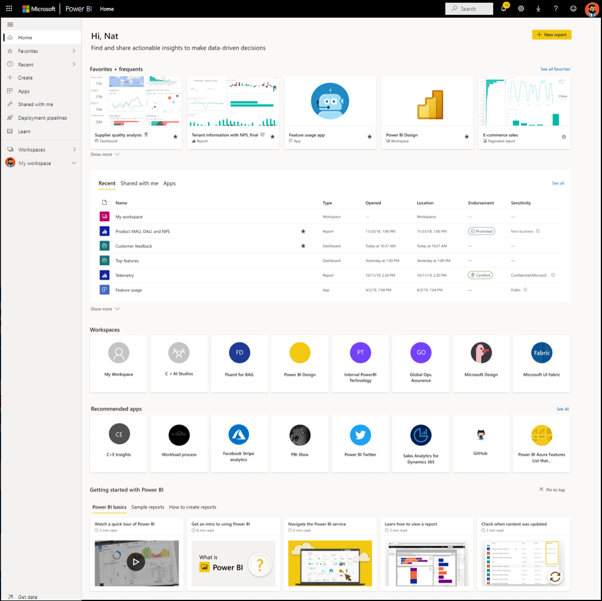
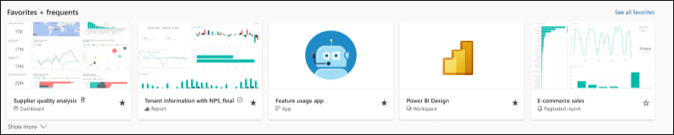
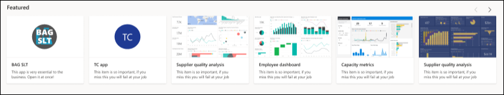

# Uw dashboards, rapporten en apps zoeken

[!INCLUDE[consumer-appliesto-yynn](../includes/consumer-appliesto-yynn.md)]
In Power BI verwijst de term *inhoud* naar apps, dashboards en rapporten. Inhoud wordt gemaakt door Power BI-*ontwerpers*, die de inhoud met collega's zoals u delen. Uw inhoud is toegankelijk en kan worden weergegeven in de Power BI-service, en de beste plek om in Power BI aan de slag te gaan is de **startpagina** van Power BI.

## Power BI Home verkennen
Nadat u zich hebt aangemeld bij de Power BI-service, selecteert u **Startpagina** in het navigatievenster. 

Power BI toont uw startcanvas, zoals in de volgende afbeelding. De lay-out en de inhoud van de startpagina zijn voor elke gebruiker verschillend. Verderop in dit artikel zien we in de startpagina een gloednieuwe gebruiker en een ervaren gebruiker. 
 

Power BI Home biedt drie verschillende manieren om uw inhoud te zoeken en weer te geven. Met elke manier krijgt u toegang tot dezelfde inhoudsgroep, alleen de manier waarop u die toegang krijgt, is anders. Soms kunt u het gemakkelijkst en snelst iets zoeken met behulp van een zoekopdracht, terwijl het op andere momenten handiger is om een *kaart* op het startcanvas te selecteren.

- Op het startcanvas wordt uw favoriete en meest gebruikte, meest recente en aanbevolen inhoud weergegeven en georganiseerd, samen met apps en werkruimten.  Als u nog geen ervaring hebt met de Power BI-service, kunt u de sectie Aan de slag volgen. Selecteer een kaart of een item in een lijst om deze te openen.
- Links ziet u een navigatiedeelvenster. Dit venster wordt ook wel gewoon navigatievenster genoemd. Selecteer  om het navigatiedeelvenster uit te vouwen. Op dit deelvenster wordt dezelfde inhoud iets anders georganiseerd, namelijk in de categorieën Favorieten, Recent, Apps en Gedeeld met mij. Vanaf dit punt kunt u lijsten met inhoud weergeven en de lijst die u wilt openen, selecteren.
- In de rechterbovenhoek staat een algemeen zoekvak waarmee u inhoud kunt zoeken op titel, naam of trefwoord.

In het volgende onderwerp worden al deze opties voor het zoeken en weergeven van inhoud stuk voor stuk bekeken.

## Startcanvas
Op het startcanvas ziet u alle inhoud die u gemachtigd bent om te gebruiken. Ook wordt het startcanvas bijgewerkt met aanbevolen inhoud en trainingsmateriaal. In het begin staat er misschien niet veel inhoud op uw startcanvas, maar dit verandert wanneer u Power BI begint te gebruiken met uw collega's.

 
Wanneer u in de Power BI-service werkt, krijgt u dashboards, rapporten en apps van collega's waardoor de Power BI-startpagina na verloop van tijd steeds voller zal raken. Na een tijdje ziet het er bijvoorbeeld uit zoals de volgende startpagina.

 
In de volgende onderwerpen gaan we dieper in op de startpagina voor een ervaren gebruiker, van boven naar beneden.

## De belangrijkste inhoud binnen handbereik

### Favorieten en vaak gebruikte items
Dit bovenste gedeelte bevat koppelingen naar de inhoud die u het meest gebruikt of die u als [aanbevolen of favoriet](end-user-favorite.md) hebt gemarkeerd. Merk op dat een aantal kaarten zwarte sterren bevatten. Deze zijn als favorieten gemarkeerd. 

Bovendien kunt u inhoud labelen als [aanbevolen](end-user-featured.md). Kies één dashboard of rapport dat u verwacht het meeste weer te geven en stel dit in als uw *aanbevolen* inhoud. Steeds wanneer u de Power BI-service opent, wordt uw aanbevolen dashboard als eerste weergegeven. 

### Uitgelicht
De sectie **Aanbevolen** bevat inhoud die uw beheerder een *niveau heeft verhoogd* naar Thuis. Dit is normaal gesproken inhoud die belangrijk of handig is bij het uitvoeren van uw taak. In dit voorbeeld bevat de aanbevolen inhoud metrische gegevens die een geslaagde poging bijhouden.

### Recent, Gedeeld met mij en Mijn apps
De volgende sectie is een lijst met tabbladen. 
- **Recent** bevat de inhoud die u het meest recent hebt bezocht. U ziet dat elk item van een tijdstempel is voorzien. 
- Collega's delen apps met u, maar ze kunnen ook afzonderlijke dashboards en rapporten delen. In het gedeelte **Gedeeld met mij** ziet u de dashboards en rapporten die uw collega's met u hebben gedeeld. 
- In het gedeelte **Mijn apps** staan apps die met u zijn gedeeld of die u [uit AppSource hebt gedownload](end-user-apps.md); hier vindt u de meest recente apps. 

### Werkruimten
Elke gebruiker van de Power BI-service heeft één **Mijn werkruimte**. **Mijn werkruimte** bevat alleen inhoud als u Microsoft-voorbeelden hebt gedownload of als u zelf dashboards, rapporten of apps hebt gemaakt. Voor veel *zakelijke gebruikers* is **Mijn werkruimte** leeg en zal ook leeg blijven. Als u een nieuwe gebruiker bent, hebt u slechts één werkruimte, **Mijn werkruimte** 

En als u die ene werkruimte selecteert, ziet u dat deze leeg is.

Telkens wanneer u [een app downloadt](end-user-app-marketing.md) of [een app met u wordt gedeeld](end-user-apps.md), wordt er een nieuwe werkruimte gemaakt. In de loop van de tijd zult u meer werkruimtes krijgen. Als u een *app-werkruimte* wilt openen, selecteert u deze op het startcanvas. 

De app wordt geopend op het canvas en u ziet de naam van de werkruimte in het navigatievenster. Binnen werkruimten van de Power BI-service wordt de inhoud gescheiden per type: dashboards en rapporten. In sommige gevallen hebt u ook werkmappen en gegevenssets. U ziet deze organisatie wanneer u een werkruimte selecteert. In dit voorbeeld bevat de werkruimte **Gardening** vier dashboards en twee rapporten.

### Aanbevolen apps
Op basis van uw activiteit en accountinstellingen worden in Power BI een aantal aanbevolen apps weergegeven. U kunt de app openen door de app-kaart te selecteren. Apps met het blauwe pictogram zijn [sjabloon-apps](../connect-data/service-template-apps-overview.md).

 
### Aan de slag-trainingsmateriaal
Welke resources exact voor u worden weergegeven, hangt af van uw activiteiten en instellingen en de Power BI-beheerder. Als u een nieuwe gebruiker bent, wordt de sectie Aan de slag weergegeven bovenaan de startpagina. Als u een nieuwe gebruiker bent en u bovenaan de pagina niet meer Aan de slag wilt zien, selecteert u **Onderaan vastmaken**.
 
## Het navigatievenster verkennen

Het navigatievenster classificeert uw inhoud zodanig dat u snel kunt vinden wat u nodig hebt.  

Gebruik het navigatievenster om dashboards, rapporten en apps te zoeken en tussen deze items te bewegen. In sommige gevallen is het gebruik van het navigatievenster de snelste manier om inhoud te openen. Het navigatievenster wordt weergegeven zodra u de startpagina opent en blijft op dezelfde plek staan wanneer u andere gebieden van de Power BI-service opent. U kunt het venster samenvouwen door het pictogram Verbergen te selecteren  .
  
In het navigatievenster wordt uw inhoud in containers geordend. Deze containers zijn vergelijkbaar met de items die u al op het startcanvas hebt gezien: Favorieten, Recent, Apps, Gedeeld met mij en werkruimten. Met behulp van de vervolgmenu's ziet u alleen de meest recente inhoud in elk van deze containers. U kunt ook naar inhoudslijsten navigeren om alle inhoud voor elke containercategorie weer te geven.
 
- Selecteer de koptekst om een van deze inhoudsdelen te openen en een lijst met alle items weer te geven.
- Selecteer het vervolgmenu om het meest recente item in elke container te zien ( **>** ).

    

 
Het navigatievenster biedt u een andere manier om snel de gewenste inhoud te zoeken. Inhoud wordt op een vergelijkbare manier als op het startcanvas georganiseerd, maar wordt in lijsten in plaats van in kaarten weergegeven. 

## Al uw inhoud doorzoeken
Soms kunt u inhoud het snelste vinden door hiernaar te zoeken. Stel bijvoorbeeld dat u hebt ontdekt dat een dashboard dat u al een tijdje niet meer hebt gebruikt, niet op het startcanvas wordt weergegeven. Of u weet nog wel dat uw collega Aaron iets met u heeft gedeeld, maar u weet niet meer hoe het heet of wat voor type inhoud Aaron met u heeft gedeeld; was het een dashboard of een rapport? Het is ook mogelijk dat u zo veel inhoud hebt dat het makkelijker is om te zoeken dan te scrollen of sorteren. 
 
Het zoekveld bevindt zich in de rechterbovenhoek van de menubalk op de startpagina. U kunt de volledige of gedeeltelijke naam van dat dashboard invoeren en naar dat dashboard zoeken. Daarnaast kunt u de naam van uw collega invoeren en inhoud zoeken die hij met u heeft gedeeld. De zoekopdracht is gericht op overeenkomsten in de volledige inhoud waarvan u eigenaar bent of waartoe u toegang hebt.

## Volgende stappen
Overzicht van de [Basisconcepten voor Power BI](end-user-basic-concepts.md)

Inhoud wordt weergegeven als een *kaart* of een lijst. Kaarten hebben een titel en een pictogram. Als u een kaart selecteert, wordt die inhoud geopend.