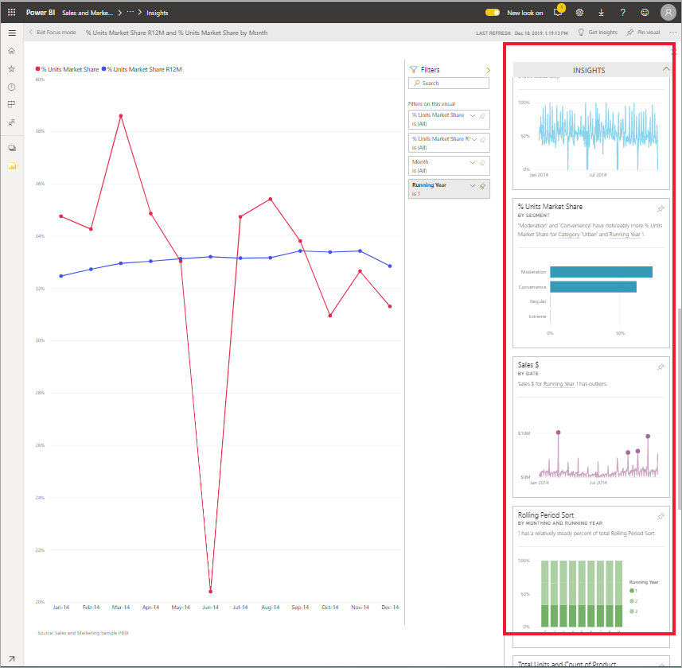
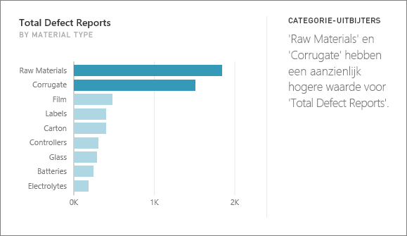
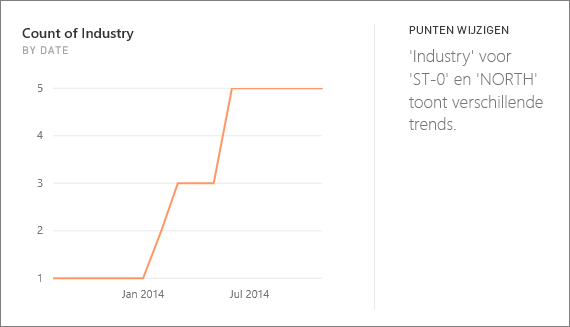
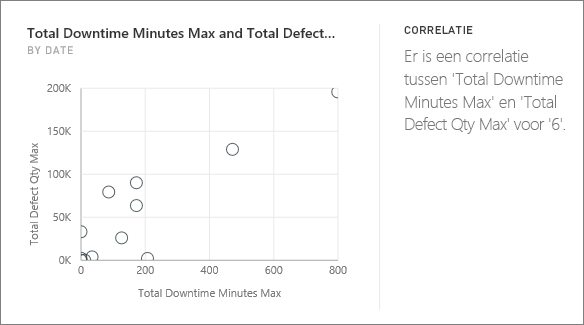
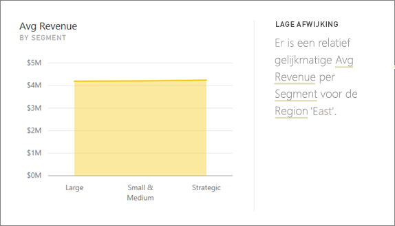
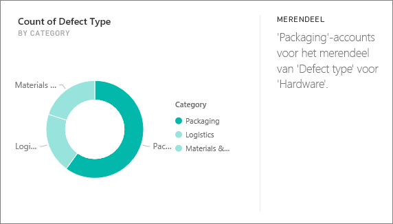
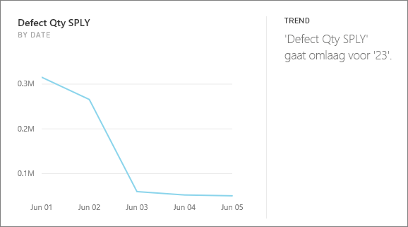
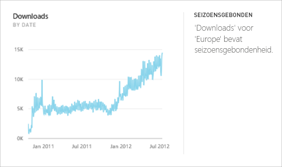
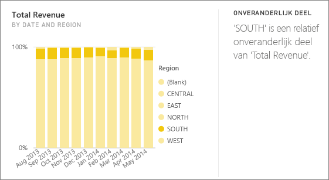
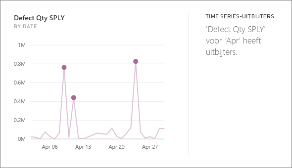

# Typen inzichten die door Power BI worden ondersteund

U kunt Power BI opdracht geven om uw gegevens te bekijken en interessante trends en patronen te vinden. Deze trends en patronen worden weergegeven in de vorm van visuals, *Inzichten* genoemd. 

Zie [Power BI-inzichten](end-user-insights.md) voor meer informatie over het gebruik van inzichten

## Hoe werkt Inzichten?
Power BI zoekt snel in verschillende subsets van uw gegevensset. Tijdens het zoeken wordt Power BI een set geavanceerde algoritmen toegepast om potentieel interessante inzichten te ontdekken. Power BI *-gebruikers* kunnen Inzichten uitvoeren op dashboardtegels.

## Een aantal termen
Power BI gebruikt statistische algoritmen voor het opsporen van inzichten. De algoritmen worden in het volgende deel van dit artikel weergegeven en beschreven. Voordat we de algoritmen behandelen, volgen hier de definities van enkele mogelijk onbekende termen. 

* **Meting**: een meting is een kwantitatief (numeriek) veld dat kan worden gebruikt om berekeningen uit te voeren. Veelvoorkomende berekeningen zijn Som, Gemiddelde en Minimum. Als ons bedrijf bijvoorbeeld skateboards maakt en verkoopt kunnen onze metingen bestaan uit het aantal verkochte skateboards en de gemiddelde winst per jaar.  
* **Dimensie**: dimensies zijn categorische (tekst)gegevens. Een dimensie beschrijft een persoon, object, item, producten, plaats en tijd. In een gegevensset zijn dimensies een manier om *metingen te groeperen* in nuttige categorieën. Sommige dimensies voor ons skateboardbedrijf zijn de verkoopcijfers (een meting) per model, kleur, land of marketingcampagne.   
* **Correlatie**: een correlatie vertelt ons over de samenhang tussen het gedrag van bepaalde zaken.  Als de toename- en afnamepatronen vergelijkbaar zijn, zijn ze positief gecorreleerd. Als de patronen tegenovergesteld zijn, zijn ze negatief gecorreleerd. Als bijvoorbeeld de verkoop van ons rode skateboard steeds stijgt na een marketingcampagne op tv, zijn de verkoop van het rode skateboard en de tv-campagne positief gecorreleerd.
* **Tijdreeksen**: een tijdreeks is een manier om tijd weer te geven als opeenvolgende gegevenspunten. Deze gegevenspunten kunnen stappen zijn, zoals seconden, uren, maanden of jaren.  
* **Doorlopende variabele**: een doorlopende variabele kan een willekeurige waarde zijn tussen de minimum- en maximumlimieten; anders is het een discrete variabele. Voorbeelden zijn temperatuur, gewicht, leeftijd en tijd. Doorlopende variabelen kunnen breuken of delen van de waarde bevatten. Het totale aantal verkochte blauwe skateboards is een discrete variabele omdat we geen halve skateboards kunnen verkopen.  

## Wat voor soorten inzichten kunt u vinden?
Dit zijn de algoritmen die Power BI gebruikt. 

### Categorie-uitbijters (boven/onder)
Markeert gevallen waarbij een of twee categorieën een veel grotere waarden hebben dan andere categorieën.  

### Punten wijzigen in een tijdreeks
Geeft aan wanneer er belangrijke wijzigingen in trends in een tijdreeks van gegevens plaatsvinden.

### Correlatie
Detecteert gevallen waarin meerdere metingen een vergelijkbaar patroon of een vergelijkbare trend weergeven wanneer ze worden afgezet tegen een categorie of waarde in de gegevensset.

### Lage afwijking
Detecteert gevallen waarbij de gegevenspunten niet ver van het gemiddelde liggen.

### Meerderheid (belangrijke factoren)
Wanneer een meerderheid van de totale waarde kan worden toegeschreven aan één factor wanneer de waarde wordt onderverdeeld op basis van een andere dimensie.  

### Algemene trends in Time Series
Detecteren van opwaartse of neerwaartse trends in Time Series-gegevens.

### Seizoensgebondenheid in Time Series
Hiermee worden periodieke patronen in Time Series-gegevens gedetecteerd, zoals wekelijkse, maandelijkse of jaarlijkse seizoensgebondenheid.

### Onveranderlijk deel
Markeert gevallen waarbij voor een continue variabele er een correlatie bestaat tussen het aandeel van de waarde van een onderliggend item in relatie tot de totale waarde van een bovenliggend item.

### Time Series-uitbijters
Detecteert of er specifieke datums of tijden voor verschillende tijdreeksen zijn met waarden die aanzienlijk afwijken van de andere datum-/tijdwaarden.

## Volgende stappen
[Power BI-inzichten](end-user-insights.md)

Hebt u nog vragen? [Misschien dat de Power BI-community het antwoord weet](https://community.powerbi.com/)

