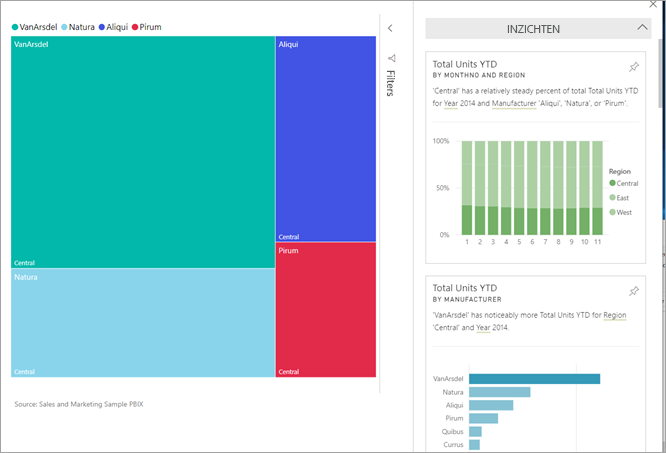

# Gegevensinzichten over dashboardtegels bekijken met Power BI

[!INCLUDE[consumer-appliesto-yyny](../includes/consumer-appliesto-yyny.md)]

Elke [tegel](end-user-tiles.md) van een visual op het dashboard is een poort naar het verkennen van gegevens. Als u een tegel selecteert, wordt er een rapport geopend [of wordt Q&A geopend](end-user-q-and-a.md) waarin u kunt filteren en sorteren, en dieper kunt ingaan op de gegevensset achter het rapport. En wanneer u inzichten uitvoert, wordt de gegevensverkenning voor u uitgevoerd met Power BI.

Voer inzichten uit om interessante interactieve visuals op basis van uw gegevens te genereren. Inzichten kunnen worden uitgevoerd voor een specifieke dashboardtegel en u kunt zelfs inzichten uitvoeren voor een inzicht!

De functie voor inzichten is gebouwd op een groeiende [set geavanceerde analytische algoritmen](end-user-insight-types.md) die zijn ontwikkeld samen met Microsoft Research. We blijven Microsoft Research gebruiken om ervoor te zorgen dat meer mensen op nieuwe en intuïtieve manieren inzichten in hun gegevens kunnen vinden.

## Inzichten uitvoeren op een dashboardtegel
Als u inzichten uitvoert voor een dashboardtegel, wordt in Power BI alleen gezocht in de gegevens die zijn gebruikt om deze specifieke dashboardtegel te maken. 

1. [Open een dashboard.](end-user-dashboards.md)
2. Beweeg de muisaanwijzer over een tegel. selecteer **Meer opties** (...) en kies **Inzichten weergeven**. 

    

3. De tegel wordt geopend in de [focusmodus](end-user-focus.md) met de kaarten voor inzichten weergegeven aan de rechterkant.    
   
        
4. Wekt een bepaald inzicht uw interesse? Selecteer deze kaart om dieper te graven. Het geselecteerde inzicht wordt aan de linkerkant weergegeven en de nieuwe kaarten met inzichten, die uitsluitend zijn gebaseerd op dit ene inzicht, worden aan de rechterkant weergegeven.    

 ## Interactie met de kaarten met inzichten
Als er een inzicht is geopend, kunt u doorgaan met verkennen.

   * Filter de visual op het canvas.  Als u de filters wilt weergeven, selecteert u de pijl in de rechterbovenhoek om het deelvenster Filters uit te vouwen.

      
   
   * Inzichten uitvoeren op de inzichtkaart zelf. Dit wordt vaak aangeduid als **verwante inzichten**. Selecteer een inzichtkaart om deze actief te maken. Deze wordt verplaatst naar de linkerkant van het rapportcanvas en nieuwe kaarten, die uitsluitend zijn gebaseerd op dit ene inzicht, worden aan de rechterkant weergegeven.
   
      
   
     
Selecteer in de linkerbovenhoek **Focusmodus sluiten** om terug te keren naar het rapport.

## Aandachtspunten en probleemoplossing
- **Inzichten weergeven** werkt niet met alle typen dashboardtegel. Het is bijvoorbeeld niet beschikbaar voor aangepaste Power BI-visuals.<!--[Power BI visuals](end-user-custom-visuals.md)-->

## Volgende stappen

Inzichten uitvoeren op rapportvisuals [met de functie Analyseren](end-user-analyze-visuals.md)    
Meer informatie over de [typen inzichten die beschikbaar zijn](end-user-insight-types.md)

