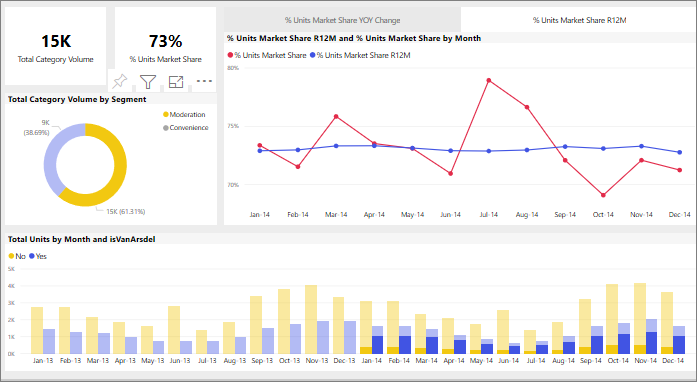

# Hoe visuele elementen elkaar kruislings filteren in een Power BI-rapport
Een van de geweldige functies van Power BI is de manier waarop alle visuals op een rapportpagina onderling zijn verbonden. Als u een gegevenspunt in een van deze visuals selecteert, worden alle andere visuals op de pagina die deze gegevens bevatten, gewijzigd op basis van deze selectie. 

## Hoe visuals met elkaar communiceren

Wanneer een gegevenspunt in één visual op een rapportpagina wordt geselecteerd, worden de andere visuals op de pagina kruislings gefilterd of kruislings gemarkeerd. Hoe de visuals op een pagina precies samenwerken, wordt ingesteld door de *rapportontwerper*. *Ontwerpers* kunnen visuele interacties in- en uitschakelen, en de standaardinstellingen voor kruislings filteren, kruislings markeren en [zoomen](end-user-drill.md) wijzigen. 

Als u nog geen hiërarchieën of inzoomen hebt gevonden, kunt u er alles over te weten komen door het lezen van [inzoomen in Power BI](end-user-drill.md). 

Kruislings filteren en kruislings markeren kan handig zijn om aan te geven hoe een van de waarden in uw gegevens bijdraagt aan een andere. Als u bijvoorbeeld het segment Beheer in het ringdiagram selecteert, wordt de bijdrage van dat segment aan elke kolom in het diagram ‘Totaal aantal eenheden per maand’ gemarkeerd en wordt het lijndiagram gefilterd.

Zie [Over filteren en markeren](end-user-report-filter.md). 

  
> [!NOTE]
> De termen *kruislings filteren* en *kruislings markeren* worden gebruikt om de hier beschreven werking te onderscheiden van wat er gebeurt wanneer u het venster **Filters** gebruikt en visuals markeert.  

## Aandachtspunten en probleemoplossing
- Als uw rapport een visual bevat die ondersteuning biedt voor [analyseren](end-user-drill.md), heeft het analyseren van één visual standaard geen invloed op de andere visuals op de rapportpagina.     
- Als u visualisatieA gebruikt om te communiceren met visualisatieB, worden filters op het visuele niveau van visualisatieA toegepast op visualisatieB.

## Volgende stappen
[How to use report filters](../power-bi-how-to-report-filter.md) (Rapportfilters gebruiken)
