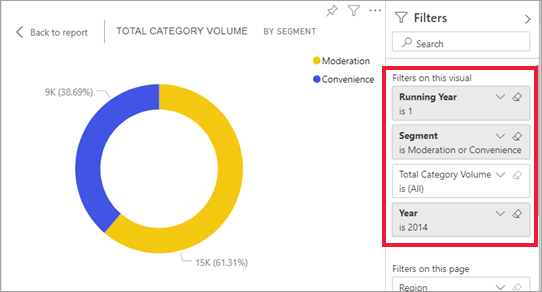

# Hoe visuele elementen elkaar kruislings filteren in een Power BI-rapport

[!INCLUDE[consumer-appliesto-yyny](../includes/consumer-appliesto-yyny.md)]

Een van de geweldige functies van Power BI is de manier waarop alle visuals op een rapportpagina onderling zijn verbonden. Als u een gegevenspunt in een van deze visuals selecteert, worden alle andere visuals op de pagina die deze gegevens bevatten, gewijzigd op basis van deze selectie. 

## Hoe visuals met elkaar communiceren

Wanneer een gegevenspunt in één visual op een rapportpagina wordt geselecteerd, worden de andere visuals op de pagina kruislings gefilterd of kruislings gemarkeerd. Hoe de visuals op een pagina precies samenwerken, wordt ingesteld door de *rapportontwerper*. *Ontwerpers* kunnen visuele interacties in- en uitschakelen, en de standaardinstellingen voor kruislings filteren, kruislings markeren en [zoomen](end-user-drill.md) wijzigen. 

Als u nog geen hiërarchieën of inzoomen hebt gevonden, kunt u er alles over te weten komen door het lezen van [inzoomen in Power BI](end-user-drill.md). 

### Kruislings filteren en kruislings markeren

Kruislings filteren en kruislings markeren kan handig zijn om aan te geven hoe een van de waarden in uw gegevens bijdraagt aan een andere. De termen *kruislings filteren* en *kruislings markeren* worden gebruikt om de hier beschreven werking te onderscheiden van wat er gebeurt wanneer u het venster **Filters** gebruikt en visuals markeert.  

We gaan deze voorwaarden definiëren terwijl we de onderstaande rapportpagina's bekijken. Het ringdiagram 'Totaal categorievolume per segment' bevat twee waarden: 'Toezicht' en 'Gemak'. 

1. Laten we eens kijken wat er gebeurt wanneer we **Toezicht** selecteren.

    

2. Bij **kruislings filteren** worden gegevens verwijderd die niet van toepassing zijn. Wanneer u **Toezicht** selecteert in het ringdiagram, wordt het lijndiagram kruislings gefilterd. In het lijndiagram worden nu alleen gegevenspunten weergegeven voor het segment Toezicht. 

3. Bij **kruislings markeren** blijven alle oorspronkelijke gegevenspunten behouden, maar wordt het gedeelte dat niet van toepassing is op uw selectie donkergrijs weergegeven. Wanneer u **Toezicht** selecteert in het ringdiagram, wordt het kolomdiagram kruislings gemarkeerd. In het kolomdiagram worden alle gegevens die van toepassing zijn op het segment Gemak donkergrijs weergegeven en worden alle gegevens die van toepassing zijn op het segment Toezicht gemarkeerd. 

## Aandachtspunten en probleemoplossing
- Als uw rapport een visual bevat die ondersteuning biedt voor [analyseren](end-user-drill.md), heeft het analyseren van één visual standaard geen invloed op de andere visuals op de rapportpagina. De *ontwerper* van het rapport kan dit gedrag echter wijzigen, dus controleer uw analyseerbare visuals om te zien of **Analysefilters voor andere visuals** is ingeschakeld door de *ontwerper* van het rapport.
    
- Filters op visualniveau blijven behouden wanneer andere visuals op de rapportpagina kruislings worden gefilterd en gemarkeerd. Dus als u of de rapportontwerper filters op visualniveau toepast op VisualA en u VisualA gebruikt om interactief met VisualB te werken, worden filters op visualniveau toegepast op VisualB.

    

## Volgende stappen
[How to use report filters](../power-bi-how-to-report-filter.md) (Rapportfilters gebruiken)    

[Over filteren en markeren](end-user-report-filter.md). 
