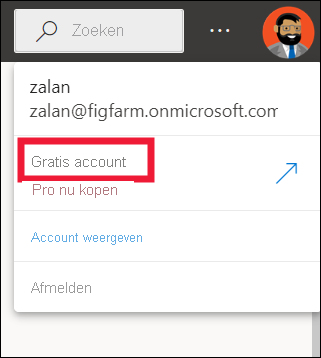
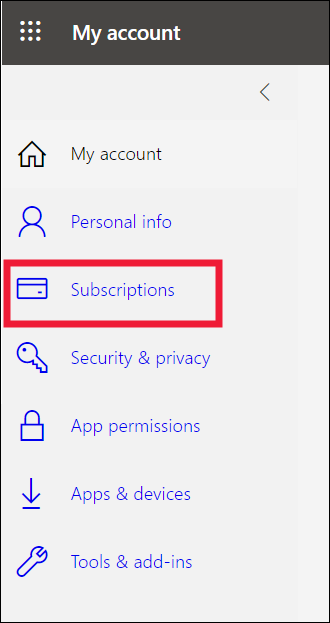

# Licenties en abonnementen voor *zakelijke gebruikers*

[!INCLUDE[consumer-appliesto-ynnn](../includes/consumer-appliesto-ynnn.md)]

Als [*zakelijke gebruiker*](end-user-consumer.md) gebruikt u de Power BI-service om rapporten en dashboards te verkennen, zodat u zakelijke beslissingen op basis van gegevens kunt nemen. Als u Power BI al een tijdje hebt gebruikt of als u hebt gepraat met collega's die *ontwerper* zijn, hebt u waarschijnlijk wel ontdekt dat bepaalde functies alleen werken als u een bepaald type licentie, abonnement of machtigingen hebt.

Wat u in de Power BI-service kunt doen, is afhankelijk van drie factoren:
-    het type licentie en abonnement dat u gebruikt,
-    de locatie waar de inhoud is opgeslagen, en
-    de rollen en machtigingen die aan u zijn toegewezen.

In dit artikel worden de mogelijkheden van elk licentietype beschreven en leest u hoe *de locatie waar inhoud is opgeslagen* invloed kan hebben op *hetgeen u met deze inhoud kunt doen*. U leert ook hoe u uw licentie en abonnement opzoekt en ontdekt waar uw inhoud is opgeslagen. Zie [Werkruimterollen](end-user-workspaces.md) voor meer informatie over rollen en machtigingen.

## Licenties

Elke gebruiker van de Power BI-service heeft een *gratis* licentie, een *Pro* -licentie of een *Premium-licentie per gebruiker**. Als u een *zakelijke gebruiker* van Power BI bent, gebruikt u waarschijnlijk een licentie die wordt beheerd door uw Power BI-beheerder.

Het is mogelijk om meer dan één licentie tegelijkertijd te gebruiken.  De service biedt altijd een ervaring die vergelijkbaar is met de meest tolerante licentie die u momenteel hebt.

## Abonnement op Power BI Premium capaciteit

Premium is een organisatie- *abonnement* dat een andere manier biedt om inhoud op te slaan in een virtuele container met de naam *capaciteit*. Met Premium-capaciteit kan iedereen met machtigingen, of deze zich binnen of buiten uw organisatie bevinden, inhoud weer geven die is opgeslagen in deze Premium-capaciteit, zonder dat hiervoor afzonderlijke Power BI Pro of Premium-licenties per gebruiker worden aangeschaft. 

Dankzij de Premium-capaciteit is de distributie van inhoud door Pro-gebruikers verbreidd zonder dat hiervoor Pro-licenties nodig zijn voor de ontvangers die de inhoud weer geven. Degene die de inhoud in de Premium-capaciteit maakt, maakt gebruik van een Pro-licentie om verbinding te maken met gegevens bronnen, gegevens te model leren en rapporten en dash boards te maken die zijn opgeslagen in een werk ruimte in Premium-capaciteit. Gebruikers zonder een Pro-licentie hebben nog steeds toegang tot een werkruimte die zich in de Power BI Premium-capaciteit bevindt, op voorwaarde dat ze beschikken over een [rol in die werkruimte](end-user-workspaces.md). Als de eigenaar van de werk ruimte een app maakt op basis van inhoud in die werk ruimte, kunnen gebruikers zonder een Pro-licentie de app nog steeds bekijken in Premium-capaciteit, zolang ze wel machtigingen hebben gekregen voor die app. 

Binnen deze werkruimten wijzen ontwerpers rollen toe, zoals **Viewer**, **Inzender**, **Lid** en **Beheerder**. Deze rollen bepalen in hoeverre collega's de inhoud kunnen gebruiken. Zie [Machtigingen en rollen voor werkruimten](end-user-workspaces.md) voor meer informatie. 

Wanneer een ontwerp functie een app maakt en publiceert, krijgen ze toegang tot hele organisaties of personen. De mate waarin u met de inhoud van de app kunt werken, is afhankelijk van de specifieke toegangs machtigingen die aan u zijn verleend. U kunt bijvoorbeeld toegang krijgen om de app weer te geven, verbinding te maken met de onderliggende gegevens sets, kopieën van rapporten te maken of de inhoud te delen.

Zie [Wat is Microsoft Power BI Premium?](../admin/service-premium-what-is.md) voor meer informatie over Premium-capaciteit.

## Ontdekken welke licenties u hebt
Selecteer uw profielafbeelding om accountgegevens weer te geven. Zalan maakt gebruik van een gratis licentie. Andere typen licenties zijn: **Pro** en **Premium per gebruiker**. 

Als u meer informatie over uw account wilt zien, selecteert u **Account weergeven**. 

<!-- [Your Microsoft **My account** page](https://portal.office.com/account) opens in a new browser tab.  To see what licenses are assigned to you.  Select the tab for  **Subscriptions**.

This first user, Pradtanna, has Office 365 E5, which includes a Power BI Pro license.

This second user, Zalan, has a Power BI free license. 

 

## Find out if you have access to Premium capacity

Next, check to see if you're part of an organization that has Premium capacity. Either of the users above, Pro or free, could belong to an organization that has Premium capacity.  Let's check for our second user, Zalan.  

We can determine whether Zalan's organization has Premium capacity by looking up the amount of storage available. 

- In the Power BI service, select **My workspace** and then select the cog icon from the upper right corner. Choose **Manage personal storage**.

    

    If you see more than 10 GB, then you're a member of an organization that has a Premium subscription. The image below shows that Zalan's organization has up to 100 GB of storage. Zalan, personally, doesn't own 100GB as indicated by the heading **Owned by us**.  

    

    Notice that a Pro user has already shared a workspace with Zalan. The diamond icon shows that this workspace is stored in Premium capacity. 

    If you see any amount of storage, the words **Pro user** next to your name, and the heading **Owned by me**, then you have a Premium per-user license.  

    -->

## Inhoud identificeren die wordt gehost in Premium-capaciteit

Er zijn een aantal manieren om inhoud te identificeren die is opgeslagen in Premium-capaciteit. Een manier is om apps en app-werk ruimten te zoeken met een ruit pictogram. De ruit geeft aan dat de inhoud is opgeslagen in Premium-capaciteit. 

In de onderstaande afbeelding zijn drie van de apps opgeslagen in Premium-capaciteit.

Als u een gebruiker bent met een gratis licentie, hebt u, zolang de **ontwerper** de werkruimte in een Premium-capaciteit plaatst, de mogelijkheid om *binnen die werkruimte* gedeelde inhoud weer te geven, met collega's samen te werken, met de app-dashboards en rapporten te werken, en meer. De strekking van uw machtigingen wordt ingesteld door uw Power BI-beheerder en door de inhoudontwerper.

## Alles samenvoegen

Er zijn veel verschillende manieren waarop organisaties hun Power BI-abonnementen en-licenties kunnen ordenen. Van een perspectief van *zakelijke gebruikers* is een van de meest voorkomende scenario's wanneer een organisatie een Premium-abonnement koopt, de beheerder Pro-licenties toewijst aan een kleine groep gebruikers en alle andere gebruikers met gratis licenties werken. Normaal gesp roken wijst de beheerder de Pro-licenties toe aan de werk nemers die inhoud gaan maken en delen. De Pro-gebruikers maken [werk ruimten](end-user-workspaces.md) en voeg inhoud (Dash boards, rapporten, gegevens sets, apps) toe aan deze werk ruimten. Als u wilt dat vrije gebruikers samen werken in deze werk ruimten, wijst de beheerder of de Pro-gebruiker vervolgens de werk ruimten toe aan een *Premium-capaciteit*.  

|Licentietype  |Niet in Premium-capaciteit | Premium-capaciteit  |
|---------|---------|---------|
|**Gratis**     |  Gebruik als een persoonlijke sandbox waar u inhoud voor uzelf maakt en met die inhoud communiceert. Een gratis licentie is een goede manier om de Power BI-service te proberen. U kunt geen inhoud van anderen gebruiken of uw eigen inhoud met anderen delen 1     |   Werk met inhoud die aan een Premium-capaciteit is toegewezen en met u is gedeeld. Gratis, Premium per gebruiker en Pro-gebruikers kunnen samen werken zonder dat de gratis gebruikers hiervoor Pro-accounts hoeven te hebben.      |
|**Pro**     |  Werk samen met Premium per gebruiker en Pro-gebruikers door inhoud te maken en te delen.        |  Werk samen met gratis, Premium per gebruiker en Pro-gebruikers door inhoud te maken en te delen.       |

1Bekijk [Aandachtspunten en probleemoplossing](#considerations-and-troubleshooting).

In onderstaand diagram ziet u links de Pro-gebruikers die inhoud in app-werkruimten maken en delen.

- **Werk ruimte A** is niet gemaakt in een Premium-capaciteit.

- **Werk ruimte B** is gemaakt en opgeslagen in een Premium-capaciteit. Deze werkruimte heeft een ruitpictogram.  

    

De Power BI Pro-*ontwerper* kan deze werkruimten gebruiken om inhoud te delen en samen te werken met andere Pro-gebruikers. Maar de enige manier waarop de Power BI Pro-gebruiker inhoud kan delen en kan samenwerken met gratis gebruikers is met behulp van werkruimte B, die zich in een Premium-capaciteit bevindt.  In de werkruimte wijst de ontwerper rollen toe aan mensen die samenwerken. Uw rol bepaalt welke acties u in de werkruimte kunt uitvoeren. *Zakelijke gebruikers* van Power BI wordt gewoonlijk de rol *Viewer* toegewezen. Zie [Werkruimten voor zakelijke gebruikers van Power BI](end-user-workspaces.md) voor meer informatie over rollen.

## Aandachtspunten en probleemoplossing

- Het is mogelijk om meer dan één Power BI-licentie te hebben. De Power BI-service biedt altijd de ervaring die vergelijkbaar is met de beste licentie die u momenteel hebt. Als u bijvoorbeeld zowel een Pro-licentie als een gratis licentie hebt, wordt voor de Power BI-service de Pro-licentie gebruikt.

- Als u inhoud wilt maken en delen (Dash boards, rapporten, apps) of inhoud wilt openen die iemand anders met u heeft gedeeld, moet u beschikken over een Pro-gebruikers licentie of een Premium per gebruikers licentie. U kunt zich aanmelden voor een afzonderlijke gratis 60-daagse proefversie van Power BI Pro. Selecteer het dialoogvenster Upgraden dat wordt weergegeven in de Power BI-service wanneer u een Pro-functie wilt gebruiken.

    

  Wanneer de proefversie van 60 dagen is verlopen, wordt uw licentie weer gewijzigd in een (gratis) Power BI-licentie. Als uw licentie wordt gewijzigd, hebt u geen toegang meer tot functies waarvoor een Power BI Pro-licentie is vereist. Als u door wilt gaan met een Pro-licentie, neemt u contact op met uw beheerder of helpdesk over het kopen van een Power BI Pro-licentie. Als u geen beheerder of helpdesk hebt, gaat u naar [de pagina met prijzen van Power BI](https://powerbi.microsoft.com/pricing/).

- Als u zich zelfstandig hebt geregistreerd voor een gratis licentie via een knop als *Gratis uitproberen*, verloopt die licentie nooit. Dus als u een upgrade naar een Pro-proefversie uitvoert of als uw organisatie u een Pro-licentie biedt en uw proefversie verloopt of uw organisatie uw Pro-licentie verwijdert, beschikt u nog steeds over de gratis licentie om op terug te vallen, tenzij u de licentie annuleert.

- 1 Een gratis gebruikerslicentie voor de Power BI-service is perfect voor iemand die deze versie wil verkennen of wil gebruiken voor analyse van persoonlijke gegevens en visualisaties met **Mijn werkruimte**. Een zelfstandig gebruiker met een gratis licentie gebruikt Power BI niet om met collega's samen te werken. Zelfstandige gebruikers met een gratis licentie kunnen geen inhoud weergeven die door anderen wordt gedeeld of hun eigen inhoud delen met andere Power BI-gebruikers.

## Volgende stappen

- [Ben ik een *zakelijke gebruiker* van Power BI?](end-user-consumer.md)    
- [Meer informatie over werkruimten](end-user-workspaces.md)    
- [Power BI-functies voor zakelijke gebruikers weergeven per licentietype](end-user-features.md)
