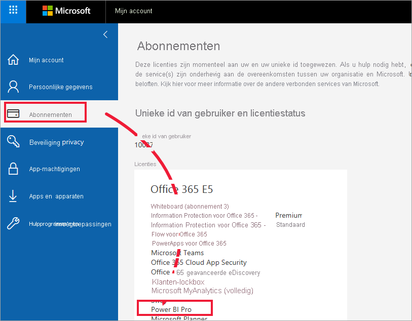
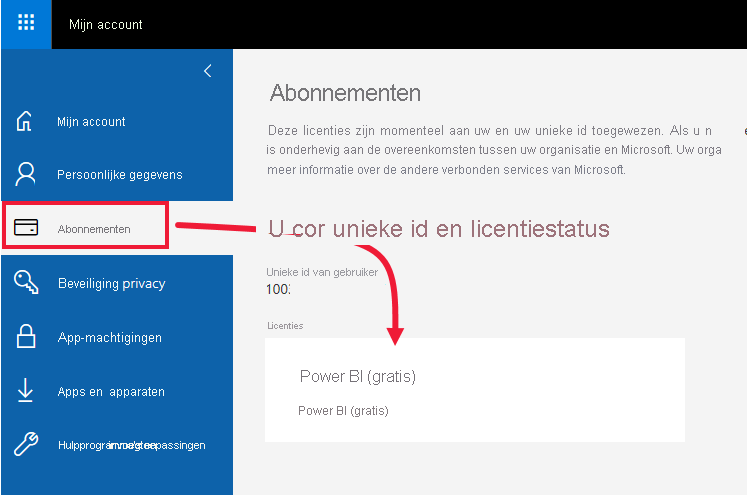
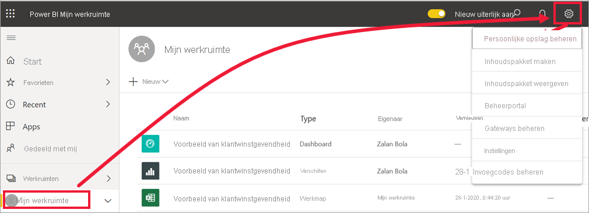
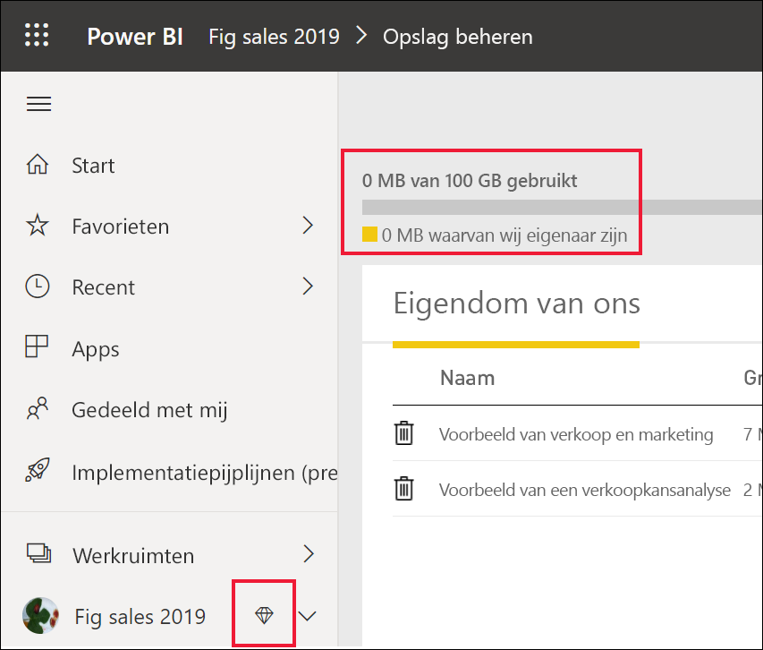
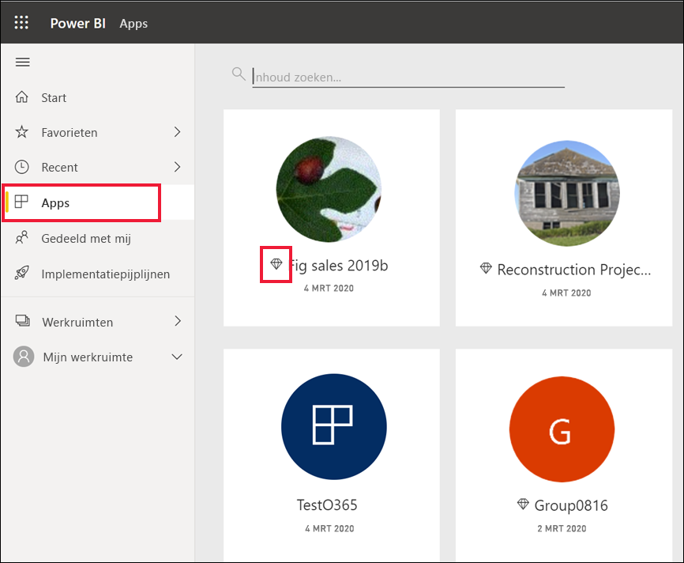
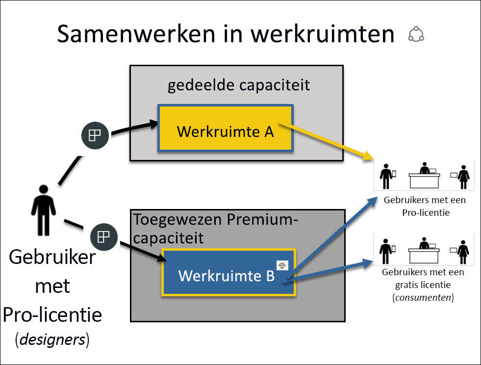
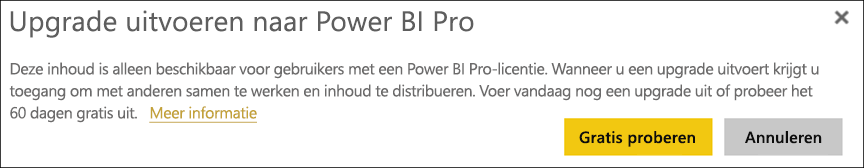

# De Power BI-service gebruiken als een *consument*

[!INCLUDE[consumer-appliesto-ynnn](../includes/consumer-appliesto-ynnn.md)]

Als [*consument*](end-user-consumer.md) gebruikt u de Power BI-service om rapporten en dashboards te verkennen om zakelijke beslissingen op basis van gegevens te nemen. Als u Power BI al een tijdje hebt gebruikt of als u hebt gechat met collega's die *ontwerper* zijn, hebt u waarschijnlijk wel ontdekt dat bepaalde functies alleen werken als u een bepaald type licentie, abonnement of machtigingen hebt. 

Wat u in de Power BI-service kunt doen, is afhankelijk van drie factoren:
-    het type licentie en abonnement dat u gebruikt
-    de locatie waar de inhoud is opgeslagen
-    de rollen en machtigingen die aan u zijn toegewezen

In dit artikel worden de mogelijkheden van elk licentietype beschreven en leest u hoe *de locatie waar inhoud is opgeslagen* invloed kan hebben op *hetgeen u met deze inhoud kunt doen*. U leert ook hoe u uw licentie en abonnement opzoekt en ontdekt waar uw inhoud is opgeslagen. Zie [Werkruimterollen](end-user-workspaces.md) voor meer informatie over rollen en machtigingen.

## Licenties

Elke gebruiker van de Power BI-service gebruikt ofwel een *gratis* licentie, of een *Pro*-licentie. Als u een Power BI-*consument* bent, dan gebruikt u waarschijnlijk een gratis licentie die wordt beheerd door uw beheerder. 

Het is mogelijk om meer dan één licentie tegelijkertijd te gebruiken.  De service biedt u altijd een ervaring die vergelijkbaar is met de beste licentie die u momenteel hebt. 

## Power BI Premium-capaciteit

Premium is een organisatorisch abonnement dat u een andere manier biedt om inhoud op te slaan: in toegewezen capaciteit. Met Premium is iedereen die binnen én buiten uw organisatie werkt in staat om uw Power BI-inhoud te bekijken, zonder afzonderlijke Power BI-licenties te hoeven aanschaffen. 

Premium voorziet in een wijdverbreide distributie van inhoud door Pro-gebruikers zonder dat ontvangers die de inhoud bekijken een Pro-licentie nodig hebben. Pro-licenties zijn vereist voor ontwerpers van inhoud. Ontwerpers maken verbinding met gegevensbronnen, modelleren gegevens en maken rapporten en dashboards die zijn verpakt als werkruimte-apps. Gebruikers zonder een Pro-licentie hebben nog steeds toegang tot een werkruimte die zich in de Power BI Premium-capaciteit bevindt, zolang ze een rol van een kijker hebben.

In die werkruimten wijzen ontwerpers rollen toe, zoals **Kijker**, **Inzender**, **Lid** en **Beheerder**. Deze rollen bepalen in welke mate collega's interactief met de inhoud kunnen werken. Zie [Machtigingen en rollen voor werkruimten](end-user-workspaces.md) voor meer informatie. 

Zie [Wat is Microsoft Power BI Premium?](../service-premium-what-is.md) voor meer informatie over Premium-capaciteit.

## Ontdekken welke licenties u hebt

Ga naar [uw **Mijn account**-pagina](https://portal.office.com/account) van Microsoft om te zien welke licenties aan u zijn toegewezen.  Selecteer het tabblad voor **Abonnementen**.

Deze eerste gebruiker, Pradtanna, heeft Office 365 E5 met daarin een Power BI Pro-licentie.

Deze tweede gebruiker, Zalan, heeft een gratis Power BI-licentie. 

## Uitzoeken of u toegang hebt tot Premium-capaciteit

Kijk hierna of u deel uitmaakt van een organisatie die over Premium-capaciteit beschikt. Een van de bovenstaande gebruikers, Pro of gratis, kan behoren tot een organisatie die Premium-capaciteit heeft.  Laten we dit controleren voor onze tweede gebruiker, Zalan.  

We kunnen zien of Zalans organisatie over Premium-capaciteit beschikt door te kijken hoeveel opslag beschikbaar is. 

- Selecteer in de Power BI-service **Mijn werkruimte** en selecteer vervolgens het tandwielpictogram in de rechterbovenhoek. Kies **Persoonlijke opslag beheren**.

    

    Als u meer dan 10 GB ziet, bent u are lid van een organisatie die over een Premium-abonnement beschikt. In de onderstaande afbeelding ziet u dat Zalans organisatie tot 100 GB aan opslag heeft.  

    

U ziet dat een Pro-gebruiker al een werkruimte heeft gedeeld met Zalan. Het ruitpictogram geeft aan dat deze werkruimte is opgeslagen in Premium-capaciteit. 

## Inhoud identificeren die wordt gehost in Premium-capaciteit

Een andere manier om erachter te komen of uw organisatie Premium-capaciteit heeft, is apps en app-werkruimten met een ruitpictogram te zoeken. De ruit geeft aan dat de inhoud is opgeslagen in Premium-capaciteit. 

In de onderstaande afbeelding zijn drie van de apps opgeslagen in Premium-capaciteit.

    
Als *consument* hebt u, zolang de *ontwerper* de werkruimte in aan Premium toegewezen capaciteit plaatst, de mogelijkheid om **in die werkruimte** gedeelde inhoud weer te geven, met collega's samen te werken, met de app-dashboards en rapporten te werken, en meer. De strekking van uw machtigingen wordt ingesteld door uw Power BI-beheerder en door de inhoudontwerper. 

   

## Alles samenvoegen

Wanneer een organisatie een Premium-abonnement aanschaft, wijst de beheerder doorgaans Pro-licenties toe aan de werknemers die in Premium-capaciteit werken aan het maken en delen van inhoud. En de beheerder wijst gratis licenties toe aan iedereen die deze inhoud gaat gebruiken. De Pro-gebruikers maken [app-werkruimten](end-user-workspaces.md) en voegen inhoud (dashboards, rapporten en apps) aan deze werkruimten toe. Als u wilt dat gratis gebruikers in die werkruimten kunnen samenwerken, wijst de beheerder of Pro-gebruiker de werkruimten toe aan *toegewezen capaciteit*.    
 

|Licentietype  |gedeelde capaciteit  |toegewezen capaciteit  |
|---------|---------|---------|
|**Gratis**     |  Voor gebruik als een persoonlijke sandbox waarin u inhoud voor uzelf maakt en alleen met die inhoud werkt. Dit is een goede manier om de Power BI-service te proberen. U kunt geen inhoud van anderen gebruiken of uw eigen inhoud met anderen delen 1     |   Werk met inhoud die aan toegewezen capaciteit is toegewezen en met u is gedeeld. Gratis gebruikers en Pro-gebruikers kunnen met elkaar samenwerken zonder dat de gratis gebruikers hiervoor een Pro-account moeten hebben.      |
|**Pro**     |  Werk samen met andere Pro-gebruikers door inhoud te maken en te delen.        |  Werk samen met gratis gebruikers en Pro-gebruikers door inhoud te maken en te delen.       |

1Bekijk [Aandachtspunten en probleemoplossing](#considerations-and-troubleshooting). 

In onderstaand diagram ziet u links de Pro-gebruikers die inhoud in app-werkruimten maken en delen. 

- **Werkruimte A** is gemaakt in een organisatie die geen Premium-capaciteit heeft. 

- **Werkruimte B** is gemaakt in een organisatie die een Premium-abonnement heeft, en de werkruimte is opgeslagen in toegewezen capaciteit. Deze werkruimte heeft een ruitpictogram.  

    

De Power BI Pro-*ontwerper* kan deze drie werkruimten allemaal gebruiken om inhoud te delen en samen te werken met andere Pro-gebruikers. Maar de enige manier waarop de Power BI Pro-gebruiker inhoud kan delen en kan samenwerken met gratis gebruikers is met behulp van werkruimte B, die zich in aan Premium toegewezen capaciteit bevindt.  In de werkruimte wijst de ontwerper rollen toe aan mensen die samenwerken. Uw rol bepaalt welke acties u in de werkruimte kunt uitvoeren. Power BI-*consumenten* krijgen meestal de rol van *Viewer* toegewezen. Zie [Werkruimten voor Power BI-consumenten](end-user-workspaces.md) voor meer informatie over rollen.

## Aandachtspunten en probleemoplossing
- Het is mogelijk om meer dan één Power BI-licentie te hebben. De Power BI-service biedt altijd de ervaring die vergelijkbaar is met de beste licentie die u momenteel hebt. Als u bijvoorbeeld zowel een Pro-licentie als een gratis licentie hebt, wordt voor de Power BI-service de Pro-licentie gebruikt.

- Als u inhoud (dashboards, rapporten, apps) wilt delen en maken, bent u wellicht geen Power BI-*consument*, maar een *ontwerper*. Misschien is het handig om over te schakelen naar een Pro-gebruikerslicentie. U kunt zich aanmelden voor een gratis individuele proefversie van 60 dagen voor Power BI Pro door het dialoogvenster voor upgrades te selecteren dat in de Power BI-service wordt weergegeven wanneer u Pro-functie probeert te gebruiken.

    

  Wanneer de proefversie van 60 dagen is verlopen, wordt uw licentie weer gewijzigd in een (gratis) Power BI-licentie. Hierna hebt u geen toegang meer tot functies waarvoor een Power BI Pro-licentie is vereist. Als u door wilt gaan met een Pro-licentie, neemt u contact op met uw beheerder over het aanschaffen van een Power BI Pro-licentie. Als u geen beheerder hebt, gaat u naar [de pagina met Power BI-prijzen](https://powerbi.microsoft.com/pricing/).     

- Als u zich hebt aangemeld voor een gratis licentie, verloopt deze nooit. Dus als u een upgrade naar een Pro-proefversie uitvoert of als uw organisatie u een Pro-licentie biedt en uw proefversie verloopt of uw organisatie uw Pro-licentie verwijdert, dan beschikt u nog steeds over de gratis licentie om op terug te vallen, tenzij u of een beheerder de licentie annuleert. 

- 1 Een gratis gebruikerslicentie voor de Power BI-service is perfect voor iemand die deze versie wil verkennen of wil gebruiken voor analyse van persoonlijke gegevens en visualisaties met **Mijn werkruimte**. Een gratis gebruiker gebruikt geen Power BI om met collega's samen te werken. Gebruikers met gratis licenties kunnen geen inhoud weergeven die door anderen wordt gedeeld of hun eigen inhoud delen met andere Power BI-gebruikers. 

    

## Volgende stappen
- [Ben ik een Power BI-*gebruiker*?](end-user-consumer.md)    
- [Meer informatie over werkruimten](end-user-workspaces.md)    
- [Power BI-functies voor consumenten weergeven per licentietype](end-user-features.md)
