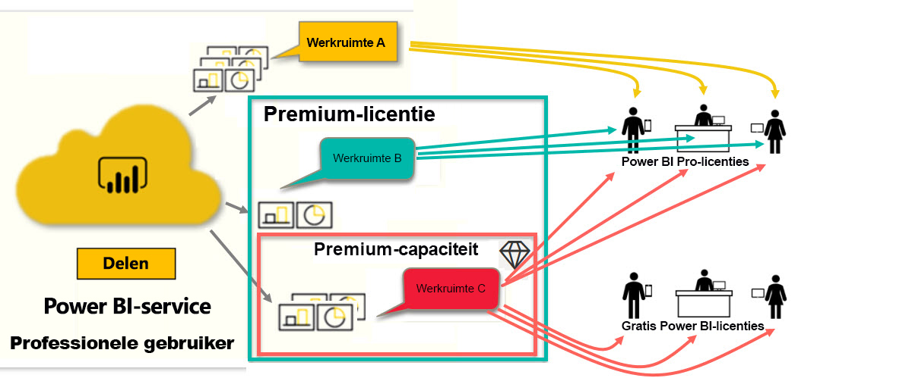

# Typen Power BI-licenties
Als *consument* gebruikt u de Power BI-service om rapporten en dashboards te verkennen om zakelijke beslissingen te nemen. Als u Power BI al een tijdje hebt gebruikt of als u hebt gechat met collega's die *ontwerper* zijn, hebt u waarschijnlijk wel ontdekt dat bepaalde functies alleen werken als u een bepaald type licentie hebt. 

In dit artikel worden de verschillen beschreven tussen de licentietypen en combinaties: gratis, Pro, Premium en Premium-capaciteit. U leert ook hoe u kunt erachter komt welke licentie u gebruikt.  

Eerst bekijken we twee categorieën licenties: licenties per gebruiker en organisatielicenties. We beginnen met de standaardmogelijkheden die beschikbaar zijn voor de licenties. Vervolgens kijken we hoe uw Power BI-beheerder en de eigenaren van de inhoud rollen en machtigingen kunnen gebruiken om de standaardmogelijkheden van een licentie te wijzigen. 

Zelfs als uw licentie dit toestaat, kan de beheerder de mogelijkheid beperken om dingen te doen, zoals het exporteren van gegevens, het gebruik van Q&A-query's in natuurlijke taal of het publiceren op internet. En wanneer een rapport*ontwerper* inhoud aan een werkruimte toewijst, kan hij of zij u aan een werkruimterol toewijzen. De rollen bepalen wat u wel en niet binnen die werkruimte kunt doen. De *ontwerper* kan de limieten van uw licentie verder aanpassen met behulp van machtigingsinstellingen. Met andere woorden... het is ingewikkeld. Hopelijk wordt in dit artikel de meeste, zo niet alle verwarring opgeheven.

## Licenties per gebruiker
Het eerste type licentie is een **licentie per gebruiker**. Elke Power BI-servicegebruiker heeft een gratis licentie of een Pro-licentie. Bepaalde functies zijn voorbehouden aan gebruikers met een Pro-licentie.  

- Met een **Power BI Pro-licentie** kan een gebruiker samenwerken met andere Pro-gebruikers door inhoud te maken en te delen. Alleen gebruikers met een Pro-licentie kunnen rapporten publiceren, zich abonneren op dashboards en rapporten en samenwerken met collega's in werkruimten. 

    

    Power BI Pro is een afzonderlijke gebruikerslicentie waarmee gebruikers rapporten en dashboards kunnen lezen en gebruiken die anderen hebben gepubliceerd in de Power BI-service. Gebruikers met dit licentietype kunnen inhoud delen en samenwerken met andere Power BI Pro-gebruikers. Alleen Power BI Pro-gebruikers kunnen inhoud publiceren of delen met andere gebruikers, of inhoud gebruiken die is gemaakt door anderen. De uitzondering hierop is inhoud die wordt gehost in [Power BI Premium-capaciteit](#understanding-premium-and-premium-capacity). Pro-licenties worden meestal gebruikt door rapport*ontwerpers* en ontwikkelaars. Zie [Power BI Premium-capaciteit](#understanding-premium-and-premium-capacity) hieronder, voor meer informatie.

- **Een zelfstandige gratis Power BI-licentie**, die ook krachtig, is bedoeld voor gebruikers die net beginnen met Power BI of gebruikers die inhoud voor zichzelf maken. [Registreert u als persoon voor Power BI-service](../service-self-service-signup-for-power-bi.md). Een gratis zelfstandige licentie is niet gekoppeld aan een organisatielicentie. 

    Een gratis zelfstandige gebruikerslicentie is ideaal voor iemand die de Microsoft-voorbeelden gebruikt om Power BI te leren kennen. Gebruikers met een gratis zelfstandige licentie kunnen geen inhoud weergeven die door anderen wordt gedeeld of hun eigen inhoud delen met andere Power BI-gebruikers. 

    

Is het tot nu toe duidelijk?  OK. Laten we er een laag aan toevoegen, **Premium-capaciteit**.

## Meer informatie over Premium en Premium-capaciteit
Premium is een **organisatielicentie**. Beschouw het als een laag functies en functionaliteit bovenop alle Power BI-**licenties per gebruiker** in een organisatie. 

Wanneer een organisatie een Premium-licentie aanschaft, wijst de beheerder doorgaans Pro-licenties toe aan werknemers die inhoud maken en delen. En de beheerder wijst gratis licenties toe aan iedereen die deze inhoud gaat gebruiken. De Pro-gebruikers maken [werkruimten](end-user-workspaces.md) en voegen inhoud (dashboards, rapporten en apps) aan deze werkruimten toe. Om ervoor te zorgen dat anderen in deze werkruimten kunnen samenwerken, gebruiken de Pro-gebruikers een combinatie van *capaciteit*, machtigingen en rollen. 

Wanneer een organisatie een Premium-licentie aanschaft, ontvangt de organisatie capaciteit in de Power BI-service die exclusief aan de organisatie is toegewezen. Deze wordt niet gedeeld. De capaciteit wordt ondersteund door specifieke hardware die volledig wordt beheerd door Microsoft. Organisaties kunnen ervoor kiezen om hun toegewezen capaciteit breed toe te passen of toe te wijzen aan specifieke werkruimten. Een werkruimte in een Premium-capaciteit is een ruimte waarin Pro-gebruikers kunnen delen en samenwerken met gebruikers die een gratis licentie hebben; deze gebruikers hebben dus geen Pro-account nodig.  

In Premium-capaciteit zijn Pro-licenties wel vereist voor ontwerpers van de inhoud. Ontwerpers maken verbinding met gegevensbronnen, modelleren gegevens en maken rapporten en dashboards die zijn verpakt als werkruimte-apps. Gebruikers zonder een Pro-licentie hebben toegang tot een werkruimte in Power BI Premium, zolang die inhoud zich in Premium-*capaciteit* bevindt en de eigenaar van de werkruimte hen toestemming heeft gegeven.

In onderstaand diagram ziet u links de Pro-gebruikers die inhoud in werkruimten maken en delen.  
- **Werkruimte A** is gemaakt in een organisatie die geen Premium heeft. 

- **Werkruimte B** is gemaakt in een organisatie die een Premium-licentie heeft, maar deze werkruimte is niet opgeslagen in Premium-capaciteit. Naast de naam van de werkruimte staat geen ruitvormig pictogram.

- **Werkruimte C** is gemaakt in een organisatie die een Premium-licentie heeft en is opgeslagen in Premium-capaciteit. Deze werkruimte heeft een ruitvormig pictogram.  

De Power BI Pro-*ontwerper* kan deze drie werkruimten allemaal gebruiken om te delen en samen te werken met andere Pro-gebruikers. Zolang de ontwerper de werkruimte deelt met de hele organisatie of werkruimterollen aan de Pro-gebruikers toewijst. 

De Power BI Pro-*ontwerper* kan alleen delen en samenwerken met gebruikers met een gratis licentie in Werkruimte C. Gebruikers met een gratis licentie hebben alleen toegang tot de werkruimte als de werkruimte is toegewezen aan Premium-capaciteit. In de werkruimte wijst de ontwerper rollen toe aan samenwerkers: *Beheerder*, *Lid*, *Inzender* of *Viewer*. Uw rol bepaalt welke acties u in de werkruimte kunt uitvoeren. Power BI-*consumenten* krijgen meestal de rol van *Viewer* toegewezen. Zie [Werkruimten voor Power BI-consumenten](end-user-workspaces.md) voor meer informatie.

## Vaststellen welke licentie u hebt
Er zijn verschillende manieren om uw Power BI-licentiegegevens te vinden. 

Stel eerst vast welke **gebruikerslicentie** u hebt.

- Bepaalde versies van Microsoft Office bevatten een Power BI Pro-licentie.  Als u wilt weten of uw Office-versie Power BI bevat, gaat u naar [de Office-portal](https://portal.office.com/account) en selecteert u **Abonnementen**.

    Deze eerste gebruiker, Pradtanna, heeft Office 365 E5 met daarin een Power BI Pro-licentie.

    

    Deze tweede gebruiker, Zalan, heeft een gratis Power BI-licentie. 

    

Controleer vervolgens of uw account ook een Premium-licentie heeft. Alle bovengenoemde gebruikers, Pro of gratis, kunnen behoren tot een organisatie die een Premium-licentie heeft.  Laten we dit controleren voor onze tweede gebruiker, Zalan.  

- Selecteer in de Power BI-service **Mijn werkruimte** en selecteer vervolgens het tandwielpictogram in de rechterbovenhoek. Kies **Persoonlijke opslag beheren**.

    

    Licenties **per gebruiker**, Pro of gratis, bieden 10 GB aan opslag in de cloud die kan worden gebruikt voor het hosten van Power BI rapporten of Excel-werkmappen. Als u meer dan 10 GB ziet, bent u lid van een organisatieaccount met een Premium-licentie.

    

    Zoals u weet, staat op de Office-portalpagina dat Zalan een (gratis) gebruikersabonnement voor Power BI heeft. Maar omdat zijn organisatie een Premium-licentie heeft aangeschaft in de Power BI-service, is Zalan niet beperkt tot 10 GB aan opslag; Hij kan beschikken over 100 GB. Als *consument* in een organisatie met een Premium-licentie, kan Zalan gedeelde inhoud weergeven, samenwerken met collega's, apps gebruiken en nog veel meer, op voorwaarde dat de *ontwerper* de werkruimte in Premium-capaciteit plaatst. De strekking van zijn machtigingen wordt ingesteld door zijn Power BI-beheerder en door de ontwerper van de inhoud. U ziet dat een Pro-gebruiker al een werkruimte heeft gedeeld met Zalan. Aan het ruitpictogram ziet hij dat deze werkruimte is opgeslagen in Premium-capaciteit. 

   
## Werkruimterollen
Tot nu toe hebben we het gehad over licenties per gebruiker, Premium-licenties en Premium-capaciteit. Nu gaan we het hebben over werkruimte*rollen*.

Omdat dit een artikel is voor Power BI-*consumenten*, hebben we het volgende scenario:

-  U bent een *gratis* gebruiker binnen een organisatie die een Power BI Premium-licentie heeft. 
- Een Power BI Pro-gebruiker heeft een verzameling dashboards en rapporten gemaakt en deze verzameling als een *app* voor uw hele organisatie gepubliceerd.  
- Apps bestaan in *werkruimten* en de werkruimte bevindt zich in Premium-capaciteit.    
- Deze app-werkruimte heeft één dashboard en twee rapporten.
- De Pro-gebruiker heeft ons de rol van **Viewer** toegewezen.

### De rol van Viewer
Met rollen kunnen Power BI-*ontwerpers* bepalen wie wat kan doen in een werkruimte, zodat teams kunnen samenwerken. Een van deze rollen is die van **Viewer**. 

Wanneer de werkruimte zich in een Power BI Premium-capaciteit bevindt, hebben gebruikers met de rol Lezer toegang tot de werkruimte, zelfs als ze geen Power BI Pro-licentie hebben. Maar omdat een gebruiker met de rol van Viewer de onderliggende gegevens niet kan openen of exporteren, is het een veilige manier om te communiceren met dashboards, rapporten en apps.

> [!TIP]
> Zie [Een nieuwe werkruimte maken](../service-new-workspaces.md) voor meer informatie over de andere rollen (beheerder, lid en bijdrager).

