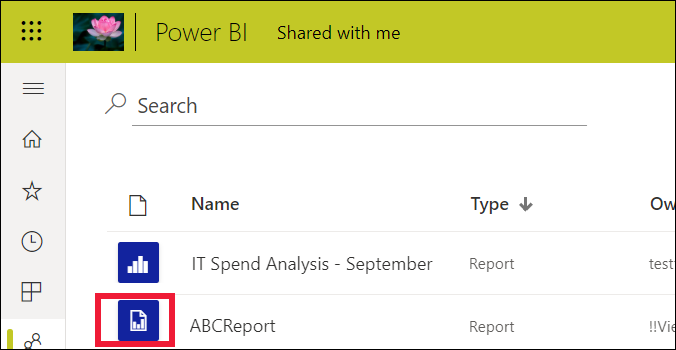

# Gepagineerde rapporten in de Power BI-service

[!INCLUDE[consumer-appliesto-yyny](../includes/consumer-appliesto-yyny.md)]

U hebt over [Power BI-rapporten](end-user-reports.md) geleerd; dit is het type rapport dat u het meest zult tegenkomen. Power BI-rapporten zijn geoptimaliseerd voor verkenning en interactiviteit. Een Power BI-rapport is ideaal voor een verkooprapport waarin verschillende verkopers de gegevens in hetzelfde rapport voor hun specifieke regio/branche/klant willen onderbrengen en willen bekijken hoe de cijfers veranderen.

Er is echter nog een ander rapporttype: *gepagineerd rapport*. Voor het ontvangen en weergeven van gepagineerde rapporten is een Power BI Pro licentie vereist om het rapport op te slaan in een Premium-capaciteit.  [Meer informatie over licenties](end-user-license.md).  

## Een gepagineerd rapport identificeren

In inhoudslijsten en op uw startpagina herkent u gepagineerde rapporten door hun pictogram .  Gepagineerde rapporten kunnen rechtstreeks met u worden gedeeld of als onderdeel van een [Power BI-app](end-user-apps.md). Als u van de *ontwerper* van het rapport machtigingen hebt gekregen, kunt u het gepagineerde rapport opnieuw delen en uzelf en anderen hierop abonneren.

## Wat is een gepagineerd rapport?

Deze rapporten worden *gepagineerd* genoemd omdat ze zo zijn opgemaakt dat ze op een afgedrukte pagina passen. Een van de voordelen is dat gegevens in een tabel worden weergegeven, zelfs als de tabel meerdere pagina's omvat. Gepagineerde rapporten worden soms 'pixelperfect' genoemd omdat *ontwerpers* de pagina-indeling van dit type rapport exact kunnen instellen.

Gepagineerde rapporten zijn het geschiktst voor scenario's waarvoor een uitgebreid opgemaakte, tot op de pixel nauwkeurige uitvoer is vereist, die is geoptimaliseerd voor afdrukken of het genereren van PDF's. Een verlies- en winstrekening is een goed voorbeeld van het type rapport dat u waarschijnlijk als een gepagineerd rapport wilt weergeven.

## Hoe werken gepagineerde rapporten?

Wanneer *ontwerpers* een gepagineerd rapport maken, maken ze in feite een *rapportdefinitie*. Het rapport bevat geen gegevens. Er wordt aangegeven waar de gegevens moeten worden opgehaald, welke gegevens u wilt ophalen en hoe u de gegevens wilt weergeven. Wanneer u het rapport uitvoert, worden er gegevens opgehaald aan de hand van de rapportrapport, waarna deze worden gecombineerd met de rapportindeling om het rapport te genereren. In sommige gevallen worden in het rapport standaardgegevens weergegeven. In andere gevallen moet u zelf parameters invoeren voordat er gegevens in een rapport kunnen worden weergegeven. 

Selecteer een gepagineerd rapport om dit in de Power BI-service te openen. Als het rapport parameters bevat, moet u deze selecteren voordat u het rapport kunt weergeven.

   

En dat is precies de bedoeling van de interactie: de parameters instellen. Als u een factuuranalist bent, kunt u gepagineerde rapporten gebruiken om facturen te maken of af te drukken. Als u een verkoopmanager bent, kunt u gepagineerde rapporten gebruiken om bestellingen per winkel of verkoopmedewerker weer te geven. 

Met dit eenvoudige gepagineerde rapport wordt de winst per jaar gegenereerd zodra u de parameter **Year** hebt geselecteerd. 

In vergelijking met gepagineerde rapporten zijn Power BI-rapporten veel interactiever. Met Power BI-rapporten is ad-hocrapportage mogelijk en worden veel meer visualtypen ondersteund, zoals aangepaste visuals.

## Interactie met gepagineerde rapporten

De manier waarop u interactief met een gepagineerd rapport werkt, wijkt af van andere rapporten. U kunt bepaalde bewerkingen uitvoeren, zoals afdrukken, bladwijzers toevoegen, exporteren en opmerkingen toevoegen. Er is echter wel minder interactiviteit. Vaak is voor gepagineerde rapporten invoer van u nodig om het rapportcanvas in te vullen.  In andere gevallen worden standaardgegevens in het rapport weergegeven en moet u parameters invoeren om andere gegevens zien.

### Een gepagineerd rapport afdrukken

*Gepagineerde* rapporten zijn zo opgemaakt dat deze goed passen op een pagina en kunnen worden afgedrukt. Wat u in de browser ziet, is wat u ziet wanneer u het rapport afdrukt. Als het rapport een lange tabel bevat, wordt bovendien de hele tabel afgedrukt, ook als de tabel op meerdere pagina's staat. 

Gepagineerde rapporten kunnen heel veel pagina's hebben. Dit rapport heeft bijvoorbeeld 563 pagina's. Alle pagina's zijn zorgvuldig opgemaakt, met één pagina per factuur en herhalende kopteksten en voetteksten. Wanneer u dit rapport afdrukt, worden tussen facturen pagina-einden geplaatst.

   

### Navigeren in een gepagineerd rapport

Dit rapport over verkooporders bevat drie parameters: Bedrijfstype, Wederverkoper en Ordernummer. 

Als u de informatie die wordt weergegeven wilt wijzigen, voert u nieuwe waarden voor de drie parameters in en selecteert u **Rapport weergeven**. Hier hebben we **Speciale fietsenwinkel**, **Alpine Ski House** en ordernummer **SO46085** geselecteerd. Als u **Rapport weergeven** selecteert, wordt het rapportcanvas vernieuwd zodat deze nieuwe verkooporder nu wordt weergegeven.

De nieuwe verkooporder wordt weergegeven, met de parameters die wij hebben geselecteerd. 

Sommige gepagineerde rapporten kunnen heel veel pagina's hebben.  Gebruik de besturingselementen op de pagina om door het rapport te navigeren. 

### Het gepagineerde rapport exporteren
Voor het exporteren van gepagineerde rapporten zijn vele opties beschikbaar, zoals PDF, Word, XML, PowerPoint, Excel en meer. Wanneer u een rapport exporteert, wordt geprobeerd zoveel mogelijk opmaak te behouden. Zo behouden gepagineerde rapporten die naar Excel, Word, PowerPoint, MHTML of PDF worden geëxporteerd, de 'pixelperfecte' opmaak. 

### Abonneren op het gepagineerde rapport
Wanneer u zich op een gepagineerd rapport abonneert, ontvangt u van Power BI een e-mailbericht met het rapport in de bijlage. Wanneer u uw abonnement instelt, kiest u hoe vaak u de e-mails wilt ontvangen: dagelijks, wekelijks, maandelijks of per uur. Het abonnement bevat een bijlage met de uitvoer van het gehele rapport, van maximaal 25 MB. Exporteer het gehele rapport of kies van tevoren de parameters. Kies een van de verschillende bijlagetypen, zoals Excel, PDF, PowerPoint en meer.  

## Aandachtspunten en probleemoplossing

- Een gepagineerd rapport kan er leeg uitzien totdat u parameters selecteert en **Rapport weergeven** kiest.

- Als u geen gepagineerde rapporten hebt, kan dit het geval zijn wanneer niemand dit type rapport met u heeft gedeeld. Het kan ook betekenen dat uw systeembeheerder geen gepagineerde rapporten voor u heeft ingeschakeld. 

 

## Volgende stappen
- [Power BI-rapporten](end-user-reports.md)
- [Gepagineerde rapporten in Power BI: Veelgestelde vragen](../paginated-reports/paginated-reports-faq.md)
- Nog vragen? Misschien dat de [Power BI-community](https://community.powerbi.com/) het antwoord weet.
