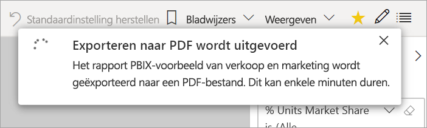

# Rapporten exporteren van Power BI naar PDF

[!INCLUDE[consumer-appliesto-yyny](../includes/consumer-appliesto-yyny.md)]

[!INCLUDE [power-bi-service-new-look-include](../includes/power-bi-service-new-look-include.md)]

Met Power BI kunt u uw rapport publiceren naar PDF-indeling en heel eenvoudig een document op basis van uw Power BI-rapport maken. Wanneer u naar PDF exporteert, wordt elke pagina in het Power BI-rapport een afzonderlijke pagina in het PDF-document.

## Uw Power BI-rapport naar PDF exporteren
Selecteer in de Power BI-service een rapport om weer te geven op het canvas. U kunt ook een rapport selecteren via de pagina **Start**, **Apps** of een andere container in het navigatievenster.

1. Selecteer **Exporteren** > **PDF** in de menubalk.

    

    Er wordt een pop-upvenster weergegeven waarin u de **huidige waarden** of de **standaardwaarden** kunt selecteren. Met **Huidige waarden** exporteert u het rapport in de huidige staat, inclusief de actieve wijzigingen die u in de slicer- en filterwaarden hebt aangebracht. De meeste gebruikers selecteren deze optie. U kunt ook **Standaardwaarden** selecteren, waarmee u het rapport in de oorspronkelijke staat exporteert (zoals de *ontwerper* dit heeft gedeeld), en waarin geen wijzigingen worden weergegeven die u aan de oorspronkelijke staat hebt aangebracht.
    
    Daarnaast is er een selectievakje dat u waarmee u kunt bepalen of u de verborgen tabbladen van een rapport wilt exporteren. U schakelt dit selectievakje in als u alleen tabbladen van een rapport wilt exporteren die in uw browser worden weergegeven. Als u wilt dat ook alle verborgen tabbladen worden weergegeven als onderdeel van de export, laat u dit selectievakje uitgeschakeld. Als het selectievakje grijs wordt weergegeven, zijn er geen verborgen tabbladen in het rapport. Nadat u de selecties hebt gemaakt, selecteert u **Exporteren** om door te gaan.
    
    U kunt er ook voor kiezen om alleen de huidige pagina uit een rapport te exporteren door de optie **Alleen de huidige pagina exporteren** aan te vinken.  Standaard worden alle pagina's van uw rapport geëxporteerd, omdat deze optie is uitgeschakeld.
    
    Er wordt een voortgangsbalk weergegeven in de rechterbovenhoek. Het exporteren kan enkele minuten duren. U kunt tijdens het exporteren van het rapport in Power BI blijven werken.

    

    Wanneer het exporteren door de Power BI-service is voltooid, verandert de meldingsbanner om u hiervan op de hoogte te stellen.

2. Het bestand is beschikbaar wanneer de gedownloade bestanden worden weergegeven in uw browser. In de volgende afbeelding wordt dit weergegeven als een downloadbanner langs de onderkant van het browservenster.

    

Zo eenvoudig werkt dat. U kunt het bestand downloaden en openen met een PDF-viewer, zoals de viewer in Microsoft Edge.

## Beperkingen en overwegingen
Er zijn enkele overwegingen en beperkingen waarmee u rekening moet houden bij het werken met de functie **Exporteren naar PDF**.

* De PDF omvat de gegevens en visualisaties die zichtbaar zijn op uw Power BI-canvas. Als de visual schuifbalken bevat, wordt de standaardversie van de visual opgenomen in de PDF, zonder schuifmogelijkheden.  
* R- en Python-visuals worden momenteel niet ondersteund. Deze visuals zijn in de PDF leeg en er wordt een foutbericht weergegeven. 
* Power BI-visuals die zijn gecertificeerd, worden ondersteund. Raadpleeg [Een Power BI-visual laten certificeren](../developer/visuals/power-bi-custom-visuals-certified.md) voor meer informatie over gecertificeerde Power BI-visuals, waaronder het laten certificeren van een Power BI-visual. Power BI-visuals die niet zijn gecertificeerd, worden niet ondersteund. Deze worden in de PDF met een foutbericht weergegeven.
* De ESRI-visual wordt niet ondersteund.
* Rapporten met meer dan vijftig rapportpagina's kunnen momenteel niet worden geëxporteerd.
* Het proces van het exporteren van een rapport naar PDF kan enkele minuten duren. Factoren die de benodigde tijd kunnen beïnvloeden, zijn onder meer de structuur van het rapport en de belasting van de Power BI-service op dat moment.
* Als het menu-item **Exporteren naar PDF** niet beschikbaar is in de Power BI-service, heeft uw Power BI-beheerder de functie waarschijnlijk uitgeschakeld. Neem voor meer informatie contact op met uw beheerder.
* Achtergrondafbeeldingen worden bijgesneden binnen het begrenzingsgebied van de grafiek. U kunt achtergrondafbeeldingen het beste verwijderen voordat u naar PDF exporteert.
* Rapporten die eigendom zijn van een gebruiker buiten uw Power BI-tenantdomein (zoals een rapport dat eigendom is van iemand buiten uw organisatie en dat met u wordt gedeeld), kunnen niet naar PDF worden gepubliceerd.
* Als u een dashboard deelt met iemand buiten uw organisatie, dus een gebruiker die zich niet in uw Power BI-tenantdomein bevindt, kan die gebruiker de rapporten die aan het gedeelde dashboard zijn gekoppeld niet naar PDF exporteren. Als u bijvoorbeeld aaron@contoso.com bent, kunt u delen met cassie@northwinds.com. cassie@northwinds.com kan de gekoppelde rapporten echter niet exporteren naar PDF.
* Wanneer u rapporten met een achtergrondafbeelding exporteert naar PDF, ziet u in de export mogelijk een vervormde afbeelding als u de optie **Normaal** of **Opvullen** kiest voor de **pagina-achtergrond**. Voor het beste resultaat gebruikt u de optie **Aanpassen**. Zo voorkomt u problemen met uw geëxporteerde document.
* De Power BI-service gebruikt uw taalinstelling voor Power BI als taal voor het geëxporteerde PDF-bestand. Als u uw taalvoorkeur wilt bekijken of instellen, selecteert u het tandwielpictogram  > **Instellingen** > **Algemeen** > **Taal**.
* Er wordt momenteel geen rekening gehouden met URL-filters als **Huidige waarden** wordt gekozen voor uw export.
* Rapporten met een ongebruikelijk aangepast paginaformaat kunnen problemen ondervinden in scenario's waarbij wordt geëxporteerd. Voor het beste resultaat kunt u overwegen om een standaardpaginaformaat te gebruiken voor uw export.
* Bij het exporteren naar PDF wordt in rapporten die thema's met aangepaste lettertypen gebruiken, het aangepaste lettertype vervangen door een standaardlettertype.
* Hoewel we een consistente ervaring willen bieden, kunnen we niet garanderen dat het PDF-bestand dat uit de Power BI-service wordt geëxporteerd altijd overeenkomt met het PDF-bestand dat op basis van een lokaal Power BI Desktop-bestand wordt geëxporteerd.
* Bij het exporteren naar PDF kan geen perfecte betrouwbaarheid worden gegaranceerd voor PBIX-rapporten.

## Volgende stappen
[Een rapport afdrukken](end-user-print.md)
