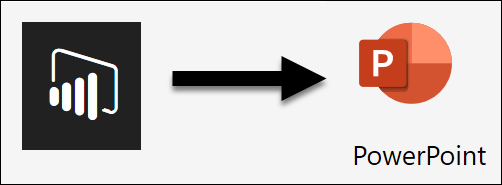

# Rapporten exporteren van Power BI naar PowerPoint

[!INCLUDE[consumer-appliesto-yyny](../includes/consumer-appliesto-yyny.md)]

[!INCLUDE [power-bi-service-new-look-include](../includes/power-bi-service-new-look-include.md)]

Met de Power BI-service (app.powerbi.com) kunt u uw rapport publiceren naar Microsoft PowerPoint en heel eenvoudig een presentatie op basis van uw Power BI-rapport maken. Wanneer u naar PowerPoint wilt exporteren, gebeurt het volgende:

* Elke pagina in het Power BI-rapport wordt een afzonderlijke dia in PowerPoint.
* Elke pagina in het Power BI-rapport wordt geëxporteerd als één afbeelding met een hoge resolutie in PowerPoint.
* U kunt de instellingen voor filters en slicers die u hebt toegevoegd aan het rapport behouden.
* In PowerPoint wordt een koppeling met het Power BI-rapport gemaakt.

Het ophalen van uw **Power BI-rapport** dat is geëxporteerd naar **PowerPoint** gaat snel. Voer de stappen uit die in de volgende sectie worden beschreven.

U kunt ook specifieke visuals uit de Power BI-service kopiëren en in PowerPoint plakken. Selecteer het pictogram **Kopiëren als afbeelding** om de visual naar het klembord te kopiëren. Open vervolgens PowerPoint en plak de visual.

## Uw Power BI-rapport naar PowerPoint exporteren
Selecteer in de **Power BI-service** een rapport om weer te geven op het canvas. U kunt ook een rapport selecteren in **Start**, **Apps** of een andere container in het navigatievenster.

Wanneer het rapport dat u wilt exporteren naar PowerPoint wordt weergegeven op het canvas, selecteert u in de menubalk **Exporteren** > **PowerPoint**.

Er wordt een pop-upvenster weergegeven waarin u de **huidige waarden** of de **standaardwaarden** kunt selecteren. Met **Huidige waarden** exporteert u het rapport in de huidige staat, inclusief de actieve wijzigingen die u in de slicer- en filterwaarden hebt aangebracht. De meeste gebruikers selecteren deze optie. U kunt ook **Standaardwaarden** selecteren. Hiermee wordt het rapport in de oorspronkelijke staat geëxporteerd, zoals de *ontwerper* dit heeft gedeeld, en waarin de wijzigingen die u eventueel hebt aangebracht niet worden weergegeven.

> [!NOTE]
> **De huidige waarden** bevatten niet de schuifstatus van visuals.

 
Daarnaast is er een selectievakje dat u uitgeschakeld kunt laten als u de verborgen tabbladen van een rapport wilt exporteren. U schakelt dit selectievakje in als u alleen tabbladen van een rapport wilt exporteren die in uw browser worden weergegeven. Als u wilt dat ook alle verborgen tabbladen worden weergegeven als onderdeel van de export, laat u dit selectievakje uitgeschakeld. Als het selectievakje grijs wordt weergegeven, zijn er geen verborgen tabbladen in het rapport. Een voorbeeld van een verborgen tabblad is het tabblad Knopinfo. [Aangepaste knopinfo](../desktop-tooltips.md) wordt gemaakt door rapport*ontwerpers* en wordt niet weergegeven als rapporttabblad in de Power BI-service voor *consumenten*. 

Nadat u de selecties hebt gemaakt, selecteert u **Exporteren** om door te gaan. Er wordt een meldingsbanner in de rechterbovenhoek van het browservenster van de Power BI-service weergegeven die aangeeft dat het rapport naar PowerPoint wordt geëxporteerd. Het exporteren kan enkele minuten duren. U kunt tijdens het exporteren van het rapport in Power BI blijven werken.

Wanneer het exporteren door de Power BI-service is voltooid, verandert de meldingsbanner om u hiervan op de hoogte te stellen. Het bestand is beschikbaar wanneer de gedownloade bestanden worden weergegeven in uw browser. In de volgende afbeelding wordt dit weergegeven als een downloadbanner langs de onderkant van het browservenster.

Zo eenvoudig werkt dat. U kunt het bestand downloaden, openen met PowerPoint en vervolgens wijzigen of bewerken zoals u met elke andere PowerPoint-presentatie zou doen.

## Het geëxporteerde PowerPoint-bestand bekijken
Bij het openen van het PowerPoint-bestand dat door Power BI is geëxporteerd, ziet u enkele coole en nuttige elementen. Bekijk de volgende afbeelding en de genummerde elementen die sommige van deze coole functies beschrijven.

1. De eerste pagina van de presentatie bevat de naam van uw rapport en een koppeling zodat u het rapport waarop de presentatie is gebaseerd, kunt **weergeven in Power BI**.
2. U krijgt ook nuttige informatie over het rapport. **Laatste keer gegevens vernieuwd** toont de datum en tijd waarop het geëxporteerde rapport is gebaseerd. **Gedownload op** toont de datum en tijd waarop het Power BI-rapport naar een Power Point-bestand is geëxporteerd.
3. Elke rapportpagina is een afzonderlijke dia, zoals wordt weergegeven in het navigatievenster. 
4. Uw gepubliceerde rapport wordt gerenderd in de taal die is geselecteerd in uw instellingen voor Power BI. Anders wordt de taal bepaald door de landinstelling van uw browser. Als u uw taalvoorkeur wilt bekijken of instellen, selecteert u het tandwielpictogram  > **Instellingen** > **Algemeen** > **Taal**. Raadpleeg [Ondersteunde talen en landen of regio's voor Power BI](../supported-languages-countries-regions.md) voor informatie over landinstellingen.

Wanneer u naar een afzonderlijke dia gaat, ziet u dat elke rapportpagina een onafhankelijke afbeelding is.

Wat u verder doet met uw PowerPoint-presentatie, of met de afbeeldingen met hoge resolutie, is geheel aan u.

## Aandachtspunten en probleemoplossing
Er zijn enkele overwegingen en beperkingen waar u rekening mee moet houden wanneer u de functie **Exporteren naar PowerPoint** gebruikt.

* Het exporteren van het rapport naar PowerPoint kan enkele minuten duren, dus u moet enig geduld opbrengen. Factoren die de benodigde tijd kunnen beïnvloeden, zijn onder meer de structuur van het rapport en de belasting van de Power BI-service op dat moment.
* Power BI-visuals die zijn gecertificeerd, worden ondersteund. Raadpleeg [Een aangepaste visual laten certificeren](../developer/power-bi-custom-visuals-certified.md) voor meer informatie over gecertificeerde aangepaste visuals, waaronder het laten certificeren van een aangepaste visual. Aangepaste visuals die niet zijn gecertificeerd, worden niet ondersteund. Deze worden als een blanco afbeelding naar PowerPoint geëxporteerd met een foutmelding die aangeeft dat de visual niet wordt ondersteund.
* Er wordt momenteel geen rekening gehouden met URL-filters als **Huidige waarden** wordt gekozen voor uw export.
* De [ESRI ArcGIS-visual](../visuals/power-bi-visualizations-arcgis.md) wordt niet ondersteund
* Rapporten met meer dan 30 rapportpagina's kunnen momenteel niet worden geëxporteerd.
* Visuals met schuifbalken worden in de standaardmodus geëxporteerd. In de visual wordt in PowerPoint alleen het bovenste gedeelte van de gegevens weergegeven. Schuiven in PowerPoint is niet beschikbaar omdat elke dia een afbeelding is. 
* Als het menu-item **Exporteren naar PowerPoint** niet beschikbaar is in de Power BI-service, heeft uw tenantbeheerder de functie waarschijnlijk uitgeschakeld. Neem contact op met uw tenantbeheerder voor meer informatie.
* Achtergrondafbeeldingen worden bijgesneden binnen het begrenzingsgebied van de grafiek. U kunt achtergrondafbeeldingen het beste verwijderen voordat u naar PowerPoint exporteert.
* Pagina's in PowerPoint worden altijd aangemaakt in het standaard 9:16-formaat, ongeacht de oorspronkelijke paginaformaten of afmetingen in het Power BI-rapport.
* Rapporten die eigendom zijn van een gebruiker buiten uw Power BI-tenantdomein, zoals rapporten die eigendom zijn van iemand buiten uw organisatie en die met u worden gedeeld, kunnen niet naar PowerPoint worden gepubliceerd.
* Als u een dashboard deelt met iemand buiten uw organisatie, dus een gebruiker die zich niet in uw Power BI-tenantdomein bevindt, kan die gebruiker de rapporten die aan het gedeelde dashboard zijn gekoppeld niet naar PowerPoint exporteren. Als u bijvoorbeeld aaron@contoso.com bent, kunt u delen met david@cohowinery.com. Maar david@cohowinery.com kan de gekoppelde rapporten niet exporteren naar PowerPoint.
* Mogelijk kunt u met oudere versies van PowerPoint niet exporteren.
* Zoals eerder vermeld, wordt elke rapportpagina geëxporteerd als één afbeelding in het PowerPoint-bestand.
* De Power BI-service gebruikt uw taalinstelling voor Power BI als taal voor het exportbestand van PowerPoint. Als u uw taalvoorkeur wilt bekijken of instellen, selecteert u het tandwielpictogram  > **Instellingen** > **Algemeen** > **Taal**.
* Het **Gedownload op**-tijdstip op de titeldia van het geëxporteerde PowerPoint-bestand is ingesteld op de tijdzone van uw computer op het moment van de export.
* Bij het exporteren naar PPTX wordt in rapporten die thema's met aangepaste lettertypen gebruiken, het aangepaste lettertype vervangen door een standaardlettertype.
* Visuals die zijn gemaakt met R en Python, worden momenteel niet ondersteund. Dergelijke visuals worden als een blanco afbeelding naar PowerPoint geëxporteerd met een foutmelding die aangeeft dat de visual niet wordt ondersteund.

## Volgende stappen
[Visuals kopiëren als statische afbeeldingen](../power-bi-visualization-copy-paste.md)    
[Een rapport afdrukken](end-user-print.md)
