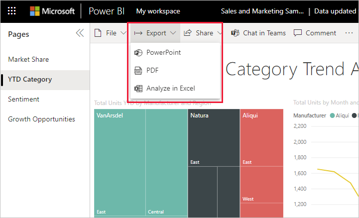

# Rapporten exporteren naar PowerPoint

[!INCLUDE[consumer-appliesto-yynn](../includes/consumer-appliesto-yynn.md)]

Met de Power BI-service (app.powerbi.com) kunt u uw rapport publiceren naar Microsoft PowerPoint en heel eenvoudig een presentatie op basis van uw Power BI-rapport maken. Wanneer u naar PowerPoint wilt exporteren, gebeurt het volgende:

* Elke pagina in het Power BI-rapport wordt een afzonderlijke dia in PowerPoint.
* Elke pagina in het Power BI-rapport wordt geëxporteerd als één afbeelding met een hoge resolutie in PowerPoint.
* De instellingen voor filters en slicers die u aan het rapport hebt toegevoegd, kunt u behouden.
* In PowerPoint wordt een koppeling naar het Power BI-rapport gemaakt.

Het ophalen van uw **Power BI-rapport** dat is geëxporteerd naar **PowerPoint** gaat snel. Voer de stappen uit die in de volgende sectie worden beschreven.

U kunt ook één visual uit de Power BI-service kopiëren en deze in PowerPoint plakken (of een ander programma waarin plakken wordt ondersteund). Selecteer het pictogram **Kopiëren als afbeelding** om de visual naar het klembord te kopiëren. Open vervolgens PowerPoint en plak de visual. Zie [Visuals kopiëren als statische afbeeldingen](../visuals/power-bi-visualization-copy-paste.md) voor meer informatie.

## Uw Power BI-rapport naar PowerPoint exporteren
Selecteer in de **Power BI-service** een rapport om weer te geven op het canvas. U kunt ook een rapport selecteren in **Start**, **Apps** of een andere container in het navigatievenster.

Wanneer het rapport dat u wilt exporteren naar PowerPoint wordt weergegeven op het canvas, selecteert u **Bestand** > **Exporteren naar PowerPoint** in de menubalk.

Er wordt een pop-upvenster weergegeven waarin u de **huidige waarden** of de **standaardwaarden** kunt selecteren. Met **Huidige waarden** exporteert u het rapport in de huidige staat, inclusief de actieve wijzigingen die u in de slicer- en filterwaarden hebt aangebracht.  De meeste gebruikers selecteren deze optie. Als u hebt gebladerd, bevat **Huidige waarden** niet de schuifstatus van de visual, maar wordt het bovenste gedeelte van de gegevens geëxporteerd. U kunt ook **Standaardwaarden** selecteren. Hiermee wordt het rapport in de oorspronkelijke staat geëxporteerd, zoals de *ontwerper* dit heeft gedeeld, en waarin de wijzigingen die u eventueel hebt aangebracht niet worden weergegeven.

 
Daarnaast is er een selectievakje dat u uitgeschakeld kunt laten als u de verborgen tabbladen van een rapport wilt exporteren. U schakelt dit selectievakje in als u alleen tabbladen van een rapport wilt exporteren die in uw browser worden weergegeven. Als u wilt dat ook alle verborgen tabbladen worden weergegeven als onderdeel van de export, laat u dit selectievakje uitgeschakeld. Als het selectievakje grijs wordt weergegeven, zijn er geen verborgen tabbladen in het rapport. Een voorbeeld van een verborgen tabblad is het tabblad Knopinfo. [Aangepaste knopinfo](../create-reports/desktop-tooltips.md) wordt gemaakt door *ontwerpers* van rapporten en wordt niet weergegeven als rapporttabblad in de Power BI-service voor *zakelijke gebruikers*. 

U kunt er ook voor kiezen om alleen de huidige pagina vanuit een rapport te exporteren door de optie **Alleen de huidige pagina exporteren** aan te vinken.  Standaard worden alle pagina's van uw rapport geëxporteerd, omdat deze optie is uitgeschakeld.

Nadat u de selecties hebt gemaakt, selecteert u **Exporteren** om door te gaan. Er wordt een meldingsbanner in de rechterbovenhoek van het browservenster van de Power BI-service weergegeven die aangeeft dat het rapport naar PowerPoint wordt geëxporteerd. 

Het exporteren kan enkele minuten duren. Factoren die de benodigde tijd kunnen beïnvloeden, zijn onder meer de structuur van het rapport en de belasting van de Power BI-service op dat moment. U kunt tijdens het exporteren van het rapport in Power BI blijven werken.

Wanneer het exporteren door de Power BI-service is voltooid, verandert de meldingsbanner om u hiervan op de hoogte te stellen. Het bestand is beschikbaar wanneer de gedownloade bestanden worden weergegeven in uw browser. In de volgende afbeelding wordt dit weergegeven als een downloadbanner langs de onderkant van het browservenster.

Zo eenvoudig werkt dat. U kunt het bestand downloaden, openen met PowerPoint en vervolgens wijzigen of bewerken zoals u met elke andere PowerPoint-presentatie zou doen.

## Het PowerPoint-bestand openen
Bij het openen van het PowerPoint-bestand dat door Power BI is geëxporteerd, ziet u enkele coole en nuttige elementen. Bekijk de volgende afbeelding en de genummerde elementen die sommige van deze coole functies beschrijven. Pagina's in PowerPoint worden altijd aangemaakt in het standaard 9:16-formaat, ongeacht de oorspronkelijke paginaformaten of afmetingen in het Power BI-rapport.

1. De eerste pagina van de presentatie bevat de naam van uw rapport en een koppeling zodat u het rapport waarop de presentatie is gebaseerd, kunt **weergeven in Power BI**.
2. U krijgt ook nuttige informatie over het rapport. **Laatste keer gegevens vernieuwd** toont de datum en tijd waarop het geëxporteerde rapport is gebaseerd. **Gedownload op** toont de datum en tijd waarop het Power BI-rapport naar een Power Point-bestand is geëxporteerd. Het tijdstip bij **Gedownload op** wordt ingesteld op de tijdzone van uw computer op het moment van exporteren.

3. Elke rapportpagina is een afzonderlijke dia, zoals wordt weergegeven in het navigatievenster. 
4. Uw gepubliceerde rapport wordt gerenderd in de taal die is geselecteerd in uw instellingen voor Power BI. Anders wordt de taal bepaald door de landinstelling van uw browser. Als u uw taalvoorkeur in de browser wilt bekijken of instellen, selecteert u het tandwielpictogram  > **Instellingen** > **Algemeen** > **Taal**. Raadpleeg [Ondersteunde talen en landen of regio's voor Power BI](../fundamentals/supported-languages-countries-regions.md) voor informatie over landinstellingen.

Wanneer u een afzonderlijke dia weergeeft, ziet u dat elke rapportpagina een onafhankelijke afbeelding is. Schuiven in PowerPoint is niet beschikbaar omdat elke dia een statische afbeelding is.

Wat u verder doet met uw PowerPoint-presentatie, of met de afbeeldingen met hoge resolutie, is geheel aan u.

## Aandachtspunten en probleemoplossing
Er zijn enkele overwegingen en beperkingen waar u rekening mee moet houden wanneer u de functie **Exporteren naar PowerPoint** gebruikt.
 

* Als u de **export** optie niet ziet, zorg er dan voor dat u een rapport bekijkt (geen dash board).

* Er wordt momenteel geen rekening gehouden met [URL-filters](../collaborate-share/service-url-filters.md) als **Huidige waarden** wordt gekozen voor uw export.

* Als het rapport wordt geëxporteerd naar PowerPoint met een aangepast lettertype, wordt dat lettertype vervangen door een standaardlettertype.

* De volgende typen visuals worden niet ondersteund en worden niet geëxporteerd naar PowerPoint:
   - [Aangepaste visuals die niet zijn gecertificeerd](../developer/visuals/power-bi-custom-visuals-certified.md), worden niet ondersteund. 
   - De [ESRI ArcGIS-visual](../visuals/power-bi-visualizations-arcgis.md) wordt niet ondersteund
   - R- en Python-visuals worden niet ondersteund.
   - Achtergrondafbeeldingen worden bijgesneden binnen het begrenzingsgebied van de grafiek. U kunt achtergrondafbeeldingen het beste verwijderen voordat u naar PowerPoint exporteert.

* Sommige rapporten kunnen niet worden geëxporteerd. Deze omvatten:
    - Als u een dashboard deelt met iemand buiten uw organisatie, dus een gebruiker die zich niet in uw Power BI-tenantdomein bevindt, kan die gebruiker de rapporten die aan het gedeelde dashboard zijn gekoppeld niet naar PowerPoint exporteren. Als u bijvoorbeeld aaron@contoso.com bent, kunt u delen met david@cohowinery.com. Maar david@cohowinery.com kan de gekoppelde rapporten niet exporteren naar PowerPoint.
    - Rapporten met meer dan 50 rapportpagina's. In gepagineerde rapporten gelden deze beperkingen niet. Zie [een gepagineerd rapport afdrukken](end-user-paginated-report.md#interact-with-a-paginated-report) voor meer informatie.
    - Rapporten die groter zijn dan 500 MB wanneer ze worden geëxporteerd. 
    - Rapporten die worden geëxporteerd naar oudere versies van PowerPoint.
    - Rapporten die langer dan een uur duren om te verwerken. 
    - Rapportpagina's melden die langer duren dan 6 minuten om te laden. 

* Als het menu-item **Exporteren naar PowerPoint** niet beschikbaar is in de Power BI-service, heeft uw Power BI-beheerder of de eigenaar van het rapport de functie waarschijnlijk uitgeschakeld. Neem contact op met uw beheerder of de eigenaar voor meer informatie.
* De Power BI-service gebruikt uw taalinstelling voor Power BI als taal voor het exportbestand van PowerPoint. Als u uw taalvoorkeur wilt bekijken of instellen, selecteert u in de browser het tandwielpictogram  > **Instellingen** > **Algemeen** > **Taal**.

## Volgende stappen
[Visuals kopiëren als statische afbeeldingen](../visuals/power-bi-visualization-copy-paste.md)    
[Een rapport afdrukken](end-user-print.md)
